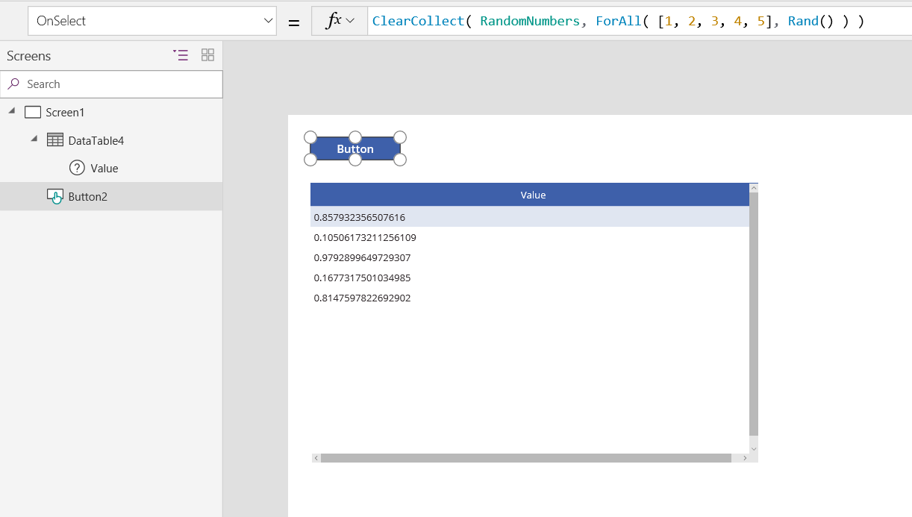

# Rand function in PowerApps
Returns a pseudo-random number.

## Description
The **Rand** function returns a pseudo-random number that's greater than or equal to 0 and less than 1.

## Volatile Functions
**Rand** is a volatile function, which means that it returns a different value whenever it's reevaluated. However, formulas are reevaluated only when something in them changes. For example, you can set the **Text** property of a **[Label](../controls/control-text-box.md)** control to **Rand()**, but it won't update until the app is closed and reopened.

In contrast, you can set the same property to **Slider1.Value + Rand()**, which will update whenever the user changes the value of a slider. For a step-by-step demonstration, see the example later in this topic.

## Syntax
**Rand**()

## Examples

#### Display a different random number as user input changes
1. Add a **[Slider](../controls/control-slider.md)** control, and rename it **Slider1** if it has a different name.

1. Add a **[Label](../controls/control-text-box.md)** control, and set its **Text** property to this formula:

    **Slider1.Value + Rand()**

    The label shows **50** (the default value for the slider) plus a random decimal:

    

1. While holding down the Alt key, change the value of the slider.

    Every time you change the value of the slider, the decimal portion of the label shows a different random number:

    

#### Create a table of random numbers
1. Add a **[Button](../controls/control-button.md)** control, and set its **[OnSelect](../controls/properties-core.md)** property to this formula:

    **ClearCollect( RandomNumbers, ForAll( [ 1, 2, 3, 4, 5 ], Rand() ))**

    This formula creates a single-column table that's used to iterate five times, resulting in five random numbers.

1. Add a **[Data table](../controls/control-data-table.md)**, set its **Items** property to **RandomNumbers**, and show the **Value** field.

    

1. While holding down the Alt key, select the button by clicking or tapping it.

    The data table shows five random decimal numbers:

    

1. Select the button again to show a different list of random numbers:

    

To generate a single random number instead of a table, use **Set( RandomNumber, Rand() )**.