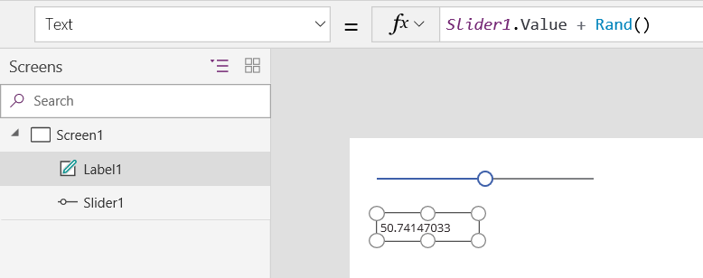
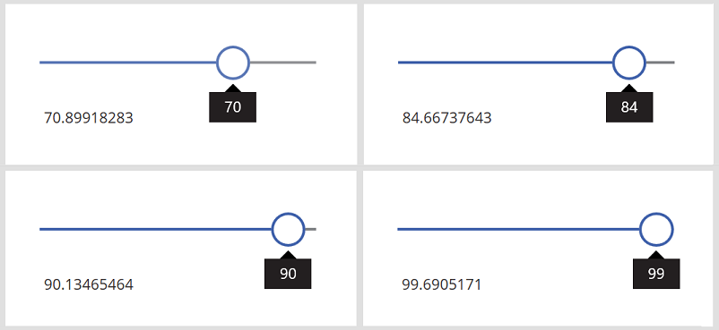

# Rand function in PowerApps
Returns a pseudo-random number.

## Description
The **Rand** function returns a pseudo-random number that's greater than or equal to 0 and less than 1.

## Volatile Functions
**Rand** is a volatile function.  Each time the function is evaluated it returns a different value.  

When used in a data flow formula, a volatile function will only return a different value if the formula in which it appears is reevaluated.  If nothing else changes in the formula then it will have the same value throughout the execution of your app.

For example, a label control with **Label1.Text = Rand()** will not change while your app is active.  Only closing and reopening the app will result in a new value.

The function will be reevaluated if it is part of a formula in which something else has changed.  For example, if we change our example to involve a slider control with **Label1.Text = Slider1.Value + Rand()** then a new random number is generated each time the Slider control's value changes and the label's text property is reevaluated.  See below for this example.

When used in a [behavior formula](../working-with-formulas-in-depth.md), **Rand** will be evaluated each time the behavior formula is evaluated.  See below for an example.

## Syntax
**Rand**()

## Examples

#### Display a different random number as user input changes

1. Place a **[Slider](../controls/control-slider.md)** control on the canvas.  Name it **Slider1** if it is not already.
2. Place a **[Label](../controls/control-text-box.md)** control on the canvas.  Set its **Text** property to **Slider1.Value + Rand()**.
3. The label control will display 50 (the default value for the slider) plus a random decimal:
    
4. Move the slider.  With each change in position of the slider, the decimal portion of the label will display a new random number:
    

#### Create a table of random numbers

1. Place a **[Button](../controls/control-button.md)** control on the canvas.  Set its **[OnSelect](../controls/properties-core.md)** property to **ClearCollect( RandomNumbers, ForAll( [ 1, 2, 3, 4, 5 ], Rand() ) )**.  The single column table [1, 2, 3, 4, 5] is only used to iterate 5 times, resulting in 5 random numbers.
2. Place a **[Data table](../controls/control-data-table.md)** control on the canvas.  Select the **RandomNumbers** collection as the data source for the data table and select the **Value** field to display.
3. Press the button.  You will see a list of random numbers in the data table:
    
4. Press the button again.  You will see a different list of random numbers:
    
5. In this example, a table of random values was created.  To create a single random number, use **Set( RandomNumber, Rand() )**.

