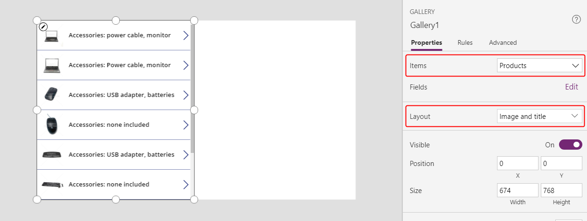
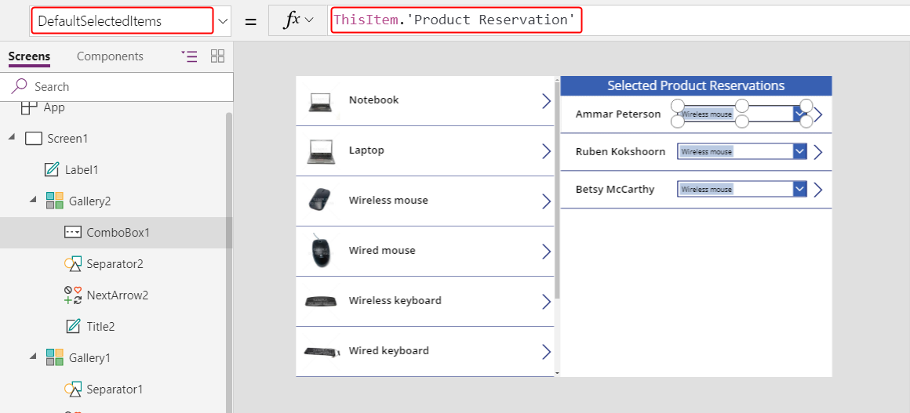
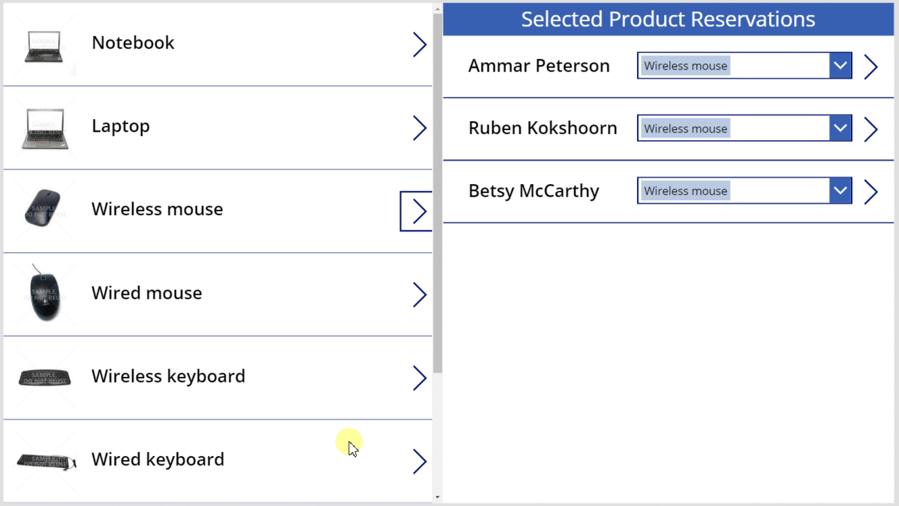
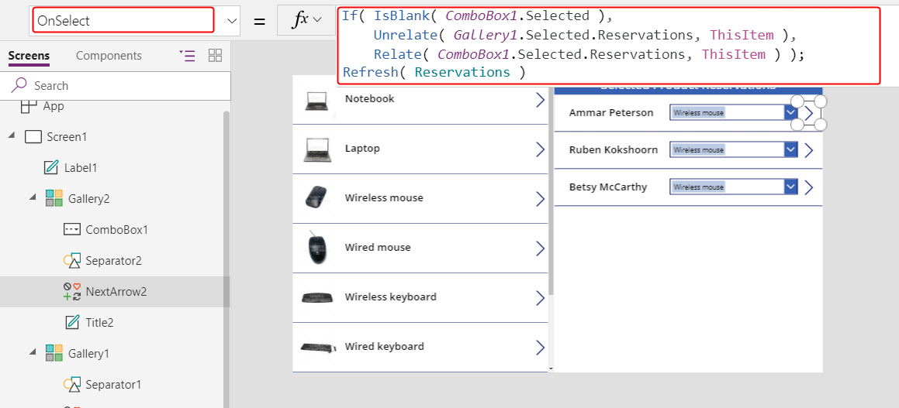
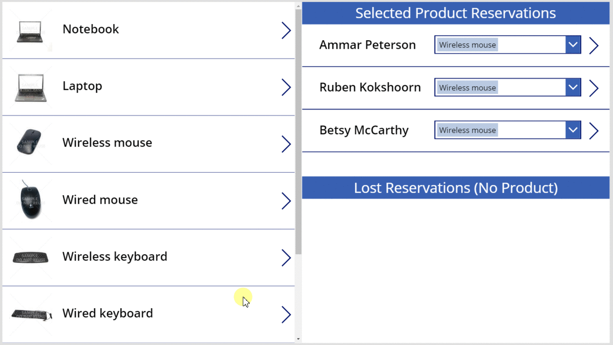
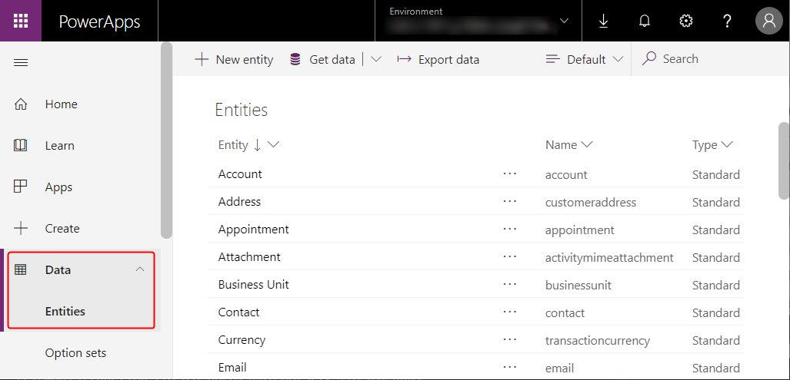
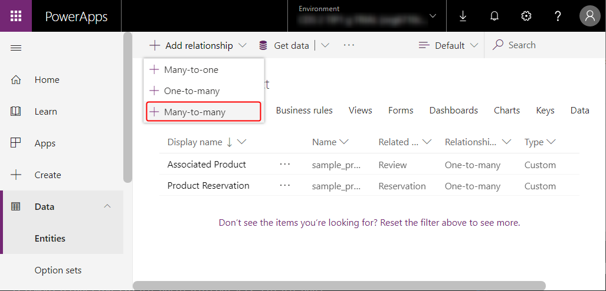
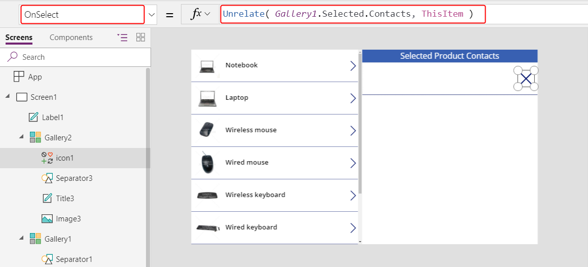

# Relate and Unrelate functions in PowerApps
Relate and unrelate records of two entities through a One-to-Many or Many-to-Many relationship. 

## Description
The **Relate** function links two records through a One-to-Many or Many-to-Many relationship in the Common Data Service for Apps.  The **Unrelate** function reverses the process and removes the link.

For One-to-Many relationships there will be a foreign key field on the Many entity that points to a record of the One entity.  **Relate** will set this field to point to a specific record of the One entity while **Unrelate** will set this field to *blank*.  If the field is already set when **Relate** is called, the existing link will be lost in favor of the new link.  You can also set this field with the [**Patch**](function-patch.md) function or an **[Edit form](../controls/control-form-detail.md)** control; the **Relate** function need not be used.

For Many-to-Many relationships a hidden join table is maintained by the system that links the records.  There is no direct access to this join table; it can only be read through a One-to-Many projection and set through the **Relate** and **Unrelate** functions.  There are no foreign keys on either of the two related entities.  

Attempting to **Relate** two records that are already related has no effect.

The data for the entity referenced in the first argument will be refreshed to reflect the change.  However, the data for the entity referenced in the second argument will not and must be manually refreshed with the **[Refresh](function-refresh.md)** function to see the result of the operation.

These functions never create or delete a record.  They only relate or unrelate two records that already exist.

## Syntax
**Relate**( *Entity1RelatedTable*, *Entity2Record* )

* *Entity1RelatedTable* - Required. For a record of *Entity1*, the table of *Entity2* records related through a One-to-Many or Many-to-Many relationship.
* *Entity2Record* - Required. The *Entity2* record to add to the relationship.

**Unrelate**( *Entity1RelatedTable*, *Entity2Record* )

* *Entity1RelatedTable* - Required. For a record of *Entity1*, the table of *Entity2* records related through a One-to-Many or Many-to-Many relationship.
* *Entity2Record* - Required. The *Entity2* record to remove from the relationship.

## Examples

These examples depend on the sample data being installed in your environment.  Either [create a trial environment including sample data](../../model-driven-apps/overview-model-driven-samples.md#get-sample-apps) or [add sample data to an existing environment](../../model-driven-apps/overview-model-driven-samples.md#install-or-uninstall-sample-data).  

### One-to-Many

#### **Relate** function

We'll first create a simple app to view and reassign the Reservations associated with a Product.

1. Create a new [tablet app from scratch](../data-platform-create-app-scratch.md).
1. From the View ribbon, select Data sources.  Add the Common Data Service and the Products entity.  The Products entity is part of the sample data loaded above.
     
1. From the Insert ribbon, add a blank vertical **[Gallery](../controls/control-gallery.md)** control.  Re-size the control to fill the left hand side of the screen.
1. In the Properties pane, Set the **Items** to **Products** and the **Layout** to **Images and title**.
    
1. Select the Label control in the gallery and change the Text property to **ThisItem.Name**.  
    
1. Add a second blank vertical **Gallery** control.  Re-size the control to fill the upper right hand side of the screen. If desired, add the blue label control above the Gallery (shown in the picture) but it is not required.  This second gallery will display the reservations for the selected product in the first gallery.
2. In the formula bar, set the **Items** property to **Gallery1.Selected.Reservations**.
3. In the properties pane, set the **Layout** to **Title**.
    
1. Add a **[Combo box](../controls/control-combo-box.md)** control into the second gallery.
3. In the Properties pane, set the **Items** to **Products**.
2. In the formula bar, set the **DefaultSelectedItems** property to **ThisItem.'Product Reservation'**.
    
1. Select the **Next arrow** control in the second gallery and use the formula bar to set the **OnSelect** property to **Relate( ComboBox1.Selected.Reservations, ThisItem )**.  Executing this formula will move the current reservation to the Product selected in the combo box.
    
1. Preview the app in the Studio.

With our app we can now move reservations from one product to another.  For a reservation on one product, you can select a different product in the combo box control and select the next arrow icon to move it.  


#### **Unrelate** function

To this point, we have been moving the relationship between records but not removing the relationship all together.  Here we will use the **Unrelate** function to disconnect a Reservation record from any Product.

1. From the View menu, select Data sources, and add the **Reservations** data source from the Common Data Source connection.
2. For the Next arrow button in the second gallery, change the **OnSelect** formula to this formula:
    ```powerapps-dot
    If( IsBlank( ComboBox1.Selected ),
        Relate( Gallery1.Selected.Reservations, ThisItem ),
        Unrelate( ComboBox1.Selected.Reservations, ThisItem )
    );
    Refresh( Reservations )
    ```
    
1. Select the second gallery (and label if you added one) and Copy to the clipboard with the Ctrl-C key.  Then paste back on to the same screen with the Ctrl-V key and position on the lower right of the screen.
    
2. Set the **Items** property for this copy of the gallery to **Filter( Reservations, IsBlank( 'Product Reservation' ) )**.  This formula will produce a delegation warning but will operate fine with the small amount of data in this example.  
    

With these changes, we can now clear the selection in the combo box for a reservation and disconnect it from any product.  Reservations that have no associated Product appear in the bottom gallery control from which they can be assigned to a product.

   

### Many-to-Many

#### Creating a Many-to-Many relationship

The sample data does not include a Many-to-Many relationship.  Let's create one between the Product entity and the Contacts entity.  For each product, there can be more than one Contact, and each Contact can be associated with more than one product.

1. In the Maker portal, go to the Entities page under Data.
    
2. Change the entity filter to include all entities.  By default, Sample entities are not listed.
    
3. Scroll down, open the **Product** entity, and select Relationships.
    
4. Add a new Many-to-Many relationship.
    
5. Select the **Contacts** entity for the relationship.
    
6. Save, confirm the change, and the relationship will be added.
    

#### Relate and Unrelate Contacts with Products

We will create an app that is similar to One-to-Many example, but will use a Many-to-Many relationship.  Instead of being limited to only one relationship, we will now be able to relate the same record multiple times.

1. Follow [steps 1-5 under One-to-Many above](#one-to-many) to add a **Gallery** control connected to the **Products** entity.  
2. Add a second gallery on the right hand side of the screen.  Leave a small amount of space at the bottom where we'll add a **Combo box** control.
3. In the formula bar, set the **Items** property to **Gallery1.Seelcted.Contacts**.
4. In the Properties panel, set the **Layout** to **Image and title**.
    
4. In the formula bar, set the **Text** property of the **Label** control within the gallery to **ThisItem.'Full Name'**.
        
5. Delete the **Next arrow** icon and insert a **Cancel** icon.  
6. Set the **OnSelect** property to **Unrelate( Gallery1.Selected.Contacts, ThisItem )**.
    
7. From the View menu, select Data sources, and add the **Contacts** data source from the Common Data Source connection.
8. Add a **Combo box** control to the bottom of the right column.  Set it's Items property to **Contacts**.  
9. In the Properties pane, set **Allow multiple selection** to **Off**.
    
1. Insert an **Add** icon and set it's **OnSelect** property to **Relate( Gallery1.Selected.Contacts, ComboBox1.Selected )**.
    

With this app, we can now freely relate and unrelate a set of Contacts to each Product.  To add a Contact to a Product, select the Contact in the combo box at the bottom of the screen and press the +.  To remove a Contact form a product, press the "X" in the gallery.  Unlike One-to-Many, the same Contact can be associated with multiple Products.


#### In reverse: Relate and Unrelate Products with Contacts

Many-to-Many relationships are symmetric.  Let's extend our example to add Products to a Contact.  We'll flip between the two screens and show how the relationship can be viewed from either direciton.

1. Select **Screen1** and set the **OnVisible** property to **Refresh( Products )**.  This is needed when flipping between our screens since updating a One-to-Many or Many-to-Many relationship refreshes the data only of the first argument entity of the **Relate** or **Unrelate** call; the second must be refreshed manually.
    
2. Duplicate **Screen1**.  This new screen will be the basis for looking at the relationships from the Contacts side. 
    
3. The name of the new screen will be **Screen1_1**.  To create the reverse view, change the following formulas on the controls of this new screen:
    - Screen1_1.OnVisible = `Refresh( Contacts )`
    - Gallery1_1.Items = `Contacts`
    - Title1_1.Text = `ThisItem.'Full Name'`
    - Label1_1.Text = `"Selected Contact Products"`
    - Gallery2_1.Items = `Gallery1_1.Selected.Products`
    - Title3_1.Text = `ThisItem.Name`
    - Icon7_1.OnSelect = `Unrelate( Gallery1_1.Selected.Products, ThisItem )`
    - ComboBox1_1.Items = `Products`
    - Icon9_1.OnSelect = `Relate( Gallery1_1.Selected.Products, ComboBox1_1.Selected )`
4. The result will look very similar to the previous screen, but comes at the relationship from the **Contacts** side.
    
5. Insert an **Arrows up down** icon control and set its **OnSelect** property to **Navigate( Screen1, None )**.  Do the same thing on **Screen1** with the formula **Navigate( Screen1_1, None )**.
    

With this new screen, we can now add a Contact to a Product and then flip to a view of Contacts and see the associated Product.  The relationships are symmetric and shared between the two screens.


