# Relate and Unrelate functions in PowerApps

Relate and unrelate records of two entities through a one-to-many or many-to-many relationship.

## Description

The **Relate** function links two records through a one-to-many or many-to-many relationship in Common Data Service (CDS) for Apps. The **Unrelate** function reverses the process and removes the link.

For one-to-many relationships, the Many entity has a foreign-key field that points to a record of the One entity. **Relate** sets this field to point to a specific record of the One entity, while **Unrelate** sets this field to *blank*. If the field is already set when **Relate** is called, the existing link is lost in favor of the new link. You can also set this field by using the [**Patch**](function-patch.md) function or an **[Edit form](../controls/control-form-detail.md)** control; you need not use the **Relate** function.

For many-to-many relationships, the system that links the records maintains a hidden join table. You can't access this join table directly; it can be read only through a one-to-many projection and set through the **Relate** and **Unrelate** functions. Neither related entity has a foreign key.

Nothing changes if you try to relate records that are already related.

The data for the entity that you specify in the first argument will be refreshed to reflect the change, but the data for the entity that you specify in the second argument won't. That data must be manually refreshed with the **[Refresh](function-refresh.md)** function to show the result of the operation.

These functions never create or delete a record. They only relate or unrelate two records that already exist.

## Syntax

**Relate**( *Entity1RelatedTable*, *Entity2Record* )

* *Entity1RelatedTable* - Required. For a record of *Entity1*, the table of *Entity2* records related through a one-to-many or many-to-many relationship.
* *Entity2Record* - Required. The *Entity2* record to add to the relationship.

**Unrelate**( *Entity1RelatedTable*, *Entity2Record* )

* *Entity1RelatedTable* - Required. For a record of *Entity1*, the table of *Entity2* records related through a one-to-many or many-to-many relationship.
* *Entity2Record* - Required. The *Entity2* record to remove from the relationship.

## Examples

These examples depend on the sample data being installed in your environment. Either [create a trial environment including sample data](../../model-driven-apps/overview-model-driven-samples.md#get-sample-apps) or [add sample data to an existing environment](../../model-driven-apps/overview-model-driven-samples.md#install-or-uninstall-sample-data).

### One-to-many

#### **Relate** function

You'll first create a simple app to view and reassign the reservations that are associated with a product.

1. Create a [tablet app from blank](../data-platform-create-app-scratch.md).

1. On the **View** tab, select **Data sources**. Add a connection to CDS for Apps, and specify the **Products** entity.

    The Products entity is part of the sample data loaded above.

     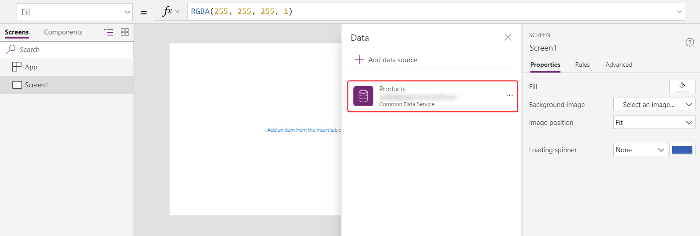

1. On the **Insert** tab, add a blank vertical **[Gallery](../controls/control-gallery.md)** control, and name it **ProductGallery**.

1. Re-size **ProductGallery** to fill the left-hand side of the screen.

1. On the **Properties** tab, set **ProductGallery**'s **Items** property to **Products** and its **Layout** to **Images and title**.

    

1. Select the **Label** control in **ProductGallery**, and change the label's **Text** property to **ThisItem.Name**.

    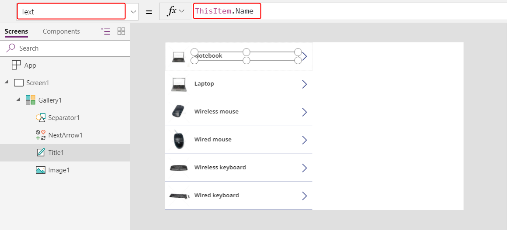

1. Add a second blank vertical **Gallery** control, and name it **ReserveGallery**.

    **ReserveGallery** will show the reservations for the selected product in **ProductGallery**.

1. Re-size **ReserveGallery** to fill the upper-right quadrant of the screen.

1. (optional) Add the blue **Label** control above **ReserveGallery**, as the graphic shows.

1. In the formula bar, set the **Items** property of **ReserveGallery** to **ProductGallery.Selected.Reservations**.

1. In the properties pane, set the **Layout** of **ReserveGallery** to **Title**.

    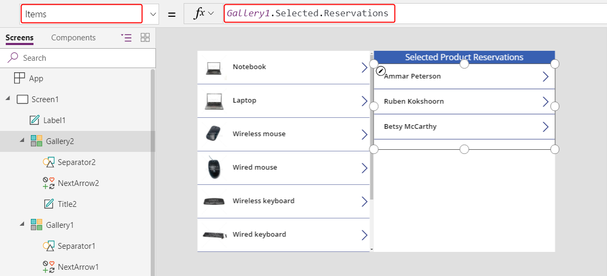

1. Add a **[Combo box](../controls/control-combo-box.md)** control into **ReserveGallery**, and name the newest control **ReserveCombo**.

1. On the **Properties** tab, set **ReserveCombo**'s **Items** property to **Products**.

1. In the formula bar, set **ReserveCombo**'s **DefaultSelectedItems** property to **ThisItem.'Product Reservation'**.

    

1. In **ReserveGallery**, set the **OnSelect** property of the **Right** icon to **Relate( ComboBox1.Selected.Reservations, ThisItem )**.

    When the user selects this arrow, the current reservation moves to the product that the user selected in the combo box.

    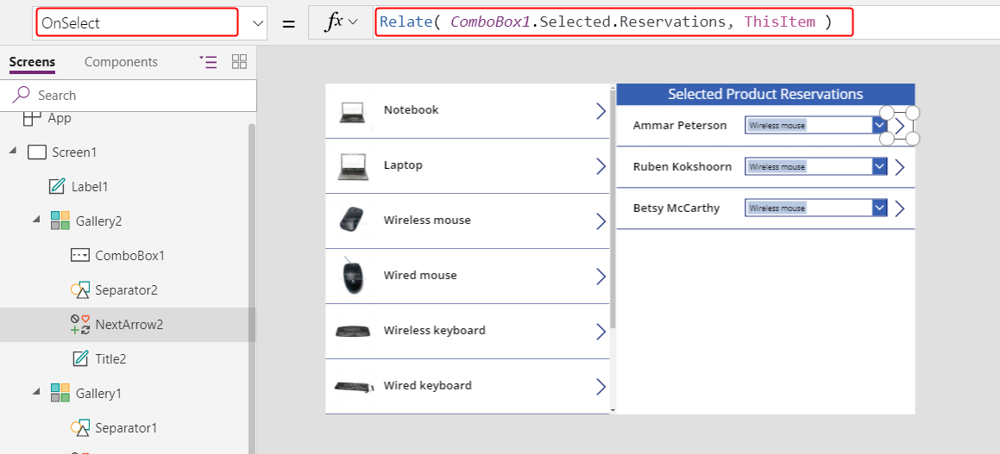

1. Press F5 to test the app in Preview mode.

With your app, users can move reservations from one product to another. For a reservation on one product, users can select a different product in the combo-box control and select the **Right** icon to move that reservation.


#### **Unrelate** function

Before this point, you've moved the relationship between records but not removed the relationship altogether. You can use the **Unrelate** function to disconnect a reservation record from any product.

1. On the **View** tab, select **Data sources**, and then add the **Reservations** entity from CDS for Apps.

1. In **ReserveGallery**, set the **OnSelect** formula for the **Right** icon to this formula:

    ```powerapps-dot
    If( IsBlank( ComboBox1.Selected ),
        Relate( Gallery1.Selected.Reservations, ThisItem ),
        Unrelate( ComboBox1.Selected.Reservations, ThisItem )
    );
    Refresh( Reservations )
    ```
    

1. Select **ReserveGallery** (and the label above it if you added one), and copy them to the clipboard by pressing Ctrl-C.

1. Paste the controls to the same screen by pressing Ctrl-V, and then position them in the lower-right corner of the screen.

1. Rename the copy of the gallery to **ReserveGallery2**, and set its **Items** property to this formula:

    **Filter( Reservations, IsBlank( 'Product Reservation' ) )**

    A delegation warning appears, but it won't matter with the small amount of data in this example.

    

With these changes, users can clear the selection in the combo box for a reservation and disconnect it from any product. Reservations that have no associated product appear in **ReserveGallery2** from which users can assign them to products.

   

### Many-to-many

#### Create a many-to-many relationship

The sample data doesn't include a many-to-many relationship, but you'll create one between the Products entity and the Contacts entity. Users can relate each product to more than one contact and each contact to more than one product.

1. From [this page](https://web.powerapps.com?utm_source=padocs&utm_medium=linkinadoc&utm_campaign=referralsfromdoc), select **Entities** in the left navigation bar, and then select **Data**.

    

1. Change the entity filter to include all entities.

    By default, sample entities don't appear.

    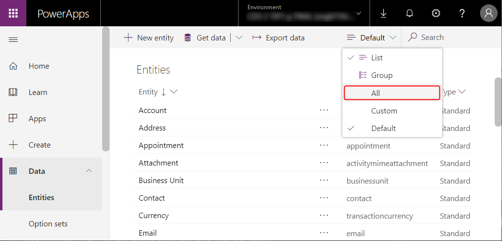

1. Scroll down, open the **Product** entity, and select **Relationships**.

    

1. Add a many-to-many relationship.

    

1. Select the **Contacts** entity for the relationship.

    

1. Save and confirm the change.

    

#### Relate and unrelate contacts with products

You'll create another app that resembles the one you created earlier in this topic, but the new app will offer a many-to-many relationship. Each contact will be able to reserve multiple products instead of only one.

1. Follow the first five steps in the [first procedure](#one-to-many) in this topic to create **ProductsGallery**.

1. Add a second gallery on the right hand side of the screen.  Leave a small amount of space at the bottom where we'll add a **Combo box** control.

1. In the formula bar, set the **Items** property to **ProductGallery.Selected.Contacts**.

1. On the **Properties** tab, set **Layout** to **Image and title**.

    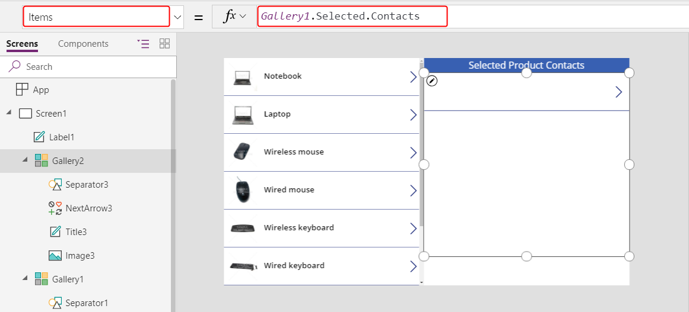

1. In the formula bar, set the **Text** property of the **Label** control within the gallery to **ThisItem.'Full Name'**.

    

1. Delete the **Right** icon, and insert a **Cancel** icon.

1. Set the **OnSelect** property to **Unrelate( Gallery1.Selected.Contacts, ThisItem )**.

    

1. On the **View** tab, select **Data sources**, and add the **Contacts** entity from CDS for Apps.

1. Add a **Combo box** control to the bottom of the right column.  Set its **Items** property to **Contacts**.

1. On the **Properties** tab, set **Allow multiple selection** to **Off**.

    

1. Insert an **Add** icon, and set its **OnSelect** property to **Relate( Gallery1.Selected.Contacts, ComboBox1.Selected )**.

    

With this app, users can now freely relate and unrelate a set of contacts to each product.

- To add a contact to a product, select the contact in the combo box at the bottom of the screen, and then select the **Add** icon.
- To remove a contact from a product, select the **Cancel** icon for that contact.

    Unlike one-to-many, a many-to-many relationship allows users can associate the same contact with multiple products.


#### In reverse: relate and unrelate products with contacts

Many-to-many relationships are symmetric. You can extend the example to add products to a contact. You'll flip between the two screens to show how the relationship appears from either direction.

1. Set the **OnVisible** property of **Screen1** to **Refresh( Products )**.

    When you update a one-to-many or many-to-many relationship, only the data of the first argument entity of the **Relate** or **Unrelate** call is refreshed. The second must be refreshed manually if you want to flip between the screens of this app.

    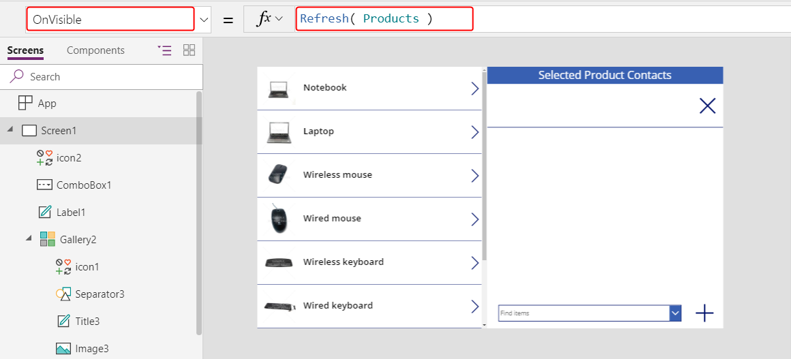

1. Duplicate **Screen1**.

    The duplicate will be named **Screen1_1** and form the basis for looking at the relationships from the contacts side.

    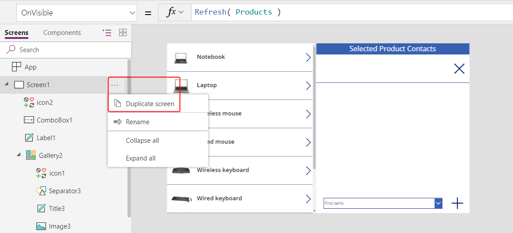

1. To create the reverse view, change these formulas on the controls of **Screen1_1**:

    - Screen1_1.OnVisible = `Refresh( Contacts )`
    - Gallery1_1.Items = `Contacts`
    - Title1_1.Text = `ThisItem.'Full Name'`
    - Label1_1.Text = `"Selected Contact Products"`
    - Gallery2_1.Items = `Gallery1_1.Selected.Products`
    - Title3_1.Text = `ThisItem.Name`
    - Icon7_1.OnSelect = `Unrelate( Gallery1_1.Selected.Products, ThisItem )`
    - ComboBox1_1.Items = `Products`
    - Icon9_1.OnSelect = `Relate( Gallery1_1.Selected.Products, ComboBox1_1.Selected )`

    The result will look very similar to the previous screen but comes at the relationship from the **Contacts** side.

    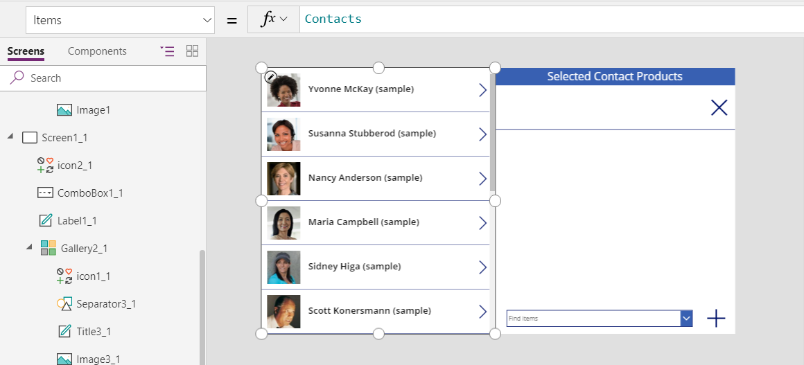

1. Insert an **Arrows up down** icon and set its **OnSelect** property to **Navigate( Screen1, None )**.  Do the same thing on **Screen1** with the formula **Navigate( Screen1_1, None )**.

    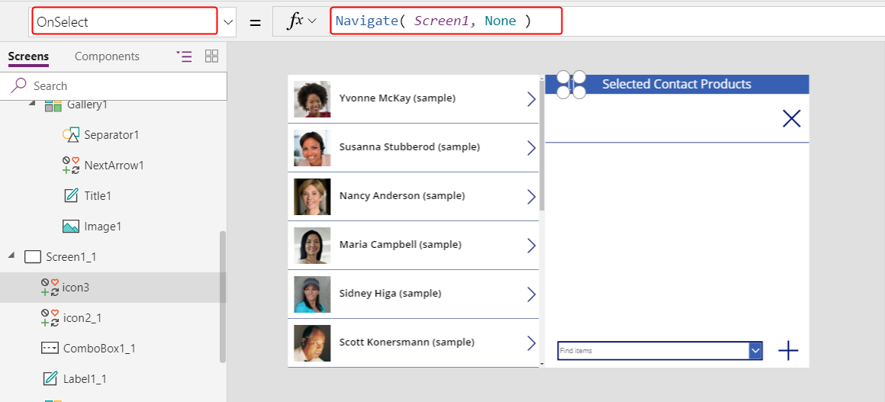

With this new screen, users can add a contact to a product and then flip to a view of contacts and see the associated product. The relationships are symmetric and shared between the two screens.

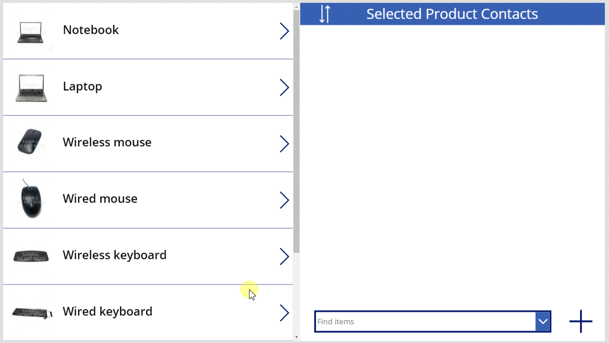