# Remove and RemoveIf functions in Power Apps
Removes [records](../working-with-tables.md#records) from a [data source](../working-with-data-sources.md).

## Description
### Remove function
Use the **Remove** function to remove a specific record or records from a data source.  

For [collections](../working-with-data-sources.md#collections), the entire record must match. You can use the **All** argument to remove all copies of a record; otherwise, only one copy of the record is removed.

### RemoveIf function
Use the **RemoveIf** function to remove a record or records based on a condition or a set of conditions. Each condition can be any formula that results in a **true** or **false** and can reference [columns](../working-with-tables.md#columns) of the data source by name. Each condition is evaluated individually for each record, and the record is removed if all conditions evaluate to **true**.

**Remove** and **RemoveIf** return the modified data source as a [table](../working-with-tables.md). You can use both functions only in [behavior formulas](../working-with-formulas-in-depth.md).

You can also use the **[Clear](function-clear-collect-clearcollect.md)** function to remove all of the records in a data source.

### Delegation
[!INCLUDE [delegation-no](../../../includes/delegation-no.md)]

## Syntax
**Remove**( *DataSource*, *Record1* [, *Record2*, ... ] [, **All** ] )

* *DataSource* – Required. The data source that contains the record or records that you want to remove.
* *Record(s)* – Required. The record or records to remove.
* **All** – Optional. In a collection, the same record may appear more than once.  You can add the **All** argument to remove all copies of the record.

**Remove**( *DataSource*, *Table* [, **All** ] )

* *DataSource* – Required. The data source that contains the records that you want to remove.
* *Table* – Required. A table of records to remove.
* **All** – Optional. In a collection, the same record may appear more than once.  You can add the **All** argument to remove all copies of the record.

**RemoveIf**( *DataSource*, *Condition* [, ... ] )

* *DataSource* – Required. The data source that contains the record or records that you want to remove.
* *Condition(s)* – Required. A formula that evaluates to **true** for the record or records to remove.  You can use column names from the *DataSource* in the formula.  If you specify multiple *Conditions*, all must evaluate to **true** for the record or records to be removed.

## Examples
In these examples, you'll remove a record or records in a data source that's named **IceCream** and that starts with the data in this table:


| Formula | Description | Result |
| --- | --- | --- |
| **Remove(&nbsp;IceCream,<br>First(&nbsp;Filter(&nbsp;IceCream,&nbsp;Flavor="Chocolate"&nbsp;)&nbsp;) )** |Removes the **Chocolate** record from the data source. |<style> img { max-width: none } </style> <br><br>The **IceCream** data source has been modified. |
| **Remove(&nbsp;IceCream,<br>First(&nbsp;Filter(&nbsp;IceCream,&nbsp;Flavor="Chocolate"&nbsp;)&nbsp;) First(&nbsp;Filter(&nbsp;IceCream,&nbsp;Flavor="Strawberry"&nbsp;)&nbsp;) )** |Removes two records from the data source. |<br><br>The **IceCream** data source has been modified. |
| **RemoveIf(&nbsp;IceCream, Quantity&nbsp;>&nbsp;150 )** |Removes records that have a **Quantity** that's greater than **150**. |<br><br>The **IceCream** data source has been modified. |
| **RemoveIf(&nbsp;IceCream, Quantity&nbsp;>&nbsp;150, Left(&nbsp;Flavor,&nbsp;1&nbsp;) = "S" )** |Removes records that have a **Quantity** that's greater than 150 and **Flavor** starts with an **S**. |<br><br><br>The **IceCream** data source has been modified. |
| **RemoveIf(&nbsp;IceCream, true )** |Removes all records from the data source. |<br><br>The **IceCream** data source has been modified. |

### Removing an item from a gallery

In this example we will use a [**Gallery** control](../controls/control-gallery.md) to list the records in a table and then use the **Remove** function to selectively remove an item.  

This example uses the **Contacts** entity in Common Data Service, loaded with sample data when the database was created.  You can create your own database with sample data by creating a trial environment.  

But any data source or collection can be used in this same manner.  To use a collection for this example, add a button control to your screen, set the **OnSelect** property to this formula, and select the button:

```powerapps-dot
ClearCollect( Contacts, 
              { Name: "Yvonne",  Email: "yvonne@contoso.com" },
              { Name: "Susanna", Email: "susanna@contoso.com" },
              { Name: "Nancy",   Email: "nancy@contoso.com" },
              { Name: "Maria",   Email: "maria@contoso.com" },
              { Name: "Robert",  Email: "robert@contoso.com" },
              { Name: "Paul",    Email: "paul@contoso.com" },
              { Name: "Rene",    Email: "rene@consoto.com" } 
)
```  

#### From outside the gallery

In this first part, we will remove an item from a button that is outside the gallery.

1. Create a [new blank canvas app](../data-platform-create-app-scratch) using the Phone layout.

    > [!div class="mx-imgBorder"]
    > 

1. Select the **Insert** tool pane on the left hand side of the studio.  

1. Select **Vertical gallery**.  The **Gallery** control will be added to your screen.

    > [!div class="mx-imgBorder"]
    > 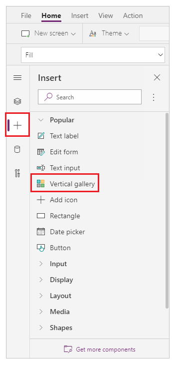

1. You will be prompted to select a data source.  If your desired data source is not shown, enter the name in the Search box at the top.  For this exercise, select the **Contacts** entity.  

    > [!div class="mx-imgBorder"]
    > 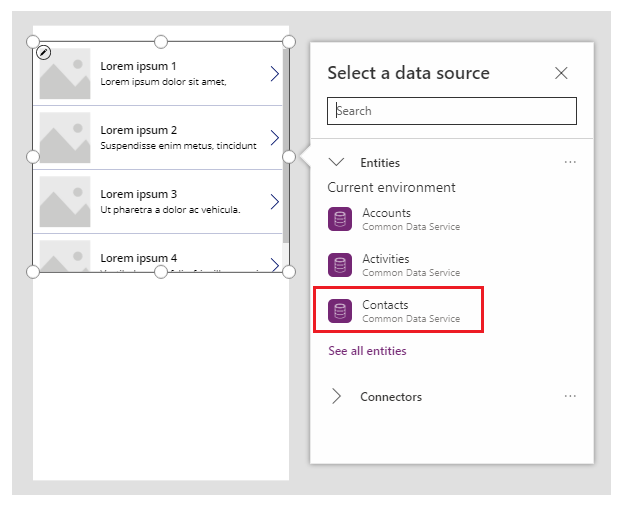

1. The gallery will show items from this entity. 

    > [!div class="mx-imgBorder"]
    > 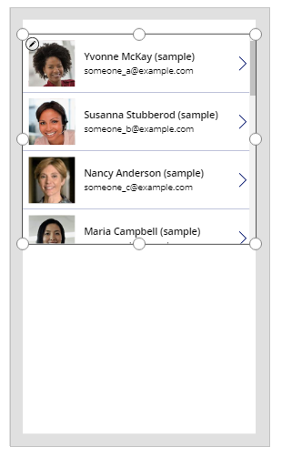

1. Insert a [**Button** control](../controls/control-button.md) from the Insert tool pane.
    
    > [!div class="mx-imgBorder"]
    > 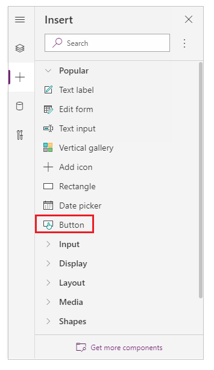

1. Set the **OnSelect** property for this button control to the formula:

    ```powerapps-dot
    Remove( Contacts, Gallery1.Selected )
    ```

    > [!div class="mx-imgBorder"]
    > 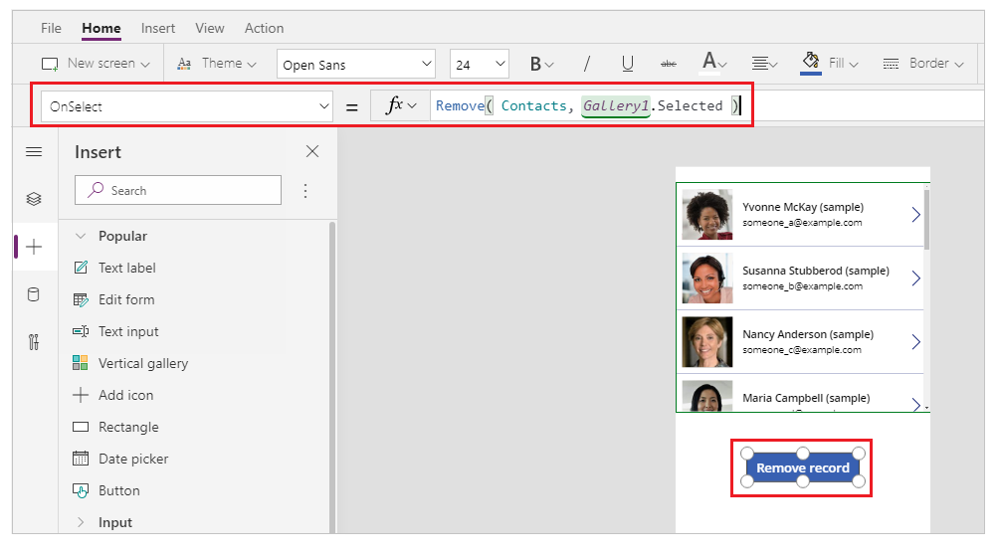

    The gallery controls makes the currently selected record available through its **Selected** property.  We are using that to tell **Remove** which record to remove from the **Contacts** entity.

1. [Hold down the Alt key](../keyboard-shortcuts#alternate-behavior.md) and select the third item in the gallery, in our case Nancy's record.  You can also preview the app to select items.

1. Again with the Alt key held down, select the button control.  The record for Nancy will be removed.

    > [!div class="mx-imgBorder"]
    > 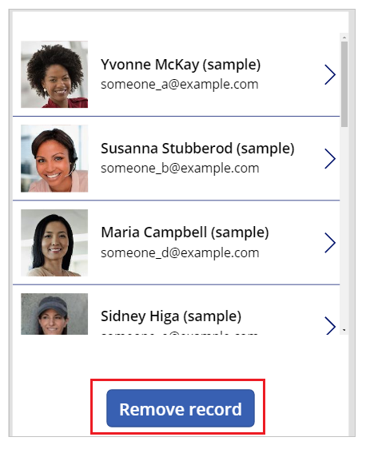

#### From inside the gallery

> [!NOTE]
> There is currently an issue with using ThisItem to remove items from Common Data Service that is being investigated.  The following example will work fine for collections, SharePoint lists, and SQL Server tables. 

In this example, we will remove an item from inside the gallery.

1. Select the top item of the gallery.  This is important to ensure that the next step will insert the item into the gallery's template and not outside it.

    > [!div class="mx-imgBorder"]
    > 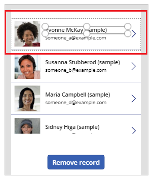

1. Return to the Insert tool pane and select **Add icon**.  This will insert a **+** icon on the left side of the gallery, replicated for each item.  

    > [!div class="mx-imgBorder"]
    > 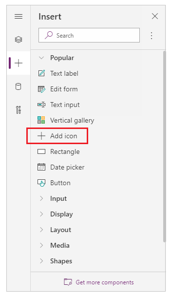

1. In the top item, move the icon to the right side of the screen.  
1. To change to a trash can icon, set the **Icon** property to the formula:

    ```powerapps-dot 
    Icon.Trash
    ```
    
    The **Icon.** prefix will not be shown unless you are actively editing the formula.

    > [!div class="mx-imgBorder"]
    > 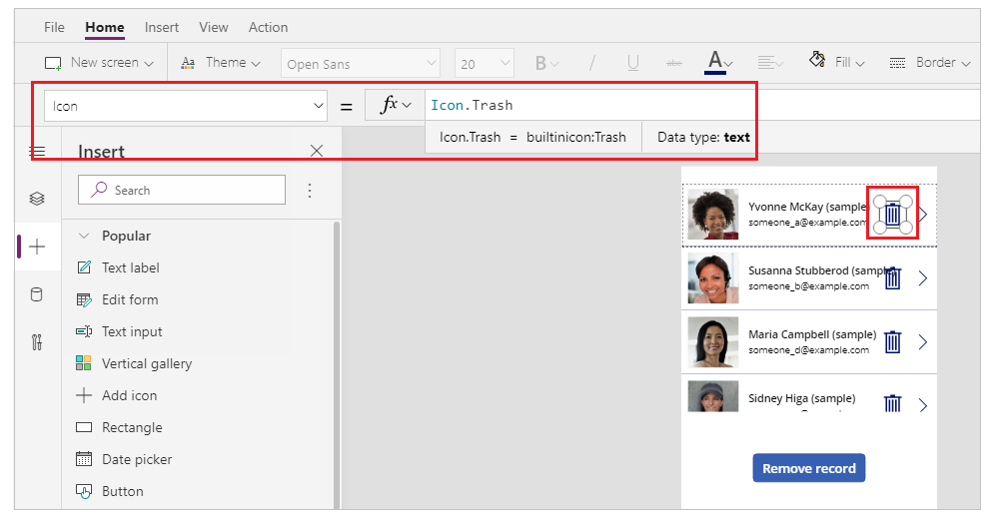

1. Set the **OnSelect** property to the formula:

    ```powerapps-dot
    Remove( [@Contacts], ThisItem )
    ```

    > [!NOTE]
    > At present, we must use the [global disambiguation operator](https://docs.microsoft.com/en-us/powerapps/maker/canvas-apps/functions/operators#disambiguation-operator) [@...] to avoid a name conflict with a One-to-Many relationship on the Contacts entity.  We are working to remove these conflicts.

    > [!div class="mx-imgBorder"]
    > 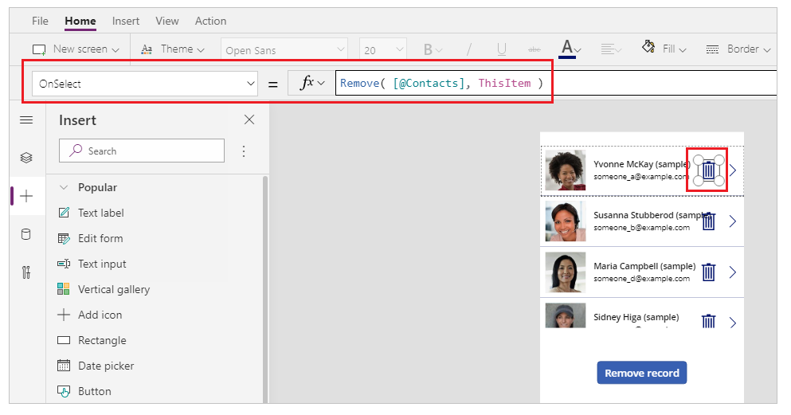

1. Hold down the Alt key and select any of the trash can icons in the gallery.  The contact will disappear as it is removed.

    > [!div class="mx-imgBorder"]
    > 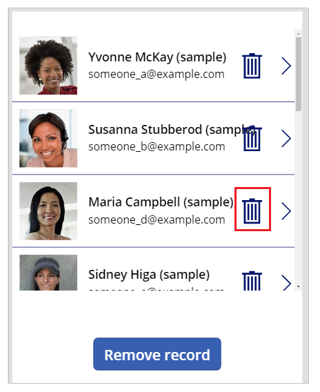