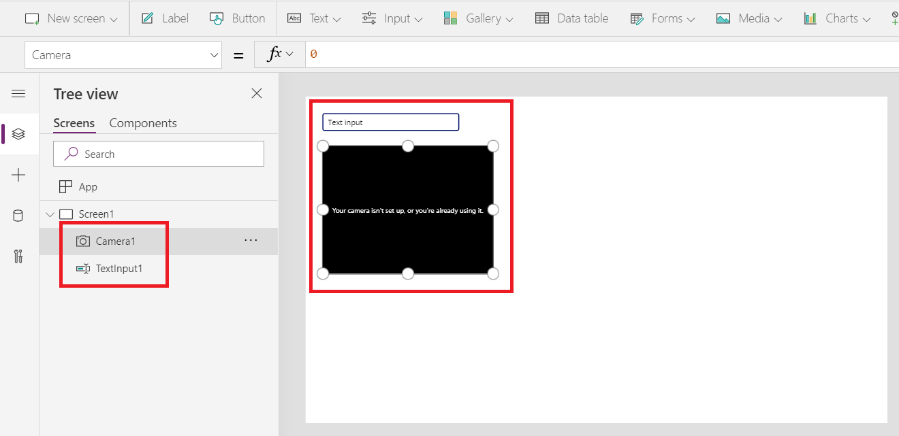
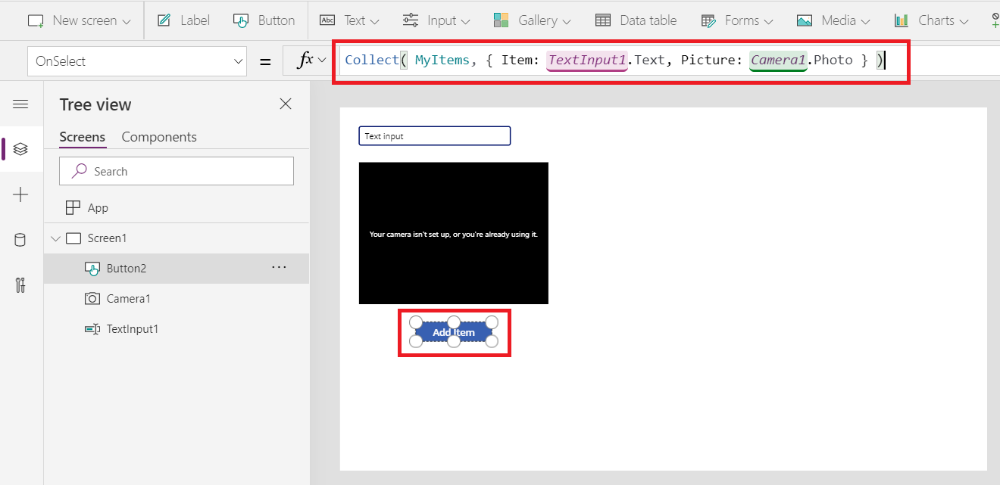
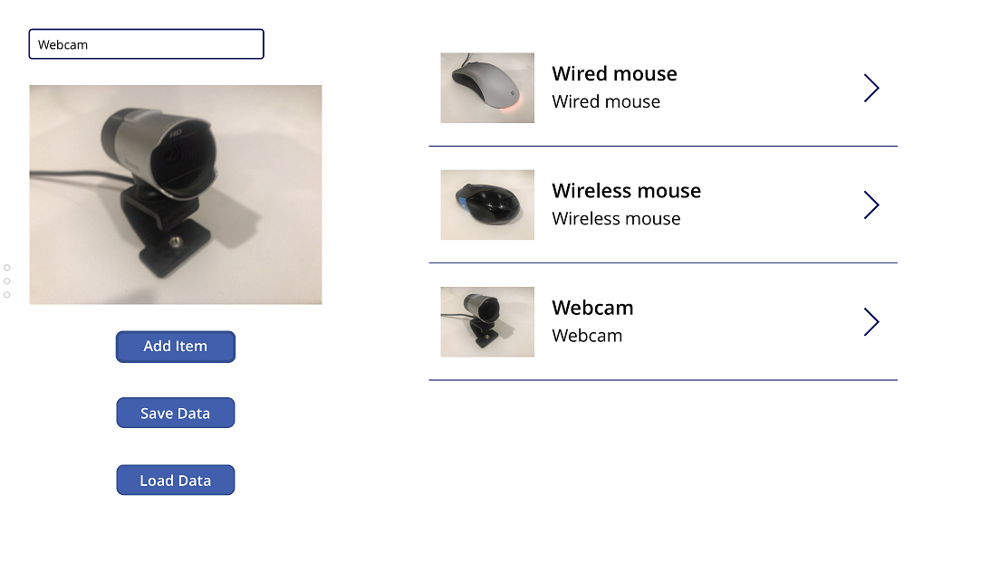
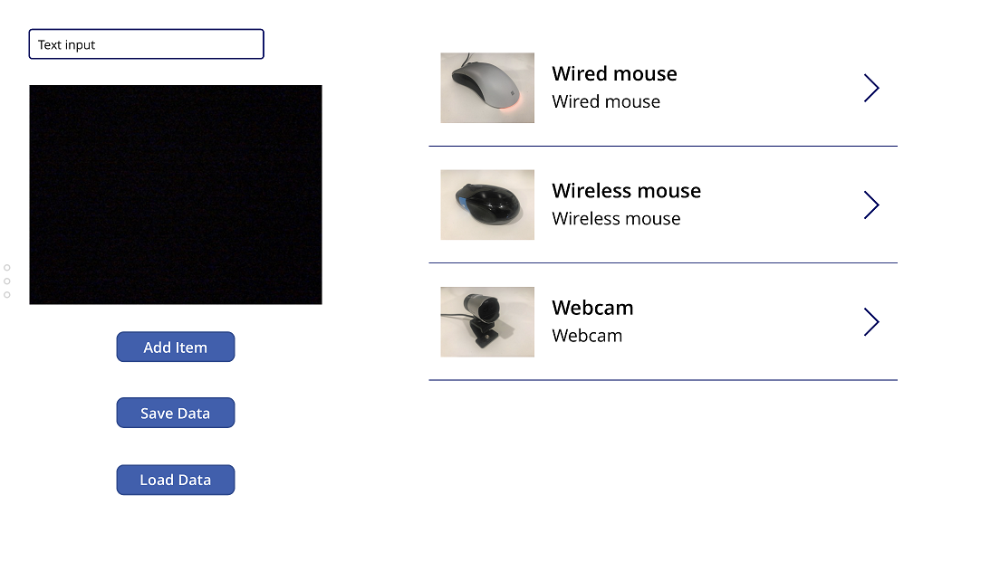
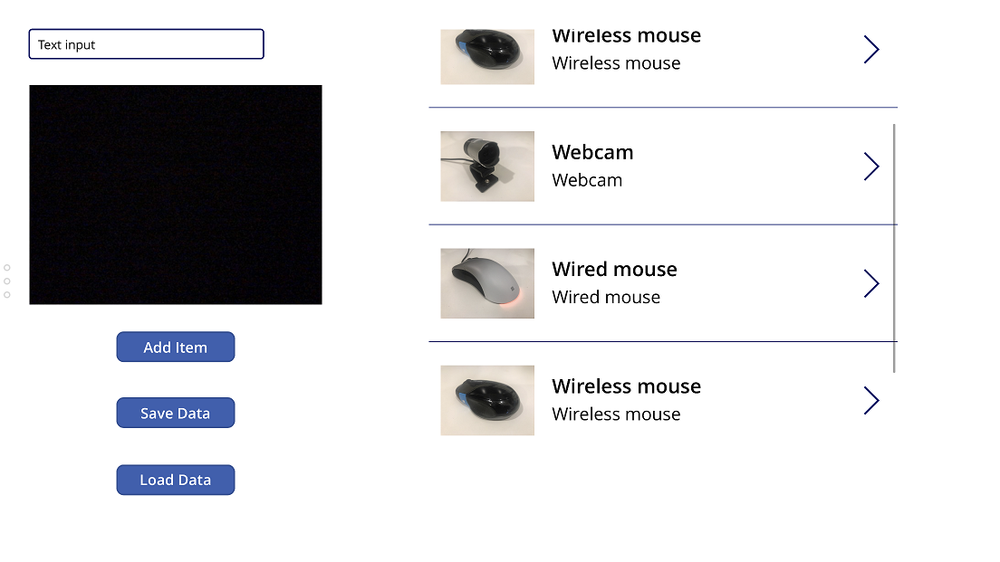

# SaveData and LoadData functions in Power Apps
Saves and reloads a [collection](../working-with-data-sources.md#collections) from a local device.

## Description
The **SaveData** function stores a collection for later use under a name.  

The **LoadData** function reloads a collection by name that was previously saved with **SaveData**. You can't use this function to load a collection from another source.  

> [!NOTE]
> The name shared between **SaveData** and **LoadData** is a key, not a file name.  It need not be complex as names are unique to each app and there is no danger of name conflict.  The name may not contain any of these characters: `*".?:\<>|/`. 

Use these functions to improve app-startup performance by:

- Caching data in the **[App.OnStart](../controls/control-screen.md#additional-properties)** formula on a first run.
- Reloading the local cache on next runs.

You can also use these functions to add [simple offline capabilities](../offline-apps.md) to your app.

You can't use these functions inside a browser when:

- Authoring the app in Power Apps Studio.
- Running the app in the web player. 

To test your app, run it in Power Apps Mobile on an iPhone or Android device.

These functions are limited by the amount of available app memory as they operate on an in-memory collection. Available memory can vary depending on factors such as: 

- The device and operating system.
- The memory that the Power Apps player uses.
- Complexity of the app with screens and controls. 

Test your app with expected scenarios on the type of devices you expect the app to run when storing large data. Expect to have between 30 MB and 70 MB of available memory generally.

These functions depend on the collection being implicitly defined with **[Collect](function-clear-collect-clearcollect.md)** or **[ClearCollect](function-clear-collect-clearcollect.md)**. You don't need to call **Collect** or **ClearCollect** to load data into the collection for defining it. It's a common case when using **LoadData** after a previous **SaveData**.  All that is needed is the presence of these functions in a formula to implicitly define the structure of the collection.  For more information, see [creating and removing variables](../working-with-variables.md#create-and-remove-variables).

The loaded data will be appended to the collection. Use the **[Clear](function-clear-collect-clearcollect.md)** function before calling **LoadData** if you want to start with an empty collection.

The device's built in app sandbox facilities are used to isolate saved data from other apps. 

The device may also encrypt the data; or you can use a mobile device management tool such as [Microsoft Intune](https://www.microsoft.com/microsoft-365/enterprise-mobility-security/microsoft-intune).


## Syntax
**SaveData**( *Collection*, *Name* )<br>**LoadData**( *Collection*, *Name* [, *IgnoreNonexistentFile* ])

* *Collection* - Required.  Collection to be stored or loaded.
* *Name* - Required.  Name of the storage. The name must be same to save and load same set of data. The name space isn't shared with other apps or users.  Names must not contain any of these characters: `*".?:\<>|/`.
* *IgnoreNonexistentFile* - Optional. A Boolean value indicating what to do if the file doesn't already exist.  Use *false* (default) to return an error and *true* to suppress the error.   

## Examples

| Formula | Description | Result |
| --- | --- | --- |
| **SaveData( LocalCache, "MyCache" )** | Save the **LocalCache** collection to the user's device under the name "MyCache", suitable for **LoadData** to retrieve later. | Data is saved to the local device. |
| **LoadData( LocalCache, "MyCache" )** | Loads the **LocalCache** collection from the user's device under the name "MyCache", previously stored with a call to **SaveData**.  | Data is loaded from the local device. |   

### Simple offline example

Following simple example captures and stores the names and pictures of everyday items while offline.  It stores the information in the device's local storage for later use. This allows the app to be closed or the device to restart without losing data.  

You must have a device to work through this example as it uses the **LoadData** and **SaveData** functions that don't operate when in a web browser.

1. Create a blank canvas app with a tablet layout.  For more details, read [creating an app from a template](../get-started-test-drive.md) and select **Tablet layout** under **Blank app**.  

1. Add a [**Text input**](../controls/control-text-input.md) control and a [**Camera**](../controls/control-camera.md) control and arrange them roughly as shown:
    > [!div class="mx-imgBorder"]  
    > 

1. Add a [**Button**](../controls/control-button.md) control.

2. Double-click the button control to change the button text to **Add Item** (or modify the **Text** property).

3. Set the **OnSelect** property of the button control to this formula that will add an item to our collection:
    ```powerapps-dot
    Collect( MyItems, { Item: TextInput1.Text, Picture: Camera1.Photo } )
    ```
    > [!div class="mx-imgBorder"] 
    > 

1. Add another **Button** control.

2. Double-click the button control to change the button text to **Save Data** (or modify the **Text** property).

3. Set the **OnSelect** property of the button control to this formula in order to save our collection to the local device:
    ```powerapps-dot
    SaveData( MyItems, "LocalSavedItems" )
    ```
    > [!div class="mx-imgBorder"] 
    > 

    It's tempting to test the button as it doesn't affect anything. But you'll only see an error as you're authoring in a web browser. Save the app first and open on a device before you follow the next steps to test this formula:

1. Add a third **Button** control.

2. Double-click the button control to change the button text to **Load Data** (or modify the **Text** property).

3. Set the **OnSelect** property of the button control to this formula in order to load our collection from the local device:
    ```powerapps-dot
    LoadData( MyItems, "LocalSavedItems" )
    ``` 
    > [!div class="mx-imgBorder"] 
    > 

1. Add a [**Gallery**](../controls/control-gallery.md) control with a Vertical layout that includes a picture and text areas: 
    > [!div class="mx-imgBorder"] 
    > 

1. When prompted, select the **MyItems** collection as the data source for this gallery.  This will set the **Items** property of the **Gallery** control: 
    > [!div class="mx-imgBorder"] 
    > 
    The image control in the gallery template should default its **Image** property to **ThisItem.Picture** and the label controls should both default their **Text** properties to **ThisItem.Item**.  Check these formulas if after adding items in the following steps you don't see anything in the gallery. 

1. Position the control to the right of the other controls: 
    > [!div class="mx-imgBorder"] 
    > 

1. Save your app.  If it's the first time it has been saved, there's no need to publish it. If it's not the first time, publish the app after you save.

1. Open your app on a device such as a phone or tablet.  **SaveData** and **LoadData** can't be used in Studio or in a web browser.  Refresh your app list if you don't see your app immediately, it can take a few seconds for the app to appear on your device.  Signing out and back in to your account can help too.
    > [!div class="mx-imgBorder"] 
    >  
    Once your app has been downloaded, you can disconnect from the network and run the app offline.

1. Enter the name and take a picture of an item.

2. Select the **Add Item** button.  Repeat adding items a couple of times to load up your collection.
    > [!div class="mx-imgBorder"] 
    >  

1. Select the **Save Data** button.  This will save the data in your collection to your local device.

1. Close the app.  Your collection in memory will be lost including all item names and pictures, but they'll still be there in the device's storage.

1. Launch the app again.  The collection in memory will again show as empty in the gallery.
    > [!div class="mx-imgBorder"] 
    >  

1. Select the **Load Data** button.  The collection will be repopulated from the stored data on your device and your items will be back in the gallery.  The collection was empty before this button calls the **LoadData** function; there was no need to call **Collect** or **ClearCollect** before loading the data from storage.
    > [!div class="mx-imgBorder"] 
    >  

1. Select the **Load Data** button again.  The stored data will be appended to the end of the collection and a scroll bar will appear on the gallery.  If you would like to replace rather than append, use the **Clear** function first to clear out the collection before calling the **LoadData** function.
    > [!div class="mx-imgBorder"] 
    >  
 
### More advanced offline example

For a detailed example, see the article on [simple offline capabilities](../offline-apps.md).


