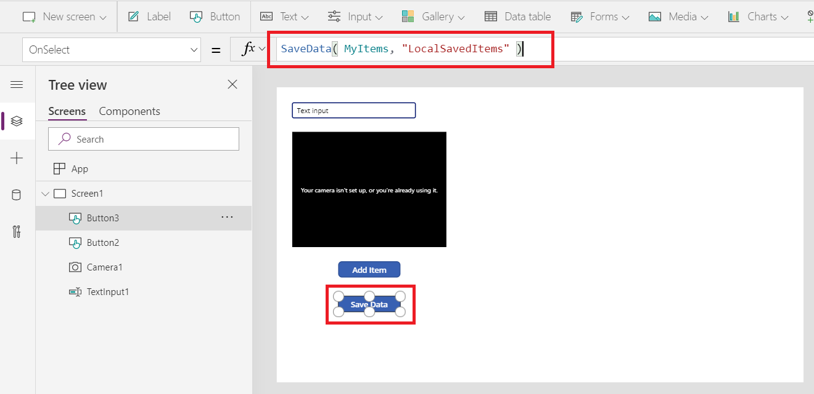
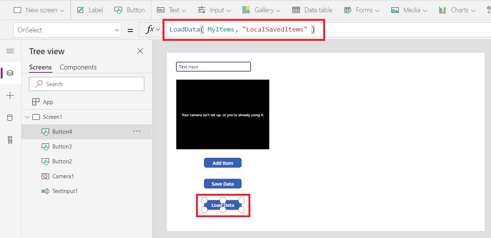
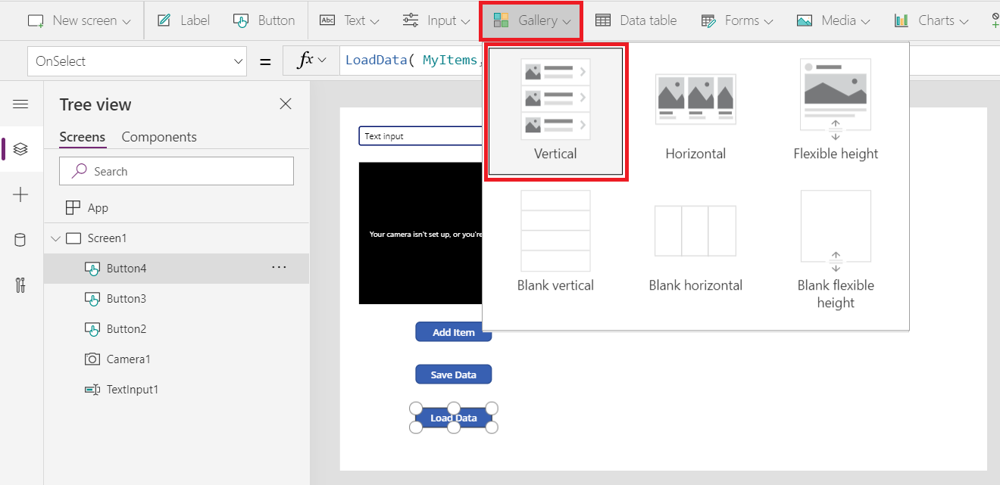
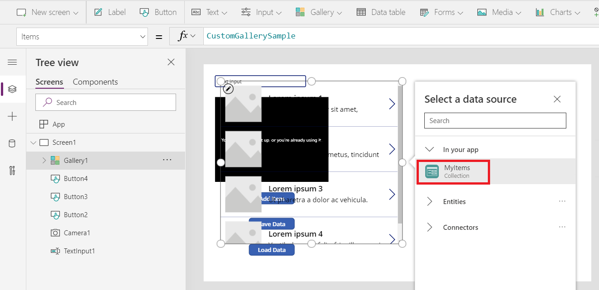
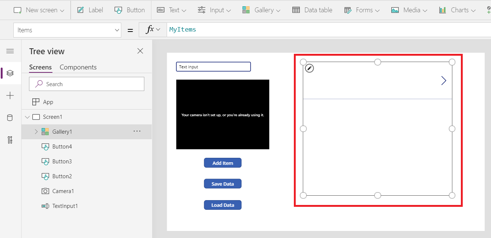

# SaveData and LoadData functions in Power Apps
Saves and re-loads a [collection](../working-with-data-sources.md#collections) from a local device.

## Description
The **SaveData** function stores a collection for later use under a name.  

The **LoadData** function re-loads a collection by name that was previously saved with **SaveData**. You can't use this function to load a collection from another source.  

Use these functions to improve app-startup performance by caching data in the **[App.OnStart](../controls/control-screen.md#additional-properties)** formula on a first run and then re-loading the local cache on subsequent runs. You can also use these functions to add [simple offline capabilities](../offline-apps.md) to your app.

You can't use these functions inside a browser, either when authoring the app in Power Apps Studio or when running the app in the web player. To test your app, run it in Power Apps Mobile on an iPhone or Android device.

These functions are limited by the amount of available app memory because they operate on an in-memory collection. Available memory can vary depending on the device and operating system, the memory that the Power Apps player uses, and the complexity of the app in terms of screens and controls. If you store more than a few megabytes of data, test your app with expected scenarios on the devices on which you expect the app to run. You should generally expect to have between 30 and 70 megabytes of available memory.  

**LoadData** fills a collection but does not define the collection's structure.  Include a **[Collect](function-clear-collect-clearcollect.md)** or **[ClearCollect](function-clear-collect-clearcollect.md)** function call anywhere within your app.  You do not need to actually call these functions as their mere presence is enough to define the structure of the collection.  

The loaded data will be appended to the collection. Use the **[Clear](function-clear-collect-clearcollect.md)** function before calling **LoadData** if you want to start with an empty collection.

The device's built in app sandbox facilities are used to isolate saved data from other apps.  The device may also encrypt the data or use a mobile device management tool such as [Microsoft Intune](https://www.microsoft.com/en-us/microsoft-365/enterprise-mobility-security/microsoft-intune) to encrypt.

## Syntax
**SaveData**( *Collection*, *Name* )<br>**LoadData**( *Collection*, *Name* [, *IgnoreNonexistentFile* ])

* *Collection* - Required.  Collection to be stored or loaded.
* *Name* - Required.  Name of the storage. You must use the same name to save and load the same set of data. The name space isn't shared with other apps or users.
* *IgnoreNonexistentFile* - Optional. Boolean (**true**/**false**) value that indicates whether **LoadData** function should display or ignore errors when it can't locate a matching file. If you specify **false**, errors will be displayed. If you specify **true**, errors will be ignored, which is useful for offline scenarios. **SaveData** may create a file if the device is offline (that is, if the **Connection.Connected** status is **false**).

## Examples

| Formula | Description | Result |
| --- | --- | --- |
| **SaveData( LocalCache, "MyCache" )** | Save the **LocalCache** collection to the user's device under the name "MyCache", suitable for **LoadData** to retrieve later. | Data is saved to the local device. |
| **LoadData( LocalCache, "MyCache" )** | Loads the **LocalCache** collection to the user's device under the name "MyCache", previously stored with a call to **SaveData**.  | Data is loaded from the local device. |   

### Simple offline

1. Create a blank canvas app with a tablet layout.

1. Add a [**Text input**](../controls/control-text-input.md) control and a [**Camera**](../controls/control-camera.md) control and arrange them roughly as shown:
    > [!div class="mx-imgBorder"]  
    > 

1. Add a [**Button**](../controls/control-button.md) control.

2. Double click the control to change the button text to **Add Item** (or modify the **Text** property).

3. Set the **OnSeelct** property to the formula to add an item to our collection:
    ```powerapps-dot
    Collect( MyItems, { Item: TextInput1.Text, Picture: Camera1.Photo } )
    ```
    > [!div class="mx-imgBorder"] 
    > 

1. Add a **Button** control.

2. Double click the control to change the button text to **Save Data** (or modify the **Text** property).

3. Set the **OnSeelct** property to the formula to save our collection to the local device:
    ```powerapps-dot
    SaveData( MyItems, "LocalSavedItems" )
    ```
    > [!div class="mx-imgBorder"] 
    > 

1. Add a **Button** control.

2. Double click the control to change the button text to **Load Data** (or modify the **Text** property).

3. Set the **OnSeelct** property to the formula to load our collection from the local device:
    ```powerapps-dot
    LoadData( MyItems, "LocalSavedItems" )
    ``` 
    > [!div class="mx-imgBorder"] 
    > 

1. Add a [**Gallery**](../controls/control-gallery.md) control with a Vertical layout that includes a picture and text: 
    > [!div class="mx-imgBorder"] 
    > 

1. When prompted, select the **MyItems** collection as the data source for this gallery.  This will set the **Items** property of the **Gallery** control: 
    > [!div class="mx-imgBorder"] 
    > 
    The image control in the gallery template should default to **ThisItem.Picture** and the label controls should default to **ThisItem.Item**.

1. Position the control to the right of the other controls: 
    > [!div class="mx-imgBorder"] 
    > 

1. Save your app.  If it is the first time it has been saved, there is no need to publish it; if not, also publish the app.

1. Open your app on a device such as a phone or tablet.  **SaveData** and **LoadData** cannot be used in Studio or in a web browser.  Refresh your app list if you don't see your app immediately, it can take a few seconds for the app to appear on your device.  Signing out and back in to your account can help too.
    > [!div class="mx-imgBorder"] 
    >  

1. Enter the name and take a picture of an item.

2. Select the **Add Item** button.  Repeat adding items a couple of times to load up your collection.
    > [!div class="mx-imgBorder"] 
    >  

1. Select the **Save Data** button.  This will save the data in your collection to your local device.

1. Close the app.  You collection in memory will be lost including all item names and pictures, but they will still be there in the device's storage.

1. Launch the app again.  The collection in memory will again show as empty in the gallery.
    > [!div class="mx-imgBorder"] 
    >  

1. Select the **Load Data** button.  The collection will be repopulated from the stored data on your device and your items will be back in the gallery.
    > [!div class="mx-imgBorder"] 
    >  

1. Select the **Load Data** button again.  The stored data will be appended to the end of the collection and a scroll bar will appear on the gallery.  If you would like to replace rather than append, use the **Clear** function first to clear out the collection before calling the **LoadData** function.
    > [!div class="mx-imgBorder"] 
    >  
 
### More advanced offline

For a detailed example, see the article on [simple offline capabilities](../offline-apps.md).


