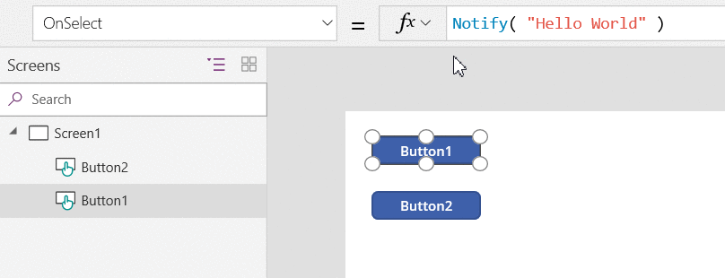

# Select function in PowerApps
Simulates a select action on a control.

## Description
The **Select** function simulates a select action on a control as if the user had caused the selection with a mouse click, screen touch, or keyboard keystroke.  As a result the **OnSelect** formula on the target control is evaluated.

Use **Select** to propagate a select action to a parent control.  Controls inserted into a **[Gallery](../controls/control-gallery.md)** control have a default **OnSelect** property set to **Select( Parent )**.  With this propagation in place, set the **OnSelect** of the gallery control to have mouse clicks anywhere in the gallery evaluate the same formula.  You can also have specialized buttons in your gallery that perform different actions by replacing **Select( Parent )** on just those controls with your own formula while having most of the gallery continue to propagate to the **OnSelect** of the gallery.  

**Select** queues the select action for later processing which may happen after the current formula has been evaluated.  **Select** does not cause the target **OnSelect** property to evaluate immediately nor does it wait for it finish evaluation.  

The target control cannot be within a container control, such as a gallery, unless the formula evaluating the **Select** function is also within the same container.  **Select** cannot be used across screens.

**Select** can only be used with controls that have an **OnSelect** property.  

**Select** can only be used in [behavior formulas](../working-with-formulas-in-depth.md).  

## Syntax
**Select**( *Control* )

* *Control* – Required.  The control to select on behalf of the user.  

## Examples

#### Basic usage

1. Insert a **[Button](../controls/control-button.md)** control, and rename it **Button1** if it has a different name.

2. Set this first button control's **OnSelect** property to this formula:

	**Notify( "Hello World" )**. 

2. Insert a second **Button** control on the same screen, and set its **OnSelect** property to:

	**Select( Button1 )**.

4. Press the second button.  You will see a notification across the top of your app.  This notification was generated by the **OnSelect** property of the first button control.

	

#### Gallery control

