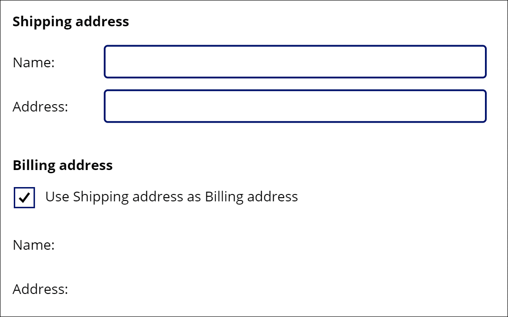
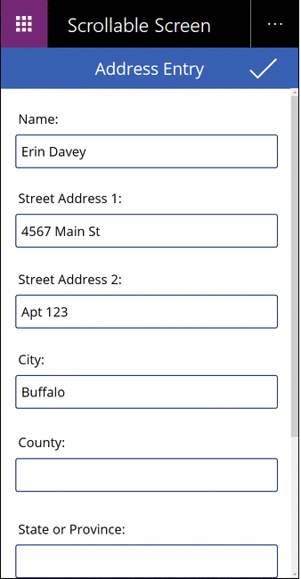

# SetFocus function in PowerApps
Moves input focus to a specific control. 

## Description
The **SetFocus** function gives a control the input focus.  The user's keystrokes are then received by that control, allowing them to type into a text input control or use the *Enter* key to select a button.  The user can also use the *Tab* key to move the input focus themselves. 

Use the **SetFocus** function within the **OnVisible** property of the [**Screen**](../controls/control-screen.md) to set the focus when a screen is displayed.  For example, when entering a screen you may always want the first text input control to have the focus.  Also use **SetFocus** to a newly exposed or enabled input control to guide the user in what comes next and for faster data entry.

The control with focus may be visually different based on the [**FocusedBorderColor**](../controls/properties-color-border.md) and [**FocusedBorderThickness**](../controls/properties-color-border.md) properties.

**SetFocus** can be used with:
- [**Button**](../controls/control-button.md) control
- [**Icon**](../controls/control-shapes-icons.md) control
- [**Image**](../controls/control-image.md) control
- [**Label**](../controls/control-text-box.md) control
- [**TextInput**](../controls/control-text-input.md) control

You cannot set the focus to controls that are within a [**Gallery**](../controls/control-gallery.md) control, [**Edit form**](../controls/control-form-detail.md) control, or [Component](../create-component.md).

You can only set the focus to controls on the same screen as the formula containing the **SetFocus** call.

Attempting to set the focus to a control that has its [**DisplayMode**](../controls/properties-core.md) property set to **Disabled** has no effect.  Focus will remain where it was previously.

On Apple iOS, the soft keyboard will only be displayed automatically if **SetFocus** was initiated by a direct user action.  For example, invoking from a button's **OnSelect** property will display the soft keyboard while invoking from a screen's **OnVisible** will not. 

You can use **SetFocus** only in [behavior formulas](../working-with-formulas-in-depth.md).

## Syntax
**SetFocus**( *Control* )

* *Control* – Required.  The control to give the input focus.

## Examples

### Move focus to newly enabled input controls

Many shopping carts allow the customer to reuse the shipping address as the billing address, alleviating the need to enter the same information twice.  If a different billing address is desired, the billing address text input boxes are enabled, and it is helpful to guide the customer to the these newly enabled controls for faster data entry.  



There are many formulas in play here, but the one that moves the focus is on the **OnUncheck** property of the **Check box** control:

```powerappa-dot
SetFocus( BillingName ) 
```

The Tab key can also be used to move focus quickly from one field to another.  To better illustrate, the Tab key was not used in the animation.

To recreate this entire example:
1. Create a new app.
1. Add [**Label** controls](../controls/control-text-box.md) with the text "Shipping address", "Name:", "Address:", "Billing Address", "Name:", and "Address:" and position them as shown in the animation.
1. Add a [**Text Input** control](../controls/control-text-input.md) and rename it **ShipingName**.
1. Add a [**Text Input** control](../controls/control-text-input.md) and rename it **ShipingAddress**.
1. Add a [**Check box** control](../controls/control-check-box.md) and rename it **SyncAddresses**.
1. Set the **Text** property of this control to the formula `"Use Shipping address as Billing address"`.
1. Add a [**Text Input** control](../controls/control-text-input.md) and rename it **BillingName**.
1. Set the **Default** property on this control to the formula `ShippingNmae`.
1. Set the **DisplayMode** property on this control to the formula `If( SyncAddresses.Value, DisplayMode.View, DisplayMode.Edit )`.  This will automatically 
1. Add a [**Text Input** control](../controls/control-text-input.md) and rename it **BillingAddress**.
1. Set the **Default** property on this control to the formula `ShippingAddress`.
1. Set the **DisplayMode** property on this control to the formula `If( SyncAddresses.Value, DisplayMode.View, DisplayMode.Edit )`.
1. Set the **Default** property of the check box to the formula `true`.  This will default the form to use the Shipping address for the Billing address.
1. Set the **OnCheck** property of the check box to the formula `Reset( BillingName ); Reset( BillingAddress )`.  If the user chooses to sync Shipping and Billing addresses, this will clear the user input in the Billing address fields and the **Default** properties on each will pull the values from the Shipping address fields.
1. Set the **OnUncheck** property of the check box to the formula `SetFocus( BillingName )`.  If the user chooses to have a different billing address, this will move the focus to the first control in the Billing address.  The controls will have already been enabled due to their **DisplayMode** properties.

### Focus on valiation issues

When validating a form, it can be very helpful to not only display a message but to take the user to the field that is offending.  It can be particularly helpful if the field in question is scrolled off the screen and not visible.



The validation button in this example uses the formula to both display a banner error and **SetFocus** to the text input box that requires attention:

```powerapps-dot
If( IsBlank( Name ), Notify( "Please provide a value for Name", Error ); SetFocus( Name ),
    IsBlank( Street1 ), Notify( "Please provide a value for Street Address 1", Error ); SetFocus( Street1 ),
    IsBlank( Street2 ), Notify( "Please provide a value for Street Address 2", Error ); SetFocus( Street2 ),
    IsBlank( City ), Notify( "Please provide a value for City", Error ); SetFocus( City ),
    IsBlank( County ), Notify( "Please provide a value for County", Error ); SetFocus( County ),
    IsBlank( AddressState ), Notify( "Please provide a value for State", Error ); SetFocus( AddressState ),
    IsBlank( Zip ), Notify( "Please provide a value for Zip", Error ); SetFocus( Zip ),
    IsBlank( Phone ), Notify( "Please provide a value for Contact Phone", Error ); SetFocus( Phone ),
    Notify( "Form is Complete", NotificationType.Success )
)
```


