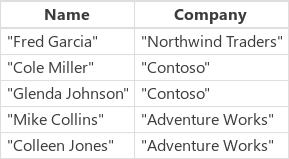
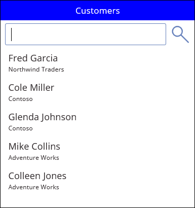

# EndsWith and StartsWith functions in PowerApps
Tests whether a text string begins or ends another text string.

## Description
The **EndsWith** function tests whether one text string ends with another.

The **StartsWith** function tests whether one text string begins with another.    

For both functions, the tests are case insensitive.  The return value of both is a Boolean **true** or **false**.  

Use **EndsWith** and **StartsWith** with the **[Filter](function-filter-lookup.md)** function to search the data within your app. You can also use the **[in](operators.md#in-and-exactin-operators)** operator or the **[Search](function-filter-lookup.md)** function to look anywhere within text strings, not just at the beginning or end.  Your choice of functions will depend on the needs of your app and which function can be [delegated](../delegation-overview.md) for your particular data source.  If one of these functions can't be delegated, a delegation warning will appear at authoring time to warn you of this limitation.

## Syntax
**EndsWith**( *Text*, *EndText* )

* *Text* – Required.  The text to test.
* *EndText* – Required.  The text to search for at the end of *Text*.  If *EndText* is an empty string, **EndsWith** returns *true*.

**StartsWith**( *Text*, *StartText* )

* *Text* – Required.  The text to test.
* *StartText* – Required.  The text to search for at the beginning of *Text*.  If *StartText* is an empty string, **StartsWith** returns *true*.

## Examples

| Formula | Description | Result |
| --- | --- | --- |
| **EndsWith( "Hello World", "world" )** |Tests whether **"Hello World"** ends with **"world"**.  The test is case insensitive. |**true** |
| **EndsWith( "Good bye", "good" )** |Tests whether **"Good bye"** ends with **"good"**.  The *EndText* argument (**"good"**) appears in the text but not at the end. |**false** |
| **EndsWith( "Always say hello", "hello" )** |Tests whether **"Always say hello"** ends with **"hello"**. |**true** |
| **Endswith( "Bye bye", "" )** |Tests whether **"Bye bye"** ends with an empty text string (**Len** returns 0).  Easing its use in **Filter** expressions, **EndsWith** is defined to return **true** in this case. |**true** |

| Formula | Description | Result |
| --- | --- | --- |
| **StartsWith( "Hello World", "hello" )** |Tests whether **"Hello World"** begins with **"hello"**.  The test is case insensitive. |**true** |
| **StartsWith( "Good bye", "hello" )** |Tests whether **"Good bye"** begins with **"hello"**. |**false** |
| **StartsWith( "Always say hello", "hello" )** |Tests whether **"Always say hello"** begins with **"hello"**.  Although **"hello"** appears in the text, it doesn't appear at the beginning. |**false** |
| **StartsWith( "Bye bye", "" )** |Tests whether **"Bye bye"** starts with an empty text string (**Len** returns 0).  Easing its use in **Filter** expressions, **StartsWith** is defined to return **true** in this case. |**true** |

### Search user experience
In many apps, you can type one or more characters into a search box to filter a list of records in a large data set. As you type, the list shows only those records that match the search criteria.

The examples in the rest of this topic show the results of searching a **Customers** list that contains this data:

To create this data source as a collection, create a **[Button](../controls/control-button.md)** control and set its **OnSelect** property to this formula:

**ClearCollect( Customers, Table( { Name: "Fred Garcia", Company: "Northwind Traders" }, { Name: "Cole Miller", Company: "Contoso" }, { Name: "Glenda Johnson", Company: "Contoso" }, { Name: "Mike Collins", Company: "Adventure Works" }, { Name: "Colleen Jones", Company: "Adventure Works" } ) )**

As in this example, you can show a list of records in a [**Gallery control**](../controls/control-gallery.md) at the bottom of a screen. Near the top of the screen, you can add a [**Text input**](../controls/control-text-input.md) control, named **SearchInput**, so that users can specify which records interest them.

As the user types characters in **SearchInput**, the results in the gallery are automatically filtered. In this case, the gallery is configured to show records for which the name of the customer (not the name of the company) starts with the sequence of characters in **SearchInput**.If the user types **co** in the search box, the gallery shows these results:

To filter based on the **Name** column, set the **Items** property of the gallery control to one of these formulas:

| Formula | Description | Result |
| --- | --- | --- |
| **Filter( Customers, StartsWith( Name, SearchInput.Text ) )** |Filters the **Customers** data source for records in which the search string appears at the start of the **Name** column. The test is case insensitive. If the user types **co** in the search box, the gallery shows **Colleen Jones** and **Cole Miller**. The gallery doesn't show **Mike Collins** because the **Name** column for that record doesn't start with the search string. |  |
| **Filter( Customers, SearchInput.Text in Name )** |Filters the **Customers** data source for records in which the search string appears anywhere in the **Name** column. The test is case insensitive. If the user types **co** in the search box, the gallery shows **Colleen Jones,** **Cole Miller,** and **Mike Collins** because the search string appears somewhere in the **Name** column of all of those records. |  |
| **Search( Customers, SearchInput.Text, "Name" )** |Similar to using the **in** operator, the **Search** function searches for a match anywhere within the **Name** column of each record. Note that you must enclose the column name in double quotation marks. |  |

You can expand your search to include the **Company** column as well as the **Name** column:

| Formula | Description | Result |
| --- | --- | --- |
| **Filter( Customers, StartsWith( Name, SearchInput.Text ) &#124;&#124; StartsWith( Company, SearchInput.Text ) )** |Filters the **Customers** data source for records in which either the **Name** column or the  **Company** column starts with the search string (for example, **co**).  The [**&#124;&#124;** operator](operators.md) is *true* if either **StartsWith** function is *true*. |  |
| **Filter( Customers, SearchInput.Text in Name &#124;&#124; SearchInput.Text in Company )** |Filters the **Customers** data source for records in which either the **Name** column or the **Company** column contains the search string (for example, **co**) anywhere within it. |  |
| **Search( Customers, SearchInput.Text, "Name", "Company" )** |Similar to using the **in** operator, the **Search** function searches the **Customers** data source for records in which either the **Name** column or the **Company** column contains the search string (for example, **co**) anywhere within it. The **Search** function is easier to read and write than **Filter** if you want to specify multiple columns and multiple **in** operators. Note that you must enclose the names of the columns in double quotation marks. |  |

