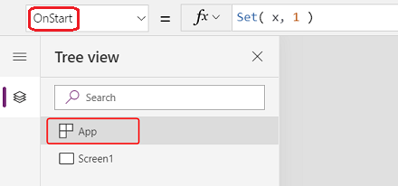
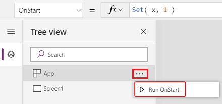

# App object in PowerApps

Provides information about the currently running app and control over the app's behavior.

## Description

Like a control, the **App** object provides properties that your app can use to know which screen is being displayed and to control when a confirmation dialog should appear before the user loses unsaved changes. Every app has an **App** object.

You can write formulas for some **App** object properties. Select the **App** object at the top of the **Tree view** pane as you would any other control or screen. View and edit the object's properties by selecting a property in the drop-down list to the left of the formula bar.

> [!div class="mx-imgBorder"]
> 

## ActiveScreen property

The **ActiveScreen** property provides the screen that's displayed.

This property returns a screen object, which you can use to reference properties of the screen or compare to another screen to determine which screen is displayed. You can also retrieve the name of the currently displayed screen by using the expression **App.ActiveScreen.Name**.

change the displayed screen by using the **[Back](function-navigate.md)** or **[Navigate](function-navigate.md)** function.

## OnStart property

The **OnStart** property runs when the user starts the app.

This property is commonly used to retrieve and cache data into collections with the **[Collect](function-clear-collect-clearcollect.md)** function, set up global variables with the **[Set](function-set.md)** function, and navigate to an initial screen with the **[Navigate](function-navigate.md)** function.

This formula is evaluated before the first screen appears. No screen is loaded, so you can't set context variables with the **[UpdateContext](function-updatecontext.md)** function. However, you can pass context variables with the **Navigate** function.  

After you change the **OnStart** property, you can test it by hovering over the **App** object in the **Tree view** pane, selecting the ellipsis (...) that appears, and then selecting **Run OnStart**. Unlike when the app is loaded for the first time, existing collections and variables will already be set. Use the **[ClearCollect](function-clear-collect-clearcollect.md)** function instead of the **Collect** function to start with empty collections.

> [!div class="mx-imgBorder"]
> 

## ConfirmExit properties

Nobody wants to lose unsaved changes. Use the **ConfirmExit** and **ConfirmExitMessage** properties to warn the user before they close your app.

> [!NOTE]
> **ConfirmExit** doesn't work in embedded scenarios such as Power BI or SharePoint.

### ConfirmExit

**ConfirmExit** is a Boolean property that, when *true*, causes a confirmation dialog box to appear before the app is closed. The default for this property is *false*, and no confirmation appears.

Use this property to show a confirmation dialog box if the user has made changes but not saved them. Use a formula that can check variables and control properties (for example, the **Unsaved** property of form controls).

The confirmation dialog box appears in any situation where data could be lost, as in these examples:

- Running the [**Exit**](function-exit.md) function.
- If running the app in a browser:
  - Closing the browser or browser tab.
  - Selecting the browser's back button.
- If running the app in PowerApps Mobile (iOS or Android):
  - Running the [**Launch**](function-param.md) function.<br>If you run this function in a browser, another tab opens. No data would be lost, so the **ConfirmExit** function doesn't run.
  - Closing PowerApps Mobile.
  - Swiping to switch to a different app.
  - Selecting the back button on an Android device.

The exact look of the confirmation dialog box might vary across devices and versions of PowerApps.

The confirmation dialog box doesn't appear in PowerApps Studio.

### ConfirmExitMessage

By default, the confirmation dialog box shows a generic message, such as **"You may have unsaved changes."** in the user's language.

Use **ConfirmExitMessage** to provide a custom message in the confirmation dialog box. If this property is *blank*, the default will be used. The message will be truncated to fit within the confirmation dialog box; keep the message to a few lines at most.

In a browser, the confirmation dialog might appear with a generic message from the browser.

### Example

Imagine your app contains two form controls named **AccountForm** and **ContactForm**. To warn the user before closing when there are unsaved changes in either of these form controls, set the **App** object's **ConfirmExit** property to this expression:

```powerapps-dot
AccountForm.Unsaved Or ContactForm.Unsaved
```

When the user closes the app on a phone without saving changes, this confirmation dialog box appears:

> [!div class="mx-imgBorder"]
> 

To give the user more actionable information about which form contains unsaved changes, set the **App** object's **ConfirmExitMessage** property to this formula:

```powerapps-dot
If( AccountsForm.Unsaved,
    "Accounts form has unsaved changes.",
    "Contacts form has unsaved changes."
)
```

If the **AccountForm** has unsaved changes, this confirmation dialog box appears:

> [!div class="mx-imgBorder"]
> 