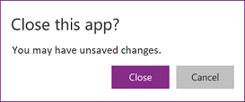
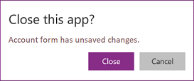

# App object in PowerApps

Provides information about the currently running app and control over the app's behavior.

## Description

Like a control, the **App** object provides properties that identify which screen is showing and that prompt the user to save changes so that they're not lost. Every app has an **App** object.

You can write formulas for some properties of the **App** object. At the top of the **Tree view** pane, select the **App** object as you would any other control or screen. View and edit one of the object's properties by selecting it in the drop-down list to the left of the formula bar.

> [!div class="mx-imgBorder"]
> 

## ActiveScreen property

The **ActiveScreen** property identifies the screen that's showing.

This property returns a screen object, which you can use to reference properties of the screen or compare to another screen to determine which screen is showing. You can also use the expression **App.ActiveScreen.Name** to retrieve the name of the screen that's showing.

Use the **[Back](function-navigate.md)** or **[Navigate](function-navigate.md)** function to change the screen that's showing.

## OnStart property

The **OnStart** property runs when the user starts the app. App makers often use this property to perform these tasks:

- Retrieve and cache data into collections by using the **[Collect](function-clear-collect-clearcollect.md)** function.
- Set up global variables by using the **[Set](function-set.md)** function.
- Navigate to an initial screen by using the **[Navigate](function-navigate.md)** function.

This formula is evaluated before the first screen appears. No screen is loaded, so you can't set context variables with the **[UpdateContext](function-updatecontext.md)** function. However, you can pass context variables with the **Navigate** function.

After you change the **OnStart** property, test it by hovering over the **App** object in the **Tree view** pane, selecting the ellipsis (...) that appears, and then selecting **Run OnStart**. Unlike when the app is loaded for the first time, existing collections and variables will already be set. To start with empty collections, use the **[ClearCollect](function-clear-collect-clearcollect.md)** function instead of the **Collect** function.

> [!div class="mx-imgBorder"]
> 

## ConfirmExit properties

Nobody wants to lose unsaved changes. Use the **ConfirmExit** and **ConfirmExitMessage** properties to warn the user before they close your app.

> [!NOTE]
> **ConfirmExit** doesn't work in apps that are embedded in, for example, Power BI and SharePoint.

> [!NOTE]
> At present, these properties cannot reference controls on any screens besides the first screen if the **Delayed load** preview feature is enabled (which it is by default for new apps).  If references are made, no error will appear while authoring, but the resulting published app will not load in any players.  We are actively working to lift this limitation.  In the meantime, you can turn off **Delayed load** in the File > App settings > Advanced settings under Preview features.

### ConfirmExit

**ConfirmExit** is a Boolean property that, when *true*, opens a confirmation dialog box before the app is closed. By default, this property is *false*, and no dialog box appears.

Use this property to show a confirmation dialog box if the user has made changes but not saved them. Use a formula that can check variables and control properties (for example, the **Unsaved** property of the [**Edit form**](../controls/control-form-detail.md) control).

The confirmation dialog box appears in any situation where data could be lost, as in these examples:

- Running the [**Exit**](function-exit.md) function.
- If the app is running in a browser:
  - Closing the browser or the browser tab in which the app is running.
  - Selecting the browser's back button.
- If the app is running in PowerApps Mobile (iOS or Android):
  - Running the [**Launch**](function-param.md) function.<br>If you run this function in a browser, another tab opens (no data would be lost, so the **ConfirmExit** formula doesn't evaluate).
  - Swiping to switch to a different app in the player.
  - Selecting the back button on an Android device.

The exact look of the confirmation dialog box might vary across devices and versions of PowerApps.

The confirmation dialog box doesn't appear in PowerApps Studio.

### ConfirmExitMessage

By default, the confirmation dialog box shows a generic message, such as **"You may have unsaved changes."** in the user's language.

Use **ConfirmExitMessage** to provide a custom message in the confirmation dialog box. If this property is *blank*, the default value is used. Custom messages are truncated as necessary to fit within the confirmation dialog box, so keep the message to a few lines at most.

In a browser, the confirmation dialog box might appear with a generic message from the browser.

### Example

1. Create an app that contains two form controls, **AccountForm** and **ContactForm**.

1. Set the **App** object's **ConfirmExit** property to this expression:

    ```powerapps-dot
    AccountForm.Unsaved Or ContactForm.Unsaved
    ```

    This dialog box appears if the user changes data in either form and then tries to close the app without saving those changes.

    > [!div class="mx-imgBorder"]
    > 

1. Set the **App** object's **ConfirmExitMessage** property to this formula:

    ```powerapps-dot
    If( AccountsForm.Unsaved,
        "Accounts form has unsaved changes.",
        "Contacts form has unsaved changes."
    )
    ```

    This dialog box appears if the user changes data in the Account form and then tries to close the app without saving those changes.

    > [!div class="mx-imgBorder"]
    > 