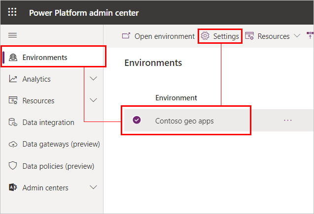
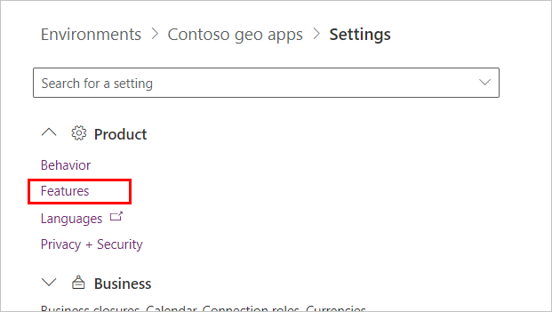
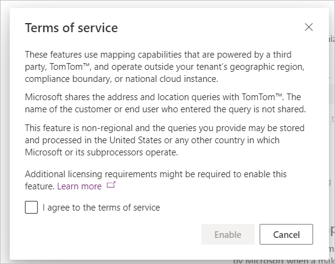
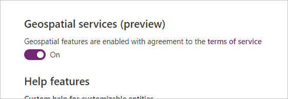
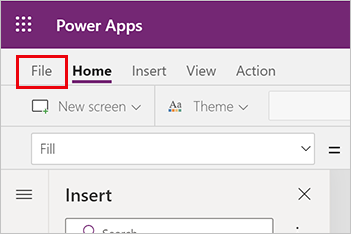
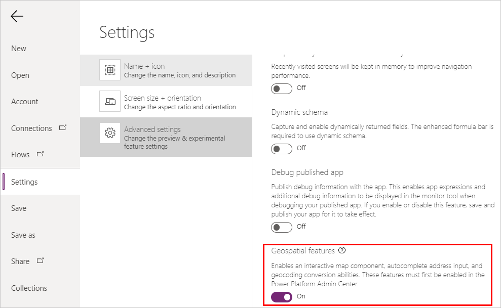
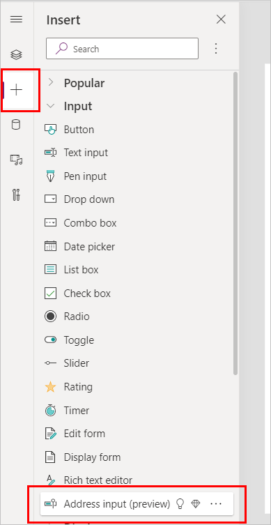
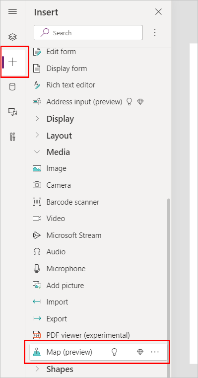

# Add augmented reality components to your app

[!INCLUDE [cc-beta-prerelease-disclaimer.md](../../includes/cc-beta-prerelease-disclaimer.md)]

You can add a number of geospatial components to your canvas app to support scenarios that involve mapping locations and addresses with Azure maps.

Components are groups of controls that can answer the need for a specific scenario.

You can read more about components and how to build your own in [the Power Apps developer library](/powerapps/developer/component-framework/custom-controls-overview).

The following pre-built components can be used for geospatial and mapping scenarios:

- [Dynamic map](geospatial-component-map.md)
- [Address input](geospatial-component-input-address.md)

## Prerequisites

1. An admin must [enable the geospatial features in the Power Platforma Admin Center](#enable-the-geospatial-features-for-the-environment) for the environment. This requires reviewing and agreeing to specific terms of service.
2. [Enable the geospatial features for each app](#enable-the-geospatial-features-for-each-app).

### Enable the geospatial features for the environment

Before you can use geospatial features in your apps, an admin must enable access to the features for the environment where you want to create your app.

The geospatial features require additional terms of use that must be reviewed and agreed to.

1. Open the [Power Platform admin center](https://admin.powerplatform.microsoft.com).

1. On the **Environments** tab, select the environment you want to use for your apps, and then select **Settings** from the top menu.

    

1. Expand **Product** and select **Features**.

    

1. Under **Geospatioal services (preview)**, set the toggle switch to **On**. A terms of service notice will appear. Read through the terms of service, and if you agree, select the checkbox **I agree to the terms of service**, and then **Enable**.

    

    >[!IMPORTANT]
    >You must read and agree to the terms of service before you can use geospatial features. The following are the terms of service:  
    >  
    >These features use mapping capabilities that are powered by a third party, TomTom(tm), and operate outside your tenant's geographic region, compliance boundary, or national cloud instance.  
    >Microsoft shares the address and location queries with TomTom(tm). The name of the customer or end user who entered the query is not shared.  
    >This feature is non-regional and the queries you provide may be stored and processed in the United States or any other country in which Microsoft or its subprocesors operate.  
    >Additional licensing requirements might be required to enable this feature.  

    

1. Click **Save** at the bottom of the settings page.

    

### Enable the geospatial features for each app

1. Open the app for editing in Power Apps Studio at [https://create.powerapps.com](https://create.powerapps.com).

2. Select **File** from the top menu.

    

3. Go to the **Settings** tab, select **Advanced settings**, and scroll down to find the **Geospatial features** option. Set the option to **On**.

    

4. Return to editing your app by selecting the back arrow icon.

    

5. Open the **Insert** pane to see the geospatial components:
    - **Address input** is under **Input**
    - **Map** is under **Media**

      
    
    

## Next steps

Start installing the components in your apps:

- View, rotate, and zoom maps with the **[Dynamic map](geospatial-component-map.md)** component.
- Enter well-formatted addresses, and link them to autocomplete forms or display on a map with the **[Address input](geospatial-component-input-address.md)** component.

