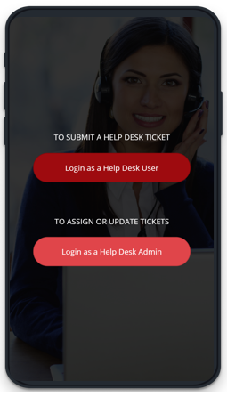
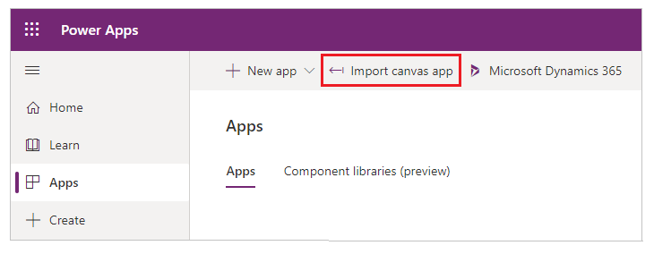
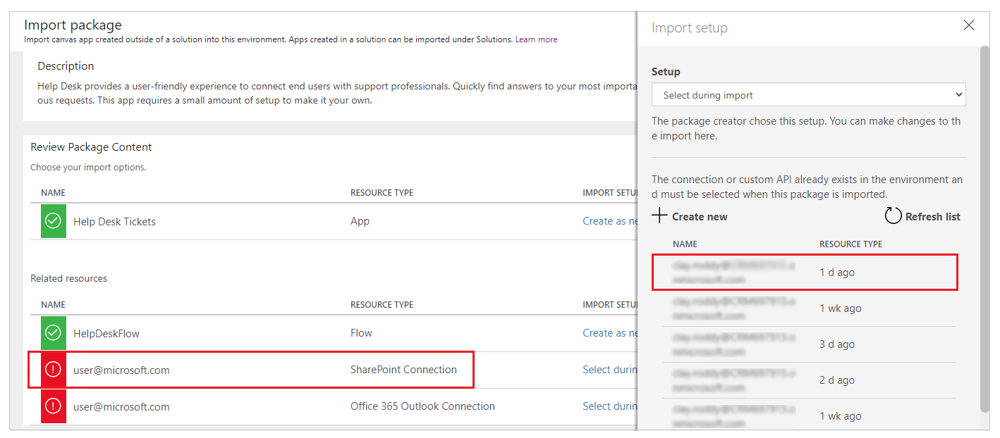
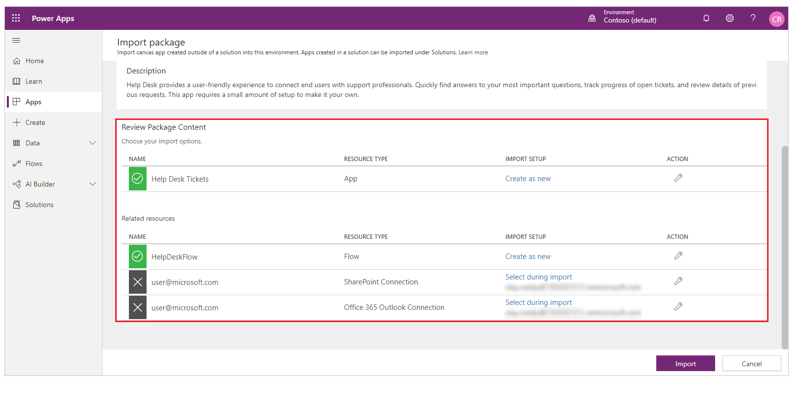
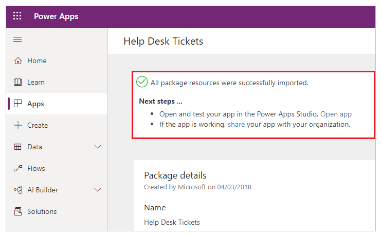
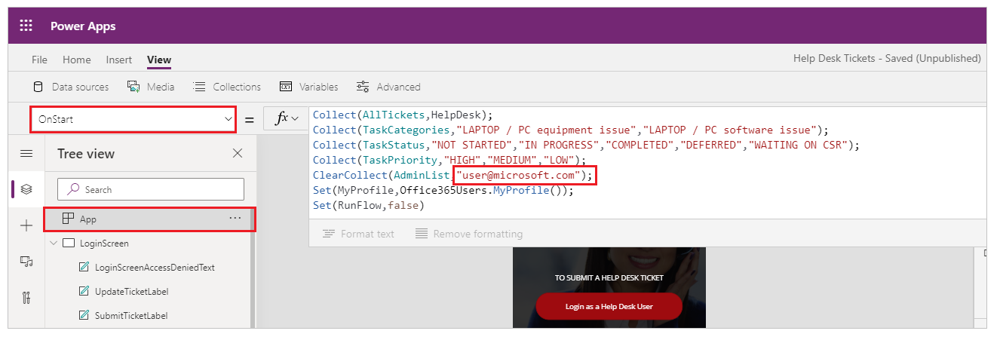
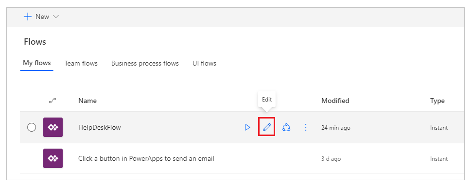
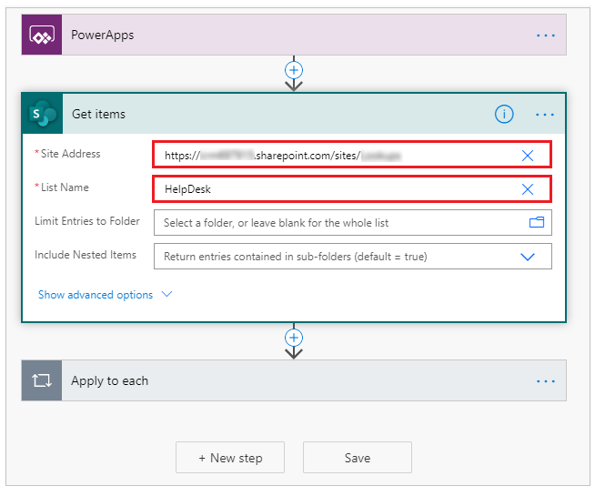

# Install and configure the Help Desk sample in PowerApps

Step-by-step instructions for, in PowerApps, installing and configuring the Help Desk sample for canvas apps.

Estimated time to complete these steps: **10-15 minutes**

> [!TIP]
> For a demonstration of this process, please watch this [video](https://youtu.be/z4cdtD6hB_4).

## Overview of the sample

Help Desk provides a user-friendly experience to connect end users with support professionals. Quickly find answers to your most important questions, track progress of open tickets, and review details of previous requests. This app requires a small amount of setup to make it your own.

> [!TIP]
> Watch this [video](https://youtu.be/sl5fXwwnvzI) to see how to use the Help Desk PowerApp Sample.

## Prerequisites

- [Sign up](https://web.powerapps.com?utm_source=padocs&utm_medium=linkinadoc&utm_campaign=referralsfromdoc) for PowerApps.
- Must have a valid SharePoint Online license and permission to create lists.

## Create the HelpDesk SharePoint list

This list stores the Help Desk tickets.

1. Open a web browser and navigate to https://portal.office.com.
2. Log in with an account that has permission to create SharePoint lists.
3. Navigate to the site collection where you want the HelpDesk list to reside.
4. Click the **gear icon** in the top right portion of the web page.
5. Click **Add an app**.
6. In the **Find an app** textbox, enter **Custom**.
7. Click the **search icon**.
8. Click the **Custom List** app.
9. In the **Name** textbox, enter **HelpDesk**.

	> [!IMPORTANT]
	> If you choose a different name for the list make sure you write it down because you will need to substitute it for HelpDesk everywhere you see it during the installation and configuration process.

10. Click **Create**.

### Create Description column

1. Select the ellipsis next to the HelpDesk list and click **Settings**.
2. Click **Create column**.
3. In the **Column name** textbox enter **Description**.
4. In the **type of information in this column is** radio button list, select **Multiple lines of text**.
5. In the **Require that this column contains information** radio button list, select **Yes**.
6. In the **Specify the type of text to allow** radio button list, select **Plain text**.
7. Click **OK**.

### Create Category column

1. Click **Create column**.
2. In the **Column name** textbox enter **Category**.
3. In the **type of information in this column is** radio button list, select **Choice**.
4. In the **Type each choice on a separate line** textbox enter the following values, each on a separate line: 
	- LAPTOP / PC equipment issue
	- LAPTOP / PC software issue
5. In the **Enforce unique values** radio button list, select **No**.
6. In the **Display choices using** radio button list, select **Drop-Down Menu**.
7. In the **Default value** textbox, enter **LAPTOP / PC equipment issue**.
8. Click **OK**.

### Create PercentComplete column

1. Click **Create column**.
2. In the **Column name** textbox enter **PercentComplete**.
3. In the **type of information in this column is** radio button list, select **Number (1, 10, 100)**.
4. In the **Require that this column contains information** radio button list, select **No**.
5. Click **OK**.

### Create Priority column

1. Click **Create column**.
2. In the **Column name** textbox enter **Priority**.
3. In the **type of information in this column is** radio button list, select **Choice**.
4. In the **Type each choice on a separate line** textbox enter the following values, each on a separate line: 
	- HIGH
	- MEDIUM
	- LOW
5. In the **Enforce unique values** radio button list, select **No**.
6. In the **Display choices using** radio button list, select **Drop-Down Menu**.
7. In the **Default value** textbox, enter **LOW**.
8. Click **OK**.

### Create TaskStatus column

1. Click **Create column**.
2. In the **Column name** textbox enter **TaskStatus**.
3. In the **type of information in this column is** radio button list, select **Choice**.
4. In the **Type each choice on a separate line** textbox enter the following values, each on a separate line: 
	- NOT STARTED
	- IN PROGRESS
	- COMPLETED
	- DEFERRED
	- WAITING ON CSR
5. In the **Enforce unique values** radio button list, select **No**.
6. In the **Display choices using** radio button list, select **Drop-Down Menu**.
7. In the **Default value** textbox, enter **NOT STARTED**.
8. Click **OK**.

### Create AssignedTo column

1. Click **Create column**.
2. In the **Column name** textbox enter **AssignedTo**.
3. In the **type of information in this column is** radio button list, select **Person or Group**.
4. In the **Require that this column contains information** radio button list, select **No**.
5. In the **Allow multiple selections** radio button list, select **NO**.
6. Click **OK**.

### Edit 'Title' column

1. Click the **Title** column link.
2. In the **Require that this column contains information** radio button list, select **No**.
3. Click **OK**.

## Download the Help Desk PowerApp

1.	[Download](http://pappsfeprodwestuscontent.blob.core.windows.net/sampleapps/helpdesk/docs/HelpDesk(SP_List).zip) the PowerApps package and save it to your machine.

## Create connections

1.	In a web browser, navigate to [web.powerapps.com](https://web.powerapps.com?utm_source=padocs&utm_medium=linkinadoc&utm_campaign=referralsfromdoc).
2.	Sign in by providing the same credentials that you used to sign up.
3.	In the menu on the left, select **Data** then **Connections**.
	
### Create Office 365 Outlook connection

1.	Click **+ New connection**.
2.	In the **Search** textbox, enter **Office 365 Outlook**.
3.	Select **Office 365 Outlook** in the list.
4.	Click **Create**.
5.	In the popup window, select the account you logged in with.

### Create SharePoint connection

1.	Click **+ New connection**.
2.	In the **Search** textbox, enter **SharePoint**.
3.	Select **SharePoint** in the list.
4.	Click **Create**.
5.	In the popup window, select the account you logged in with.

### Create Office 365 Users connection

1.	Click **+ New connection**.
2.	In the **Search** textbox, enter **office 365 users**.
3.	Select **Office 365 Users** in the list.
4.	Click **Create**.
5.	In the popup window, select the account you logged in with.

## Import the Help Desk PowerApp

1. In a web browser, navigate to https://web.powerapps.com.
2. Sign in by providing the same credentials that you used to sign up.
3. In the menu on the left, select **Apps**. 
4. Click **Import package(preview)**.
	
   

5. Click the **Upload** button and select the PowerApp package you downloaded in previous steps.
6. For the **App** and **Flow** resource types, set **IMPORT SETUP** to **Create as new**.
7. For the **SharePoint** and **Outlook** connections, set **IMPORT SETUP** to **Select during import**.
	
   

8. Click the **red icon** for the **SharePoint Connection**.
9. In the connections list, click the item with your username.

   

10. Click **Save**.
11. Click the **red icon** for the **Office 365 Outlook Connection**.
12. In the connections list, click the item with your username.

	

13. Click **Save**.

	> [!TIP] 
	> When you are done, it will look like this.

	

14.	Click **Import** and wait until the process is complete.

	

## Configure the PowerApp to use the SharePoint list

1. Under Next steps, click **Open app**.
2. Click **Allow** when prompted for permission.

### Delete connections

1. Click **View**.
2. Click **Data sources**.
3. In the **Data** pane, click the **ellipses** next to the **HelpDesk** SharePoint connection.
4. Click **Remove**.

### HelpDesk list

1. Click **View**.
2. Click **Data sources**.
3. In the **Data** pane, click **+ Add data source**.
4. Select **SharePoint**.
5. Click **Create**.
6. In the **Recent sites** list, select the SharePoint site where you created the HelpDesk List.

	> [!TIP] 
	> If the site does not appear in the list, enter the URL to the SharePoint site in the textbox and click, **Go**.

7. In the **Search** textbox at the top of the list enter **HelpDesk**.
8. Check the checkbox next to the **HelpDesk** list.
9. Click **Connect**.

### Update admin list

1. Select the **LoginScreen**.
2. Select **OnStart** in the dropdown.
3. Expand the formula window and find the **AdminList** collection.
4. Replace <strong>user@microsoft.com</strong> with your HelpDesk administrator(s).

	
	
   > [!TIP]
   > If you have more than 1 admin, please use a comma to delimit the admin.  Example:
   > "admin1@microsoft.com","admin2@microsoft.com".
   > To ensure the addresses in the AdminList match the format PowerApps expects, select
   > View > Variables > Global > MyProfile and look at the 'Mail' column to see the expected email format.

5. Click **File**.
6. Click **Save**.
7. Click **Publish**.
8. Click **Publish this version**.

## Modify the Flow

1.	In the menu on the left, click **Flows**.
2.	If prompted to sign in, sign in by providing the same credentials that you used to sign up.
3.	Select **My flows** in the top menu.
4.	Next to the **HelpDeskFlow** Flow, click the **pencil icon**. 
 
	

5.	Expand the **Get items** action. 
6.	Change the **Site Address** and **List Name** to match the HelpDesk SharePoint list you created.
	
	

	> [!TIP] 
	> You don’t need to type it manually, you can choose it in the dropdown lists.

7.	Expand the **Switch**.
8.	Expand the **NOT STARTED** case.
9.  Expand the **Case not started** action.
10.	Change the **To** to match the HelpDesk admin email.

	 

11.	Click **Update flow**.

## Play the PowerApp

1. In the web browser, click **Apps**.
2. Click the **ellipses** next to the Help Desk PowerApp.
3. Click **Open**. 

> [!TIP]
> Watch this [video](https://youtu.be/sl5fXwwnvzI) to see how to use the Help Desk PowerApp Sample.

## Next steps
- [Customize a SharePoint list form](https://docs.microsoft.com/powerapps/maker/canvas-apps/customize-list-form)
- [Add and configure a control](https://docs.microsoft.com/powerapps/maker/canvas-apps/add-configure-controls)
- [Edit and manage permissions for a SharePoint list or library](https://support.office.com/en-us/article/edit-and-manage-permissions-for-a-sharepoint-list-or-library-02d770f3-59eb-4910-a608-5f84cc297782)
 
