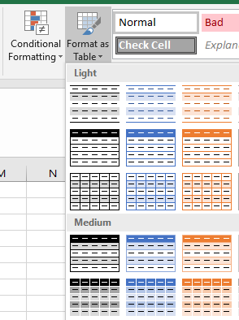
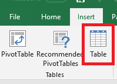

# Format a table in Excel and naming tips
It is a prerequisite to format Excel data as a table to use in PowerApps. By following this content, you'll learn how to format a table in Excel and some tips of naming Excel columns.

## How to format a table in Excel
You can convert your data to a table by clicking **Format as Table** in the **Home** tab of Excel.

Another way to have a formatted table is to create as a table from the **Insert** tab.

To find your table easily, go to **Design** under **Table Tools** and rename your table. It is useful to give your table a meaningful name, especially when there are multiple tables in one Excel file.

## Naming tips in Excel
In your Excel table, try to add a keyword "image" to your image column. This will bind your image column with an image control while using this table in a gallery with image controls.

## Next steps
* [Generate an app from Excel in PowerApps](get-started-create-from-data.md) based on a table that you specify. The app will have three screens by default: one each for browsing records, displaying details about a single record, and creating or updating a record.
* [Create an app from scratch](get-started-create-from-blank.md) using the table you format in Excel. You can manually create and customize your app to display, browse, or edit the data in your table.
