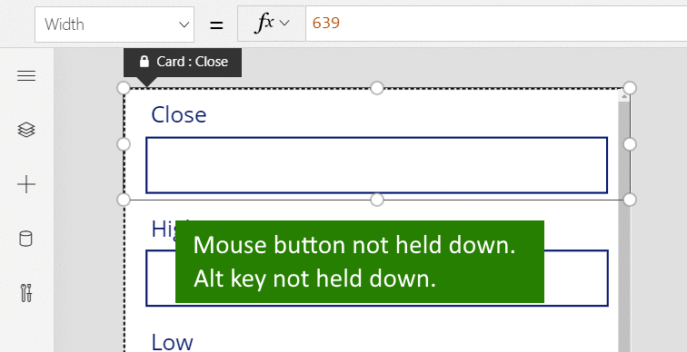

# Keyboard shortcuts for canvas apps

> [!NOTE]
> Shortcuts might vary based on keyboard layout.

## File

| Shortcut | Action |
|--|--|
| Ctrl+O (or Alt+F) | Open a file. |
| Ctrl+Shift+S (or Alt+P) | Save the app with a different name. |
| Ctrl+S | Save the app with the same name or for the first time. |
| Ctrl+Shift+P | Save the app and activate the publish dialog. |
| F12 | Download the app file (.msapp). |
| Alt+F | Open the **File** menu. |

## Ribbon

| Shortcut | Action |
|--|--|
| Enter | Run the selected command. |
| Tab | Move between commands on the selected tab and then to the next tab. |
| Alt+I | Select the **Insert** tab. |

## Editing

| Shortcut | Action |
|--|--|
| Ctrl+A | Select all. |
| Ctrl+X | Cut. |
| Ctrl+C | Copy. |
| Ctrl+V | Paste. |
| Ctrl+Z | Undo command. |
| Ctrl+Y | Redo command. |
| Ctrl+M | Add a screen. |
| Ctrl+= or Ctrl+Shift+= | Zoom in. |
| Ctrl+- or Ctrl+Shift+- | Zoom out. |
| Ctrl+0 | Fit canvas to page. |
| Shift+Enter | Break a line in a formula. |

## Preview

| Shortcut | Action |
|--|--|
| F5 | Open Preview mode. |
| Esc | Close Preview mode, a dialog box, or a flyout pane.|

## Canvas

| Shortcut | Action |
|--|--|
| Tab | Select the next control. |
| Ctrl+Click or Shift+Click | Select multiple objects at once. |
| Right arrow | Nudge the selected control to the right. |
| Left arrow | Nudge the selected control to the left. |
| Up arrow | Nudge the selected control up. |
| Down arrow | Nudge the selected control down. |

## Tree view

> [!NOTE]
> These shortcuts require the **Tree view** pane to have focus.

| Shortcut | Action |
|--|--|
| F2 | Rename a control. |
| Esc | Cancel renaming a control. |
| Ctrl+G | Group/ungroup controls. |
| Ctrl+] | Bring a control forward. |
| Ctrl+[ | Send a control backward. |
| Ctrl+Shift+] | Bring to front. |
| Ctrl+Shift+[ | Send to back. |

## Resize

| Shortcut | Action |
|--|--|
| Shift+Left arrow | Decrease width. |
| Ctrl+Shift+Left arrow | Decrease width slightly. |
| Shift+Down arrow | Decrease height. |
| Ctrl+Shift+Down arrow | Decrease height slightly. |
| Shift+Right arrow | Increase width. |
| Ctrl+Shift+Right arrow | Increase width slightly. |
| Shift+Up arrow | Increase height. |
| Ctrl+Shift+Up arrow | Increase height slightly. |

## Text format

| Shortcut | Action |
|--|--|
| Ctrl+B  | Cycle through levels of bold. |
| Ctrl+I | Turn italic on or off. |
| Ctrl+U | Add or remove underline. |

## Alternate behavior

| Shortcut | Action |
|--|--|
| Alt or Ctrl+Shift | 1. Before selecting a control, hide design elements so that you can interact with controls as the app's user would. 2. After initiating a resize or reposition of a control, holding down these keys overrides any snap points. |

Like an Excel spreadsheet, canvas apps are live and operating even when they are being edited.  There is no need to change to preview mode in order to exercise your app, making the edit and test cycle much faster.  But this poses a problem: how do we differentiate selecting a button control so that it can be resized from selecting a button control to exercise the logic in our app?

When in design mode, by default selecting an object is for editing: moving, resizing, changing properties, and otherwise configuring the object.  This default can be overridden by holding down the Alt or Ctrl+Shift keys *before* initiating the selection which treats the selection as if a user of the app had done it.  

In the following animation, a button control is first selected for editing.  Adorners appear around the control and the formula bar shows the **OnSelect** property, ready to be edited.  The button is then released.  *With the Alt key first depressed*, the button control is again selected, but this time the **OnSelect** property is evaluated and the notification is displayed, just as if the button was selected in a running app.  

The Alt key can also be used *after* a control has been selected to override snap points for moving and resizing.  The next animation shows the resize of a data card within an [**Edit form**](controls/control-form-detail.md) control.  Initially, the resizing is restricted to specific snap points.  Later, *without releasing the mouses button*, the Alt key is depressed in addition to the mouse button. The addition of the Alt key overrides the snap points and any width can be obtained with the mouse. 

## Other

| Shortcut | Action |
|--|--|
| F1 | Open documentation. |
| Ctrl+F6 | Navigate to the next landmark. |
| Ctrl+Shift+F6 | Navigate to the previous landmark. |
| Shift+F10 | Open a shortcut menu in, for example, **Tree view**. |

 
