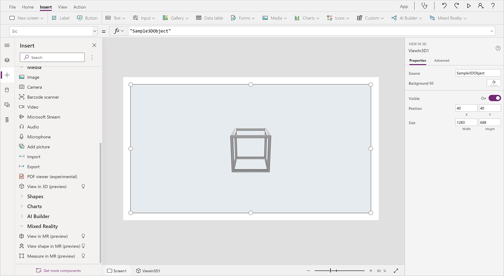
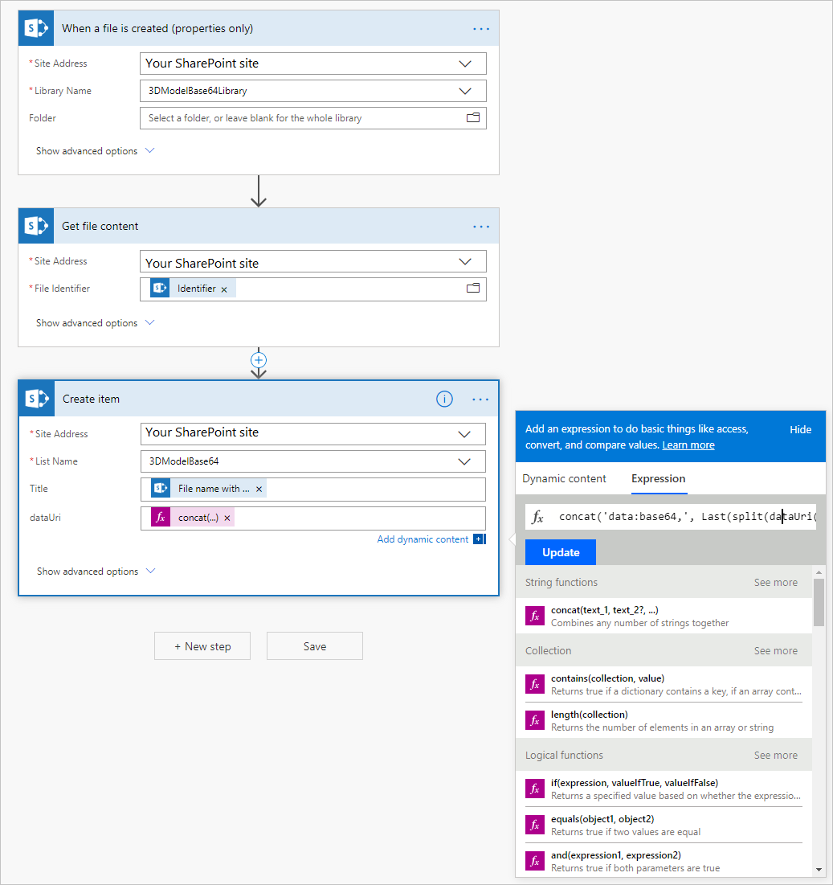
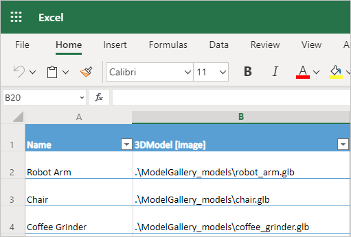

# View 3D objects in canvas and model-driven apps

Add 3D models to your canvas and model-driven apps built in Power Apps. Use the **View in 3D** component to rotate the shape and zoom into the model with simple gestures.

You can display a single 3D object, or you can let the user see [multiple objects by connecting the component to the **Gallery** control](#define-the-location-for-3d-objects).

>[!IMPORTANT]
>Your 3D objects must be in the .glb file format.  
>You can [convert your existing 3D models into the .glb file format](/dynamics365/mixed-reality/import-tool/) from a variety of 3D formats.

To use the component, you need to [enable the mixed reality (MR) features for each app](#enable-the-mixed-reality-features-for-each-app) that you want to use it in. 

Make sure to also [review the prerequisites for using MR components](mixed-reality-overview.md#prerequisites).

## Explore the sample app

You can test the component in the sample view in 3D app:

1. Go to https://create.powerapps.com to open the app studio.
2. On the homepage, select either **Phone layout** or **App layout** under **App templates**.

    

1. Select the **App name** app, confirm the right location for the storage of the sample data file (this will default to your currently logged in OneDrive account), and select **Use**.

    

The sample app lets you view and manipulate 3D objects. You'll need to [publish your app](save-publish-app.md) and then [open it on a mixed reality-capable device](../../user/run-app-client.md).

## Use the component

Insert the component into your app as you normally would for any other control or component.

With an app open for editing in the Power Apps https://create.powerapps.com studio:

1. Open the **Insert** tab.
2. Expand **Media**.
3. Select the component **View in 3D** to place it in the center of the app screen, or drag and drop it to position it anywhere on the screen.

You can modify the component with a number of properties.

### Properties

The following properties can be defined and configured in the **View in 3D** component's **View in 3D** pane on the **Properties** and **Advanced** tabs. 

Note that some properties are only available in the **Advanced** tab on the **View in 3D** pane.

Property | Description | Type | Location
- | - | - | -
Source | Data source that identifies the .glb file to display.  Within **model-driven apps**, the **View in 3D** component is bound to a *SingleLine.URL* field property. This means that you can only add the component to a *SingleLine.URL* field on the form. An example is the **Website** field on the **Account** entity.  Within **canvas apps**, the **View in 3D** component supports loading models from: <ul><li>Publically accessible, CORS-compliant URLs</li><li>Base64-encoded URIs</li><li>Attachments or media content accessed through data connectors</li> | Not applicable | **Properties** (also in **Advanced** as **Src**)
Background fill | Set the background color for the component. | Color picker | **Properties** (also in **Advanced** as **BackgroundFill**, where it accepts RGBA or HTML hexadecimal color codes)
Visible | Whether the component is shown or not. | Boolean | **Properties** (also in **Advanced**)
Position | X is the horizontal position of the component on the app screen. 0 is the leftmost edge of the screen.  Y is the vertical position of the component on the app screen. 0 is the topmost edge of the screen. | Pixels | **Properties** (also in **Advanced** as indiviual X and Y values)
Size | Width and height of the component in pixels. | Pixels | **Properties** (also in **Advanced** as indiviual width and height values)
OnChange | Defines what happens when an event occurs within the component | Formula | Advanced
Tooltip | Descriptive text that appears when a user navigates to the component. | String | Advanced
DisplayMode | The mode to use for data cards and controls within the component. `DisplayMode.Edit` allows users to edit the component's forms and controls, `DisplayMode.View` sets the component to read only | String | Advanced
TabIndex | Order in which items on the app screen be tabbed between. | Integer | Advanced

## Define the location for 3D objects

You can set the location for 3D objects as a direct URL to a .glb file, as a base64-encoded URI, or as attachments or media content.

### Load objects from an URL

The **Source** property can be an URL that points to a 3D model file (.glb). 

You will not be able to view a 3D model in your app if the file resides on a server that has restrictive cross-origin resource sharing (CORS) settings. To resolve this issue, the hosting server must permit cross-origin requests from *powerapps.com*. 

You can use the following services to host and obtain a CORS-compliant URL.

**To use Dropbox:**

1. Upload your file to Dropbox as you normally would.
1. Select the **Share** button.
1. Generate a public download link, for example *https://www.dropbox.com/s/rANdoMGeneR4tedLink/my-file.glb?dl=0*.
1. Replace **www** in the URL with **dl**, and remove **?dl=0** at the end. You now have a direct access URL, for example *https://dl.dropbox.com/s/rANdoMGeneR4tedLink/my-file.glb*.

**To use GitHub:**

1. Ensure that your git repo is set to **Public**.
1. Navigate to your file. For example *https://github.com/microsoft/experimental-pcf-control-assets/blob/master/robot_arm.glb*.
1. Remove **/blob/**.
1. Replace **https://github.com** with **https://raw.githubusercontent.com**. You now have raw access to your file, for example *https://raw.githubusercontent.com/microsoft/experimental-pcf-control-assets/master/robot_arm.glb*

### Loading base64-encoded models

The **Source** property can be a base64-encoded 3D model data URI that is in the format *data:base64,\<base64-encoded content\>*. 

The following are two common ways you can create a base64-encoded URI of your model.

**To use Power Automate:**

Power Automate can convert files to base64 using the dataUri(base64(<file content>)) expression. For example, if you want to store .glb files in a SharePoint Document Library, you could do the following to load them in power apps using the View In 3D:

1. Create a **SharePoint Document Library** and a **SharePoint List**. The list should have a column which is of type **multiple line text**.
1. From the **Document Library**, create a new flow using the **When a new file is added in SharePoint, complete a custom action** template.
1. Add a new step to **Get file content from SharePoint**, setting **File Identifier** to **Identifier**.
1. Add a new step to **Create item from Sharepoint**, setting **List Name** to the SharePoint list you created earlier, and the **Title** to the multiple line text column, with the following expression as the URI:  
    `concat('data:base64,', Last(split(dataUri(base64(body('Get_file_content'))), ',')))`  

    

When you add .glb files to the **Document Library**, they will be converted to a base64-encoded data URI, which you can set to the **Source** property of the **View in 3D** component, using the SharePoint data connector to access the list. 

**To use Common Data Service (CDS):**

The [Note entity](https://docs.microsoft.com/en-us/powerapps/developer/common-data-service/annotation-note-entity) in CDS converts any attached file to base64 in the **Document** field. 

### Loading models as attachments or media content

Loading models as attachments or media content works through the binary storage associated with Power Apps. To check if a data connector uses binary storage, add a label and set the **Text** property to the data source. If the label starts with `appres://`, then that data source should work with the **View In 3D** component.

**To use a SharePoint List:**

1. Create a SharePoint List.
1. In the created list, click + Add column and then click Show/hide columns.
1. Make sure Attachments is checked and press Apply at the top.
1. Create a new item in the List and press Add attachments.
1. Select your 3D model (.glb file).
1. Create a new item in the list for each 3D model that you want to have in your Power App.
1. In a canvas Power App, add a Gallery.
1. Set the gallery data source to the SharePoint list created earlier.
1. Add the View In 3D control and in the Advanced tab set the Src property to First(Gallery1.Selected.Attachments).Value

**To use Excel Online:**

1. Create an Excel Online workbook on OneDrive where you've also stored your .glb files.

    

1. In the workbook, create a table with columns titled **3DModel [image]** and **Name**.
1. Add a row for each .glb file, inserting the relative file path to the .glb file in the **3DModel [image]** column.

    

1. In a canvas-based app, add a **Gallery**.
1. Set the gallery data source to the Excel Online workbook.
1. In the **Advanced** properties tab for the **View In 3D** component, set the **Src** property to **Gallery1.Selected.3DModel**.

 

 

## Known issues 

- The **View In 3D** component only supports the .glb file format. You will need to [convert your existing 3D models into the .glb file format](/dynamics365/mixed-reality/import-tool/).
- The security architecture of Power Apps requires HTTPS links, not HTTP.
- The server that hosts the document must not require authentication and must be [CORS-compliant](https://en.wikipedia.org/wiki/Cross-origin_resource_sharing).

## Other mixed reality components
- View 3D models in the real world with the **[View in mixed reality](mixed-reality-component-view-mr.md)** component.
- Take measurements and create 3D volumes with the **[Measure in mixed reality](mixed-reality-component-measure-distance.md)** component.
- Create and view predefined 3D shapes with the **[View shape in mixed reality](mixed-reality-component-view-shape.md)** component

