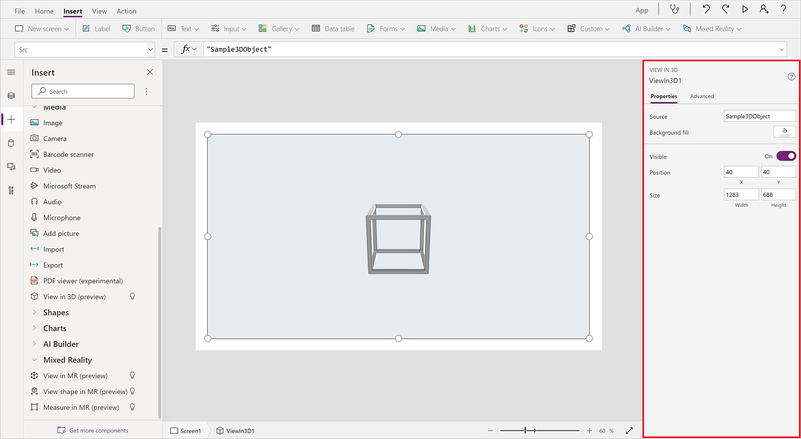
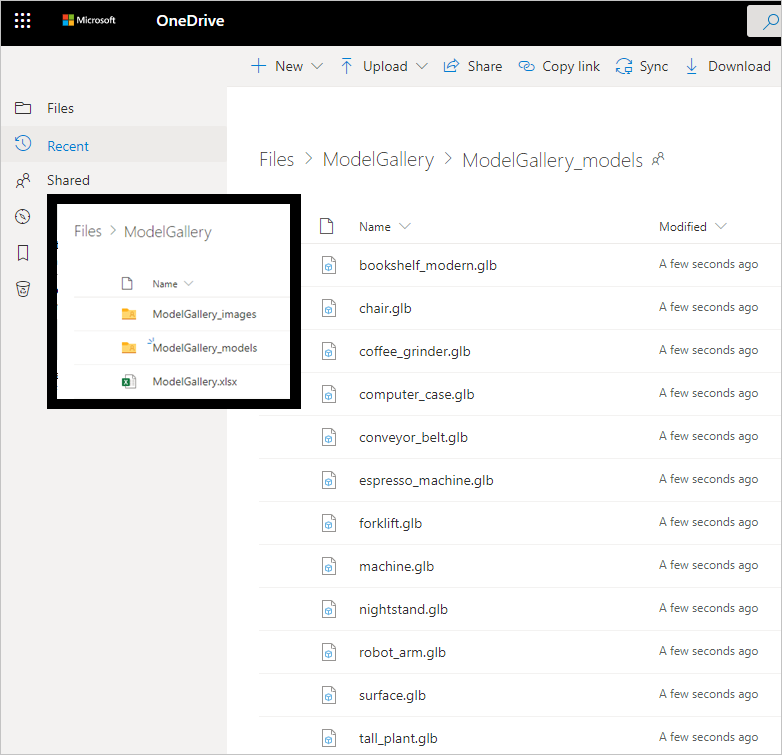

# View 3D content in canvas apps (Preview)

[!INCLUDE [cc-beta-prerelease-disclaimer.md](../../includes/cc-beta-prerelease-disclaimer.md)]

Add 3D content to your canvas apps. Use the **View in 3D** component to rotate and zoom into the model with simple gestures.

You can display a single 3D model, or you can let the user select from a gallery [by connecting to a **Gallery** control](#define-where-the-3d-content-is-stored).

> [!VIDEO https://www.microsoft.com/videoplayer/embed/RE4vyoW]

> [!IMPORTANT]
> Your 3D content must be in the .glb file format.  
> You can [convert your existing 3D models into the .glb file format](/dynamics365/mixed-reality/import-tool/) from a variety of 3D formats.

To use the component, you need to [enable the mixed reality (MR) features for each app](mixed-reality-overview.md#enable-the-mixed-reality-features-for-each-app) that you want to use it in.

Make sure to also [review the prerequisites for using MR components](mixed-reality-overview.md#prerequisites).

## Use the component

Insert the component into your app as you normally would for any other control or component.

With an app open for editing in [Power Apps Studio](https://create.powerapps.com):

1. Open the **Insert** tab.
2. Expand **Media**.
3. Select the component **View in 3D** to place it in the center of the app screen, or drag and drop it to position it anywhere on the screen.

You can modify the component with a number of properties.

### Properties

The following properties are on the component's **View in 3D** pane on the **Properties** and **Advanced** tabs.

Some properties are only available in the **Advanced** tab on the **View in 3D** pane.

Property | Description | Type | Location
- | - | - | -
Source | Data source that identifies the .glb file to display. The **View in 3D** component supports loading models from: <ul><li>Publicly accessible, CORS-compliant URLs</li><li>Base64-encoded URIs</li><li>Attachments or media content accessed through data connectors</li> | Not applicable | **Properties** (also in **Advanced** as **Src**)
Background fill | Set the background color for the component | Color picker | **Properties** (also in **Advanced** as **BackgroundFill**, where it accepts RGBA or HTML hexadecimal color codes)

### Additional properties

**[DisplayMode](./controls/properties-core.md)** – Whether the control allows user input (**Edit**), only displays data (**View**), or is disabled (**Disabled**).

**[Height](./controls/properties-size-location.md)** – The distance between a control's top and bottom edges.

**[TabIndex](./controls/properties-accessibility.md)** – Keyboard navigation order.

**[Visible](./controls/properties-core.md)** – Whether a control appears or is hidden.

**[Width](./controls/properties-size-location.md)** – The distance between a control's left and right edges.

**[X](./controls/properties-size-location.md)** – The distance between the left edge of a control and the left edge of its parent container (or the screen if there's no parent container).

**[Y](./controls/properties-size-location.md)** – The distance between the top edge of a control and the top edge of the parent container (or the screen if there's no parent container).

## Define where the 3D content is stored

You can set the source for 3D content as a direct URL to a .glb file, as a base64-encoded URI, or as attachments or media content.

### Load models from a URL

The **Source** property can be a URL that points to a 3D model file (.glb).

You can't view a 3D model in your app if the file is on a server that has restrictive cross-origin resource sharing (CORS) settings. To resolve this issue, the hosting server must permit cross-origin requests from *powerapps.com*.

You can use the following services to host and obtain a CORS-compliant URL.

**To use Dropbox**

1. Upload your file to Dropbox as you normally would.
1. Select the **Share** button.
1. Generate a public download link. For example, *https://www.dropbox.com/s/rANdoMGeneR4tedLink/my-file.glb?dl=0*.
1. Replace **www** in the URL with **dl**, and remove **?dl=0** at the end. You now have a direct-access URL. For example, *https://dl.dropbox.com/s/rANdoMGeneR4tedLink/my-file.glb*.

**To use GitHub**

1. Ensure that your Git repo is set to **Public**.
1. Navigate to your file. For example, *https://github.com/microsoft/experimental-pcf-control-assets/blob/master/robot_arm.glb*.
1. Remove **/blob/**.
1. Replace **https://github.com** with **https://raw.githubusercontent.com**. You now have raw access to your file. For example, *https://raw.githubusercontent.com/microsoft/experimental-pcf-control-assets/master/robot_arm.glb*.

### Loading base64-encoded models

The **Source** property can be a base64-encoded 3D model data URI that is in the format *data:base64,\<base64-encoded content\>*.

The following are two common ways you can create a base64-encoded URI of your model.

**To use Power Automate**

Power Automate can convert files to base64 using the dataUri(base64(*file content*)) expression. For example, if you want to store .glb files in a SharePoint document library, you could do the following to load them in Power Apps using the View in 3D:

1. Create a **SharePoint Document Library** and a **SharePoint List**. The list should have a column of type **multiple-line text**.
1. From the **Document Library**, create a new flow using the **When a new file is added in SharePoint, complete a custom action** template.
1. Add a new step to **Get file content from SharePoint**, setting **File Identifier** to **Identifier**.
1. Add a new step to **Create item from SharePoint**, setting **List Name** to the SharePoint list you created earlier, and the **Title** to the multiple-line text column, with the following expression as the URI:  
    `concat('data:base64,', Last(split(dataUri(base64(body('Get_file_content'))), ',')))`  

    

When you add .glb files to the **Document Library**, they'll be converted to a base64-encoded data URI, which you can set to the **Source** property of the **View in 3D** component, using the SharePoint data connector to access the list.

**To use Common Data Service**

The [Note entity](/powerapps/developer/common-data-service/annotation-note-entity) in Common Data Service converts any attached file to base64 in the **Document** field.

### Loading models as attachments or media content

Loading models as attachments or media content works through the binary storage associated with Power Apps. To check if a data connector uses binary storage, add a label and set the **Text** property to the data source. If the label starts with `appres://`, then that data source should work with the **View in 3D** component.

**To use a SharePoint list**

<!-- In lines 144 and 145, can "Power App" change to "app"? Our style guide says to "use app to refer to something created using Power Apps. Don’t use Power App or Power Apps app."  -->

1. Create a SharePoint list.
1. In the created list, select the **+ Add** column and then select **Show/hide columns**.
1. Make sure **Attachments** is selected and press **Apply** at the top.
1. Create a new item in the list and press **Add attachments**.
1. Select your 3D model (.glb file).
1. Create a new item in the list for each 3D model that you want to have in your Power App.
1. In a canvas Power App, add a Gallery.
1. Set the gallery data source to the SharePoint list created earlier.
1. Add the **View in 3D** control and in the **Advanced** tab, set the **Src** property to **First(Gallery1.Selected.Attachments).Value**.

**To use Excel Online**

1. Create an Excel Online workbook on OneDrive where you've also stored your .glb files.

    

1. In the workbook, create a table with columns titled **3DModel [image]** and **Name**.
1. Add a row for each .glb file, inserting the relative file path to the .glb file in the **3DModel [image]** column.

    

1. In a canvas-based app, add a **Gallery**.
1. Set the gallery data source to the Excel Online workbook.
1. In the **Advanced** properties tab for the **View in 3D** component, set the **Src** property to **Gallery1.Selected.3DModel**.

## Known constraints

- The security architecture of Power Apps requires HTTPS links, not HTTP.
- The server that hosts the document must not require authentication and must be [CORS-compliant](https://en.wikipedia.org/wiki/Cross-origin_resource_sharing).

## Other mixed reality components

- View 3D content and images in the real world with the **[View in mixed reality](mixed-reality-component-view-mr.md)** component.
- Measure distance, area, and volume with the **[Measure in mixed reality](mixed-reality-component-measure-distance.md)** component.
- Create and view predefined 3D shapes with the **[View shape in mixed reality](mixed-reality-component-view-shape.md)** component
