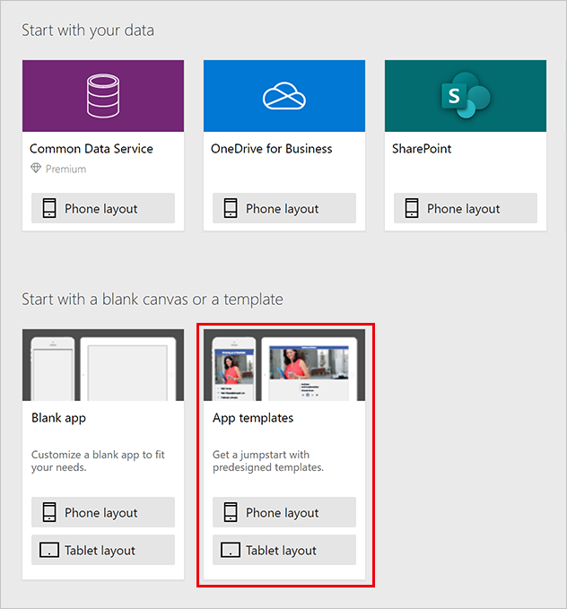

# View 3D models or 2D images in the real word

You can use the **View in MR** component in your app to let users see how a particular item might fit within a specified space. 

The component creates a button in your app. When app users click the button, it overlays a selected 3D object (in the .glb file format) or 2D image (in .jpg or .png file formats) onto the live camera feed of the device. 

- Blah
- Blahblah
- Moreblahs

>[!IMPORTANT]
>Your 3D objects must be in the .glb file format.  
>You can [convert your existing 3D models into the .glb file format](/dynamics365/mixed-reality/import-tool/) from a variety of 3D formats.

To use the component, you need to [enable the mixed reality (MR) features for each app](#enable-the-mixed-reality-features-for-each-app) that you want to use it in. 

Make sure to also [review the prerequisites for using MR components](mixed-reality-overview.md#prerequisites).

## Explore the sample app

You can test the component in the sample app:

1. Go to https://create.powerapps.com to open the app studio.
2. On the homepage, select either **Phone layout** or **App layout** under **App templates**.

    

1. Select the **App name** app, confirm the right location for the storage of the sample data file (this will default to your currently logged in OneDrive account), and select **Use**.

    

The sample app lets you view and manipulate 3D objects in the real world. You'll need to [publish your app](save-publish-app.md) and then [open it on a mixed reality-capable device](../../user/run-app-client.md).

## Other augmented reality controls
- [View in 3D](augmented-reality-component-view-3d.md)
- [View in augmented reality](augmented-reality-component-view-ar.md)
- [Measure in augmented reality - distance](augmented-reality-component-measure-distance.md)
- [Measure in augmented reality - advanced](augmented-reality-component-measure-advanced.md)
- [View shape in augmented reality](augmented-reality-component-view-shape.md)

## Next steps
Explore [example AR apps](augmented-reality-example-apps.md) and see what sorts of scenarios AR controls can help solve
