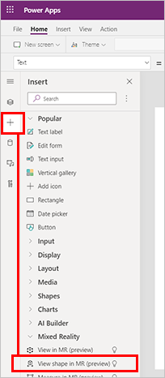
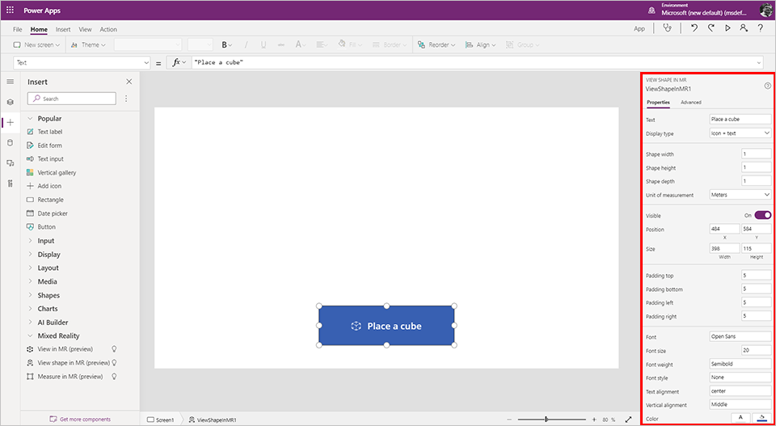

# Create and view predefined 3D shapes in mixed reality (Preview)

[!INCLUDE [cc-beta-prerelease-disclaimer.md](../../includes/cc-beta-prerelease-disclaimer.md)]

You can use the **View shape in MR** component in your app to let users see a simple cube might fit within a specified space. They might want to do this to see how a certain object that you provide would fit in their space. If you have a 3D model of your object, you might like to use [the **View in MR** component](mixed-reality-component-view-mr.md) instead.

The component creates a button in your app. When app users click the button, it overlays a cube onto the live camera feed of the device. You set up the dimensions of the cube when you edit the component in Power Apps.

To use the component, you need to [enable the mixed reality (MR) features for each app](mixed-reality-overview.md#enable-the-mixed-reality-features-for-each-app) that you want to use it in.

Make sure to also [review the prerequisites for using MR components](mixed-reality-overview.md#prerequisites).

>[!TIP]
> The MR components work best in well-lit environments with flat-textured surfaces. When establishing tracking, point the device at the surface you would like to track and slowly pan the device from right to left in broad arm motions. If tracking fails, exit and enter the MR view to reset the tracking and try again.

## Use the component

Insert the component into your app as you normally would for any other button control or component.

With an app open for editing in the [Power Apps Studio](https://create.powerapps.com):

1. Open the **Insert** tab.
2. Expand **Mixed reality**.
3. Select the component **View shape in MR** to place it in the center of the app screen, or drag and drop it to position it anywhere on the screen.

  

You can modify the component with a number of properties.

### Properties

The following properties are on the component's **View shape in MR** pane on the **Properties** and **Advanced** tabs.

Note that some properties are only available in the **Advanced** tab on the **View in MR** pane.

Property | Description | Type | Location
- | - | - | -
Text | Label for the button | String | Properties (also in **Advanced**)
Display type | Whether the button shows just an icon, text, or both | Drop-down selection | Properties (also in **Advanced**)
Shape width | Width of the cube. | Integer | **Properties** (also in **Advanced**)
Shape height | Height of the cube. | Integer | **Properties** (also in **Advanced**)
Shape depth | The three-dimensional depth of the cube. | Integer | **Properties** (also in **Advanced**)
Unit of measurement | The measurement unit used for the width, height, and depth fields. | Drop-down selection | **Properties** (also in **Advanced**)
Photos | The photos captured during the mixed reality session. | | Not applicable (output property only)

### Additional properties

**[BorderColor](./controls/properties-color-border.md)** – The color of a control's border.

**[BorderStyle](./controls/properties-color-border.md)** – Whether a control's border is **Solid**, **Dashed**, **Dotted**, or **None**.

**[BorderThickness](./controls/properties-color-border.md)** – The thickness of a control's border.

**[Color](./controls/properties-color-border.md)** – The color of text in a control.

**[DisplayMode](./controls/properties-core.md)** – Whether the control allows user input (**Edit**), only displays data (**View**), or is disabled (**Disabled**).

**[DisabledBorderColor](./controls/properties-color-border.md)** – The color of a control's border if the control's **[DisplayMode](./controls/properties-core.md)** property is set to **Disabled**.

**[DisabledColor](./controls/properties-color-border.md)** – The color of text in a control if its **[DisplayMode](./controls/properties-core.md)** property is set to **Disabled**.

**[DisabledFill](./controls/properties-color-border.md)** – The background color of a control if its **[DisplayMode](./controls/properties-core.md)** property is set to **Disabled**.

**[FillColor](./controls/properties-color-border.md)** – The background color of a control.

**[Font](./controls/properties-text.md)** – The name of the family of fonts in which text appears.

**[FontStyle](./controls/properties-text.md)** - The style of the text in the component: **None**, **Strikethrough**, **Underline**, or **Italic**

**[FontSize](./controls/properties-text.md)** – The font size of the text that appears on a control.

**[FontWeight](./controls/properties-text.md)** – The weight of the text in a control: **Bold**, **Semibold**, **Normal**, or **Lighter**.

**[Height](./controls/properties-size-location.md)** – The distance between a control's top and bottom edges.

**[HoverBorderColor](./controls/properties-color-border.md)** – The color of a control's border when the user keeps the mouse pointer on that control.

**[HoverColor](./controls/properties-color-border.md)** – The color of the text in a control when the user keeps the mouse pointer on it.

**[HoverFill](./controls/properties-color-border.md)** – The background color of a control when the user keeps the mouse pointer on it.

**[PaddingBottom](./controls/properties-size-location.md)** – The distance between text in a control and the bottom edge of that control.

**[PaddingLeft](./controls/properties-size-location.md)** – The distance between text in a control and the left edge of that control.

**[PaddingRight](./controls/properties-size-location.md)** – The distance between text in a control and the right edge of that control.

**[PaddingTop](./controls/properties-size-location.md)** – The distance between text in a control and the top edge of that control.

**[PressedBorderColor](./controls/properties-color-border.md)** – The color of a control's border when the user taps or clicks that control.

**[PressedColor](./controls/properties-color-border.md)** – The color of text in a control when the user taps or clicks that control.

**[PressedFill](./controls/properties-color-border.md)** – The background color of a control when the user taps or clicks that control.

**[TabIndex](./controls/properties-accessibility.md)** – Keyboard navigation order.

**[TextAlignment](./controls/properties-text.md)** - The alignment of the text: **Center**, **Left**, **Right**, or Justify

**[Tooltip](./controls/properties-core.md)** – Explanatory text that appears when the user hovers over a control.

**[VerticalAlign](./controls/properties-text.md)** – The location of text on a control in relation to the vertical center of that control: **Middle**, **Top**, or **Bottom**

**[Visible](./controls/properties-core.md)** – Whether a control appears or is hidden.

**[Width](./controls/properties-size-location.md)** – The distance between a control's left and right edges.

**[X](./controls/properties-size-location.md)** – The distance between the left edge of a control and the left edge of its parent container (or the screen if there's no parent container).

**[Y](./controls/properties-size-location.md)** – The distance between the top edge of a control and the top edge of the parent container (or the screen if there's no parent container).

## Other mixed reality controls

- View 3D content with the **[View in 3D](mixed-reality-component-view-3d.md)** component.
- View images and 3D content in the real world with the **[View in mixed reality](mixed-reality-component-view-mr.md)** component.
- Measure distance, area, and volume with the **[Measure in mixed reality](mixed-reality-component-measure-distance.md)** component.
