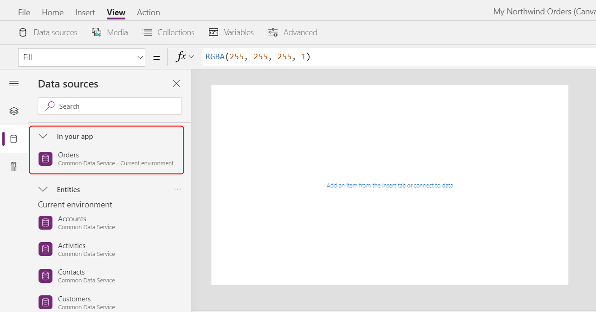
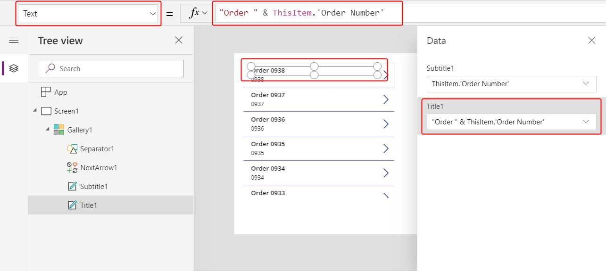
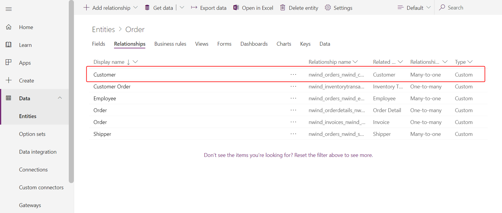
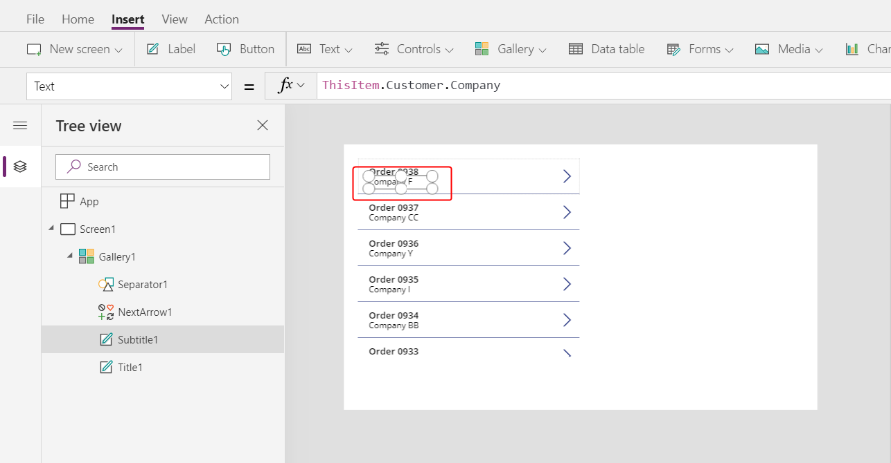
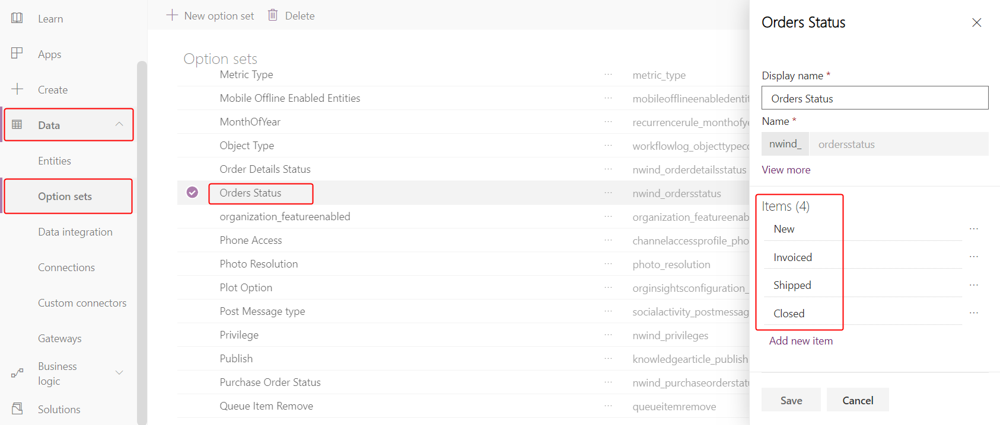
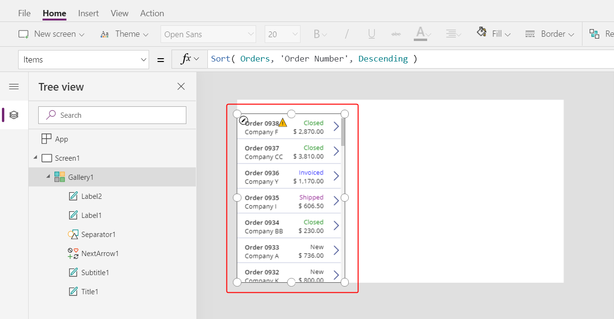

# Create a list of orders in a canvas app

Follow the steps in this topic to create a list of orders in a canvas app based on sample data in Common Data Service. The sample data is for a fictitious organization named Northwind Traders, and the app shows the types, quantities, and prices of various products that Northwind sells and ships to other fictitious companies.

This single-screen app is designed to run on tablets. In other topics, you'll add more UI until the app resembles this graphic:


This app will showcase these concepts:

- **Many-to-one relationships.** Each customer can place multiple orders, but each order is placed by only one customer. The **Orders** entity is related to the **Customers** entity so that the list near the left edge can show which customer placed each order. The list shows the name of the customer, but it could show data from any column in the **Customers** entity.
- **One-to-many relationships.** Each order contains one or more line items, each of which appears as a record in the **Order Details** entity. Each order detail is contained in only one order.
- **Option sets.** Each order has a status, such as **New**, **Shipped**, **Invoiced**, or **Closed**. Sets of values such as these are defined as option sets in the database and can be shared across apps.
- **Gallery and form interactions.**  The gallery provides the list of orders, a user can select an order, and the rest of the app responds to the user's selection.

To build this app, follow the steps in these topics:


- **Part 1, Orders list**: As this topic describes, show each order's number, customer name, status, and total amount in a list. Select an order that you want to edit or delete in the other parts of the screen.
- [**Part 2, Order form**](northwind-orders-canvas-part2.md): Show and edit an overview of the order, delete the order, or create another order.
- [**Part 3, Order details**](northwind-orders-canvas-part3.md): Show and edit the line items, called order details, that are associated with the order.

## Create a blank app

1. [Sign in to PowerApps](https://web.powerapps.com?utm_source=padocs&utm_medium=linkinadoc&utm_campaign=referralsfromdoc).

1. [Install the Northwind Traders sample database and apps](northwind-install.md).

    This step installs all the entities that you need, as well as a completed version of the app that you're about to build.

1. Create a blank tablet app:

    

1. Name your app whatever you like, and then select **Create**:

    

    PowerApps Studio opens so that you can add data sources and controls to your app:

    

1. Enable an [experimental feature](working-with-experimental.md) for showing the result of a formula directly from the formula bar.

    1. On the **File** menu, select **App settings**, and then select **Advanced settings**.
    1. Scroll to the bottom of the list of features, and then turn on **Enable formula bar result view**:

        

## Add the data

1. On the **View** tab, select **Data sources**, and then select **Add data source** in the **Data** pane:

    

1. Select **Common Data Service**.

    If **Common Data Service** doesn't appear in the list of connections, select **New connection**, and then add it.

    

1. Under **Choose an entity**, type **Orders**, select the **Orders** checkbox, and then select **Connect**:

    

    You've added the **Orders** data source to your app:

    

    The **Orders** entity contains many fields of various types:

    

    Each column has a **Display name** and a **Name**, which is sometimes called the logical name. Both names refer to the same thing. In general, you'll use the display name when you build an app, but some cases require the more cryptic **Name**, as noted in a procedure.

## Display the list of orders

1. On the **Insert** tab, select **Gallery** > **Blank vertical** to add a [**Gallery** control](controls/control-gallery.md) in which the list of orders will appear.

    

1. In the formula bar, set the gallery's **Items** property to this formula:

    ```powerapps-dot
    Sort( Orders, 'Order Number', Descending )
    ```

    The [**Sort** function](functions/function-sort.md) orders the list so that the newest order (which has the highest order number) appears first.

    

1. In the **Properties** tab of the right-hand pane, open the **Layout** list:

    

1. In the list of options, select **Title and subtitle**:

    

    Two label controls are added in the gallery's template. By default, these controls show two columns of the **Orders** entity, which you'll change next. The gallery's template is replicated vertically for each record in the entity.

1. In the **Data** pane, select **Title1** (or select the upper label in the gallery's template):

    

1. In the formula bar, set the label's **Text** property to this expression:

    ```powerapps-dot
    "Order " & ThisItem.'Order Number'
    ```

    

    The order number appears at the top of each gallery item. In the gallery template, **ThisItem** grants access to all columns in the **Order** entity.

1. In the **Data** pane, select **Subtitle1** (or select the lower label in the gallery's template):

    

1. In the formula bar, set the label's **Text** property to this expression:

    ```powerapps-dot
    ThisItem.Customer.Company
    ```

    

    After you enter this formula, it may show a red squiggly error for a moment. If you select anything outside the formula bar and then return the cursor to the formula bar, it should clear. If the error persists or you don't see a value, select the **View** tab, select **Data sources**, and then refresh the **Orders** entity with the ellipsis (...) to the right of the data-source name.

    When you specify **ThisItem.Customer**, you're leveraging a many-to-one relationship between the **Orders** and **Customers** entities and retrieving the customer record that's associated with each order. From the customer record, you're extracting data in the **Company** column for display.

    You can show all the relationships from the **Orders** entity to other entities, including the **Customer** entity:

    

## Show each order's status

1. Let's make some space to include more information about each order in the gallery.  Select the first label control, **Title1**, in the gallery's template and re-size it to be narrower:

	

1. Do the same with the second label control, **Subtitle1**:

	

1. Let's display the order status directly in the gallery.  Using the **Insert** ribbon, insert a new **Label** control:

	

1. Re-size and re-position this control to the right of the **Title1** label:

	

1. Set the **Text** property to this formula: 

	```powerapps-dot
	ThisItem.'Order Status'
	```

	

	**'Order Status'** is a column an **Order** that holds an option set value, one of the values from the **Orders Status** option set.  It is similar to an enumeration in other programming tools.  **Orders Status** is a global option set with a fixed set of options that are defined in the database:

	

	Using the column **'Order Status'** in a string context, as we did in the **Text** property of the label control, will display the app user friendly label for the option.  Option set labels can be localized so these strings may appear differently dependeing on the language of the app user.

	**'Order Status'** is like any other name in PowerApps, such as **Customer** or **Copmany**.  The single quotes are required here because of the space in the name. 

1. Let's use the option set's value to conditionally color the status text.  Using the **Home** ribbon, increase the font size of the label to 20 points and right align the text:

	

1. Using the formula bar, set the **Color** property of the label control to this formula:

	```powerapps-dot
	Switch( ThisItem.'Order Status', 
        'Orders Status'.Closed, Green, 
        'Orders Status'.New, Black, 
        'Orders Status'.Invoiced, Blue, 
        'Orders Status'.Shipped, Purple 
	)
	```

	

	Note that we did not compare **ThisItem.'Order Status'** to a text string, instead we used **'Orders Status'** enumeration.  In fact text string comparisons are disallowed.  Using the enumeration is important as the label can change depending on the language of the app user while the numetical values of the enumeration will always be the same.

	With this formula in place, we can see how different status values are colored in the bottom of the portion of the gallery pictured above.

## Use aggregate functions to display each Order's total

1. Let's display each Order's total in the gallery. Select the first item which is the gallery's template:

	

1. Use the **Insert** ribbon to add one more label control:  

	

1. Re-size and re-position this control to the right of the customer label:

	

1. Set the **Text** property to this formula in the formula bar:

	```powerapps-dot
	Text( Sum( ThisItem.'Order Details', Quantity * 'Unit Price' ), "[$-en-US]$ #,###.00" )
	```

	

	This formula is using the [**Sum** function](functions/function-aggregates.md) to add up the records in the **Order Details** entity that are associated with each **Order** through a One-to-Many relationship.  These are the line items of products that make up each order.  We'll us this same One-to-Many relationship to show and edit the line items in Part 3.  
	
	You will notice that there is a blue underline and a delegation warning on this formula.  Aggregate functions currenctly cannot be delegated to CDS if they are complex, in this case the sum of a multiplication.  This is OK for our app, we do not expect any single Order to have more than 500 items and this number can be increased in the App settings if necessary.  

	This formula also uses the [**Text** function](functions/function-text.md) to add a currency symbol and format with thousands and decimal seperators.  The **$** in the format will be translated to the curency symbol of the app user.  If you don't include the language tag (**[$-en-US]**) it will be added for you based on your language and region.  If it is different, you will want to use your own currency symbol instead of the **$** shown here just before the first **#**.

1. Using the **Home** ribbon, change the font size to 20 points and right justify the label:
	
	

1. In preperation for the next part, re-size the width of the gallery to close up some space, and re-size and re-position the gallery to fill the left hand side of the screen, with a small buffer at the top for a title bar which we'll add next:

	

## On to Part 2

To recap, we just built a single screen Canvas app that shows the list of Orders.  This list includes:
- A formula to format the Order Number: `"Orders " & ThisItem.OrderNumber`
- A field in a Many-to-One relationship: `ThisItem.Customer.Company`
- An option set label, for display to the app user: `ThisItem.'Order Status'`
- An option set value, for conditional formatting of the status: `Switch( ThisItem.'Order Status', 'Orders Status'.Closed, Green, ...`
- An aggregate function over a One-to-Many relationship: `Sum( ThisItem.'Order Details', Quantity * 'Unit Price' )`

In the next part, we'll add an [**Edit form** control](controls/control-form-detail.md) to display and edit more information about each order.
