# Build Northwind Orders (Canvas): Part 3, Order details

Let's continue building a simple order management canvas app over data in the Common Data Service, step-by-step.  When we are done we will have a single screen master-detail app:


This app will showcase:

- **Many-to-One relationships.** Many Orders can be related to the same Customer. Each Order can be related to only one Customer.  All of the columns of the foreign entity are available to use.
- **One-to-Many relationships.** Each Order can be related to many Order Details (or line items). Each Order Detail is related to only one Order.
- **Option sets.**  A set of named choices defined in the database and shared across apps.  
- **Gallery and form interactions.**  The gallery provides the list of Orders to choose from, and the rest of the app responds to changes in the gallery's selection.      

The instructions for building the app are broken into three parts:

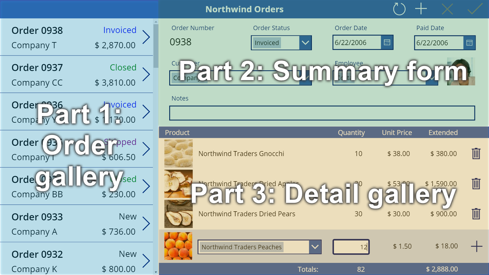

- [**Part 1, Orders list**](northwind-orders-canvas-part1.md):  Displays the list of orders.  Selection in this list determines which order is being edited on the rest of the screen.
- [**Part 2, Order form**](northwind-orders-canvas-part2.md):  View and edit information about the order.  Here new orders can be created and existing orders deleted.  You are here.
- **Part 3, Order details**:  View and edit the product line items that are associated with the order.  You are here.

If you have not already done so, work through [part 2](northwind-orders-canvas-part2.md).  Or take a shortcut by opening the **Northwind Orders (Canvas), Start Part 3** app after [installing the Northwind Traders sample database and apps](northwind-install.md)

## Display Order Details

1. Let's display the line items that make up this order.  Copy (with Ctrl-C) and Paste (with Ctrl-V) the title bar label at the top of the screen:

	

1. Re-size and re-position the copy to just below the form control.  Double click into the control and backspace over the text to remove it (you can also set the Text property to an empty string or **""**):

	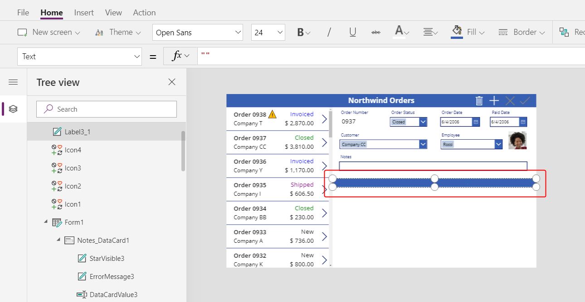

1. Insert a [**Gallery** control](controls/control-gallery.md) with a **Blank vertical** layout:

	

    The newly inserted control will overlay the existing controls on the left hand side of the screen:
 
	

1. Close the Data pane.  Re-size and re-position the control below our new title bar:

	

1. Set the **Items** property of the gallery to this formula:

	```powerapps-dot
	Gallery1.Selected.'Order Details'
	```

	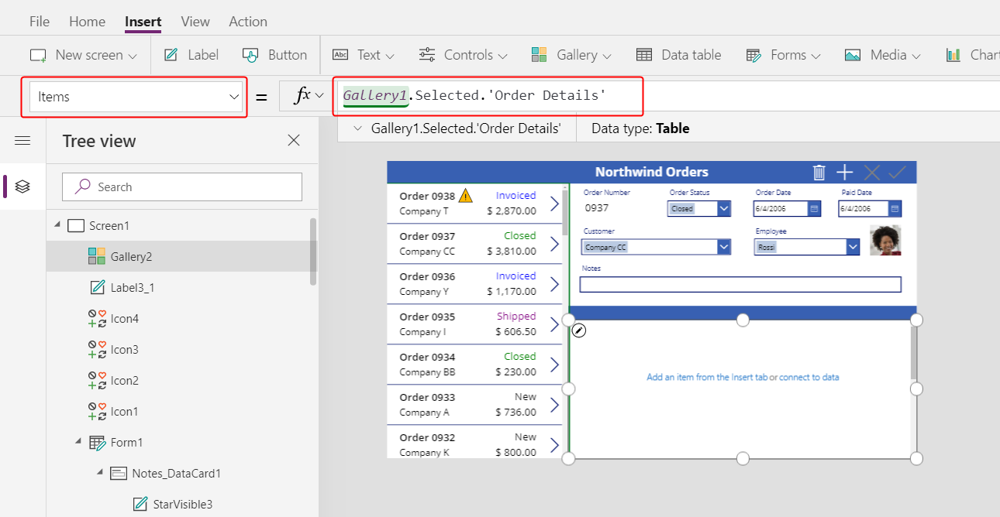

    Your gallery may be named something different than **Gallery1**.  Check the navigation pane to find the name of your form if you experience problems.  

    We have just linked the two galleries on your screen: the new gallery wiill display the **Order Details** for the selected **Order** in the orders list gallery.  Here we are traversing the One-to-Many relationship between the **Order Details** and **Orders** entities, as seen in the PowerApps portal:

	 

1. Select **Add an item from the insert tab** inside the gallery to select the template for the gallery.  You can tell the difference from selecting the gallery itself because the bounding box is slightly inside the gallery's boundary and is usually shorter than the gallery's height.  We will be inserting controls into this template that will be repeated for each item:

	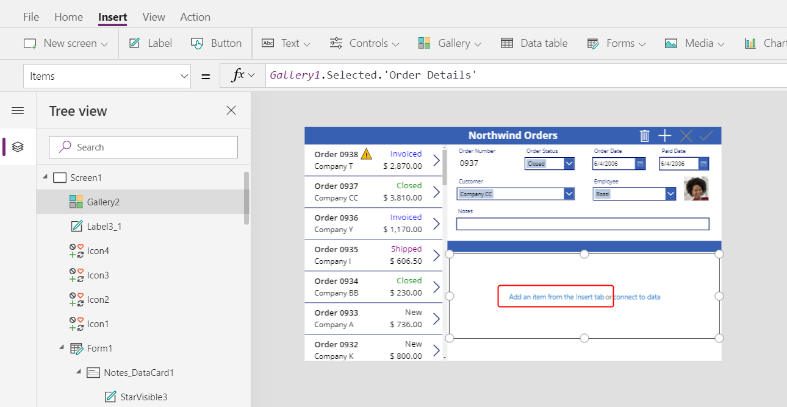

1. From the **Insert** ribbon, insert a [**Label** control](controls/control-text-box.md).  It should appear within the gallery; if it does not, try again and make sure the gallery's template is selected before inserting the control.

	

1. Set the **Text** property to the formula:

	```powerapps-dot
	ThisItem.Product.'Product Name'
	```

	Resize the control as needed to see the full text:

	
	
	With this formula we are walking from an **Order Detail** record which is held in **ThisItem** over to the **Order Products** entity through a Many-to-One relationship:

	

    And extracting the **Product Name** field (other fields we are about to use are also highlighted):

	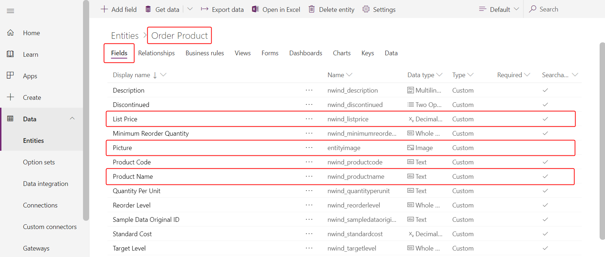

1. From the **Insert** ribbon, insert an [**Image** control](controls/control-image.md) into the gallery:

	

1. Re-size and re-position the image and label controls to be side by side.  

    For fine grained control over size and position, start to resize or move the control without the Alt key pressed, and then after starting hold down the Alt key:

	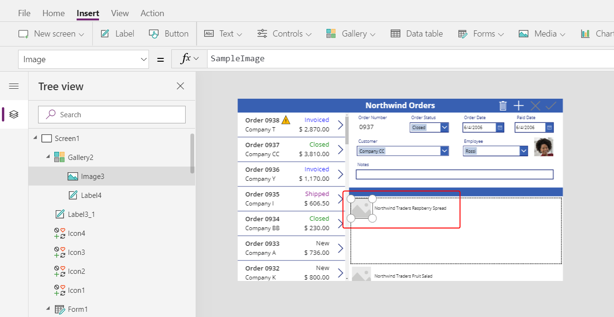

1. Set the **Image** property to this formula:

	```powerapps-dot
	ThisItem.Product.Picture
	```
	Here we are again referencing the **Order Product** associated with this **Order Detail** record and extracting the **Picture** field to display.

	

1. Shorten the height of the gallery's template so that we can see more than one **Order Detail** record at a time:
 
	

1. From the **Insert** ribbon, insert another **Label** control into the gallery.  Re-size and re-position it to the right of the product information.  Set it's **Text** Property to the formula:

	```powerapps-dot
	ThisItem.Quantity
	```

	This formula is pulling information directly from the **Order Details** records (no relationship required).
 
	 
 
1. From the **Home** ribbon, change the alignment of this control to **Right**:

	

1. From the **Insert** ribbon, insert another **Label** control into the gallery.  Re-size and re-position it to the right of the quantity.  Set it's **Text** Property to the formula:

	```powerapps-dot
	Text( ThisItem.'Unit Price', "[$-en-US]$ #,###.00" )
	```

	If you don't include the language tag (**[$-en-US]**) it will be added for you based on your language and region.  If you use a different language tag, you will want to use your own currency symbol instead of the **$** shown here just before the first **#**.

	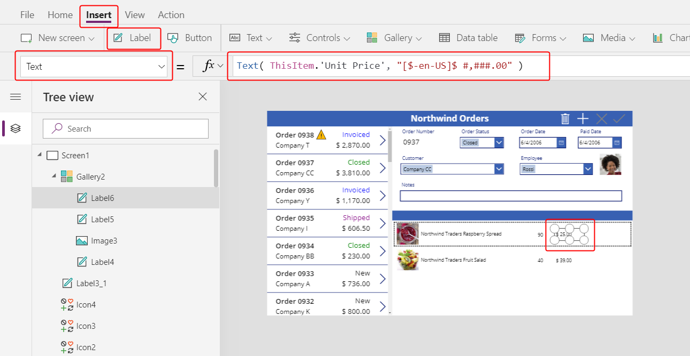

1. From the **Home** ribbon, change the alignment of this control to **Right**:

	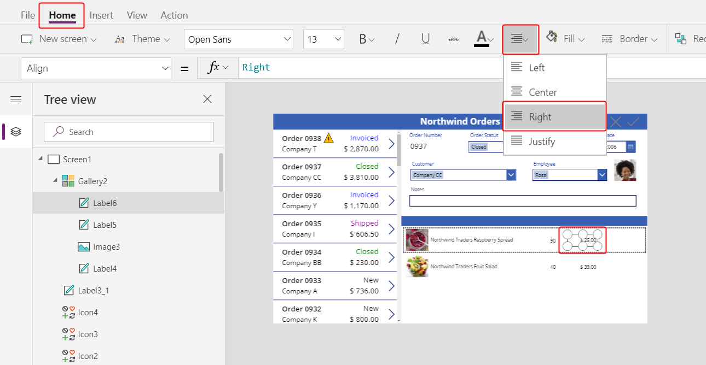

1. From the **Insert** ribbon, insert another **Label** control into the gallery.  Re-size and re-position it to the right of the unit price.  Set it's **Text** Property to the formula:

	```powerapps-dot
	Text( ThisItem.Quantity * ThisItem.'Unit Price', "[$-en-US]$ #,###.00" )
	```

	Again, if you don't include the language tag (**[$-en-US]**) it will be added for you based on your language and region.  If it is different, you will want to use your own currency symbol instead of the **$** shown here just before the first **#**.

	

1. From the **Home** ribbon, change the alignment of this control to **Right**:

	

1. We are done adding controls to this gallery for now.  Select **Screen1** in the navigateion pane to ensure the gallery is no longer selected.  

1. From the **Insert** ribbon, insert another **Label** control on to the screen:

	

1. Re-size and re-position this control on top of the second title bar above the picture of the products.  Change the text's color to white with the **Home** ribbon:

	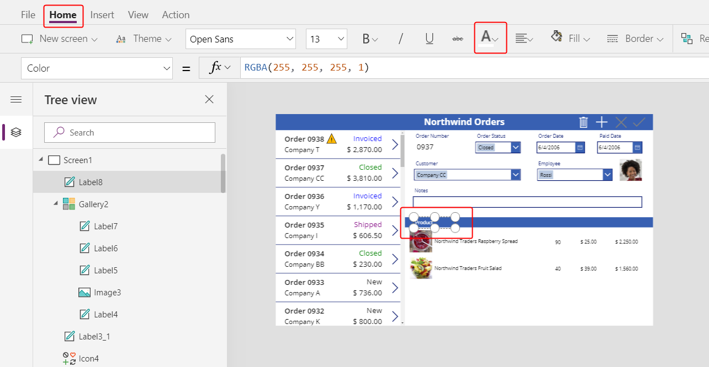

1. Copy and paste this control.  Re-size and re-position above the quantity column.  Double click into the control and type **Quantity**:

	

1. Copy and paste this control.  Re-size and re-position above the unit price column.  Double click into the control and type **Unit Price**:

	

1. Copy and paste this control.  Re-size and re-position above the extended price column.  Double click into the control and type **Extended**:

	

## Display Order totals

1. Re-size the height of the gallery to make room to display the order totals at the bottom of the screen:

	

1. Copy and paste the title bar in the middle of the screen and re-position it at the bottom of the screen:

	

1. Copy and paste the label showing **Product** from the middle title bar and position this to the left of the **Quantity** column on top of the bottom title bar.  Double click into the control and type **Order Totals:**:

	

1. Copy and paste this label control.  Re-size and re-position this control to the right of the **Order Totals:** label.  Set the **Text** property to this formula:

	```powerapps-dot
	Sum( Gallery1.Selected.'Order Details', Quantity )
	```

	This formula will show a delegation warning.  This is OK since we do not expect to have more than 500 diferent products in any one order.

	Using the **Home** ribbon set the text alignment to **Right**:

	

1. Copy and paste this label control.  Re-size and re-position this control below the **Extended** column.  Set the **Text** property to this formula:

	```powerapps-dot
	Text( Sum( Gallery1.Selected.'Order Details', Quantity * 'Unit Price' ), "[$-en-US]$ #,###.00" )
	```

	This formula will show a delegation warning.  This is OK since we do not expect to have more than 500 diferent products in any one order.

	

## Add Order Details

1. Gallery controls are read only and don't offer a way to add items.  Let's add an area below the gallery where we can provide some editable controls to configure an **Order Details** record and insert it into an order.  

    Shorten the height of the gallery showing **Order Details** to make room for a single item editing space below where we can add an **Order Detail**:

	

1. From the **Insert** ribbon, insert a **Label** control and re-size and re-position it below the gallery.  

	

1. Double click into the control and clear the text on the label (empty string or **""**).  Using the **Home** ribbon, set the **Fill** color to a light blue:

	

1. From the **View** ribbon, select **Data sources** and then **+ Add data source**:

	

1. Select the **Common Data Service**:

	

1. Type **order** in the search box at the top of the data pane.  Check the **Order Details** entity.  Select the **Connect** button at the bottom of the screen:

	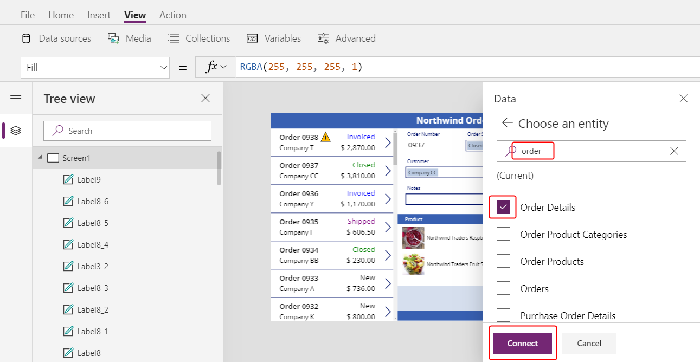

	We have just added another data source to our app:

	

    We need to add this data source since although we can read through a One-to-Many relationship we cannot yet write back changes.  We must make changes directly with the related entity.

1. Close the Data panel.  From the **Insert** ribbon, select **Controls** and then select **Combo box**:

	

1. The combo box control will appear to overlay the other controls on the upper left side of the screen.  Set the **Items** property to the formula:

	```powerapps-dot
	Choices( 'Order Details'.Product )
	```

	


    The [**Choices** function] returns a table of the possible values for the field **'Order Details'.Product**.  Since this field is a lookup in a Many-to-One relationship, **Choices** returns all the records in the **Order Products** entity. 

    **Choices** can also be used with option sets to return the table of all the different options which was used behind the scenes in Part 2 to provide a combo box for **Order Status** in the form.

1. In the Data panel, set the **Primary text** to **nwind_productname**.  This is a logical name as the Data panel does not support display names in this case yet:

	

1. In the Data panel, set the **SearchField** to **nwind_productname**:

	

1. Close the Data panel.  Scroll down in the Properties panel and turn off **Allow multiple selection** and turn on **Allow searching**:

	

1. Re-size and re-position the combo box on top of our light blue area, in the same column as the product names shown above it in the gallery:

	

    This control will capture the **Product** for the **Order Details** record.

1. Hold down the Alt key and click the down arrow on the combo box. Using the Alt key allows us to interact with controls in the Studio without needing to enter Preview mode. 

    You should see the list of all products.  Select of one of the products:

	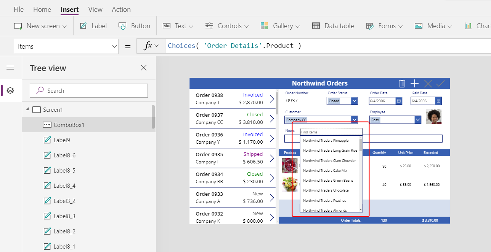

1. From the **Insert** menu, select **Media**, and then select an **Image** control:

	

	The control will overlay other controls on the left side of the screen and may not be easy to see:

	

1. Re-size and re-position this control under the other product images next to the combo box control in the light blue area.  Set the **Image** property of this control to:

	```powerapps-dot
	ComboBox1.Selected.Picture
	```

	

    We are using the same trick we used in Part 2 to show the employee picture.  The **Selected** property on the combo box control returns the entire record of the product selected including the **Picture** field.

1. From the **Insert** menu, select **Text** and insert a [**Text input** control](controls/control-text-input.md):

	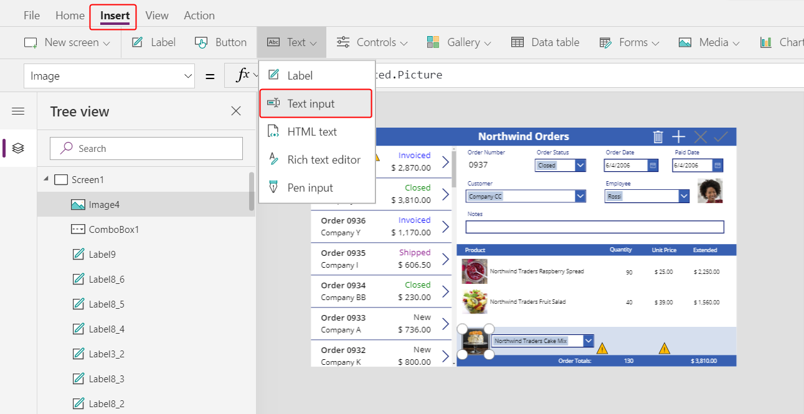

	Again, this new control will be inserted over the other controls on the left side of the screen:

	

1. Re-size and re-position this control to the right of the combo box control, under the quantity column of the gallery above:

	

    This control will capture the **Quantity** for the **Order Details** record.

1. Set the **Default** property of this control to **""**:

	

1. Using the **Home** ribbon, set the text alignment of this control to **Right**:

	

1. From the **Insert** menu, insert a **Label** control, which will appear in the upper left corner of the screen:

	

1. Re-size and re-position this control to the right of the text input control.  Set its **Text** property to the formula:

	```powerapps-dot
	Text( ComboBox1.Selected.'List Price', "[$-en-US]$ #,###.00" )
	```

	

    This control is displaying the **List Price** from the **Order Products** entity.  We will use this for the **Unit Price** field in the **Order Details** record.  If we had wanted the app user to be able to modify the price, we could ahve used a **Text input** control and set the **Default** property to **List Price**.

1. Using the **Home** ribbon, set the text alignment of this control to **Right**:

	

1. Cut and paste a copy of this control.  Re-size and re-position it to the right of the **List price** label.  Set its **Text** property to the formula:

	```powerapps-dot
	Text( Value(TextInput1.Text) * ComboBox1.Selected.'List Price', "[$-en-US]$ #,###.00" )
	```

	

    This control is displaying the extended price based on the quantity entered and the list price.  It is purely informational for the app user.

1. Double click the **Text input** control that holds quantity and type a number.  The **Extended** price label will automatically recalculate to show the new value:

	

1. From the **Insert** ribbon, select **Icons** and insert an **Add** icon:

	

	The icon will be inserted in the upper left corner of the screen and may be hard to see.

	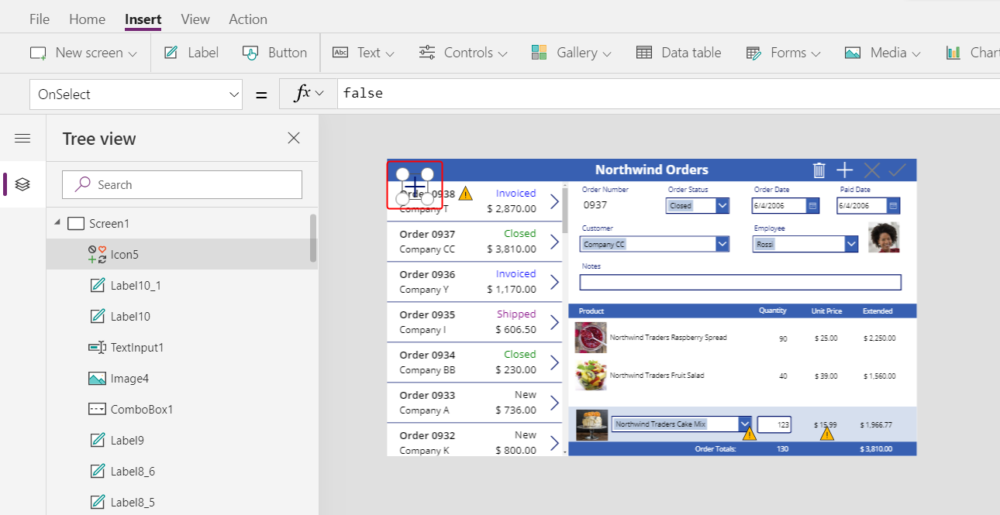

1.  Re-size and re-position this icon to the right of the other controls in the light blue area.  Set its **OnSelect** property to the formula:

	```powerapps-dot
	Patch( 'Order Details', 
	    Defaults('Order Details'),
	    { 
        	Order: Gallery1.Selected, 
        	Product: ComboBox1.Selected,
        	Quantity: Value(TextInput1.Text), 
        	'Unit Price': ComboBox1.Selected.'List Price' 
    	}
	);
	Refresh( Orders );
	Reset( ComboBox1 ); 
	Reset( TextInput1 )
	```

	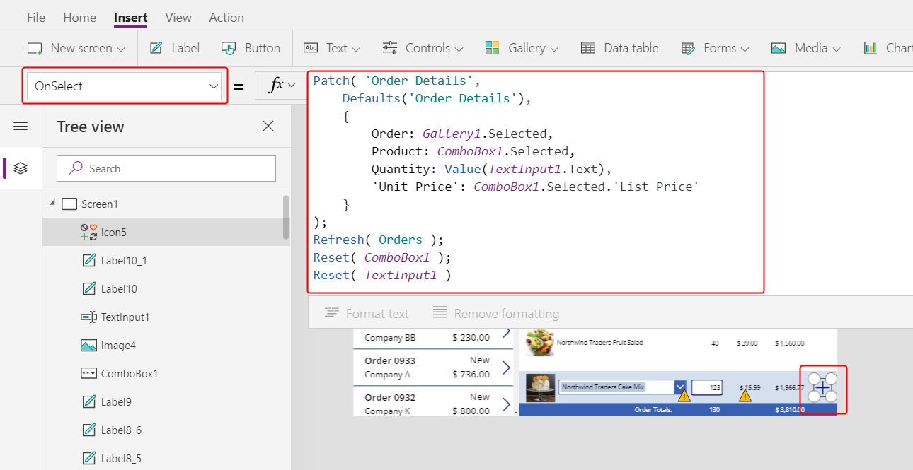

    Let's unpack what this formula is doing:
    - The [**Patch** function](functions/function-patch.md) is used to update and create records.  We are using it to modify the **Order Details** entity and in this case to create a new record by passing **Defaults( 'Order Details' )** in the second argument.
    - The third argument to **Patch** is the record we want to add.  We are providing values for the fields we care about:
        - **Order** is the order currently selected in the Orders list.
        - **Product** is taken from the combo box control we just added.  It will return the complete record for whatever **Order Products** was selected by the app user.  That is how we set lookup values in canvas apps, by complete record and not by primary keys.
        - **Quantity** is taken from the text input control we just added. 
        - **'Unit Price'** is taken from the current price in the **Order Products** entity.  It is one of the fields made available by thte combo box's selection.
    - For performance reasons, data is cached in a canvas app.  After updating the **Order Details**, the cache for the **Orders** entity won't know that the One-to-Many relationship to **Order Details** has been updated.  We use the [**Refresh** function](functions/function-refresh.md) to let it know.
    - After adding an **Order Detail**, we'd like to clear out the selections for a new record.  The [**Reset** function](functions/function-reset.md) clears the app user's input to start fresh. 

1. Preview the app with the triangular Play button at to the right of the Studio.  Press the **+** icon to add the product and quantity in the light blue area to the order.  Add another item to the order if you wish:

	

## Remove Order Details

1. Now that we can add an order detail, let's add a way to remove one.

    Select the gallery template for the **Order Details** in the center of the screen:

	

1. From the **Insert** ribbon, select **Icons**, and select the **Trash** icon:

	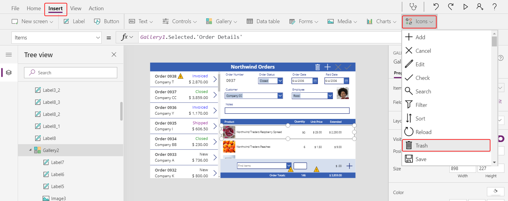

	The icon will be inserted in the upper left corner of gallery's template, overlaying other controls and may be hard to see.

	

1. Re-size and re-position this icon control to the right side of the gallery's template.  Set its **OnSelect** property to the formula:

	```powerapps-dot
	Remove( 'Order Details', ThisItem ); Refresh( Orders )
	```

	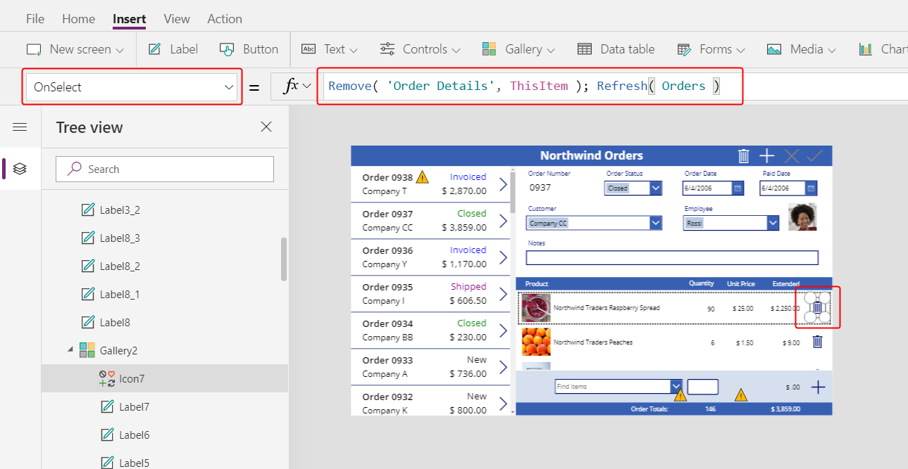

    As we can't yet remove a record directly from a relationship, the [**Remove** function](functions/function-remove-removeif.md) is used to remove a record directly from the related entity.  **ThisItem** is the record to remove, taken from the same record in the gallery where the trash can icon appears.

    Again, as we use cached data, we need to inform the **Orders** entity that we did something to one of its related entities without it knowning about it, by invoking the **Refresh** function.

1. Again preview the app.  Click the trash icon next to each **Order Details** record you would like to remove from the order.  Try adding and removing various order details from your orders:

	

## In conclusion

To recap, we just added another gallery to our app to show **Order Details** and a facility for adding an **Order Detail**.   We used:
- A second gallery control, linked to the first through a One-to-Many relationship: **Gallery2.Items** = `Gallery1.Selected.'Order Details'`
- From here, navigating a Many-to-One relationship: `ThisItem.Product.'Product Name'` and `ThisItem.Product.Picture`
- The **Choices** function to obtain a list of possible **Order Products**: `Choices( 'Order Details'.Product' )`
- The **Selected** property of a combo box control as the complete Many-to-One related record: `ComboBox1.Selected.Picture` and `ComboBox1.Selected.'List Price'`
- The **Patch** function to create a new **Order Details** record: `Patch( 'Order Details', Defautls( 'Order Details' ), ... )`
- The **Remove** function to delete an **Order Details** record: `Remove( 'Order Details', ThisItem )`

This has been a quick walk through of using Common Data Service relationships and option sets in a canvas app.      


	


	


