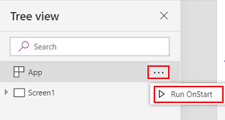
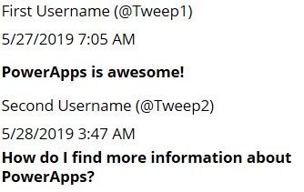
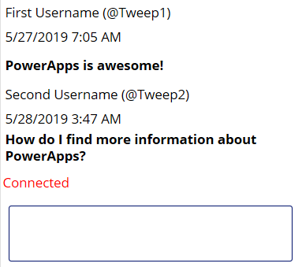
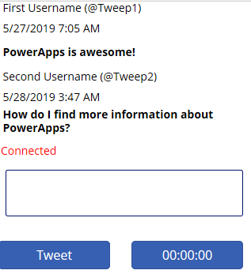

# Develop offline-capable canvas apps

Mobile users often need to be productive even when they have limited or no connectivity. When you build a canvas app, you can:

- Open PowerApps Mobile when offline.
- Run apps that you develop when offline.
- Determine when an app is offline, online, or in a metered connection by using the [Connection](../canvas-apps/functions/signals.md#connection) signal object.
- Use [collections](../canvas-apps/create-update-collection.md) and leverage functions such as [LoadData and SaveData](../canvas-apps/functions/function-savedata-loaddata.md) for basic data storage when offline.

## Limitations

**LoadData** and **SaveData** combine to form a simple mechanism to store small amounts of data on a local device. By using these functions, you can add simple offline capabilities to your app.

These functions are limited by the amount of available app memory because they operate on an in-memory collection. Available memory can vary depending on the device, the operating system, the memory that PowerApps Mobile uses, and the complexity of the app in terms of screens and controls. If you store more than a few megabytes of data, test your app with expected scenarios on the devices on which you expect it to run. You should generally expect to have between 30 and 70 megabytes of available memory.

The functions also don't automatically resolve merge conflicts when a device returns to connectivity from offline. Configuration on what data is saved and how to handle reconnection is up to the maker when writing expressions.

For updates on capabilities for offline scenarios, return to this topic, and subscribe to the [PowerApps blog](https://powerapps.microsoft.com/blog/).

## Overview

The first thing to think about in offline scenarios is how your apps work with data. Apps in PowerApps primarily access data through a set of [connectors](../canvas-apps/connections-list.md) that the platform provides, such as SharePoint, Office 365, and the Common Data Service. You can also build custom connectors that enable apps to access any service that provides a RESTful endpoint. This could be a Web API or a service such as Azure Functions. All these connectors use HTTPS over the Internet, which means your users must be online for them to access data and any other capabilities that a service offers.


### Handling offline data

One of the most interesting aspects of PowerApps is its set of capabilities and formulas that enable you to filter, search, sort, aggregate, and manipulate data in a consistent way regardless of the data source. Sources range from in-memory collections in the app to SharePoint lists to SQL databases and Common Data Service. This consistency enables you to easily retarget an app to use a different backend. More importantly here, it also enables you to use local collections for data management with almost no changes to an app's logic. In fact, local collections are the primary mechanism for handling offline data.

## Build an offline app

To keep the focus on the offline aspects of app development, we'll show you a simple scenario focused around Twitter. We'll build an app that enables you to read Twitter posts and submit tweets while being offline. When the app comes online, the app posts tweets and reloads the local data.

At a high level, the app performs these tasks:

- When the user opens the app:

  - If the device is online, the app fetches data through the Twitter connector and populates a collection with that data.
  - If the device is offline, the app loads the data from a local cache file by using the [**LoadData**](../canvas-apps/functions/function-savedata-loaddata.md) function.
  - The user can submit tweets. If the app is online, it posts the tweets directly to Twitter and refreshes the local cache.

- Every five minutes while the app is online:

  - The app posts any tweets in the local cache.
  - The app refreshes the local cache and saves it by using the [**SaveData**](../canvas-apps/functions/function-savedata-loaddata.md) function.

### Step 1: Add Twitter to a blank phone app

1. In PowerApps Studio, select **File** > **New**.

1. On the **Blank app** tile, select **Phone layout**.

    > [!div class="mx-imgBorder"]
    > 

1. On the **View** tab, select **Data sources**.

1. In the **Data** pane, select **Add data source**.

1. Select **New Connection** > **Twitter** > **Create**.

1. Enter your credentials, create the connection, and then close the **Data** pane.

### Step 2: Create a collection of tweets

1. In the **Tree view** pane, select **App**, and then set its **OnStart** property to this formula:

    ```powerapps-dot
    If( Connection.Connected,
        ClearCollect( LocalTweets, Twitter.SearchTweet( "PowerApps", {maxResults: 10} ) );
            Set( statusText, "Online data" ),
        LoadData( LocalTweets, "LocalTweets", true );
            Set( statusText, "Local data" )
    );
    SaveData( LocalTweets, "LocalTweets" );
    ```

    > [!div class="mx-imgBorder"]
    > 

1. In the **Tree view** pane, select the ellipsis menu for the **App** object, and then select **Run OnStart** to run that formula.

    > [!div class="mx-imgBorder"]
    > 

    > [!NOTE]
    > The **LoadData** and **SaveData** functions might show an error in PowerApps Studio because browsers don't support them. However, they'll perform normally after you deploy this app to a device.

This formula checks whether the device is online:

- If the device is online, the formula loads up to 10 tweets with the search term "PowerApps" into a **LocalTweets** collection.
- If the device is offline, the formula loads the local cache from a file called "LocalTweets" if it's available.

### Step 3: Show tweets in a gallery

1. On the **Insert** tab, select **Gallery** > **Blank flexible height**.

1. Set the **Items** property of the [**Gallery**](controls/control-gallery.md) control to `LocalTweets`.

1. In the gallery template, add three [**Label**](controls/control-text-box.md) controls, and set the **Text** property of each label to one of these values:

    - `ThisItem.UserDetails.FullName & " (@" & ThisItem.UserDetails.UserName & ")"`
    - `Text(DateTimeValue(ThisItem.CreatedAtIso), DateTimeFormat.ShortDateTime)`
    - `ThisItem.TweetText`

1. Make the text in the last label bold so that the gallery resembles this example.

    > [!div class="mx-imgBorder"]
    > 

### Step 4: Show connection status

1. Under the gallery, insert a label, and then set its **Color** property to **Red**.

1. Set the newest label's **Text** property to this formula:

    `If( Connection.Connected, "Connected", "Offline" )`

This formula determines whether the device is online. If it is, the label shows **Connected**; otherwise, it shows **Offline**.

### Step 5: Add a box to compose tweets

1. Under the connection-status label, insert a [**Text input**](controls/control-text-input.md) control, and rename it **NewTweetTextInput**.

1. Set the text-input box's **Default** property to `""`.

    > [!div class="mx-imgBorder"]
    > 

### Step 6: Add a button to post the tweet

1. Under the text-input box, add a **Button** control, and set its **Text** property to this value:

    `"Tweet"`

1. Set the button's **OnSelect** property to this formula:

    ```powerapps-dot
    If( Connection.Connected,
        Twitter.Tweet( "", {tweetText: NewTweetTextInput.Text} ),
        Collect( LocalTweetsToPost, {tweetText: NewTweetTextInput.Text} );
            SaveData( LocalTweetsToPost, "LocalTweetsToPost" )
    );
    Reset( NewTweetTextInput );
    ```  

1. In the **OnStart** property for the **App**, add a line at the end of the formula:

    ```powerapps-dot
    If( Connection.Connected,
        ClearCollect( LocalTweets, Twitter.SearchTweet( "PowerApps", {maxResults: 100} ) );
            Set( statusText, "Online data" ),
        LoadData( LocalTweets, "LocalTweets", true );
            Set( statusText, "Local data" )
    );
    SaveData( LocalTweets, "LocalTweets" );
    LoadData( LocalTweetsToPost, "LocalTweetsToPost", true );  // added line
    ```

    > [!div class="mx-imgBorder"]
    > 

This formula determines whether the device is online:

- If the device is online, it posts the tweet immediately.
- If the device is offline, it captures the tweet in a **LocalTweetsToPost** collection and saves it to the device.

Then the formula resets the text in the text-input box.

### Step 7: Check for new tweets

1. On the right side of the button, add a **Timer** control.

    > [!div class="mx-imgBorder"]
    > 

1. Set the timer's **Duration** property to **300000**.

1. Set the timer's **AutoStart** and **Repeat** properties to **true**.

1. Set the timer's **OnTimerEnd** to this formula:

    ```powerapps-dot
    If( Connection.Connected,
        ForAll( LocalTweetsToPost, Twitter.Tweet( "", {tweetText: tweetText} ) );
        Clear( LocalTweetsToPost );
        ClearCollect( LocalTweets, Twitter.SearchTweet( "PowerApps", {maxResults: 100} ) );
        SaveData( LocalTweets, "LocalTweets" );
   )
    ```

This formula determines whether the device is online. If it is, the app tweets all the items in the **LocalTweetsToPost** collection and then clears the collection.

## Test the app

1. On a mobile device that's online, open PowerApps, and then open the Twitter app.

    The tweets are loaded, and the status shows **Connected**.

1. Close the Twitter app, disable wi-fi, and then enable the device's airplane mode.

1. Open the Twitter app again.

    The status label shows that the app is **Offline**.

1. Write a tweet that includes **PowerApps**.

    The tweet is stored locally in the **LocalTweetsToPost** collection.

1. Disable the device's airplane mode to bring the app online again.

    In five minutes or less, the app posts the tweet.

We hope this article gives you an idea of the capabilities that PowerApps has for building offline apps. As always, please provide feedback in our [forum](https://powerusers.microsoft.com/t5/PowerApps-Forum/bd-p/PowerAppsForum1) and share your examples of offline apps in the [PowerApps community blog](https://powerusers.microsoft.com/t5/PowerApps-Community-Blog/bg-p/PowerAppsBlog).