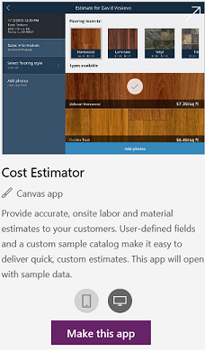
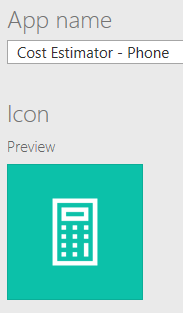

# Quickstart: Create a canvas app from a sample in PowerApps
In this quickstart, you'll create a canvas app from a sample so that you can explore design possibilities and discover concepts that you can apply as you develop your own canvas apps.

Each sample showcases a real-world scenario but uses fictitious data. To store this data, you'll need a cloud-storage account, such as Dropbox, Google Drive, or OneDrive.

If you don't have a license for PowerApps, you can [sign up for free](../signup-for-powerapps.md).

## Open a sample app
1. Sign in to [PowerApps](https://web.powerapps.com?utm_source=padocs&utm_medium=linkinadoc&utm_campaign=referralsfromdoc).

1. In the list of sample apps, hover over a sample app (such as **Cost Estimator**) with your mouse.

	

1. Click or tap the phone icon to create a version of the app for mobile devices (or leave the tablet icon selected), and then click or tap **Make this app**.

1. In PowerApps Studio, click or tap **Make my own app** in the banner near the top-center of the screen.

	

1. Specify the cloud-storage account where you want to store the fictitious data for this app, and then provide credentials for that account.

1. Open Preview mode by pressing F5 (or by clicking or tapping the play button near the upper-right corner).

	

	Each sample represents a different scenario with a variety of screens and other controls. If you opened the Cost Estimator sample, you can use the default app to perform these tasks:

	- Create an appointment for estimating the cost of installing a flooring product in a room of a particular size.
	- Capture details such as address and square footage, and calculate the price based on discounts and tax rates.
	- Filter a list of appointments to show those for which estimates have been created, for which estimates haven't been created, or all appointments.
	
1. When you finish exploring the app, close Preview mode by pressing Esc (or by clicking or tapping the close icon near the upper-right corner, under the title bar for PowerApps).

## Save the app
1. Near the upper-left corner, click or tap the **File** tab.

1. In the **App settings** page, review the default settings.

	

1. Near the left edge, click or tap **Save**. 

## Next steps
In this quickstart, you created your own app based on a sample that uses fictitious data stored in your cloud account. For more help learning how to create an app, you can also automatically generate an app based on data in other sources such as the Common Data Service, SharePoint, or Excel.

> [!div class="nextstepaction"]
> [Generate an app](data-platform-create-app.md)
