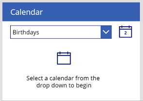
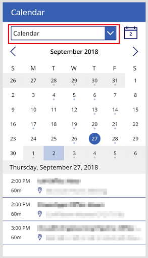
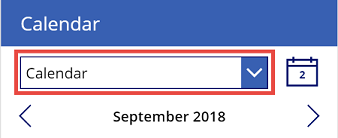
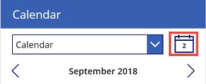
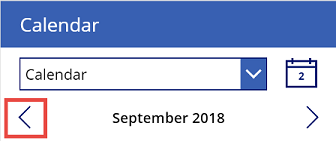
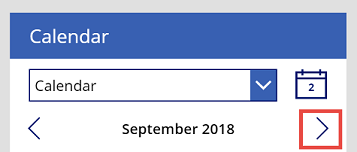
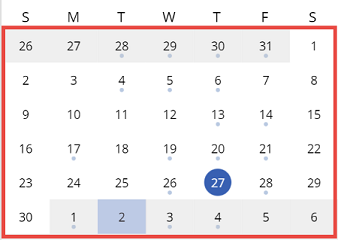
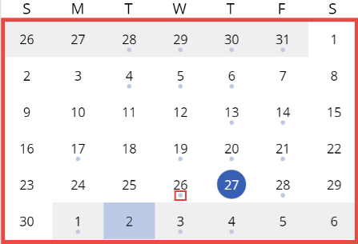

# Reference information about the calendar-screen template for canvas apps

For canvas apps in PowerApps, understand how each significant control in the calendar-screen template contributes to the screen's overall default functionality. This deep dive presents the behavior formulas and the values of other properties that determine how the controls respond to user input. For a high-level discussion of this screen's default functionality, see the [calendar-screen overview](calendar-screen-overview.md).

## Prerequisite

Familiarity with how to add and configure screens and other controls as you [create an app in PowerApps](../data-platform-create-app-scratch.md).

## Default functionality

To add a calendar screen from the template:

1. [Sign in](http://web.powerapps.com?utm_source=padocs&utm_medium=linkinadoc&utm_campaign=referralsfromdoc) to PowerApps, and then create an app or open an existing app in PowerApps Studio.

    This topic shows a phone app, but the same concepts apply to a tablet app.

1. On the **Home** tab of the ribbon, select **New screen** > **Calendar**.

    By default, the screen resembles this graphic:

    

1. To show data, select an option in the drop-down list near the top of the screen.

    

This topic explains the expressions or formulas to which various properties (such as **Items** and **OnSelect**) of significant controls are set. Those controls are presented in this order:

- [Calendar dropdown (dropdownCalendarSelection)](#calendar-drop-down)
- [Calendar icon (iconCalendar)](#calendar-icon)
- [Previous-month chevron (iconPrevMonth)](#previous-month-chevron)
- [Next-month chevron (iconNextMonth)](#next-month-chevron)
- [Calendar gallery (MonthDayGallery) (+ child controls)](#month-day-gallery)
- [Events gallery (CalendarEventsGallery)](#calendar-events-gallery)

## Calendar dropdown



- Property: **Items**<br>
    Value: `Office365.CalendarGetTables().value`

    This value is a connector operation that retrieves the app user's Outlook calendars. You can see [the value](https://docs.microsoft.com/connectors/office365/#entitylistresponse[table]) that this operation retrieves.

- Property: **OnChange**<br>Value: `Select(dropdownCalendarSelection)`

    When the user selects an option in the list, the function in the control's **OnSelect** property runs.

- Property: **OnSelect**<br>
    Value: An **If** function, which appears in the next code block, and several additional functions, which appear in the code block after that.

   This part of the formula runs only the first time that the user selects an option in the dropdown after opening the app.

    ```
    If(IsBlank(_userDomain),
        UpdateContext({_showLoading: true});
        Set(_userDomain, Right(User().Email, Len(User().Email) - Find("@", User().Email)));
        Set(_dateSelected, Today());
        Set(_firstDayOfMonth, DateAdd(Today(), 1 - Day(Today()), Days));  
        Set(_firstDayInView, DateAdd(_firstDayOfMonth, -(Weekday(_firstDayOfMonth) - 1), Days));
        Set(_lastDayOfMonth, DateAdd(DateAdd(_firstDayOfMonth, 1, Months), -1, Days))  
    );
    ```

    This code defines these variables:
    
  - **_userDomain**: The app user's company domain, as reflected in the user's email address.
  - **_dateSelected**: Today's date (by default). The calendar gallery highlights this date, and the event gallery shows the events that are scheduled for that date.
  - **_firstDayOfMonth**: The first day of the current month. Because (Today + (1 - Today)) = Today - Today + 1 = 1, this **DateAdd** function always returns the first day of the month.
  - **_firstDayInView**: The first day that the calendar gallery can show. This value isn't the same of the first day of the month unless the month starts on a Sunday, and you don't want to show an entire week of the previous month. Thus, the first day in view will be _firstDayOfMonth - Weekday(_firstDayOfMonth) + 1.
  - **_lastDayOfMonth**: The last day of the current month, which is the same as the first day of next month minus 1 day.

    The functions after the **If** function run whenever the user selects an option in this dropdown (not just the first time after the user opens the app).

    ```
    Set(_calendarVisible, false);
    UpdateContext({_showLoading: true});
    Set(_myCalendar, dropdownCalendarSelection2.Selected);
    Set(_minDate, DateAdd(_firstDayOfMonth, -(Weekday(_firstDayOfMonth) - 2 + 1), Days));
    Set(_maxDate, DateAdd(DateAdd(_firstDayOfMonth, -(Weekday(_firstDayOfMonth) - 2 + 1), Days), 40, Days));
    ClearCollect(MyCalendarEvents, 'Office365'.GetEventsCalendarViewV2(_myCalendar.Name, Text(_minDate, UTC), Text(_maxDate, UTC)).value);
    UpdateContext({_showLoading: false});
    Set(_calendarVisible, true)
    ```

    This code defines these variables and one collection:

    - **_calendarVisible** Set to false so that the calendar doesn't appear while the new selection is loaded.
    - **_showLoading** Set to true so that loading indicators appear while the new selection is being loaded.
    - **_myCalendar** Set to the current value of the dropdown so that events from the correct calendar are retrieved.
    - **_minDate** Set to the equivalent date as _firstDayInView. This variable determines what events have already been retrieved from Outlook and cached in the app.
    - **_maxDate** Set to the last viewable day in the calendar. This formula is just _firstDayInView + 40. The calendar displays a maximum of 41 days, so this variable always reflects the last viewable day and determines what events have already been retrieved from Outlook and cached in the app.
    - **MyCalendarEvents** Set to a collection of the user's events from the selected calendar, ranging from **_minDate** to **_maxDate**.
    - **_showLoading** Set to false, and set **_calendarVisible** to true after everything else has been loaded.

## Calendar icon



- Property: **OnSelect**<br>
    Value: Four **Set** functions that reset the calendar gallery to today's date.

    ```
    Set(_dateSelected, Today());
    Set(_firstDayOfMonth, DateAdd(Today(), 1 - Day(Today()), Days));
    Set(_firstDayInView, DateAdd(_firstDayOfMonth, -(Weekday(_firstDayOfMonth) - 2 + 1), Days));
    Set(_lastDayOfMonth, DateAdd(DateAdd(_firstDayOfMonth, 1, Months), -1, Days))
    ```

    This code resets all date variables that are necessary for displaying the proper calendar view:

    - **_dateSelected** is reset to today.
    - **_firstDayOfMonth** is reset to the first day of today's month.
    - **_firstDayInView** is reset to the first day viewable when today's month is selected.
    - **_lastDayOfMonth** is reset to the last day of today's month.

    The [**Calendar dropdown**](#calendar-dropdown) section of this topic explains these variables in more detail.

## Previous-month chevron



- Property: **OnSelect**<br>Value: Four **Set** functions and an **If** function that show the previous month in the calendar gallery.

    ```
    Set(_firstDayOfMonth, DateAdd(_firstDayOfMonth, -1, Months));
    Set(_firstDayInView, DateAdd(_firstDayOfMonth, -(Weekday(_firstDayOfMonth) - 2 + 1), Days));
    Set(_lastDayOfMonth, DateAdd(DateAdd(_firstDayOfMonth, 1, Months), -1, Days));
    If(_minDate > _firstDayOfMonth,
     Collect(MyCalendarEvents, 'Office365'.GetEventsCalendarViewV2(_myCalendar.Name, Text(_firstDayInView, UTC), Text(DateAdd(_minDate, -1, Days), UTC)).value);
     Set(_minDate, _firstDayInView))
    ```

    > [!Note]
    > Definitions for **_firstDayOfMonth**, **_firstDayInView**, and **_lastDayOfMonth** are nearly identical to those in the [Calendar dropdown](#calendar-dropdown) section of this topic.

    The first three lines of this code run whenever the user selects the icon, and they set the variables that are necessary to display the proper calendar view. The remaining code runs only if the user hasn't previously selected this month for the selected calendar.

    In that case, **_minDate** is the first day that appears when the previous month displays. Before the user selects the icon, **_minDate** has a minimum possible value of the 23rd of the current month. (When March 1 falls on a Saturday, **_firstDayInView** for March is Feb. 23.) Thus, if a user hasn't selected this month yet, **_minDate** is greater than the new **_firstDayOfMonth**, and the **If** function returns true. The code in it runs, and a collection and a variable are updated:

    - **MyCalendarEvents** retrieves events from the selected calendar with the [Office365.GetEventsCalendarViewV2](https://docs.microsoft.com/connectors/office365/#get-calendar-view-of-events--v2-) operation. The date range is between the **_firstDayInView** date and **_minDate** - 1. Because **MyCalendarEvents** already contains events on the **_minDate** date, 1 is subtracted from that date for the max in this new date range.

    - **_minDate** is set to the current **_firstDayInView** because this is the first date for which events have been retrieved. If a user returns to this date by selecting this icon, the **If** function returns false, and the code doesn't run because events for this view are already cached in **MyCalendarEvents**.

## Next-month chevron



- Property: **OnSelect**<br>
    Value: Four **Set** functions and an **If** function that show the next month in the calendar gallery.

    ```
    Set(_firstDayOfMonth, DateAdd(_firstDayOfMonth, 1, Months));
    Set(_firstDayInView, DateAdd(_firstDayOfMonth, -(Weekday(_firstDayOfMonth) - 2 + 1), Days));
    Set(_lastDayOfMonth, DateAdd(DateAdd(_firstDayOfMonth, 1, Months), -1, Days));
    If(_maxDate < _lastDayOfMonth,
    Collect(MyCalendarEvents, 'Office365'.GetEventsCalendarViewV2(_myCalendar.Name, Text(DateAdd(_maxDate, 1, Days), UTC), DateAdd(_firstDayInView, 40, Days)).value);
    Set(_maxDate, DateAdd(_firstDayInView, 40, Days)))
    ```

    > [!Note]
    > Definitions for **_firstDayOfMonth**, **_firstDayInView**, and **_lastDayOfMonth** are nearly identical to those in the [Calendar dropdown](#calendar-dropdown) section of this topic.

    The first three lines of this code run whenever the user selects the icon, and they set the variables that are necessary to display the proper calendar view. The remaining code runs only if the user hasn't previously selected this month for the selected calendar.

    In that case, **_maxDate** is the last day that appears when the previous month displays. Before the user selects the icon, **_maxDate** has a maximum possible value of the 13th of the next month. (When February 1 falls on a non leap year Sunday, **_maxDate** is March 13, which is _firstDayInView + 40 days.) Thus, if a user hasn't selected this month yet, **_maxDate** is greater than the new **_lastDayOfMonth**, and the **If** function returns true. The code in it runs, and a collection and a variable are updated:

    - **MyCalendarEvents** retrieves events from the selected calendar with the [Office365.GetEventsCalendarViewV2](https://docs.microsoft.com/connectors/office365/#get-calendar-view-of-events--v2-) operation. The date range is between **_maxDate** + 1 day and **_firstDayInView** + 40 days. Because **MyCalendarEvents** already contains events on the **_minDate** date, 1 is added to that date for the min in this new date range. **_firstDayInView** + 40 is the formula for **_maxDate**, so the second date in the range is just the new **_maxDate**.

    - **_maxDate** is set to **_firstDayInView** + 40 days because this is the last day for which events have been retrieved. If a user returns to this date by selecting this icon, the **If** function returns false and the code doesn't run because events for this view are already cached in **MyCalendarEvents**.

## Calendar gallery



- Property: **Items**<br>
    Value: `[0,1,2,3,4,5,6,7,8,9,10,11,12,13,14,15,16,17,18,19, 20,21,22,23,24,25,26,27,28,29,30,31,32,33,34,35,36,37,38,39,40,41]`
  
  The set of 0 through 41 is used as the items in the calendar gallery because, in the worst case scenario, the calendar view will have to display 42 full days. This will occur when the first of the month occurs on a Saturday and the last of the month occurs on a sunday. In this case, the calendar will show six preceding days in the row containing the first of the month, and six proceeding days in the row containing the last of the month. This will be 42 unique values, of which 30 are for the selected month.

- Property: **WrapCount**<br>
    Value: `7`

  This value reflects a seven-day week.

### Title control in the calendar gallery


- Property: **Text**<br>
    Value: `Day(DateAdd(_firstDayInView,ThisItem.Value,Days))`

    Recall **_firstDayInView** is defined as (**_firstDayOfMonth** - its weekday value) + 1. This tells you that **_firstDayInView** will always be a Sunday, and **_firstDayOfMonth** will always occur in the first row of **MonthDayGallery**. Because of these two facts, **_firstDayInView** will always be in the very first cell of **MonthDayGallery**. ThisItem.Value is the number for that cell in the **MonthDayGallery** item property. So, taking **_firstDayInView** as a starting point, each cell displays the increment of **_firstDayInView** + its respective cell value.

- Property: **Fill**<br>
    Value: One **If** function.

    ```
  If(
    DateAdd(_firstDayInView, ThisItem.Value) =
    Today() && DateAdd(_firstDayInView, ThisItem.Value) =
    _dateSelected, RGBA(0,0,0,0),
    DateAdd(_firstDayInView, ThisItem.Value) =
    Today(), ColorFade(Subcircle.Fill, 0.67),
    Abs(Title.Text - ThisItem.Value) >
    10,RGBA(200, 200, 200, 0.3),
    RGBA(0, 0, 0, 0))
    ```

  - From the above description of the **Text** property, `DateAdd(_firstDayInView, ThisItem.Value)` represents the day in the visible cell. With this knowledge, the first comparison says that if this cell is today AND this cell is equivalent to **_dateSelected** then don't provide a fill value.
  - The second comparison says that if this cell is only equal to today, then provide the ColorFade fill.
  - The last comparison isn't as clear. It's a comparison between the actual text value in the cell and the value of the cell item. (The number on display, and the item number). To better understand this consider September 2018, a month that starts on a Saturday and ends on a Sunday. In that case the calendar displays the 26th - 31st of August and the 1st of September in the first row. For this `Abs(Title.Text - ThisItem.Value) = 26` until September 1st. Then `Abs(Title.Text - ThisItem.Value) = 5`. It will stay at 5 until the last row in the calendar which displays September 30th and October 1st - 6th. In that `Abs(Title.Text - ThisItem.Value)` will still be 5 for September 30th, but will be 35 for the October dates.
    - This is the pattern: for days being displayed from the previous month, `Abs(Title.Text - ThisItem.Value)` will always equal the Title.Text value of the first day on display. For days being displayed in the next month, `Abs(Title.Text - ThisItem.Value)` will always equal the **MonthDayGallery** item value of the first cell of that month (in this case October 1st) minus 1. And most importantly, for days displayed in the currently selected month, `Abs(Title.Text - ThisItem.Value)` will also always equal the value of the first item of that month minus 1 and will never exceed 5 as the example above shows. So it is perfectly valid to write the above formula as `Abs(Title.Text - ThisItem.Value) > 5`.
    - This statement is checking whether the date value is outside of the currently selected month. If it is, then the Fill is a partially opaque gray.

    > [!Note]
    > You can check the validity of this last comparison for yourself by inserting a **Label** control into the gallery and setting its **Text** property to this value:<br>`Abs(Title.Text - ThisItem.Value)`

- Property: **Visible**<br>
    Value:

    ```
    !(DateAdd(_firstDayInView,ThisItem.Value,Days) -
    Weekday(DateAdd(_firstDayInView,ThisItem.Value,Days)) + 1 >
    _lastDayOfMonth)
    ```

    The statement checks whether the cell is in a row where no days of the currently selected month occur.  Recall that subtracting the weekday value of any day from that its date value and adding 1 will always return the first item in the row that day lives in. So this statement checks if the first day in the row this item is in is larger than the last day of the viewable month. If it is, then it shouldn't be visible because the entire row contains days of the proceeding month.

- Property: **OnSelect**<br>
    Value: A **Set** function that sets the _dateSelected variable to the date of the selected cell.

    ```
    Set
        (_dateSelected,
        DateAdd(_firstDayInView, ThisItem.Value, Days)
    ```

### Circle control in the calendar gallery



- Property: **Visible**<br>
    Value: A formula that determines whether any events are scheduled for the selected date and the subcircle and the title are visible.

    ```
    CountRows
        (Filter(MyCalendarEvents, DateValue(Text(Start)) =
        DateAdd(_firstDayInView,ThisItem.Value,Days))) > 0 &&
        !Subcircle.Visible && Title.Visible`
    ```

    This control is visible if the `Start` field for any event is equivalent to the date of that cell, the Title control is visible, and the Subcircle control isn't visible. In other words, this control is visible when at least one event occurs on this day and it isn't selected. If it is selected, the events for that day are displayed in the **CalendarEventsGallery** control.

### Subcircle control in the calendar gallery


- Property: **Visible**<br>
    Value:

    ```
    And(DateAdd(_firstDayInView, ThisItem.Value) =
    _dateSelected, Title.Visible)
    ```

  - This control is visible when _dateSelected is equivalent to the date of the cell AND the Title control is visible. In other words, this control appears when the cell is the currently selected date.

## Events gallery


- Property: **Items**<br>
    Value: A formula that sorts and filters the events gallery.

    ```
    SortByColumns
        (Filter(MyCalendarEvents,
        Text(Start, DateTimeFormat.ShortDate) =
        Text(_dateSelected, DateTimeFormat.ShortDate)),
        "Start")
    ```

   From the discussions about **MyCalendarEvents** above, this collection contains all the events between **_minDate** and **_maxDate**. In order to display the events for only the date selected, a `Filter` is applied on **MyCalendarEvents** to display the events whose `Start` date is equivalent to **_dateSelected**. The items are then sorted by their `Start` to put them in sequential order.

## Next steps

- [Learn more about this screen](./calendar-screen-overview.md)
- [Learn more about the Office365 Outlook connector in PowerApps](../connections/connection-office365-outlook.md)
- [Learn more about the Office365 Users connector in PowerApps](../connections/connection-office365-users.md)
