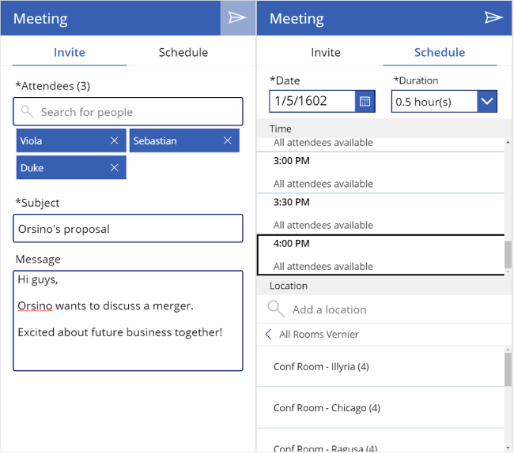

# Overview of the meeting-screen template in PowerApps

In a canvas app, add a meeting screen that lets users create and send a meeting invite from their Office 365 Outlook account. Users can search for attendees in their org and add external email addresses too. If your tenant has meeting rooms built into Outlook, users can select a location as well.

You can also add other template-based screens that show different data from Office 365, such as [email](email-screen-overview.md), [people](people-screen-overview.md) in an organization, and a user's [calendar](calendar-screen-overview.md).

This overview teaches you:
> [!div class="checklist"]
> * The high level functionality of the screen

For a deeper dive into this screen's default functionality, see the [meeting-screen reference](meeting-screen-reference.md).

## Prerequisite

Familiarity with how to add and configure screens and other controls as you [create an app in PowerApps](../data-platform-create-app-scratch.md).

## Default functionality

To add a meeting screen from the template:

1. [Sign in](http://web.powerapps.com?utm_source=padocs&utm_medium=linkinadoc&utm_campaign=referralsfromdoc) to PowerApps, and then create an app or open an existing app in PowerApps Studio.

    This topic shows a phone app, but the same concepts apply to a tablet app.

1. On the **Home** tab of the ribbon, select **New screen** > **Meeting**.

  When filled out, both tabs of the meeting screen will resemble this graphic:

  

A few helpful notes:

* The meeting screen allows an app user to create a meeting in Outlook.
  * Users can search for / add attendees, and optionally add a meeting room to the meeting.
* To search for users in your org, start typing their name in the text input box below "Attendees".
* When searching for people, only the top 15 results will be returned.
* To add email addresses for attendees outside your org, type out the full, valid email address and click the '+' icon that appears to the right of the email address.
* You must add at least one person as an attendee, provide a subject, and select a meeting time in the 'Schedule' tab to create the meeting.
* After you send the meeting, all of the selection contents will be cleared.
* The OnSelect statement of the send icon (upper right corner) contains this line: `Set(_myCalendarName, LookUp('Office365'.CalendarGetTables().value, DisplayName = "Calendar").Name);`
  * "Calendar" is the default display name for most office user's calendars. However this may not be the case in your org. If it's not, you can change "Calendar" to the appropriate term for your org.
* You will get an error if you try to schedule a meeting that occurs in the past.
* You will get an error if you add more than twenty people to a meeting.

## Next steps

* [View the reference documentation for this screen](./meeting-screen-reference.md)
* [Learn more about the Office365 Outlook connector in PowerApps](/connections/connection-office365-outlook.md)
* [Learn more about the Office365 Users connector in PowerApps](/connections/connection-office365-users.md)