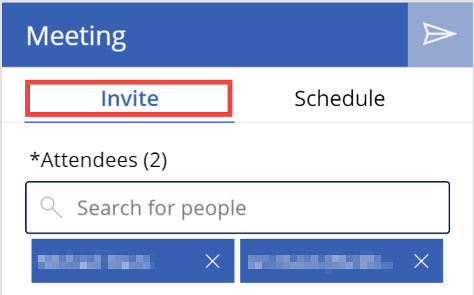
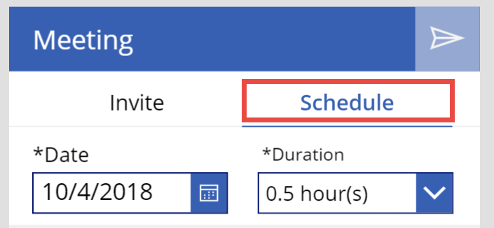
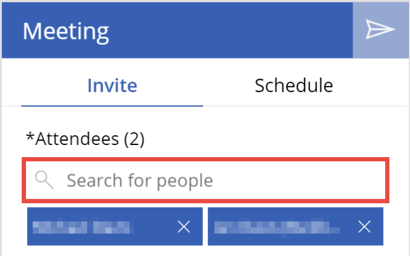
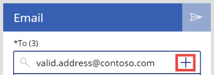
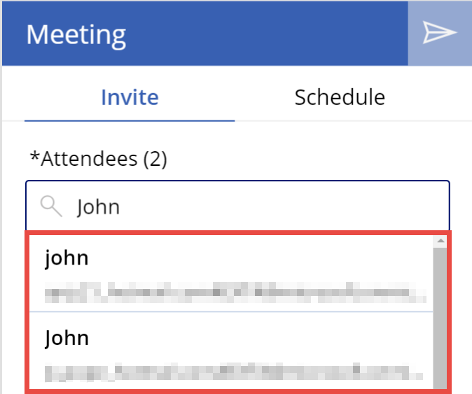
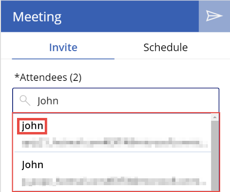

# Reference information about the email-screen template for canvas apps

For canvas apps in PowerApps, understand how each significant control in the meeting-screen template contributes to the screen's overall default functionality. This deep dive presents the behavior formulas and the values of other properties that determine how the controls respond to user input. For a high-level discussion of this screen's default functionality, see the [meeting-screen overview](meeting-screen-overview.md).

## Prerequisite

Familiarity with how to add and configure screens and other controls as you [create an app in PowerApps](../data-platform-create-app-scratch.md).

## Default functionality

To add a meeting screen from the template:

1. [Sign in](http://web.powerapps.com?utm_source=padocs&utm_medium=linkinadoc&utm_campaign=referralsfromdoc) to PowerApps, and then create an app or open an existing app in PowerApps Studio.

    This topic shows a phone app, but the same concepts apply to a tablet app.

1. On the **Home** tab of the ribbon, select **New screen** > **Meeting**.

  When filled out, both tabs of the meeting screen will resemble this graphic:

  

This topic explains the expressions or formulas to which various properties (such as **Items** and **OnSelect**) of significant controls are set. Those controls are presented in this order:

* [Invite tab (LblInviteTab)](#invite-tab)
* [Schedule tab (LblScheduleTab)](#schedule-tab)
* [Text search box](#text-search-box)
* [Add icon (AddIcon)](#add-icon)
* [People browse gallery](#people-browse-gallery) (+ child controls)
* [Meeting people gallery](#meeting-people-gallery) (+ child controls)
* [Meeting date picker (MeetingDateSelect)](#meeting-date-picker)
* [Meeting duration dropdown (MeetingDurationSelect)](#meeting-duration-dropdown)
* [Find meeting times gallery](#find-meeting-times-gallery) (+ child controls)
* [Room browse gallery](#room-browse-gallery) (+ child controls)
* [Back chevron (RoomsBackNav)](#back-chevron) (may not be visible if tenant doesn't have rooms lists)
* [Send icon](#send-icon)

## Invite tab

   

* Property: **Color**<br>
    Value: `If(_showDetails, LblRecipientCount.Color, RectQuickActionBar.Fill)`

    **_showDetails** is a variable used to determine whether the **LblInviteTab** control or the **LblScheduleTab** control is selected. If it's true, **LblScheduleTab** is selected, if false, **LblInviteTab** is. Thus, if **_showDetails** is true (this tab *isn't* selected), the tab color will match that of **LblRecipientCount**. Otherwise, it will match the fill value of **RectQuickActionBar**.

* Property: **OnSelect**<br> 
    Value: `Set(_showDetails, false)`

    Sets the **_showDetails** variable to false which means the contents of the Invite tab are visible, and the contents of the Schedule tab are hidden.

## LblScheduleTab

   

* Property: **Color**<br>
    Value: `If(!_showDetails, LblRecipientCount.Color, RectQuickActionBar.Fill)`

    **_showDetails** is a variable used to determine whether the **LblInviteTab** control or the **LblScheduleTab** control is selected. If it's true, **LblScheduleTab** is selected, if false, **LblInviteTab** is. Thus, if **_showDetails** is true (this tab *is* selected), the tab color will match the fill value of **RectQuickActionBar**. Otherwise, it will match the color value of **LblRecipientCount**.

* Property: **OnSelect**<br>
    Value: Set(_showDetails, true).

    Sets the **_showDetails** variable to true which means the contents of the Schedule tab are visible, and the contents of the Invite tab are hidden.

## Text search box

   

Several other controls in the screen have a dependency on this one:

* If a user starts typing any text, **PeopleBrowseGallery** becomes visible.
* If a user types out a valid email address, **AddIcon** becomes visible.
* When a user selects a person within **PeopleBrowseGallery** the search contents are reset.

## Add icon

   

This control allows users to add people who don't exist inside their org to the attendee list for the meeting being composed.

* Property: **Visible**<br>
    Value: 3 logical checks which all must evaluate to true for the control to be visible.

	```powerapps-dot
    !IsBlank(TextSearchBox.Text) &&
    IsMatch(TextSearchBox.Text, Match.Email) &&
    Not(Trim(TextSearchBox.Text) in MyPeople.UserPrincipalName)
	```

  Line by line this code block says that the **AddIcon** control will only be visible if:

  * The text in **TextSearchBox** contains something
  * The text in **TextSearchBox** is a valid email address
  * The text in **TextSearchBox** doesn't already exist in the MyPeople collection

* Property: **OnSelect**<br> 
    Value: A collect statement to add the user to the attendee list, another to refresh available meeting times, and several variable toggles.

	```powerapps-dot
	Collect( MyPeople,
        { 
			DisplayName: TextSearchBox.Text, 
			UserPrincipalName: TextSearchBox.Text, 
			Mail: TextSearchBox.Text
		}
	);
    Concurrent(
        Reset( TextSearchBox ),
        Set( _showMeetingTimes, false ),
        UpdateContext( {_loadMeetingTimes: true} ),
        Set( _selectedMeetingTime, Blank() ),
        Set( _selectedRoom, Blank() ),
        Set( _roomListSelected, false ),
        ClearCollect( MeetingTimes, 
			AddColumns(
				'Office365'.FindMeetingTimes(
        			{ 
						RequiredAttendees: Concat(MyPeople, UserPrincipalName & ";")
						MeetingDuration: MeetingDurationSelect.Selected.Minutes,
						Start: Text(DateAdd(MeetingDateSelect.SelectedDate, 8, Hours), UTC),
						End: Text(DateAdd(MeetingDateSelect.SelectedDate, 17, Hours), UTC),
						MaxCandidates: 15, 
						MinimumAttendeePercentage:1, 
						IsOrganizerOptional: false, 
						ActivityDomain: "Work"
					}
				).MeetingTimeSuggestions,
				"StartTime", MeetingTimeSlot.Start.DateTime, 
				"EndTime", MeetingTimeSlot.End.DateTime
			)
		)
	);
	UpdateContext({_loadingMeetingTimes: false});
	Set(_showMeetingTimes, true)
	```

  Selecting this adds the valid email address (it will only be visible if a valid email address is typed into **TextSearchBox**) to the **MyPeople** collection (this collection is the attendee list) and then refreshes the available meeting times with the new user entry.

  At a low level, this code block:
  * Collects the email address into the MyPeople collection, collecting the email address into the DisplayName, UserPrincipalName, and Mail fields.
  * Resets the contents of the **TextSearchBox** control
  * Sets the **_showMeetingTimes** variable to false. This variable controls the visibility of the **FindMeetingTimesGallery** which displays open times for the selected attendees to meet.
  * Sets the **_loadMeetingTimes** context variable to true. This variable sets a loading state which toggles the visibility of loading state controls like **_LblTimesEmptyState** to indicate to the user that their data is being loaded.
  * Sets **_selectedMeetingTime** to Blank(). **_selectedMeetingTime** is the selected record from the **FindMeetingTimesGallery** control. It is blanked here because the addition of another attendee may mean that the previous definition of **_selectedMeetingTime** may not be available for that attendee.
  * Sets **_selectedRoom** to Blank(). **_selectedRoom** is the selected room record from the **RoomBrowseGallery**. The room availabilities are determined from the value of **_selectedMeetingTime**. With that value blanked, the **_selectedRoom** value is no longer valid, so it must be blanked.
  * Sets **_roomListSelected** to false. This line may not be applicable to everyone. In Office, you can group your rooms by different 'Room Lists'. If you have 'Room Lists', this screen accounts for that, allowing you to first select a room list before selecting a room from within that list. The value of **_roomListSelected** is what determines whether a user (in a tenant with 'Room Lists' only) will be viewing rooms within a room list or the set of room lists. It's set to false to force users to re-select a new room list.
  * Uses the [Office365.FindMeetingTimes](https://docs.microsoft.com/en-us/connectors/office365/#find-meeting-times) operation to determine and collect the available meeting times for the attendees.
    * It passes the UserPrincipalName of each selected user into the *RequiredAttendees* parameter,
    * The **MeetingDurationSelect**.Selected.Minutes into the *MeetingDuration* parameter,
    * MeetingDateSelect.SelectedDate + 8 hours into the *Start* parameter. 8 hours is added because by default, the full date/time for the calendar control is 12:00 AM of the selected date. Presumably, you want to retrieve availabilities within normal working hours. A normal work start would be 8:00 AM
    * MeetingDateSelect.SelectedDate + 17 hours into the *End* parameter. 17 hours is added because 12:00 AM + 17 = 5:00 PM. A normal work end would be 5:00 PM.
    * 15 into the *MaxCandidates* parameter. This means the operation will only return the top 15 available times for the selected date. This makes sense because there are only sixteen 30 minute chunks in an 8 hour work day, and a 30 minute meeting is the minimum one can set in this screen.
    * 1 into the *MinimumAttendeePercentage* parameter. Essentially, unless no attendees are available, the meeting time will be retrieved.
    * false into the *IsOrganizerOptional* parameter. The app user is not an optional attendee for this meeting.
    * "Work" into the *ActivityDomain* parameter. This means the times retrieved will only be within a normal working time period.
  * The ClearCollect function also adds two columns: "StartTime" and "EndTime". This is to simplify the data returned. The field containing the available start and end times is the 'MeetingTimeSlot' field. This field is a record containing the 'Start' and 'End' records which themselves contain the DateTime and TimeZone values of their respective suggestion. Instead of attempting to retrieve this nesting of records, adding the "StartTime" and "EndTime" columns to the **MeetingTimes** collection brings those Start > DateTime and End > DateTime values to the surface of the collection.
  * Once these functions are all finished, the **_loadingMeetingTimes** variable is set to false, removing the loading state, and **_showMeetingTimes** is set to true, displaying the **FindMeetingTimesGallery**.

## People browse gallery

   

* Property: **Items**<br>
    Value: `If(!IsBlank(Trim(TextSearchBox.Text)), 'Office365Users'.SearchUser({searchTerm: Trim(TextSearchBox.Text), top: 15}))`

  * The items of this gallery are populated by search results from the [Office365.SearchUser](https://docs.microsoft.com/en-us/connectors/office365users/#searchuser) operation.
    * The operation takes the text in `Trim(TextSearchBox)` as its search term and returns the top 15 results based on that search.
  * **TextSearchBox** is wrapped in a Trim() function because a user search on spaces is invalid.
  * The `Office365Users.SearchUser` operation is wrapped in an `If(!IsBlank(Trim(TextSearchBox.Text)) ... )` function because retrieving search results before a user has searched is a performance waste.

### People browse gallery Title

   

* Property: **Text**<br>
    Value: `ThisItem.DisplayName`

    Displays the person's display name from their Office365 profile.

* Property: **OnSelect**<br>
    Value: A collect statement to add the user to the attendee list, another to refresh available meeting times, and several variable toggles.

    ```powerapps-dot
    Concurrent(
        Reset(TextSearchBox),
        Set(_selectedUser, ThisItem),
        If(Not(ThisItem.UserPrincipalName in MyPeople.UserPrincipalName), 
        	Collect(MyPeople, ThisItem); 
        	Concurrent(
            	Set(_showMeetingTimes, false),
            	UpdateContext({_loadMeetingTimes: true}),
            	Set(_selectedMeetingTime, Blank()),
            	Set(_selectedRoom, Blank()),
            	Set(_roomListSelected, false),
            
            	ClearCollect(MeetingTimes, 
					AddColumns(
						'Office365'.FindMeetingTimes(
            				{
								RequiredAttendees: Concat(MyPeople, UserPrincipalName & ";"),
								MeetingDuration: MeetingDurationSelect.Selected.Minutes,
            					Start: Text(DateAdd(MeetingDateSelect.SelectedDate, 8, Hours), UTC),
								End: Text(DateAdd(MeetingDateSelect.SelectedDate, 17, Hours), UTC),
            					MaxCandidates: 15, 
								MinimumAttendeePercentage: 1, 
								IsOrganizerOptional: false, 
								ActivityDomain: "Work"
							}
						).MeetingTimeSuggestions,
						"StartTime", MeetingTimeSlot.Start.DateTime, 
						"EndTime", MeetingTimeSlot.End.DateTime
					)
				)
        	);
            UpdateContext({_loadingMeetingTimes: false});
            Set(_showMeetingTimes, true)
        )
    )
    ```

    At a high level, selecting this control adds the person to the **MyPeople** collection (the app's storage of the attendee list), and refreshes the available meeting times based on the new user addition.

    Selecting this control is very similar to selecting the **AddIcon** control, the only difference being the `Set(_selectedUser, ThisItem) statement and the execution ordering of the operations. As such, this discussion will not be as deep. For a fuller explanation, read through the [AddIcon control section](#AddIcon-control).

    Selecting this control resets **TextSearchBox**. Then if the selection is not in the **MyPeople** collection it sets the **_loadMeetingTimes** state to true and the **_showMeetingTimes** state to false, blanks the **_selectedMeetingTime** and **_selectedRoom** variables, and refreshes the MeetingTimes collection with the new addition to the **MyPeople** collection. It then sets the **_loadMeetingTimes** state to false, and sets **_showMeetingTimes** to true. If the selection is already in the **MyPeople** collection it only resets the contents of **TextSearchBox**.

## Meeting people gallery

   

* Property: **Items**<br>
    Value: `MyPeople`

    The MyPeople collection is the collection of people initialized / added to by selecting the **PeopleBrowseGallery Title** control

* Property: **Height**<br>
    Value: Logic to allow the gallery to grow to a max height of 350.

	```powerapps-dot
	Min( 76 * RoundUp(CountRows(MeetingPeopleGallery.AllItems) / 2, 0),
      350
    )
	```

  * The height of this gallery adjusts to the number of items in the gallery to a maximum height of 350.
  * It takes 76 as the height of a single row of the MeetingPeopleGallery, then multiplies it by the number of rows. Since WrapCount = 2, the number of true rows is `RoundUp(CountRows(MeetingPeopleGallery.AllItems) / 2, 0)`.

* Property: **ShowScrollbar**<br>
    Value: `MeetingPeopleGallery.Height >= 350`

    When the max height of the gallery is reached (350), the scroll bar will be visible.

### Meeting people gallery Title

   

* Property: **OnSelect**<br>
    Value: `Set(_selectedUser, ThisItem)`
  * Sets the **_selectedUser** variable to the item selected in the **MeetingPeopleGallery**.

### Meeting people gallery iconRemove

   

* Property: **OnSelect**<br>
    Value: A remove statement to remove the user from the attendee list, a collect statement to refresh available meeting times, and several variable toggles.

	```powerapps-dot
    Remove(MyPeople, LookUp(MyPeople, UserPrincipalName = ThisItem.UserPrincipalName));
    Concurrent(
        Reset(TextSearchBox),
        Set(_showMeetingTimes, false),
        UpdateContext({_loadMeetingTimes: true}),
        Set(_selectedMeetingTime, Blank()),
        Set(_selectedRoom, Blank()),
        Set(_roomListSelected, false),
        ClearCollect(MeetingTimes, 
			AddColumns(
				'Office365'.FindMeetingTimes(
        			{
						RequiredAttendees:Concat(MyPeople, UserPrincipalName & ";"), 
						MeetingDuration:MeetingDurationSelect.Selected.Minutes,
        				Start:Text(DateAdd(MeetingDateSelect.SelectedDate, 8, Hours), UTC), 
						End:Text(DateAdd(MeetingDateSelect.SelectedDate, 17, Hours), UTC),
        				MaxCandidates:15, 
						MinimumAttendeePercentage:1, 
						IsOrganizerOptional: false, 
						ActivityDomain: "Work"}
				).MeetingTimeSuggestions,
				"StartTime", MeetingTimeSlot.Start.DateTime, 
				"EndTime", MeetingTimeSlot.End.DateTime
			)
		)
    );
    UpdateContext({_loadingMeetingTimes: false});
    Set(_showMeetingTimes, true)
	```

  At a high level, selecting this control removes the person from the attendee list, and refreshes the available meeting times based on the removal of this person.

  After the first line, selecting this control is almost identical to selecting the **AddIcon** control.  As such, this discussion will not be as deep. For a fuller explanation, read through the [AddIcon control section](#AddIcon-control).

  In the first line, the selected item is removed from the MyPeople collection. Selecting this control resets **TextSearchBox**, then removes the selection from the **MyPeople** collection. It sets the **_loadMeetingTimes** state to true and the **_showMeetingTimes** state to false, blanks the **_selectedMeetingTime** and **_selectedRoom** variables, and refreshes the MeetingTimes collection with the new addition to the **MyPeople** collection. It then sets the **_loadMeetingTimes** state to false, and sets **_showMeetingTimes** to true.

## Meeting date picker

   

* Property: **DisplayMode**<br>
    Value: `If(IsEmpty(MyPeople), DisplayMode.Disabled, DisplayMode.Edit)`

    A date for a meeting cannot be chosen until at least 1 attendee has been added to the **MyPeople** collection.

* Property: **OnChange**<br>
    Value: `Select(MeetingDateSelect)`

    Changing the selected date triggers the code in the OnSelect property of this control to run.

* Property: **OnSelect**<br>
    Value: A collect statement to refresh available meeting times, and several variable toggles.
  
	```powerapps-dot
	Concurrent(
    	Reset(TextSearchBox),
	    Set(_showMeetingTimes, false),
	    UpdateContext({_loadingMeetingTimes: true}),
	    Set(_selectedMeetingTime, Blank()),
	    Set(_selectedRoom, Blank()),
	    Set(_roomListSelected, false),
    	ClearCollect(MeetingTimes, 
			AddColumns(
				'Office365'.FindMeetingTimes(
    				{RequiredAttendees:Concat(MyPeople, UserPrincipalName & ";"), 
					MeetingDuration:MeetingDurationSelect.Selected.Minutes,
    				Start:Text(DateAdd(MeetingDateSelect.SelectedDate, 8, Hours), UTC), 
					End:Text(DateAdd(MeetingDateSelect.SelectedDate, 17, Hours), UTC),
    				MaxCandidates:15, 
					MinimumAttendeePercentage:1, 
					IsOrganizerOptional: false, 
					ActivityDomain: "Work"}
				).MeetingTimeSuggestions,
				"StartTime", MeetingTimeSlot.Start.DateTime, 
				"EndTime", MeetingTimeSlot.End.DateTime
			)
		)
	);
	UpdateContext({_loadingMeetingTimes: false});
	Set(_showMeetingTimes, true)
	```

  At a high level, selecting this control refreshes the available meeting times. It is valuable because if a user changes the date, the available meeting times will need to update to reflect the attendees availabilities for that day.

  * With the exception of the initial `Collect` statement, this is identical to the OnSelect functionality of the **AddIcon** control. As such, this discussion will not be as deep. For a fuller explanation, read through the [AddIcon control section](#AddIcon-control).

  Selecting this control resets **TextSearchBox**. It sets the **_loadMeetingTimes** state to true and the **_showMeetingTimes** state to false, blanks the **_selectedMeetingTime** and **_selectedRoom** variables, and refreshes the MeetingTimes collection with the new date selection. It then sets the **_loadMeetingTimes** state to false, and sets **_showMeetingTimes** to true.

## Meeting duration dropdown

   

* Property: **DisplayMode**<br>
    Value: `If(IsEmpty(MyPeople), DisplayMode.Disabled, DisplayMode.Edit)`

    A duration for a meeting cannot be chosen until at least 1 attendee has been added to the **MyPeople** collection.

* Property: **OnChange**<br>
    Value: `Select(MeetingDateSelect1)`

    Changing the selected duration triggers the code in the OnSelect property of the **MeetingDateSelect** control to run.

## Find meeting times gallery (+ child controls)

   

* Property: **Items**<br>
    Value: `MeetingTimes`

    The collection of potential meeting times retrieved from the [Office365.FindMeetingTimes](https://docs.microsoft.com/en-us/connectors/office365/#find-meeting-times) operation

* Property: **Visible**<br>
    Value: `_showMeetingTimes && _showDetails && !IsEmpty(MyPeople)`

    The gallery is only visible if _showMeetingTimes is set to true, the user has selected the **LblScheduleTab** control, and there is at least 1 attendee added to the meeting

### Find meeting times gallery Title

   

* Property: **Text**<br>
    Value: A conversion of the start time to be displayed in the user's local time.

	```powerapps-dot
  Text(
      DateAdd(
          DateTimeValue(ThisItem.StartTime),
          -TimeZoneOffset(), Minutes
      ),
      DateTimeFormat.ShortTime
  )
	```

  * The retrieved value of StartTime is in UTC format. To [convert from UTC to local time](../functions/function-dateadd-datediff.md#converting-from-utc), the DateAdd function is applied.
  * The [Text function](../functions/function-text.md#datetime) takes a date/time as its first argument, and formats it based on its second argument. You pass it the local time conversion of ThisItem.StartTime, and display it as DateTimeFormat.ShortTime

* Property: **OnSelect**<br>
    Value:  Several collect statements to gather meeting rooms, and their suggested availabilities, as well as several variable toggles.

	```powerapps-dot
	Set(_selectedMeetingTime, ThisItem);
	UpdateContext({_loadingRooms: true});
  
	If(IsEmpty(RoomsLists),
		ClearCollect(RoomsLists, 'Office365'.GetRoomLists().value));
	If(CountRows(RoomsLists) <= 1,
		Set(_noRoomLists, true);
		ClearCollect(AllRooms, 'Office365'.GetRooms().value);
		Set(_allRoomsConcat, Concat(FirstN(AllRooms, 20), Address & ";"));
		ClearCollect(RoomTimeSuggestions, 
			'Office365'.FindMeetingTimes(
				{RequiredAttendees: _allRoomsConcat, 
				MeetingDuration: MeetingDurationSelect.Selected.Minutes,
 				Start: _selectedMeetingTime.StartTime & "Z", 
				End: _selectedMeetingTime.EndTime & "Z", 
				MinimumAttendeePercentage: "1",
				IsOrganizerOptional: "false", 
				ActivityDomain: "Unrestricted"}
			).MeetingTimeSuggestions);
		ClearCollect(AvailableRooms, 
			AddColumns(
				AddColumns(
					Filter(First(RoomTimeSuggestions).AttendeeAvailability, Availability="Free"), 
					"Address", Attendee.EmailAddress.Address), 
				"Name", LookUp(AllRooms, Address = Attendee.EmailAddress.Address).Name)
			);
		ClearCollect(AvailableRoomsOptimal, 
			DropColumns(
				DropColumns(AvailableRooms, "Availability"), "Attendee")
			),
		Set(_roomListSelected, false));
	UpdateContext({_loadingRooms: false})
	```

  At a high level, for users that don't have rooms lists, this code block gathers available rooms based on the selected date/time for the meeting. Otherwise it simply retrieves the rooms lists.

  At a low level this code block:
  * Sets **_selectedMeetingTime** to the selected item. This will be used to find what rooms are available during that time
  * Sets the loading state variable **_loadingRooms** to true, turning the loading state on.
  * If the **RoomsLists** collection is empty, it retrieves the user's tenant's rooms lists and stores them in the **RoomsLists** collection.
  * If the user has 0 or 1 room list:
    * The **noRoomLists** variable is set to true, this variable is used to determine the items displayed in the **RoomBrowseGallery** control.
    * The `Office365.GetRooms()` operation is used to retrieve the first 100 rooms in their tenant. These are stored in the **AllRooms** collection.
    * The **_allRoomsConcat** variable is set to a semicolon separated string of the first 20 email addresses of the rooms in the **AllRooms** collection. This is because the [Office365.FindMeetingTimes](https://docs.microsoft.com/en-us/connectors/office365/#find-meeting-times) is limited to searching for the available times of 20 person objects in a single operation.
    * The **RoomTimeSuggestions** collection uses the [Office365.FindMeetingTimes](https://docs.microsoft.com/en-us/connectors/office365/#find-meeting-times) to retrieve the availabilities of the first twenty rooms in the **AllRooms** collection based on the time values from the **_selectedMeetingTime** variable. Note that the `& "Z"` is to properly format the DateTime value.
    * The **AvailableRooms** collection is created. This is simply the **RoomTimeSuggestions** collection of attendee availabilities with 2 additional columns added to it: "Address" and "Name". "Address" is the email address of the room and "Name" is the name of the room.
    * Then, the **AvailableRoomsOptimal** collection is created. This is just the **AvailableRooms** collection with the "Availability" and "Attendee" columns removed. Doing this matches the schemas of **AvailableRoomsOptimal** and **AllRooms**. This allows you to use both collections in the **Items** property of the **RoomBrowseGallery**.
    * _roomListSelected is set to false.
  * The loading state, **_loadingRooms** is set to false once everything else has finished executing.

## Room browse gallery

   

* Property: **Items**<br>
    Value: Logically set to two internal collections of identical schema depending on if user has selected a room list or has rooms lists in their tenant.

	```powerapps-dot
  Search(
      If(_roomListSelected || _noRoomLists, AvailableRoomsOptimal, RoomsLists),
      Trim(TextMeetingLocation1.Text), "Name", "Address")
	```

  This gallery will display the **AvailableRoomsOptimal** collection if **_roomListSelected** or **_noRoomLists** is true. Otherwise it will display the **RoomsLists** collection. This can be done because the schema of these collections are identical.

* Property: **Visible**<br>
    Value: ```_showDetails && !IsBlank(_selectedMeetingTime) && !_loadingRooms```

    The gallery is only visible if the three statements above evaluate to true.

### RoomBrowseGallery Title

   

* Property: **OnSelect**<br>
    Value: A set of logically bound `Collect` and `Set` statements which are may or may not be triggered depending on if the user is viewing room lists or rooms.

	```powerapps-dot
	UpdateContext( {_loadingRooms: true} );
	If( !_roomListSelected && !noRoomLists,
		Set( _roomListSelected, true );
		Set( _selectedRoomList, ThisItem.Name );
		ClearCollect( AllRooms, 'Office365'.GetRoomsInRoomList(ThisItem.Address).value );
		Set( _allRoomsConcat, Concat(FirstN(AllRooms, 20), Address & ";") );
		ClearCollect( RoomTimeSuggestions, 
			'Office365'.FindMeetingTimes(
				{
					RequiredAttendees: _allRoomsConcat, 
					MeetingDuration: MeetingDurationSelect.Selected.Minutes,
     				Start: _selectedMeetingTime.StartTime & "Z", 
					End: _selectedMeetingTime.EndTime & "Z", 
					MinimumAttendeePercentage: "1",
					IsOrganizerOptional: "false", 
					ActivityDomain: "Unrestricted"
				}
			).MeetingTimeSuggestions
		);
		ClearCollect( AvailableRooms, 
			AddColumns(
				AddColumns(
					Filter(
						First( RoomTimeSuggestions ).AttendeeAvailability, 
						Availability = "Free"
					),
     				"Address", Attendee.EmailAddress.Address ), 
				"Name", LookUp( AllRooms, Address = Attendee.EmailAddress.Address ).Name
			)
		);
		ClearCollect( AvailableRoomsOptimal, 
			DropColumns(
				DropColumns( AvailableRooms, "Availability" )
			), 
			"Attendee" )
		),
		Set(_selectedRoom, ThisItem)
	);
	UpdateContext( {_loadingRooms: false} )
	```

  The actions that occur when selecting this are dependent upon if a user is currently viewing a set of room lists or a set of rooms. If it's the former, then selecting this will retrieve the rooms that are available in the selected time for the selected room list. If it's the latter, selecting this will set the **_selectedRoom** variable to the selected item. This statement is very similar to the select statement for [**FindMeetingTimesGallery Title**](#findMeetingTimesGallery-title).

  At a low level, this code block:
  * Turns the loading state for the rooms on by setting **_loadingRooms** to true.
  * Checks to see if a room list has been selected and if the tenant has room lists. If so:
    * Sets **_roomListSelected** to true and sets **_selectedRoomList** to the selected item.
    * The **_allRoomsConcat** variable is set to a semicolon separated string of the first 20 email addresses of the rooms in the **AllRooms** collection. This is because the [Office365.FindMeetingTimes](https://docs.microsoft.com/en-us/connectors/office365/#find-meeting-times) operation is limited to searching for the available times of 20 person objects in a single operation.
    * The **RoomTimeSuggestions** collection uses the [Office365.FindMeetingTimes](https://docs.microsoft.com/en-us/connectors/office365/#find-meeting-times) operation to retrieve the availabilities of the first twenty rooms in the **AllRooms** collection based on the time values from the **_selectedMeetingTime** variable. Note that the `& "Z"` is to properly format the DateTime value.
    * The **AvailableRooms** collection is created. This is simply the **RoomTimeSuggestions** collection of attendee availabilities with 2 additional columns added to it: "Address" and "Name". "Address" is the email address of the room and "Name" is the name of the room.
    * Then, the **AvailableRoomsOptimal** collection is created. This is just the **AvailableRooms** collection with the "Availability" and "Attendee" columns removed. Doing this matches the schemas of **AvailableRoomsOptimal** and **AllRooms**. This allows you to use both collections in the **Items** property of the **RoomBrowseGallery**.
    * _roomListSelected is set to false.
  * The loading state, **_loadingRooms** is set to false once everything else has finished executing.

## Back chevron

   

* Property: **Visible**<br>
    Value: `_roomListSelected && _showDetails`

    This will only be visible if both a room list has been selected and the Schedule tab is selected.

* Property: **OnSelect**<br>
    Value: `Set(_roomListSelected, false)`

    When **_roomListSelected** is set to false, it changes the **RoomBrowseGallery** control to display items from the RoomsLists collection.

## Send icon

   

* Property: **DisplayMode**<br>
    Value: Logic to force user to input certain meeting details before the icon becomes editable.

	```powerapps-dot
	If( Len(Trim(TextMeetingSubject1.Text)) > 0
		&& !IsEmpty(MyPeople) && !IsBlank(_selectedMeetingTime),
		DisplayMode.Edit, DisplayMode.Disabled
	)
	```

  * The icon is only selectable if the meeting subject is filled out, there are greater than 0 attendees for the meeting, and a meeting time has been selected. Otherwise it will be disabled.

* Property: **OnSelect**
    Value: Code to send the meeting invite out to your selected attendees and clear all the input fields.

	```powerapps-dot
	Set(_myCalendarName, LookUp('Office365'.CalendarGetTables().value, DisplayName = "Calendar").Name);
	Set(_myScheduledMeeting, 
		'Office365'.V2CalendarPostItem(_myCalendarName,
			TextMeetingSubject1.Text, 
			Text(DateAdd(DateTimeValue(_selectedMeetingTime.StartTime), -TimeZoneOffset(), Minutes)),
			Text(DateAdd(DateTimeValue(_selectedMeetingTime.EndTime), -TimeZoneOffset(), Minutes)),
			{
				RequiredAttendees: Concat(MyPeople, UserPrincipalName & ";") & _selectedRoom.Address, 
				Body: TextMeetingMessage1.Text, 
				Location: _selectedRoom.Name, 
				Importance: "Normal", 
				ShowAs: "Busy", 
				ResponseRequested: true
			}
		)
	);
	Concurrent(
    	Reset(TextMeetingLocation1),
    	Reset(TextMeetingSubject1),
    	Reset(TextMeetingMessage1),
    	Clear(MyPeople),
    	Set(_selectedMeetingTime, Blank()),
    	Set(_selectedRoomList, Blank()),
    	Set(_selectedRoom, Blank()),
    	Set(_roomListSelected, false)
	)
	```
  
  At a low level, this code block:
  * Sets _myCalendarName to the calendar in the [Office365.CalendarGetTables()](https://docs.microsoft.com/en-us/connectors/office365/#get-calendars) operation with a DisplayName of "Calendar".
  * Schedules the meeting with all of the input values from the various selections the user made throughout the screen using the [Office365.V2CalendarPostItem](https://docs.microsoft.com/en-us/connectors/office365/#create-event--v2-) operation.
  * Resets all of the input fields and variables used in creating the meeting.

> [!Note]
> Depending on your region, the calendar you want may not have a display name of "Calendar". Go to Outlook to see what the title of your calendar is, and make the appropriate change in the app.

## Next steps

* [Learn more about this screen](./meeting-screen-overview.md)
* [Learn more about the Office365 Outlook connector in PowerApps](/connections/connection-office365-outlook.md)
* [Learn more about the Office365 Users connector in PowerApps](/connections/connection-office365-users.md)
