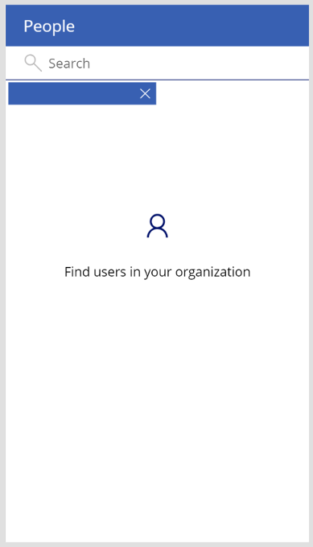
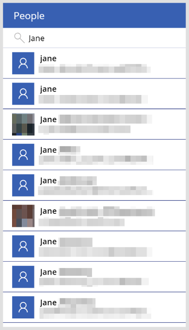

# Overview of the people screen template in PowerApps

In a canvas app, add a people screen that lets users search for people within their organization. Users can search for, select, and add people to a collection. You can change which types of data appear in the search result gallery, use your people selections to send an email, and make other customizations.

You can also add other template-based screens that show different data from Office 365, such as [email](email-screen-overview.md), a user's [calendar](calendar-screen-overview.md), and [availability](meeting-screen-overview.md) of people whom you want to invite to a meeting.

This overview teaches you:
> [!div class="checklist"]
> * The high level functionality of the people screen
> * How to modify the screen
> * How to integrate the screen into apps

For a deeper dive into this screen's default functionality, see the [people-screen reference](people-screen-reference.md).

## Prerequisite

Familiarity with how to add and configure screens and other controls as you [create an app in PowerApps](../data-platform-create-app-scratch.md).

## Default functionality

To add a people screen from the template:

1. [Sign in](http://web.powerapps.com?utm_source=padocs&utm_medium=linkinadoc&utm_campaign=referralsfromdoc) to PowerApps, and then create an app or open an existing app in PowerApps Studio.

    This topic shows a phone app, but the same concepts apply to a tablet app.

1. On the **Home** tab of the ribbon, select **New screen** > **People**.

    By default, the screen resembles this graphic:

    

1. To start searching for users, select the text input box at the top and start typing a co-worker's name. The search results will appear below:

    

1. When you select individuals from the search results, they are added to the **MyPeople** collection, and the search bar input value is reset, revealing the collection of people you've selected:

    

A few helpful notes:

* The people screen allows an app user to search for, view, and add people from their org to an app level collection.

## Modify the screen

You can modify the default functionality of this screen in a few common ways:

* [Show different data for people](people-screen-overview.md#show-different-data-for-people)

If you want to modify the screen further, use the [people-screen reference](./people-screen-reference.md) as a guide.

### Show different data for people

This screen uses the [Office365Users.SearchUser](https://docs.microsoft.com/en-us/connectors/office365users/#searchuser) operation to search for users in your org. It provides additional fields for each event beyond what is displayed in the **UserBrowseGallery** control. Adding or changing fields in the gallery is a simple process.

1. In the **UserBrowseGallery**, select a label to modify (or add one and keep it selected).

1. With its **Text** property selected, in the formula bar, replace the contents with `ThisItem.`

    Intellisense shows a list of fields that you can select.

1. Select the field that you want.

    The **Text** property should update to `ThisItem.{FieldSelection}`.

## Integrate the screen into an app

The people screen is a powerful bundle of controls in its own right, but it usually performs best as part of a larger, more versatile app. You can integrate this screen into a larger app in a number of ways, including:

* [Using your cached list of people](people-screen-overview.md#using-your-cached-list-of-people)

### Using your cached list of people

The people screen caches your person selections in the **MyPeople** collection. Should your business scenario call for a person lookup, you will have to know how to use this collection. Here, you'll walk through how to connect this screen to a rudimentary email screen, and send emails to users in the **MyPeople** collection. In doing so, you'll also gain insight into how the [email-screen](./email-screen-overview.md) works.

1. Add the Office 365 Outlook data source to your app: On the ribbon select **View** > **Data sources** > **Add data source** and look for the Office 365 Outlook connector
    * You may have to select **New connection** to find it.
1. After inserting the people screen, insert a new blank screen. Within the screen, add a back arrow icon, two text input boxes, and a send icon.
1. Rename the screen to **EmailScreen**, the back icon to **BackIcon**, one text input box to **SubjectLine**, the other to **MessageBody**, and the send icon to **SendIcon**.
1. Set the **OnSelect** property of the **BackIcon** to `Back()`.
1. Set the **OnSelect** property of the **SendIcon** to this formula:

    ```powerapps-dot
    Office365.SendEmail( 
        Concat( MyPeople, UserPrincipalName & ";" ), 
        SubjectLine.Text, 
        MessageBody.Text 
    )
    ```
    
    * Here, you're using the Outlook connector to send an email. You pass it `Concat(MyPeople, UserPrincipalName & ";")` as the list of recipients. This takes the **MyPeople** collection, and, for every row in that collection, combines all of their UserPrincipalName (email address) fields together into a single string with semicolons separating them. This is no different than writing out a string of email addresses separated by semicolons in the "to" line of your favorite email client.
    * You're passing SubjectLine.Text as the subject of the message, and MessageBody.Text as the body of the message.
1. On the people screen, in the top right corner, insert the mail icon.
    * Change the icon color to whatever suits you.
1. Set the OnSelect property of the send icon to `Navigate( EmailScreen, None )`
1. You now have a two screen app where you can select users, then compose and send an email message to them. Feel free to test it out, but be careful because it will send emails to whomever you add to the MyPeople collection.

## Next steps

* [View the reference documentation for this screen](./people-screen-reference.md)
* [Learn more about the Office365 Outlook connector in PowerApps](../connections/connection-office365-outlook.md)
* [Learn more about the Office365 Users connector in PowerApps](../connections/connection-office365-users.md)
