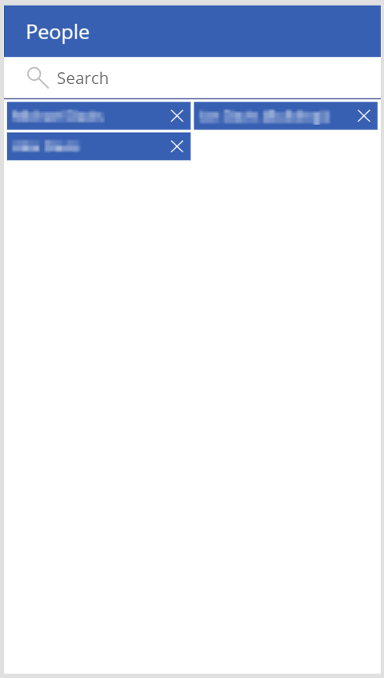
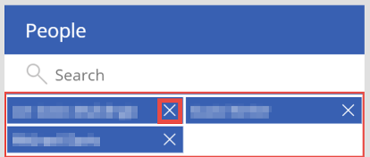

# Reference information about the people-screen template for canvas apps

For canvas apps in PowerApps, understand how each significant control in the people-screen template contributes to the screen's overall default functionality. This deep dive presents the behavior formulas and the values of other properties that determine how the controls respond to user input. For a high-level discussion of this screen's default functionality, see the [people-screen overview](people-screen-overview.md).

## Prerequisite

Familiarity with how to add and configure screens and other controls as you [create an app in PowerApps](../data-platform-create-app-scratch.md).

## Default functionality

To add a people screen from the template:

1. [Sign in](http://web.powerapps.com?utm_source=padocs&utm_medium=linkinadoc&utm_campaign=referralsfromdoc) to PowerApps, and then create an app or open an existing app in PowerApps Studio.

    This topic shows a phone app, but the same concepts apply to a tablet app.

1. On the **Home** tab of the ribbon, select **New screen** > **People**.

    By default, the screen resembles this graphic:

    

1. To start searching for users, select the text input box at the top and start typing a co-worker's name. The search results will appear below:

    

1. When you select individuals from the search results, they are added to the **MyPeople** collection, and the search bar input value is reset, revealing the collection of people you've selected:

    

This topic explains the expressions or formulas to which various properties (such as **Items** and **OnSelect**) of significant controls are set. Those controls are presented in this order:

* [Text search box](#text-search-box)
* [User browse gallery](#user-browse-gallery) (+ child controls)
* [People added gallery](#people-added-gallery) (+ child controls)

## Text search box


A couple other controls interact or have a dependency on this one:

* If a user starts typing any text, **UserBrowseGallery** becomes visible.
* When a user selects a person within **UserBrowseGallery** the search contents are reset.

## User browse gallery


* Property: **Items**<br>
    Value: Logic to lookup users when the user starts typing.
    `If(!IsBlank(Trim(TextSearchBox.Text)), 'Office365Users'.SearchUser({searchTerm: Trim(TextSearchBox.Text), top: 15}))`

  * The items of this gallery are populated by search results from the [Office365.SearchUser](https://docs.microsoft.com/en-us/connectors/office365users/#searchuser) operation.
  * The operation takes the text in Trim(**TextSearchBox**) as its search term and returns the top 15 results based on that search.
  * **TextSearchBox** is wrapped in a Trim() function because a user search on spaces should be invalid.
  * The `Office365Users.SearchUser` operation is wrapped in an `If(!IsBlank(Trim(TextSearchBox.Text)) ... )` function because you only want to call the operation when the search box has user entered text. Otherwise it will be a performance waste.

### UserBrowseGallery Title control


* Property: **Text**<br>Value: `ThisItem.DisplayName`

  * Displays the person's display name from their Office365 profile.

* Property: **OnSelect**<br>
    Value: Code to add the user to an app level collection, and select the user.

    ```powerapps-dot
    Concurrent(
        Set(_selectedUser, ThisItem),
        Reset(TextSearchBox),
        If(Not(ThisItem.UserPrincipalName in MyPeople.UserPrincipalName), Collect(MyPeople, ThisItem))
    )
    ```
    * Selecting this control does 3 things concurrently:

      1. Sets the **_selectedUser** variable to the item selected.
      1. Resets the search term in **TextSearchBox**.
      1. Adds the selected item to the **MyPeople** collection, a collection of all the people the app user has selected.

### User browse gallery ProfileImage control


* Property: **Image**<br>
    Value: Logic to retrieve a user's profile photo.
    `If(!IsBlank(ThisItem.Id) && 'Office365Users'.UserPhotoMetadata(ThisItem.Id).HasPhoto, 'Office365Users'.UserPhoto(ThisItem.Id))`

    * The image control retrieves the user's image with the [Office365Users.UserPhoto](https://docs.microsoft.com/en-us/connectors/office365users/#get-user-photo--v1-) operation. However, before doing that, it checks for two things:
  
    1. If the Id field is not empty.
      * This prevents the image from attempting to retrieve a user photo before the gallery has been populated with any search results.
    1. If the user has a photo (with the [Office365Users.UserPhotoMetadata](https://docs.microsoft.com/en-us/connectors/office365users/#get-user-photo-metadata) operation).
      * This prevents the `Office365Users.UserPhoto` lookup from returning an exception if the user doesn't have a profile picture.

Note that if an image isn't retrieved, the image control is blank, and the **iconUser** control will be visible in its stead.

## People added gallery


* Property: **Items**<br>
    Value: `MyPeople`

  * This is the collection of people initialized / added to by selecting the **UserBrowseGallery Title** control.

### PeopleAddedGallery Title control


* Property: **OnSelect**<br>
    Value: `Set(_selectedUser, ThisItem)`

  * Sets the **_selectedUser** variable to the item selected in the **EmailPeopleGallery**.

### People added gallery iconRemove



* Property: **OnSelect**<br>
    Value: `Remove(MyPeople, LookUp(MyPeople, UserPrincipalName = ThisItem.UserPrincipalName))`

  * Looks up the record in the **MyPeople** collection where the UserPrincipalName matches the UserPrincipalName of the selected item, and removes that record from the collection.

## Next steps

* [Learn more about this screen](./people-screen-overview.md)
* [Learn more about the Office365 Outlook connector in PowerApps](../connections/connection-office365-outlook.md)
* [Learn more about the Office365 Users connector in PowerApps](../connections/connection-office365-users.md)
