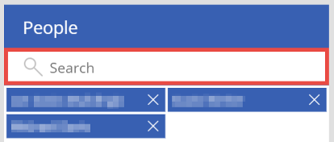
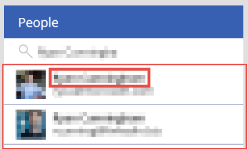
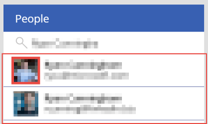
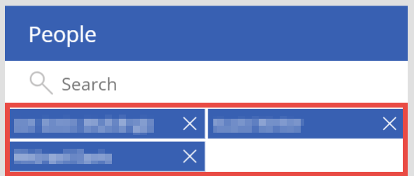

# Reference information about the people-screen template for canvas apps

For canvas apps in Power Apps, understand how each significant control in the people-screen template contributes to the screen's overall default functionality. This deep dive presents behavior formulas and the values of other properties that determine how the controls respond to user input. For a high-level discussion of this screen's default functionality, see the [people-screen overview](people-screen-overview.md).

This topic highlights some significant controls and explains the expressions or formulas to which various properties (such as **Items** and **OnSelect**) of these controls are set:

* [Text search box](#text-search-box)
* [User-browse gallery](#user-browse-gallery) (+ child controls)
* [People added gallery](#people-added-gallery) (+ child controls)

## Prerequisite

Familiarity with how to add and configure screens and other controls as you [create an app in PowerApps](../data-platform-create-app-scratch.md).

## Text search box



A couple other controls interact or have a dependency on the text search box:

* If a user starts typing any text, **UserBrowseGallery** becomes visible.
* When a user selects a person within **UserBrowseGallery**, the search contents are reset.

## User-browse gallery


* Property: **Items**<br>
    Value: Logic to look up users when the user starts typing:
    
    ```powerapps-dot
    If( !IsBlank( Trim( TextSearchBox.Text ) ), 
        'Office365Users'.SearchUser(
            {
                searchTerm: Trim( TextSearchBox.Text ), 
                top: 15
            }
        )
    )
    ```
    
The items of this gallery are populated by search results from the [Office365.SearchUser](https://docs.microsoft.com/connectors/office365users/#searchuser) operation. The operation takes the text in `Trim(TextSearchBox)` as its search term and returns the top 15 results based on that search. **TextSearchBox** is wrapped in a `Trim()` function because a user search on spaces is invalid.

The `Office365Users.SearchUser` operation is wrapped in an `If(!IsBlank(Trim(TextSearchBox.Text)) ... )` function because you only need to call the operation when the search box contains user-entered text. This improves performance.

### UserBrowseGallery Title control



* Property: **Text**<br>Value: `ThisItem.DisplayName`

  Displays the person's display name from their Office 365 profile.

* Property: **OnSelect**<br>
    Value: Code to add the user to an app-level collection, and then select the user:

    ```powerapps-dot
    Concurrent(
        Set( _selectedUser, ThisItem ),
        Reset( TextSearchBox ),
        If( Not( ThisItem.UserPrincipalName in MyPeople.UserPrincipalName ), 
            Collect( MyPeople, ThisItem )
        )
    )
    ```
Selecting this control does three things concurrently:

   * Sets the **\_selectedUser** variable to the item selected.
   * Resets the search term in **TextSearchBox**.
   * Adds the selected item to the **MyPeople** collection, a collection of all the people the app user has selected.

### UserBrowseGallery ProfileImage control



* Property: **Image**<br>
    Value: Logic to retrieve a user's profile photo.

    ```powerapps-dot
    If( !IsBlank( ThisItem.Id ) && 
            'Office365Users'.UserPhotoMetadata( ThisItem.Id ).HasPhoto,
        'Office365Users'.UserPhoto( ThisItem.Id )
    )
    ```

The **Image** control retrieves the user's image with the [Office365Users.UserPhoto](https://docs.microsoft.com/connectors/office365users/#get-user-photo--v1-) operation. However, before doing that, it checks for two things:
  
   * Whether the ID field is empty or not empty. This prevents the **Image** control from trying to retrieve a user photo before the gallery has been populated with search results.
   * Whether the user has a photo (with the [Office365Users.UserPhotoMetadata](https://docs.microsoft.com/connectors/office365users/#get-user-photo-metadata) operation). This prevents the `Office365Users.UserPhoto` lookup from returning an exception if the user doesn't have a profile picture.

Note that if an image isn't retrieved, the **Image** control is blank, and the **iconUser** control is visible instead.

## People-added gallery



* Property: **Items**<br>
    Value: `MyPeople`

This is the collection of people initialized or added to by selecting the **UserBrowseGallery Title** control.

### PeopleAddedGallery Title control


* Property: **OnSelect**<br>
    Value: `Set( _selectedUser, ThisItem )`

Sets the **_selectedUser** variable to the item selected in **EmailPeopleGallery**.

### PeopleAddedGallery iconRemove control


* Property: **OnSelect**<br>
    Value: `Remove( MyPeople, LookUp( MyPeople, UserPrincipalName = ThisItem.UserPrincipalName ) )`

Looks up the record in the **MyPeople** collection, where **UserPrincipalName** matches the **UserPrincipalName** of the selected item, and then removes that record from the collection.

## Next steps

* [Learn more about this screen](./people-screen-overview.md).
* [Learn more about the Office 365 Outlook connector](../connections/connection-office365-outlook.md).
* [Learn more about the Office 365 Users connector](../connections/connection-office365-users.md).
