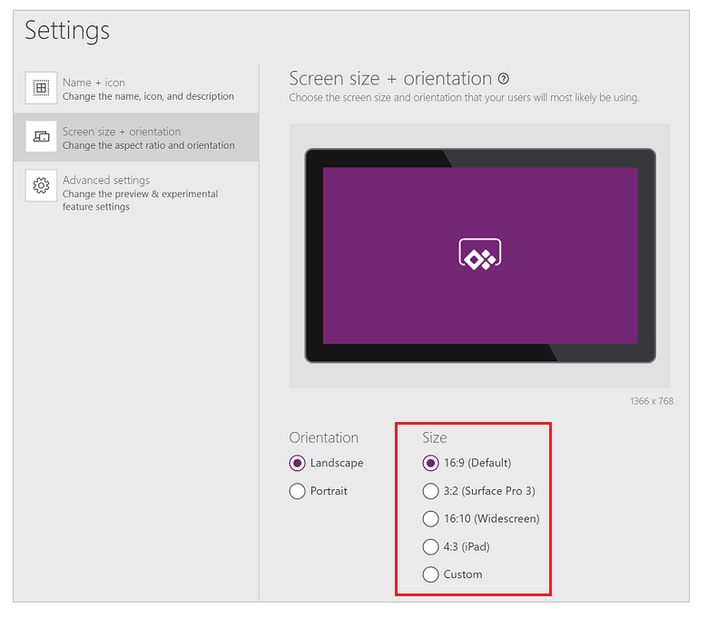

# Change screen size and orientation of a canvas app in PowerApps
Customize a canvas app by changing its screen size and orientation.

## Prerequisites
1. Create an app, or open one for editing.

2. On the **File** menu, select **App settings**.

## Change screen size and orientation
1. Under **App settings**, select **Screen size + orientation**.

    

2. In the **Orientation** list, select **Portrait** or **Landscape**.

3. (Tablet apps only) Under **Aspect ratio**, perform either of these steps:

    - Select the ratio that matches the target device for this app.
    - Select **Custom** to set your own size, and then specify a width between 50 - 3840 and a height between 50 - 2160.

    
    
4. Under **Scale to fit**, specify either **On** or **Off**.

    If scale to fit is turned on, the app screens will resize to fit the available space on the device. App.Width is equal to App.DesignWidth, and App.Height is equal to App.DesignHeight. This is the default setting.
    
    If scale to fit is turned off, the app will adjust to the aspect ratio of the device on which it's running and take up all of the available space. The app will not scale, and as a result screens can show more information. When scale to fit is turned off, Lock Aspect ratio is automatically turned off and disabled.  
    Scale to fit turned off enables the Screen Width property of Max(App.Width, App.DesignWidth) and Screen Height property of Max(App.Height, App.DesignHeight) to track the dimensions of the app playing window instead. This enables creating apps that are responsive when you configure layout properties. See more on creating responsive apps. 
    
5. Under **Lock aspect ratio**, specify either **On** or **Off**.

    If you lock the aspect ratio, the app will retain the appropriate aspect ratio for the selections made in the screen orientation and aspect ratio in steps 1 and 2, no matter the device. For example, if a phone app is running on another kind of device like a web browser, the app may display incorrectly by retaining its phone aspect ratio, not filling the window and having dark bars to fill in the aspect ratio mismatch. If you unlock the aspect ratio, the app will adjust to the aspect ratio of the device on which it's running. This may cause unintended or unwanted distortion of the controls on the screen. 

6. Under **Lock orientation**, specify either **On** or **Off**.

    If you lock the app's orientation, the app will retain the orientation that you specify. If the app is running on a device for which the screen is in a different orientation, the app will display incorrectly and may show unwanted results. If you unlock the app's orientation, it will adjust to the screen orientation of the device on which it's running.

    You can also modify the app's orientation by enabling **Enable app embedding user experience** in **Advanced settings**. This feature top-left aligns the app when it's embedded and changes the background color of the hosting canvas to white.

7. Select **Apply** to save your changes.

## Next step
On the **File** menu, select **Save** to republish your app with the new settings.
