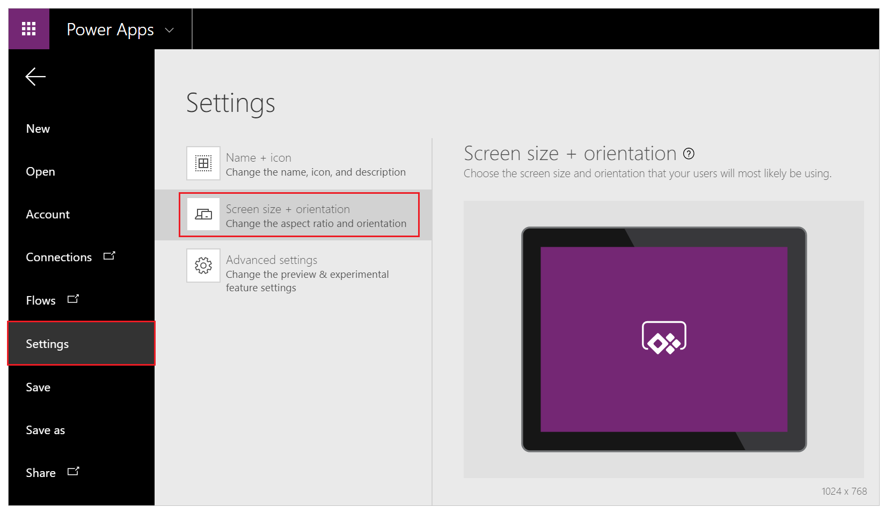

# Change screen size and orientation of a canvas app in PowerApps
Customize a canvas app by changing its screen size and orientation.

## Prerequisites
1. Create an app, or open one for editing.

2. On the **File** menu, click or tap **App settings**.

## Change screen size and orientation
1. Under **App settings**, click or tap **Screen size + orientation**.

    

2. In the **Orientation** list, click or tap **Portrait** or **Landscape**.

3. (Tablet apps only) Under **Aspect ratio**, click or tap the ratio that matches the target device for this app.

    

4. Under **Lock aspect ratio**, specify either **On** or **Off**.

    If you lock the aspect ratio, the app will retain the appropriate aspect ratio for a phone. If the app is running on another kind of device, the app will display incorrectly and may show unwanted results. If you unlock the aspect ratio, the app will adjust to the aspect ratio of the device on which it's running.

5. Under **Lock orientation**, specify either **On** or **Off**.

    If you lock the app's orientation, the app will retain the orientation that you specify. If the app is running on a device for which the screen is in a different orientation, the app will display incorrectly and may show unwanted results. If you unlock the app's orientation, it will adjust to the screen orientation of the device on which it's running.

6. Select **Apply** to save your changes.

## Next step
On the **File** menu, select **Save** to republish your app with the new settings.
