# Automate tests with Azure Pipeline using classic editor

In this article, you'll learn how to setup and run your canvas app tests built in the Test Studio using the [Azure Pipelines classic editor](https://docs.microsoft.com/azure/devops/pipelines/get-started/pipelines-get-started?view=azure-devops#define-pipelines-using-the-classic-interface) in [Azure DevOps Services](https://docs.microsoft.com/azure/devops/user-guide/what-is-azure-devops?view=azure-devops).

You can use a public project on GitHub - [Microsoft/PowerAppsTestAutomation](https://github.com/microsoft/PowerAppsTestAutomation) to:

- Automate operations of logging into your application.
- Open a browser on the build agent and executing a set of test cases and suites.
- View the status of the test execution in the Azure DevOps pipeline.

## Prerequisites

Before you begin, you must complete the following steps:

- [Fork](#step-1---fork-the-powerappstestautomation-project) the [Microsoft/PowerAppsTestAutomation](https://github.com/microsoft/PowerAppsTestAutomation) project on GitHub.

    > [!NOTE]
    > Public forks can’t be made private. If you want to create a private repo, please [duplicate the repository](https://help.github.com/github/creating-cloning-and-archiving-repositories/duplicating-a-repository).

- Create a new [*Test URLs .json file*](#step-2---create-test-url-json-file) in the repo with the App Test URLs you want to run from the pipeline.

### Step 1 - Fork the PowerAppsTestAutomation project

A [Fork](https://help.github.com/github/getting-started-with-github/fork-a-repo) is a copy of a repository. By forking a repository, you can make changes without effecting the original project.

1. Sign in to [GitHub](https://github.com/).

1. Go to [microsoft/PowerAppsTestAutomation](https://github.com/microsoft/PowerAppsTestAutomation) repository. You can also search for **microsoft/PowerAppsTestAutomation** instead, and then select the repository:

    

1. Select **Fork**:

    

1. Select where you want fork:

    

Your forked repository will now be available.

### Step 2 - Create Test URL .json file

Test URL .json file will contain the test suite and test case URLs for validating your app. The app test suite and test case URLs can be retrieved by selecting the [Copy play link](working-with-test-studio.md#playing-tests-in-a-browser) in Test studio.

You can find a sample file ```Samples/TestAutomationURLs.json``` in the repo you created earlier.

1. Create a new ```TestURLs.json``` file in your repo, or use any other file name. <br> The file name and location will be mapped in the pipeline variables later in the document.

1. Copy the format from the ```Samples/TestAutomationURLs.json``` file.

1. Update the Test URLs section with the tests that your want to validate in your app.

1. Commit the changes to your repo:

    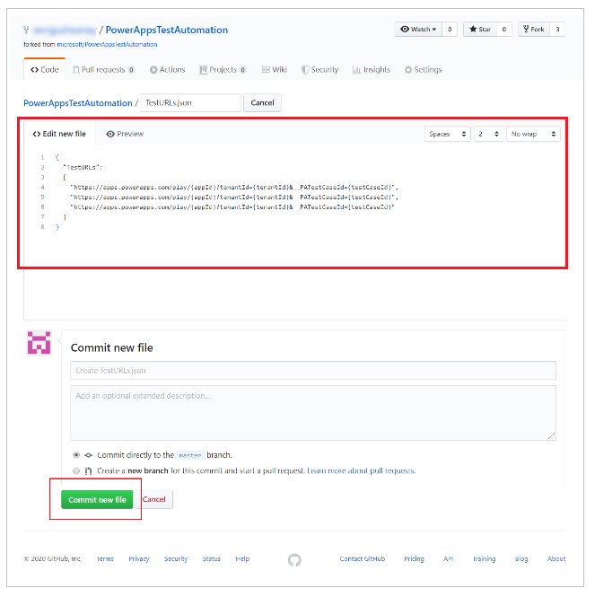

## Create a Pipeline

1. Sign in to your Azure DevOps instance.

1. Select an existing project or create a new project.

1. Select **Pipelines** in the left menu.

1. Select **Create Pipeline**:

    

1. Select **Use the classic editor**:

    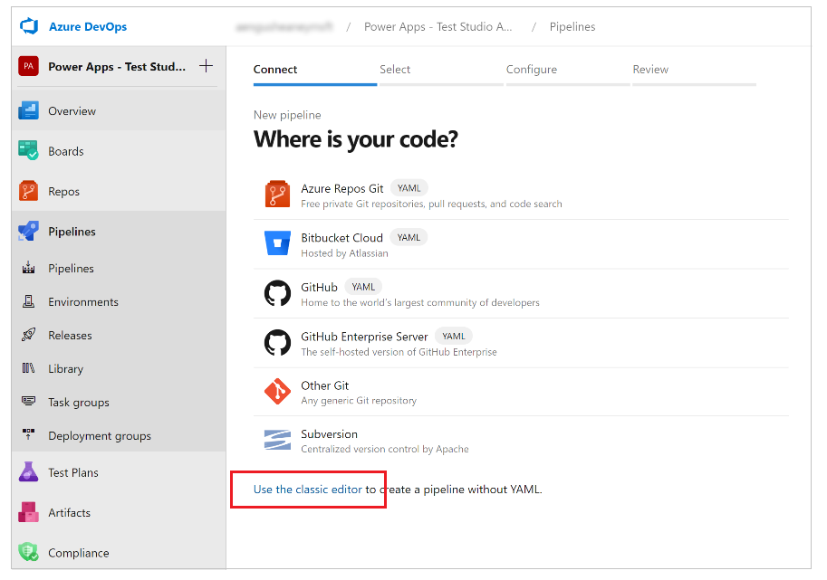

1. Select GitHub as the source.

1. If necessary, authorize your GitHub connection using OAuth or using a
    personal access token:

    

1. If needed, edit the connection name.

1. Select **...** (ellipsis) from the right side of **Repository** input.

1. Enter the name of your project on GitHub, and then **Select** it:

    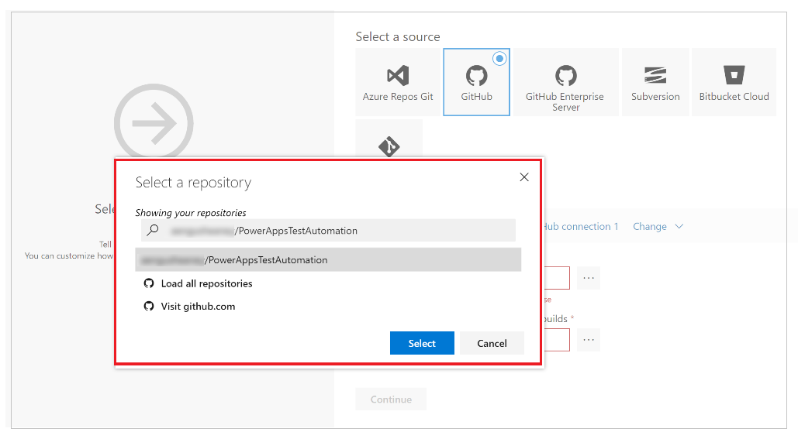

1. Select **Continue**.

1. In the Choose a template screen, select **Empty job**:

    

1. **Save** your pipeline.

## Add Tasks to the pipeline

You'll now add new job tasks and configure the tasks to run the tests
from the pipeline in this sequence:

1. [Configure screen resolution using PowerShell.](#step-1---configure-screen-resolution-using-powershell)

1. [Restore NuGet packages for the PowerAppsTestAutomation solution.](#step-2---restore-nuget-packages)

1. [Build the PowerAppsTestAutomation solution.](#step-3---build-the-powerappstestautomation-solution)

1. [Add Visual Studio Tests for Google Chrome.](#step-4---add-visual-studio-tests-for-google-chrome)

1. [Add Visual Studio Tests for Mozilla Firefox.](#step-5---add-visual-studio-tests-for-mozilla-firefox)

### Step 1 - Configure screen resolution using PowerShell

1. Select **+** next to the *Agent job 1*.

1. Search for **PowerShell**.

1. Select **Add** to add a PowerShell task to the job:

    

1. Select the task. <br>
    You can also update display name to *Set Agent Screen
    Resolution to 1920x1080* or similar.

1. Select **Inline** as the script type, and enter the below in the script window:

    ```powershell
    # Set agent screen resolution to 1920x1080 to avoid sizing issues with Portal  
    Set-DisplayResolution -Width 1920 -Height 1080 -Force
    # Wait 10 seconds  
    Start-Sleep -s 10
    # Verify Screen Resolution is set to 1920x1080  
    Get-DisplayResolution
    ```

    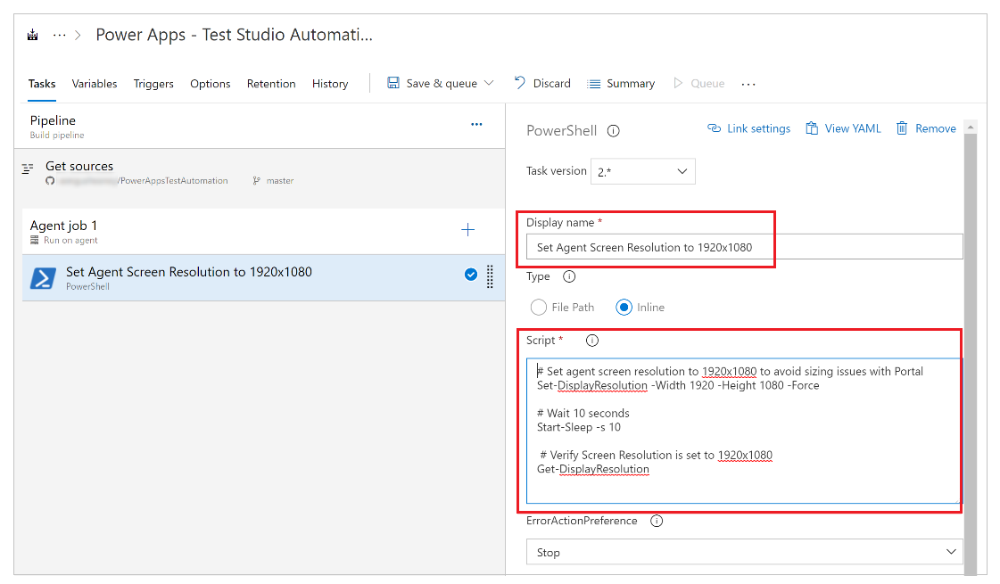

### Step 2 - Restore NuGet packages

1. Select **+** beside the Agent job 1.

1. Search for **NuGet**.

1. Select Add to add a NuGet task to the job.

1. Select the task.
    <br> You can also update the display name to **Restore NuGet
    Packages** or similar.

1. Select **…** (ellipsis) in the **Path to solution, packages.config, or project.json** configuration field.

1. Select the PowerAppsTestAutomation.sln solution file.

1. Select **OK**:

    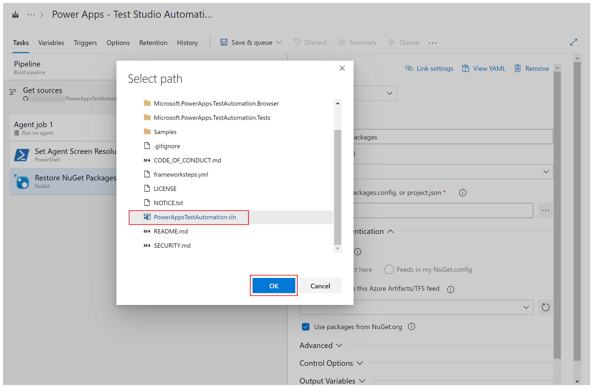

### Step 3 - Build the PowerAppsTestAutomation solution

1. Select **+** next to the Agent job 1.

1. Search for **Visual Studio build**.

1. Select **Add** to add a Visual Studio build task to the job.

1. Select the task.
    <br> You can also update the display name to **Build Power Apps
    Test Automation Solution** or similar.

1. Select **…** (ellipsis) in the **Solution** configuration field.

1. Select the PowerAppsTestAutomation.sln solution file.

1. Select **OK**.

### Step 4 - Add Visual Studio Tests for Google Chrome

1. Select **+** next to the Agent job 1.

1. Search for **Visual Studio Test**.

1. Select Add to add a Visual Studio Test task to the job.

1. Select the task.
    <br> You can also update the display name to *Run Power Apps
    Test Automation Tests via \$(BrowserTypeChrome)* or similar.

1. Remove the default entries in the Test Files text field and add the following:

    ```**\Microsoft.PowerApps.TestAutomation.Tests\bin\\Debug\Microsoft.PowerApps.TestAutomation.Tests.dll```

1. Enter ```TestCategory=PowerAppsTestAutomation``` in the **Test Filter Criteria field**.

1. Select **Test mix contains UI tests**.

    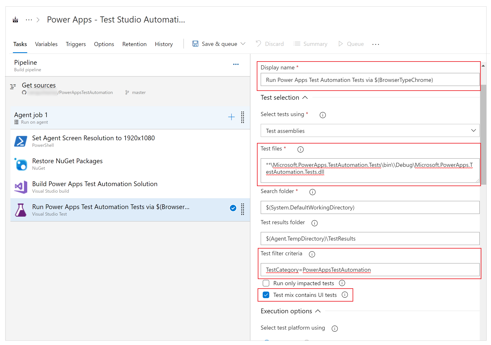

1. Select **…** (ellipsis) in the **Settings file** field.

1. Expand the **Microsoft.PowerApps.TestAutomation.Tests**, select the
    **patestautomation.runsettings** file, and then select **OK**:

    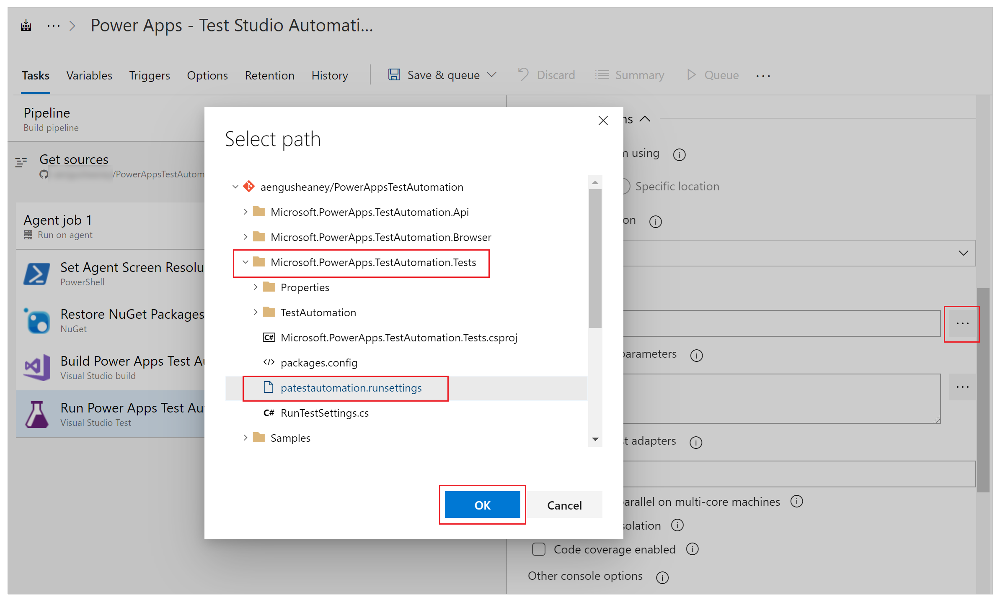

1. Copy the following in the **Override test run parameters** field.

    ```
    -OnlineUsername $(OnlineUsername) -OnlinePassword $(OnlinePassword) -BrowserType $(BrowserTypeChrome) -OnlineUrl $(OnlineUrl) -UsePrivateMode $(UsePrivateMode) -TestAutomationURLFilePath $(TestAutomationURLFilePath) -DriversPath $(ChromeWebDriver)
    ```

    > [!NOTE]
    > This is where the variables in the pipeline are configured, represented above in the form of \$(VariableName).

1. Enter **Run Power Apps Test Automation Tests via \$(BrowserTypeChrome)** or similar in the Test Run Title field.

    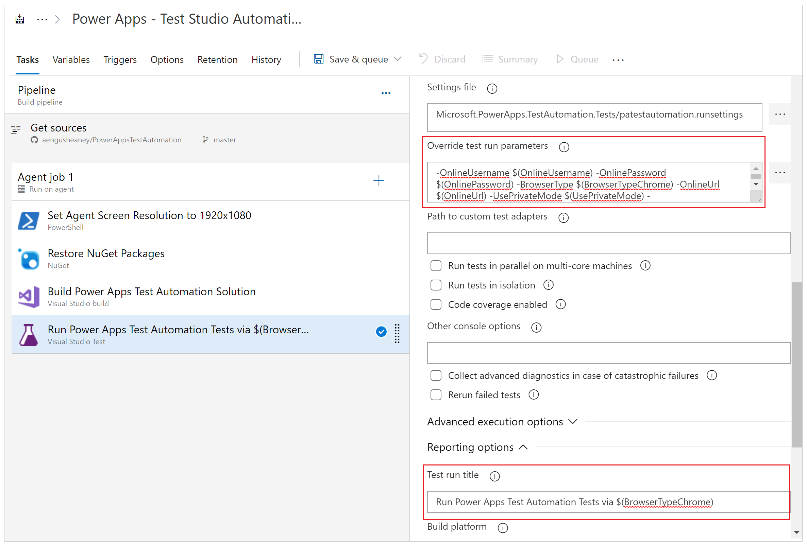

### Step 5 - Add Visual Studio Tests for Mozilla Firefox

1. Right-click the **Add Visual Studio Tests for Chrome** task and select **Clone task(s)**.

1. Select the task and update the following areas.

    1. **Title**: Run Power Apps Test Automation Tests via
        \$(BrowserTypeFirefox) copy

    1.  **Override test run parameters**

        ```
        -OnlineUsername $(OnlineUsername) -OnlinePassword $(OnlinePassword) -BrowserType $(BrowserTypeFirefox) -OnlineUrl $(OnlineUrl) -UsePrivateMode $(UsePrivateMode) -TestAutomationURLFilePath $(TestAutomationURLFilePath) -DriversPath $(GeckoWebDriver)
        ```

    1.  **Test Run Title**: Run Power Apps Test Automation Tests via
        \$(BrowserTypeFirefox)

## Configure Pipeline variables

You'll now configure the pipeline variables defined in the tasks
you've added [earlier](#add-tasks-to-the-pipeline).

1. Select the **Variables** tab.

2. Select **Add** and repeat this step to configure the following variables:

| Variable name             | Variable value                                                                                                                 |
|---------------------------|--------------------------------------------------------------------------------------------------------------------------------|
| BrowserTypeChrome         | Chrome                                                                                                                         |
| BrowserTypeFirefox        | Firefox                                                                                                                        |
| OnlineUrl                 | <https://make.powerapps.com>                                                                                                   |
| TestAutomationURLFilePath | ```$(Build.SourcesDirectory)\<test URL file>.json``` <br>**Note:** This is the [*Test URLs .json file*](#step-2---create-test-url-json-file) file you created earlier.                      |
| UsePrivateMode            | true                                                                                                                           |
| OnlineUsername            | Enter the Azure Active Directory email address of the user context that will sign in to the application. Tests will run under the context of this user account.\> |

1. Select Add and enter **OnlinePassword** in the variable name.

1. Check the lock image to make this variable a secret.

    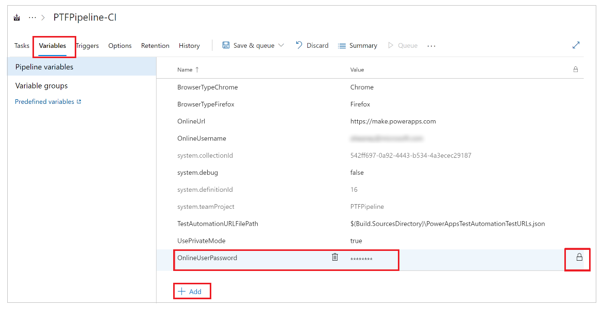

1. **Save** your pipeline configurations.

## Run and analyze tests

To validate your tests are executing successfully, select **Queue** and then select **Run**. Your job will start running.

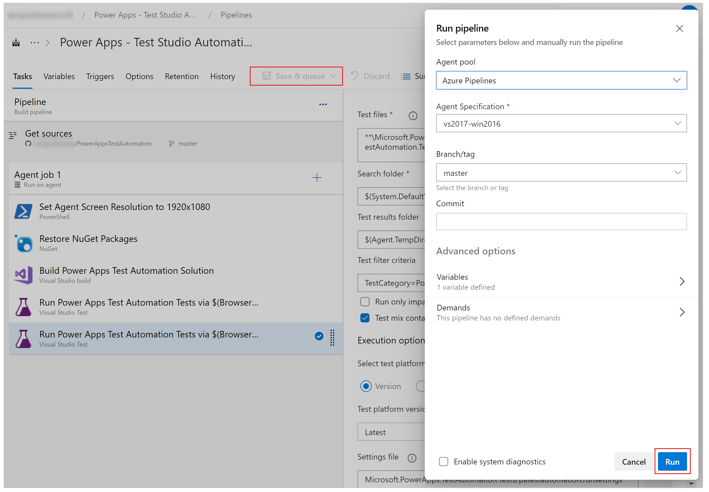

As the job runs, select the job to see a detailed status on each of the
tasks running:


When the job completes, you can view the high-level job summary, and any errors or warnings. By selecting the Test tab, you can view specific details on the test cases you've executed.

The following example indicates at least one of our test cases has failed while executing the tests using the Chrome browser:

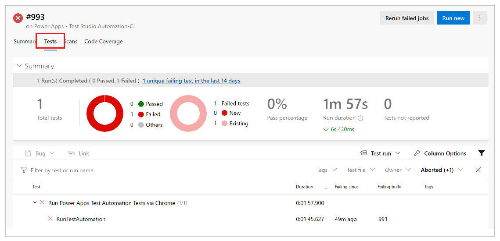

Select **RunTestAutomation** test to drill into the details on what test case has failed. In the *attachments tab*, you can see the summary of the test execution and which test cases have failed or passed in your test suite:


> [!NOTE]
> If you execute a test suite, you'll see a summary of test cases passed and
failed. If you execute a test case, you'll see specific details on
the failure with any trace information, if available.

## Known Limitations

- Multi-factor authentication isn't supported.

- Internet Explorer 11 and Microsoft Edge aren't supported browsers.

- Test summary will report a single test result per browser. The test result will contain 1 or more test cases or test suite results.   

- Any authentication process other than Azure Active Directory sign in flow requires customization of the sign in process in the **PowerAppsTestAutomation** solution.

### See also

- [Test Studio Overview](test-studio.md)
- [Working with Test Studio](working-with-test-studio.md)