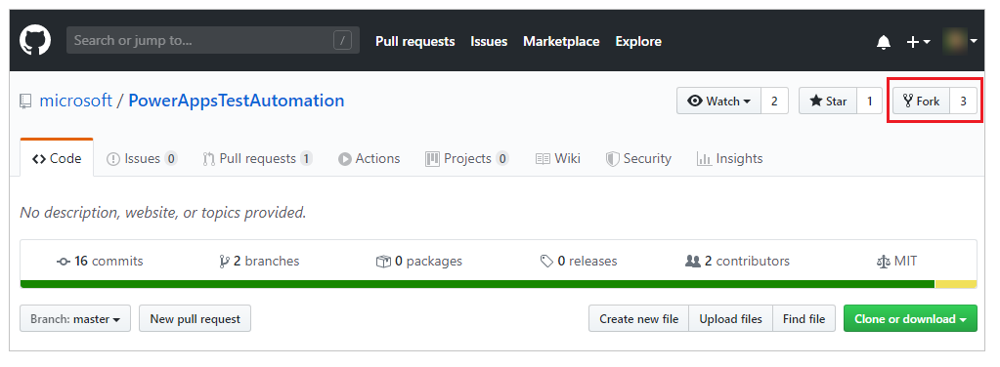
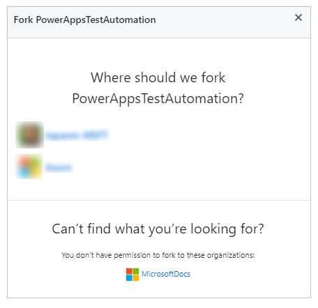
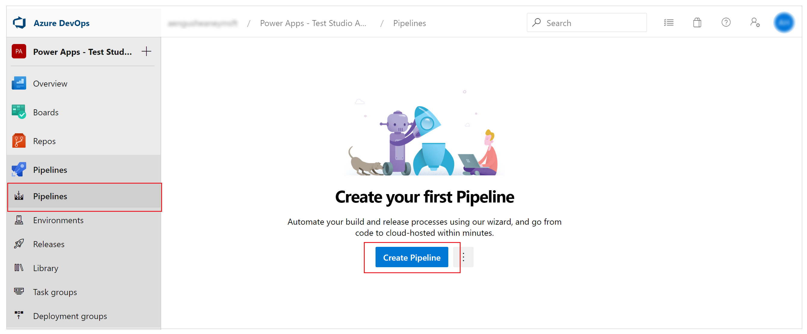
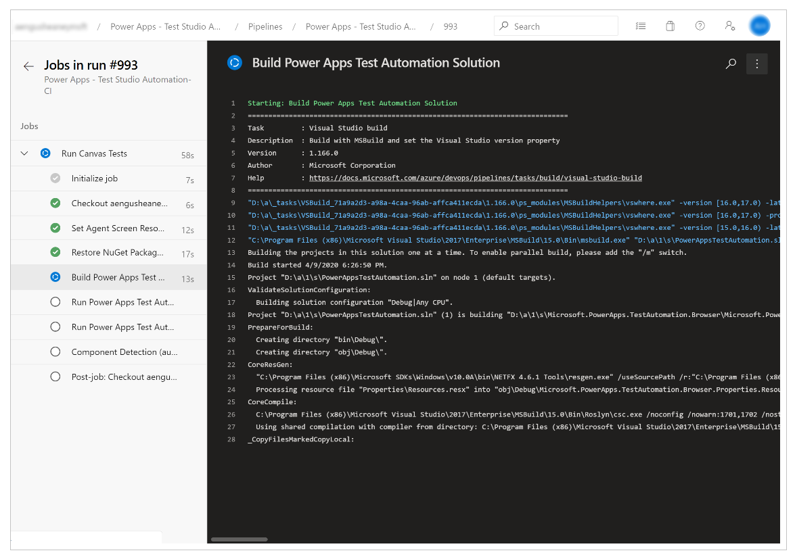
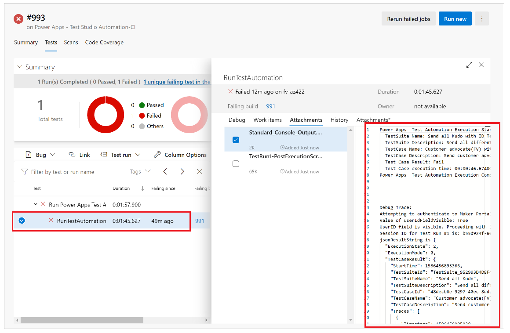

# Automate tests with Azure Pipeline using YAML

In this article, you'll learn how to setup and run your canvas app tests built in the Test Studio using a [YAML pipeline](https://docs.microsoft.com/en-us/azure/devops/pipelines/get-started/pipelines-get-started?view=azure-devops#define-pipelines-using-yaml-syntax) in [Azure DevOps Services](https://docs.microsoft.com/azure/devops/user-guide/what-is-azure-devops?view=azure-devops).

You can use a public project on GitHub - [Microsoft/PowerAppsTestAutomation](https://github.com/microsoft/PowerAppsTestAutomation) to:

- Automate operations of logging into your application.
- Open a browser on the build agent and executing a set of test cases and suites.
- View the status of the test execution in the Azure DevOps pipeline.

> [!NOTE]
> [Test Studio](test-studio.md) feature is still experimental and we recommend you use it to write tests for non-production apps. For more information, see [Experimental and preview features](working-with-experimental-preview.md).

## Prerequisites

Before you begin, you must complete the following steps:

- [Fork](#step-1---fork-the-powerappstestautomation-project) the [Microsoft/PowerAppsTestAutomation](https://github.com/microsoft/PowerAppsTestAutomation) project on GitHub.

    > [!NOTE]
    > Public forks can’t be made private. If you want to create a private repo, please [duplicate the repository](https://help.github.com/github/creating-cloning-and-archiving-repositories/duplicating-a-repository).

- Create a new [*Test URLs .json file*](#step-2---create-test-url-json-file) in the repo with the App Test URLs you want to run from the pipeline.

- Create a new [*Pipelines YAML file*](#step-3---create-pipeline-yaml-file) in your repo. 

- Create a [*Github service connection*](#step-4---create-github-service-connection) to your repo. 

### Step 1 - Fork the PowerAppsTestAutomation project

A [Fork](https://help.github.com/github/getting-started-with-github/fork-a-repo) is a copy of a repository. By forking a repository, you can make changes without effecting the original project.

1. Sign in to [GitHub](https://github.com/).

1. Go to [microsoft/PowerAppsTestAutomation](https://github.com/microsoft/PowerAppsTestAutomation) repository. You can also search for **microsoft/PowerAppsTestAutomation** instead, and then select the repository:

    

1. Select **Fork**:

    

1. Select where you want fork:

    

Your forked repository will now be available.

### Step 2 - Create Test URL .json file

Test URL .json file will contain the test suite and test case URLs for validating your app. The app test suite and test case URLs can be retrieved by selecting the [Copy play link](working-with-test-studio.md#playing-tests-in-a-browser) in Test studio.

You can find a sample file ```Samples/TestAutomationURLs.json``` in the repo you created earlier.

1. Create a new ```TestURLs.json``` file in your repo, or use any other file name. <br> The file name and location will be mapped in the pipeline variables later in the document.

1. Copy the format from the ```Samples/TestAutomationURLs.json``` file.

1. Update the Test URLs section with the tests that your want to validate in your app.

1. Commit the changes to your repo:

    

### Step 3 - Create Pipeline YAML file

You can find a sample file ```Samples/azure-pipelines.yml``` in the repo you created earlier.

1. Create a new ```azure-pipelines.yml``` file in your repo.

1. Copy the content from the ```Samples/azure-pipelines.yml``` file.

1. Commit the changes to your repo. <br> You will reference and update the azure-pipelines.yml file when you are configuring your pipeline later in the document. 


### Step 4 - Create Github service connection

1. Sign in to your Azure DevOps instance.

1. Select an existing project or create a new project.

1. Select **Project settings** at the bottom of the left menu.

    

1. Select **Service connections** under the Pipelines section. 

    

1. Select **Create service connection**. 

1. Select the **Github** service. 

1. Select **Next**.

    

1. Select the **AzurePipelines** in the OAuth Configuration. 

1. Select **Authorize**

    

1. Update the **Service connection name** or leave the default name generated. 

1. Select **Save**

    


## Create a Pipeline

1. Select **Pipelines** in the left menu.

1. Select **Create Pipeline**:

    

1. Select **GitHub YAML**:

    

1. Search or select your repo:

    

1. Select **Existing Azure Pipelines YAML file**

1. Set the path to the [*Azure YAML pipeline file*](#step-3---create-pipeline-yaml-file) you created earlier. 

1. Select **Continue**

    

1. The azure-pipelines file will be displayed:

    

1. Update the **repositories name** to your repo 

1. Update the **endpoint** to the name of the [*Github service connection*](#step-4---create-github-service-connection) you created earlier.
    
    

1. Update the **TestAutomationURLs** file name. This is the [*Test URLs .json file*](#step-2---create-test-url-json-file) file name you created earlier.

1. Update the **LocalProjectName** value to your repo name, if you changed it. 
    
1. Update the **TestAutomationURLFilePath** to the location of the [*Test URLs .json file*](#step-2---create-test-url-json-file) file name in your repo:
    
    

1. Select **Variables**: 

1. Add a variable called **OnlineUsername** and set the value to the Azure Active Directory email address of the user context that will sign in to the application. Tests will run under the context of this user account.

1. Select **OK**. 

1. Add another variable called **OnlinePassword**. Set the value to the password of the AAD account created above. 

1. Check the **Keep this value secret** and **Let users override this value when running this pipeline** options: 
 
    

1. **Save** and **Commit** the changes to your repo:  

    


## Run and analyze tests

To validate your tests are executing successfully, select **Run**. You can optionally select the server image to run your tests and also the Browser Types. Your job will start running.


As the job runs, select the job to see a detailed status on each of the
tasks running:



When the job completes, you can view the high-level job summary, and any errors or warnings. By selecting the Test tab, you can view specific details on the test cases you've executed.

The following example indicates at least one of our test cases has failed while executing the tests using the Chrome browser:


Select **RunTestAutomation** test to drill into the details on what test case has failed. In the *attachments tab*, you can see the summary of the test execution and which test cases have failed or passed in your test suite:



> [!NOTE]
> If you execute a test suite, you'll see a summary of test cases passed and
failed. If you execute a test case, you'll see specific details on
the failure with any trace information, if available.

## Known Limitations

- Multi-factor authentication isn't supported.

- Internet Explorer 11 and Microsoft Edge aren't supported browsers.

- Test summary will report a single test result per browser. The test result will contain 1 or more test cases or test suite results.   

- Any authentication process other than Azure Active Directory sign in flow requires customization of the sign in process in the **PowerAppsTestAutomation** solution.

### See also

- [Test Studio Overview](test-studio.md)
- [Working with Test Studio](working-with-test-studio.md)
- [Configure pipeline using classic editor](test-studio-classic-pipeline-editor.md)