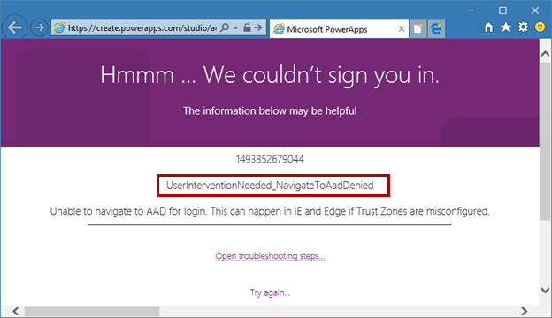

# Troubleshooting startup issues for PowerApps

This troubleshooting guide helps fix the following two common configuration problems that prevent PowerApps from starting:

- When you receive a “Hmmm … We couldn’t sign you in” error message and identifier that resembles the following image:

    

- When you try to create an app from a SharePoint list, you receive the following "abnormal termination" error message
    ```
    WebAuthoring abnormal termination.

    Client date/time: <Client Time>Thh:mm:ss.sssZ
    Version: 2.0.602
    Session ID: xxxx-xxxxx-xxxxxxx--xxxxxxxx
    description: {"error":{"detail":{"exception":{}},"colno":0,"filename":"https://paaeuscdn.azureedge.net/v2.0.602.0/studio/openSource/modified/winjs/js/base.js?v=39de0f2edf1...",
    "lineno":0,"message":"Script error","initErrorEvent":"[function]","bubbles":false,"cancelBubble":false,"cancelable":false,"currentTarget":"[window]","defaultPrevented":true,
    "eventPhase":2,"isTrusted":true,"srcElement":"[window]","target":"[window]","timeStamp":1490711965955,"type":"error","initEvent":"[function]","preventDefault":"[function]",
    "stopImmediatePropagation":"[function]","stopPropagation":"[function]","AT_TARGET":2,"BUBBLING_PHASE":3,"CAPTURING_PHASE":1},"errorLine":0,"errorCharacter":0,
    "errorUrl":"https://paaeuscdn.azureedge.net/v2.0.602.0/studio/openSource/modified/winjs/js/base.js?v=39de0f2edf1... error","setPromise":"[function]","exception":{}}
    stack: null
    errorNumber: 0
    errorMessage: Script error
    ```

If you experience one of the issues that's described in this section, check out the common errors matrix later, and then try one of the resolutions listed later to resolve the problem.

## Common error matrix

| Error identifier                                                              | Internet Explorer 11          | Edge                          | Chrome                        |
|-------------------------------------------------------------------------------|-------------------------------|-------------------------------|-------------------------------|
| UserInterventionNeeded_CookiesBlocked UserInterventionNeeded_StorageBlocked   | Enable storage of local data  | Enable storage of local data  | Enable storage of local data  |
| UserInterventionNeeded_NavigateToAadTimeout                                   | Possible network problem      | Configure Trust Zones         | Possible network problem      |
| UserInterventionNeeded_NavigateToAadDenied UserInterventionNeeded_StorageLost | Configure Trust Zones         | Configure Trust Zones         | Not applicable                |
| AadError                                                                      | Azure Active Directory Errors | Azure Active Directory Errors | Azure Active Directory Errors |

## Resolution 1: Enable storage of local data in your browser
PowerApps stores some data locally in your browser, including user identity and preferences. PowerApps can’t function if the browser is configured to disallow this.

- Instructions for Internet Explorer 11
    - Option 1: Enable local data for all sites
        1. Close all Internet Explorer and Edge windows.
        2. Select __OK__ to close the __Internet Options__ dialog box.
        3. Select __OK__.
        4. Remove any entries for __powerapps.com__.
        5. In the __Settings__ section, select __Sites__.
        6. Select __OK__.
        7. Select __Accept__ for third-party cookies.
        8. Select __Accept__ for first-party cookies.
        9. In the __Settings__ section, select __Advanced__.
        10. Select the __Privacy__ tab.
        11. Select __Internet Options__.
        12. On the browser toolbar, select the gear icon.
        13. Open Internet Explorer.
    - Option 2: Create exceptions to enable local data for PowerApps and associated services
        1. Open Internet Explorer.
        2. On the browser toolbar, select the gear icon.
        3. Select __Internet Options__.
        4. Select the __Privacy__ tab.
        5. In the __Settings__ section, select __Sites__.
        6. Add an entry to “Allow” __powerapps.com__.
        7. Select __OK__.
        8. Select __OK__ to close the Internet Options dialog box.
        9. Close all Internet Explorer and Edge windows.

- Instructions for Edge
      1. Open Edge.
      2. On the Edge toolbar, select More.
      3. Select Settings.
      4. Near the bottom of the panel, select View advanced settings.
      5. Near the bottom of the panel, find the Cookies drop-down options list.
      6. Select Don’t block cookies.
      7. Close all Internet Explorer and Edge windows.

- Instructions for Chrome
    - Option 1: Enable local data for all sites
      1. On your browser toolbar, select __More__.
      2. Select __Settings__.
      3. Near the bottom of the page, select __Show advanced settings__.
      4. In the "Privacy" section, select __Content settings__.
      5. Select __Allow local data to be set (recommended)__.
      6. Make sure that __Block third-party cookies and site data__ is not selected.
      7. Select Manage exceptions and make sure that there are no exceptions for __https://create.powerapps.com__, __https://\*.create.powerapps.com__, __https://make.\*.powerapps.com__, __https://make.powerapps.com__, and __https://login.microsoftonline.com__. If there are such exceptions, remove them by clicking on the x sign for the corresponding rows.
      8. Select __Done__.
    - Option 2: Create exceptions to allow local data for PowerApps and associated services
      1. On the browser toolbar, select __More__.
      2. Select __Settings__.
      3. Near the bottom of the page, select __Show advanced settings__.
      4. In the Privacy section, select __Content settings__.
      5. Select __Manage exceptions__ and create exceptions to “Allow” data storage for __https://create.powerapps.com__, __https://\*.create.powerapps.com__, __https://make.\*.powerapps.com__, __https://make.powerapps.com__, and __https://login.microsoftonline.com__.
      6. Select __Done__.


## Resolution 2: Configure Trust Zones for Internet Explorer and Edge
Internet Explorer and Edge use *Trust Zones*. Problems can occur if services on which PowerApps relies are in different Trust Zones in your browser settings. While these settings apply to both Internet Explorer and Edge, the easiest way to access them is from Internet Explorer. (You might need assistance from your IT administrator to change some of these settings.)

- Option 1: Add the required PowerApps domains to the Trusted Sites zone
  1. On the browser toolbar, select the gear icon.
  2. Select __Internet Options__.
  3. Select the __Security__ tab.
  4. Select __Trusted sites__.
  5. Select __Sites__.
  6. Add the following sites by typing the address and selecting __Add__ for each:
    - __https://login.microsoftonline.com__
    - __https://create.powerapps.com__
    - __https://*.create.powerapps.com__ (the asterisk is part of the address, don't replace it)
    - __https://make.powerapps.com__
    - __https://make.*.powerapps.com__ (the asterisk is part of the address, don't replace it)
    - __https://*.powerapps.com__ (the asterisk is part of the address, don't replace it)
  7. Select __Close__.
  8. Select __OK__.
  9. Close all Internet Explorer and Edge windows.
 

- Option 2: Remove all the PowerApps domains from the Trusted Sites zone
  1. On the browser toolbar, select the gear icon.
  2. Select __Internet Options__.
  3. Select the __Security__ tab.
  4. Select __Trusted sites__.
  5. Select __Sites__.
  6. Remove all existing entries for the following sites:
    - __https://login.microsoftonline.com__
    - __https://create.powerapps.com__
    - __https://*.create.powerapps.com__
    - __https://make.powerapps.com__
    - __https://make.*.powerapps.com__ 
    - Any other address that ends in __powerapps.com__ or __create.powerapps.com__.
  7. Select __Close__.

## Resolution 3: Azure Active Directory Errors
Azure Active Directory (AAD) is the technology on which the PowerApps ecosystem relies for user authentication and authorization.

The error page that you see might contain additional information that can help diagnose and fix the problem.

To resolve ADD errors, you might need assistance from your IT department.
