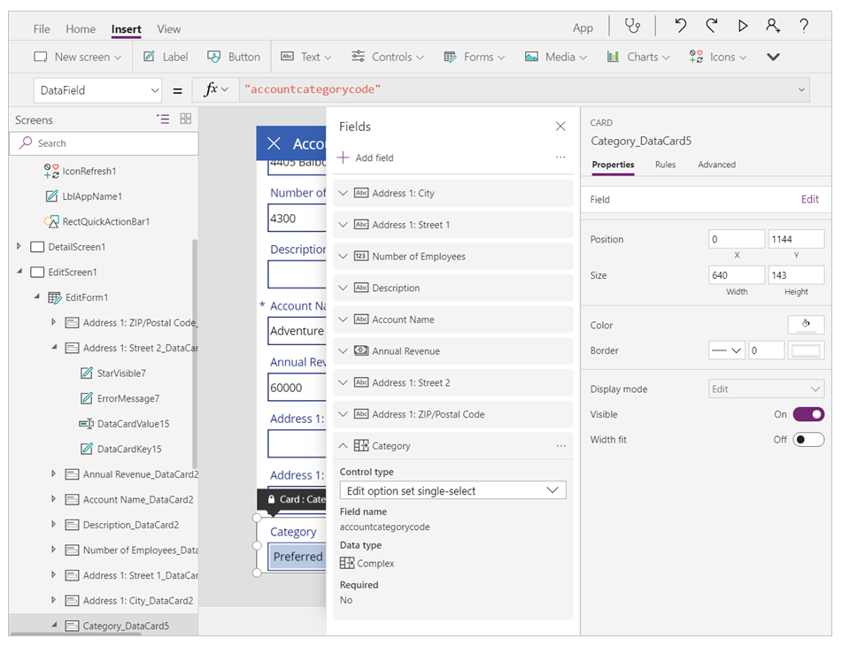
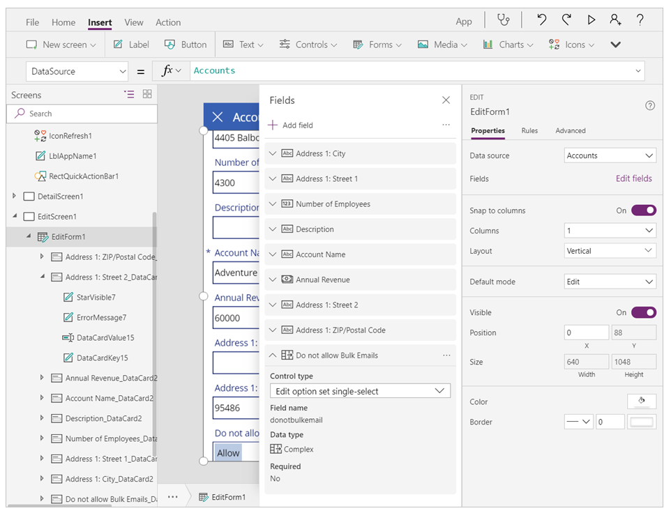
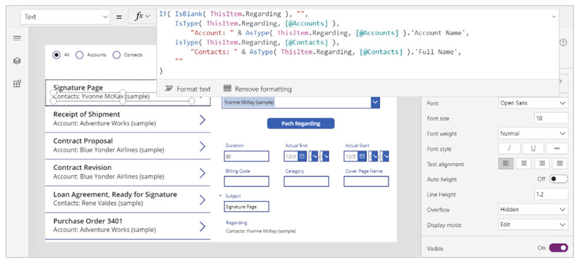
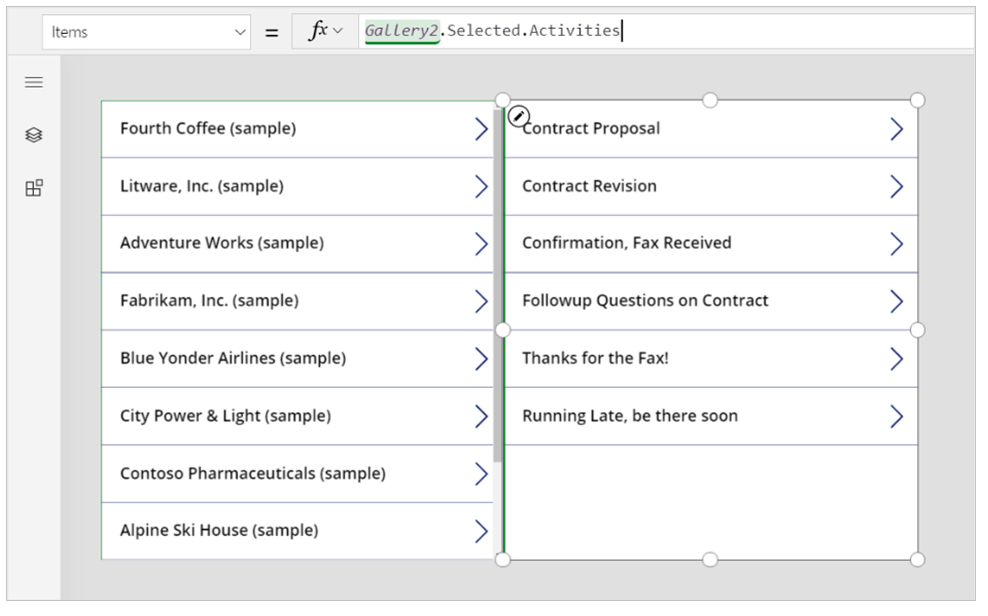
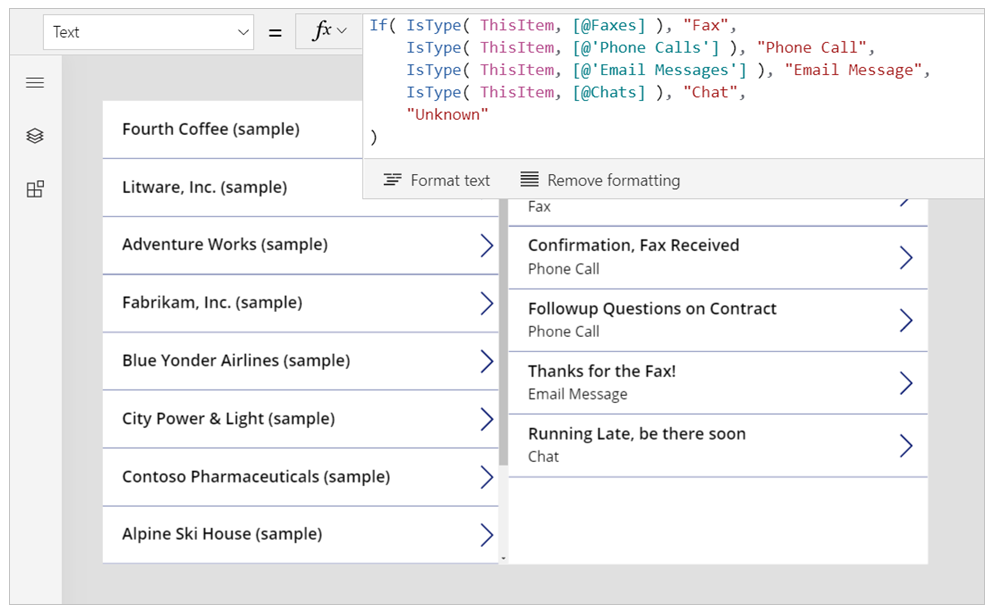

# Common Data Service and the Improved data source experience

If you created a canvas app with a Common Data Service connector prior to November 2019, then you may not have the benefit of the most current version of the Common Data Service.  The **Improve data source experience and Common Data Service views** switch unlocks significant speed gains, increased reliability, and features such as access to Common Data Service Views and File and Image field attributes. 
The “Improve data source experience and Common Data Service views” feature option appears in the Advanced settings section.   The “Relational data, option sets, and other new features for Common Data Service” now appears in the Deprecated features section.
## How do I upgrade my canvas app?
Upgrade your app by inspecting the settings of the options and then following the directions below.
### A.	“Improve data source experience and Common Data Service views” is already “On”
If the “Improve data source experience and Common Data Service views” feature is “On” then you have previously converted your canvas app to use this new feature or you started an app when the default setting for this feature was “On.”  You are already there.  If it isn’t already, you may want to turn on the “Explicit Column Selection” feature “On” as well.
Note that as this feature is not supported on Windows Player, authors working with Power Apps Windows Player will need to turn the “Improve data source … “ feature “Off.”
### B.	“Relational data, option sets and other new features for CDS” feature is “Off”
Check in the Deprecated features section for this setting.  If the “Relational data, option sets and other new features for CDS” in your app is “Off” then use the steps below as a first step in the conversion.  If you can’t see this option or if it’s already “On”, continue to the next section.
#### First, turn “Use display names” ON
1.	Turn on “Use display names” (if it is not already on.)
2.	Wait for the health monitor to finish analyzing your app.
3.	Save, close, and re-open your app.
4.	Resolve all formula errors.
5.	Save, close, and re-open your app.

##### Possible errors at this step
It’s possible that some of the newly shown display names conflict with the display names for other entities, fields, or controls.  For instance, you might have a control name “image” and a field name “image.”  
1.	For control name clashes, change the name of the control to be different and unique.  This is usually the simplest fix. 
2.	For field and entity display name conflicts you may see a formula that is expecting an entity but is resolving to a more locally scoped field name. Use the square bracket with a “@” symbol to indicate a global scope so it resolves to the entity (e.g., [@entityName].)
#### Second, turn ON both “Relational data, option sets and other new features for CDS” and “Use GUID data types instead of strings”
1.	Turn on “Relational data, option sets and other new features for CDS”.
2.	Turn on “Use GUID data types instead of strings”.
3.	Wait for the health monitor to finish analyzing your app.
4.	Resolve all formula errors.
5.	Save, close, and re-open your app.  

##### Possible errors and suggestions at this step
It’s possible to have errors at this stage if you were using an option set field or hard coded GUID text values.  
1.	Option Set values.  If you were using an option set field with a text identifier for the option set value, you should instead use the dot notation to reference the option set value. For instance:  Change Patch (Accounts, OptionSet1 = “12345”) to Change Patch (Accounts, OptionSet.Item1) where Item1 corresponds to the “12345” value.  See the Detailed Examples section below for more information. 
2.	GUIDs.  If you were using a static GUID string such as “015e45e1044e49f388115be07f2ee116”, convert it to function that returns a GUID object (e.g, GUID(“015e45e1044e49f388115be07f2ee116”)) 
3.	Lookups.  If you were using Lookup functions to get first level lookup values such as: Lookup (Lookup (Contacts, ‘contactID’ = ThisItem.ContactID”) consider using ThisItem.PrimaryContacts (where PrimaryContacts is the name of the entity) instead.  
   
### C.	“Improve data source experience and Common Data Service views“ is “Off”

This setting is at the top of the Setting page.  If the “Improve data source experience and Common Data Service views” in your app is “Off” then use the steps below to finish the conversion.
#### Turning on Improve data source experience and Common Data Service views” 
1.	Remove your existing Common Data Service data source connections. 
2.	Turn ON the “Improve data source experience and Common Data Service views” 
3.	Re-add your connections to your data sources to the Common Data Service using the new data source selection experience. 
4.	Save your application. 
Note:  If your application is extremely large, adding your data source connections back may take a while.  Please do not close the application during this process.

## Converting canvas apps with the Dynamics 365 connector
To convert your app that currently uses the Dynamics 365 connector you will need to drop and re-add your connections to your data sources.  Use the steps below to convert your connections to your data sources.
1.	Ensure that the “Improve data source experience and Common Data Service views” feature is turned “On.”
2.	Remove your existing Dynamics 365 data source connections.
3.	Re-add your connections to your data sources to the Common Data Service using the new data source selection experience.
4.	Save your application.


### Possible errors and suggestions at this step
It’s possible to have errors as you convert if you were not using Display Names, if you were using GUID strings, or if you were using an option set fields. 
1.	For control name clashes, change the name of the control to be different and unique.  This is usually the simplest fix. 
2.	For field and entity display name conflicts you may see a formula that is expecting an entity but is resolving to a more locally scoped field name. Use the square bracket with a “@” symbol to indicate a global scope so it resolves to the entity (e.g., [@entityName].)
3.	Option Set values.  If you were using an option set field with a text identifier for the option set value, you should instead use the dot notation to reference the option set value. For instance:  Change Patch (Accounts, OptionSet1 = “12345”) to Change Patch (Accounts, OptionSet.Item1) where Item1 corresponds to the “12345” value.  See the Detailed Examples section below for more information. 
4.	GUIDs.  If you were using a static GUID string such as “015e45e1044e49f388115be07f2ee116”, convert it to function that returns a GUID object (e.g, GUID(“015e45e1044e49f388115be07f2ee116”)) 
5.	Lookups.  If you were using Lookup functions to get first level lookup values such as: Lookup (Lookup (Contacts, ‘contactID’ = ThisItem.ContactID”) consider using ThisItem.PrimaryContacts (where PrimaryContacts is the name of the entity) instead.  
6. For any Polymorphic references, refer to the Detailed Examples section below. 

## Detailed Examples

### Option Sets

Converting your app to use the new Power Apps Option sets and Two option data types along with the controls that support them can be one of the biggest sources of change when upgrading your app to use the new Improved data source experience.      

Previously there were separate *_myfield* and *_myfield_label fields* used for an Option set, and now there is just a single *myfield* that can be used both for locale independent comparisons and to obtain the locale specific label. 

#### Option set Data cards - remove and re-add
It's best to remove existing data cards and re-add them to work with your Option set.  For example, if you are working with the Account entity and the Category Option set, you'll see that the DataField property of the data card was set to *_accountcategorycode_label*. In the field list you can see that the data card has a type of String.


With the "Improve" switch on you no longer see *_accountcategorycode_label*.  It has been replaced by *accountcategorycode*.  And your card will now be marked as "custom" and you'll have errors.  Remove the old data card and re-add the Option Set.  The new data card is Option set aware.



#### Option Set Filter expressions - edit to use new syntax

Previously, if you wanted to use an Option Set value in a Filter expression you would need to use the *Value* field.  For example:

```powerapps-dot
Filter(Account,'Category Value' = "1")
```
You will need to edit this formula.  We no longer use the Option set text identifer for the value.  This expression should be updated to look like the following:

```powerapps-dot
Filter(Account, Category= ‘Category (Accounts)’.’Preferred Customer’)
```
Where 'Category(Accounts)' is the name of enum used in the Category field of the Accounts entity. Note this is a local option set.  You can read more about local and global option sets here: [Global option sets.](https://docs.microsoft.com/en-us/powerapps/maker/common-data-service/create-edit-global-option-sets)

#### Option Set Patch statements - edit to use new syntax
Similar to Filter expressions, Patch statements must be updated as well.  The previous way to patch an option set is shown here:

```powerapps-dot
Patch( Accounts, First(Accounts), { ‘Category Value’: 1 } ) )
```
You will need to update your statements to follow this form:

```powerapps-dot
Patch( Accounts, First(Accounts), { Category: ‘Category (Accounts)’.’Preferred Customer’ } )
```

#### Option Set Disambiguation - clarify with the disambiguation operator
If the display name of a Option set **field** and the name of the Option set **itself** are the same, you'll need to disambiguate the formula. To continue using the Accounts Category Code example, the **@** says to use the Option Set, not the field.

```powerapps-dot
Filter(Accounts, 'Category Code' = [@’Category Code’].'Preferred Customer')
```

### Two Options

the Two Option data type behave the same as Option Sets.  So, we can apply similar fixes.

#### Two Option set Data cards - remove and re-add
It's best to remove existing data cards and re-add them to work with your Two Option set.  Previously, Power Apps recognized the types as simple boolean data type (e.g., ture/on and false/off).  There were no labels. 


With the "Improve" switch on your card will now be marked as "custom" and you'll have errors.  Remove the old data card and re-add the Option Set.  Once re-added, by default, you'll see an edit control with two options.  



If you prefer the toggle switch for your boolean field, you can unlock the data card and replace the control in the data card with a toggle instead.  You will need to also set these properties on the Toggle.

```powerapps-dot
Toggle1.Default = ThisItem.’Do not allow Bulk Emails’
Toggle1.TrueText = ‘Do not allow Bulk Emails (Accounts)’.’Do Not Allow’
Toggle1.FalseText = ‘Do not allow Bulk Emails (Accounts)’.Allow
DataCard.Value = If( Toggle1.Value,
    ‘Do not allow Bulk Emails (Accounts)’.’Do Not Allow’,
    ‘Do not allow Bulk Emails (Accounts)’.Allow )
```


#### Two Option Patch statements - refine if desired
Using the Patch function with Two option should work 'as is.'  It supports direct use of true and false just as a Boolean does.  The only slight difference is that if you put the value in a Label control previously, and it showed true and false, it will now show the Two option labels instead.


### Polymorphic lookups
If your application referenced polymorphic fields, then use these guidelines to migrate your application. Polymorphic lookups, from the same field, support references to a restricted set of multiple entities.  Similar to references in other languages, a record reference is a pointer to a specific record in a specific entity. A record reference carries with it the entity information allowing it to point to a record in several different other entities, which differs from a normal lookup that can only point to records in one entity.  

#### 1. Access, Set, and Filter on the Owner field of a record
For instance, the Owner field in an entity can refer to a record in the Users entity or the Teams entity. The same lookup field in different records could refer to records in different entities. 
 

 
##### Polymorphic with Filter and Patch 
Record references can be used just like a full record 
```powerapps-dot
Filter( Accounts, Owner = First( Teams ) )
Patch( Accounts, First( Accounts ), { Owner: First( Users ) })
```

##### Polymorphic with a Gallery displaying Owner name: 
Since a reference can point to different entities, we must be more specific about what we want. You cannot use **ThisItem.Owner.Name**, as the name field in the **Team** entity is **Team Name**, and the name field in the **User** entity is **Full Name**. Power Apps won’t know which type of lookup you're referring to, until you run the app. 

To overcome this, 

1. You will need to add the data sources for the entity types that Owner could be (in this case, Users and Teams) 
2. You will need to use additional functions to make your intent clear. 

There are two new functions you can make use of: 
* IsType – Checks if a record reference is of a particular entity type.
* AsType – Casts a record reference to a particular entity type.

With these functions, you can write a formula that displays the name of the Owner taken from two differently named fields, based on the entity type of the Owner:

```powerapps-dot
If( IsType( ThisItem.Owner,  [@Teams]), 
    AsType( ThisItem.Owner, [@Teams]).'Team Name', 
    AsType( ThisItem.Owner, [@Users]).'Full Name' )
```


We use the global disambiguation operator for [@Teams] and [@Users] to ensure that you reference the global entity type.  In this case it's not technically necessary.  But it is good practice to always be clear. One-to-many relationships often conflict in the gallery's record scope, and this practice avoids that confusion.
 
#### 2. Access and set the Company Name field (a Customer data type) of the Contacts entity.
Customer lookup field is another polymorphic lookup that's very similar to Owner. You can only have one Owner field per entity. But an entity can include zero, one, or more Customer lookup fields. The Contacts system entity includes the Company Name field, which is a Customer lookup field. See this [article](https://docs.microsoft.com/powerapps/maker/canvas-apps/working-with-references#show-the-fields-of-a-customer) for more details.  
 
#### 3. Access and set the Regarding field of activity entities such as Faxes, Phone Calls, Email Messages, etc.
Regarding Polymorphic lookups are not just limited to Accounts and Contacts. The list of entities is extensible with custom entities. For example, the Faxes entity has a polymorphic Regarding lookup field, which can refer to Accounts, Contacts, and other entities. If you have a gallery with data source set to Faxes, you can use the following formula to display the name associated with the Regarding lookup field. 
 
 ```powerapps-dot
If( IsBlank( ThisItem.Regarding ), "",
    IsType( ThisItem.Regarding, [@Accounts] ),
        "Account: " & AsType( ThisItem.Regarding, [@Accounts] ).'Account Name',
    IsType( ThisItem.Regarding, [@Contacts] ),
        "Contacts: " & AsType( ThisItem.Regarding, [@Contacts] ).'Full Name',
    "" )
```


 
 
Please refer to these links to understand [Regarding lookup fields](https://docs.microsoft.com/powerapps/maker/canvas-apps/working-with-references#understand-regarding-lookup-fields) and [Regarding relationships](https://docs.microsoft.com/powerapps/maker/canvas-apps/working-with-references#understand-regarding-relationships) in detail. 

#### 4. Access the list of all Activities for a record.
In Common Data Service, entities such as Faxes, Tasks, Emails, Notes, Phone Calls, Letters, and Chats are designated as [activities](https://docs.microsoft.com/powerapps/developer/common-data-service/activity-entities). You can also create your own [custom activity entities](https://docs.microsoft.com/powerapps/developer/common-data-service/custom-activities) .
In a canvas app, you can either show activities of a specific type such as Faxes or Taxes, or all activities associated with an entity such as account. You need to add the Activities entity as well as other individual entities whose data you plan to display in the canvas app. 
Also, whenever you add a record to, for example the Tasks entity, the system also creates a record in the Activity entity with the fields that are common across all activity entities.
 
You can read more about Activity entity [here](https://docs.microsoft.com/en-us/powerapps/maker/canvas-apps/working-with-references#activity-entity). 
 
In the below example, as you select an Account, all the Activities associated with that account will be displayed. 
 
 
 
The records are being displayed from the Activity entity, but you can nevertheless use the IsType function to identify which kind of activity they are. Again, before you use IsType with an entity type, you must add the necessary data source.
 
By using this formula, you can show the record type in a label control within the gallery:

 ```powerapps-dot
If( IsType( ThisItem, [@Faxes] ), "Fax",
    IsType( ThisItem, [@'Phone Calls'] ), "Phone Call",
    IsType( ThisItem, [@'Email Messages'] ), "Email Message",
    IsType( ThisItem, [@Chats] ), "Chat",
    "Unknown")
```
 
 
 
#### 5. Access the list of Notes for a record.
When you create an entity, you can enable attachments. If you select the check box for enabling attachments, you'll create a Regarding relationship with the Notes entity, as this graphic shows for the Accounts entity:


 
##### Filtering 
You can't read or filter based on the Regarding field. However, the reverse Notes one-to-many relationship is available, so to list all the Notes associated to an Account entity, you can use the following formula:

```powerapps-dot
First( Accounts ).Notes
```
##### Patch 
You can't set the Notes field on an entity by using Patch. In order to add a record to an entity's Notes table, you can use the Relate function. But the note should first be created, as in this example:

```powerapps-dot
Relate( ThisItem.Notes, Patch( Notes, Defaults( Notes ), { Title: "A new note", isdocument:'Is Document (Notes)'.No } ) )
```


