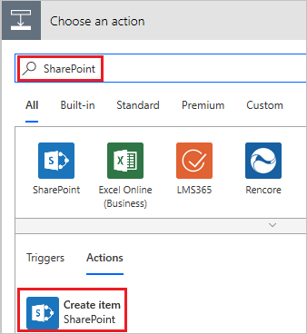
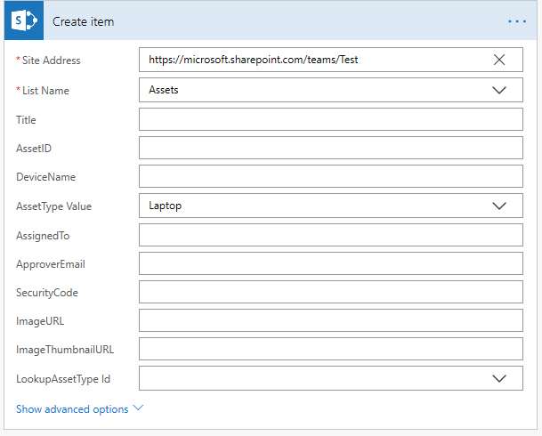

# Start a flow in a canvas app

You can use Microsoft Flow to create logic that performs one or more tasks when an event occurs in a canvas app. For example, configure a button so that, when a user selects it, an item is created in a SharePoint list, an email or meeting request is sent, a file is added to the cloud, or all of these. You can configure any control in the app to start the flow, which continues to run even if you close PowerApps.

> [!NOTE]
> When a user runs a flow from within an app, that user must have permission to perform the tasks that are specified in the flow. Otherwise, the flow will fail.

## Prerequisites

- [Sign up](../signup-for-powerapps.md) for PowerApps.
- Learn how to [configure a control](add-configure-controls.md).

## Create a flow

1. Sign in to [PowerApps](http://web.powerapps.com?utm_source=padocs&utm_medium=linkinadoc&utm_campaign=referralsfromdoc).

1. In the left navigation bar, select **Business logic**, and then select **Flows**.

1. In the upper-left corner of the **My Flows** page, select **New**, and then select **Create from blank**.

    

1. Near the bottom of the page that appears, select **Search hundreds of connections and triggers**.

1. In the search box, type **PowerApps**, and then select the **PowerApps** icon.

    
    
1. On the next page, select the PowerApps icon again, and then select **New step**.

1. In the box that says **Search connectors and actions**, specify an action for your flow, as in this example:

   1. Type **SharePoint** in the box, and then select **Create item** in the list under **Actions**.

       

   1. If prompted, provide credentials to connect to SharePoint.

   1. In the **Site Address** box, type or paste the URL of a SharePoint Online site that contains a list.

       > [!NOTE]
       > Don't append the name of the list to the URL.

   1. In the **List Name** box, specify the list that you want to use.
   
       

   1. Select the input box for a field in your list (such as **Title**), select **See more** in the dynamic-content pane, and then select **Ask in PowerApps**. 

       

1. (optional) Specify one or more additional steps, such as sending approval mail to an address that you specify or creating a related entry in another data source.

1. Near the upper-left corner, type or paste a name for your flow, and then select **Save** near the upper-right corner.

## Add a flow to an app
1. In the left navigation bar, select **Create**.

1. Hover over the **Canvas app from blank** tile, and then select **Make this app**.

1. Add a **[Text input](controls/control-text-input.md)** control, and name it **RecordTitle**.

1. Add a **[Button](controls/control-button.md)** control, and move it under **RecordTitle**.

1. With the **[Button](controls/control-button.md)** control selected, select **Flows** on the **Action** tab.

    

1. In the pane that appears, select the flow that you created in the previous procedure.

    > [!NOTE]
   > If the flow that you created isn't available, confirm whether PowerApps is set to the environment in which you created the flow.

    

1. In the formula bar, type or paste **RecordTitle.Text)** at the end of the formula that's been automatically added.

    

## Test the flow
1. Double-click the **Text input** control, and type or paste some text into it.

1. While holding down the Alt key, select the **[Button](controls/control-button.md)** control.

    A SharePoint item is created in the list that you specified with the text that you specified as the title. If the list was open when the flow ran, you might need to refresh your browser window to show the changes.
