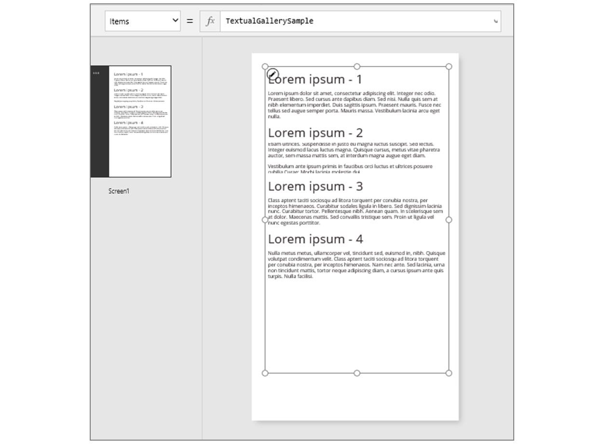
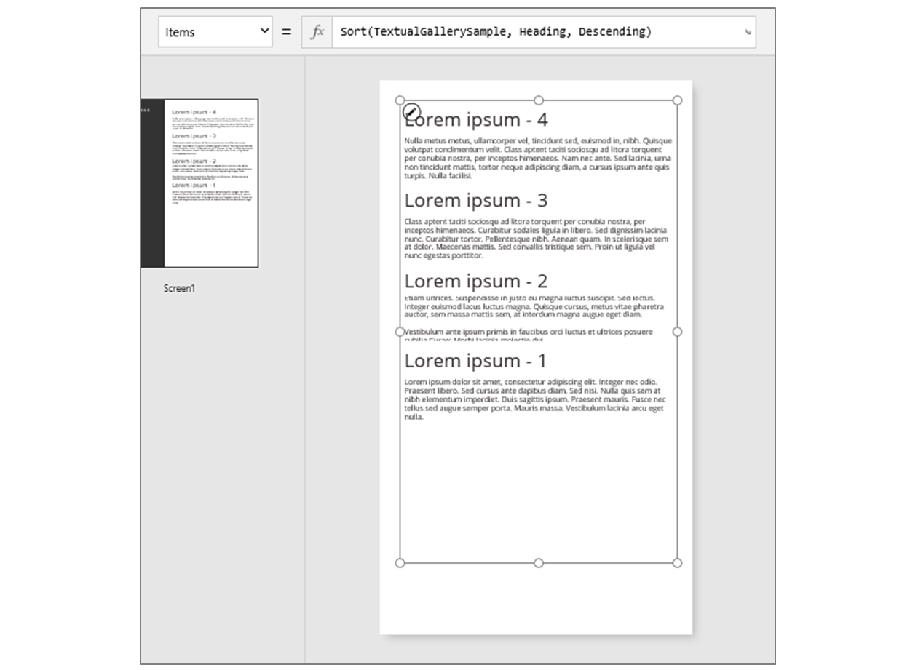
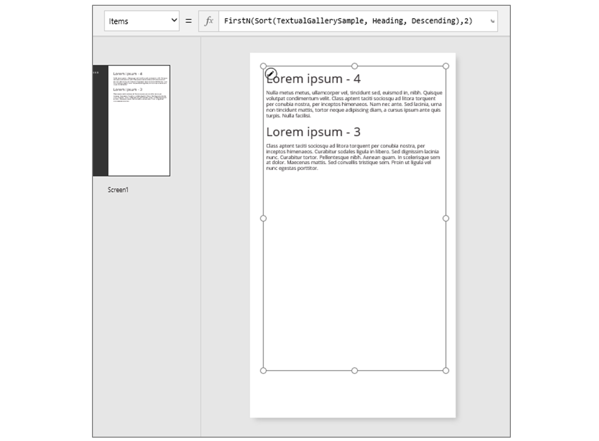
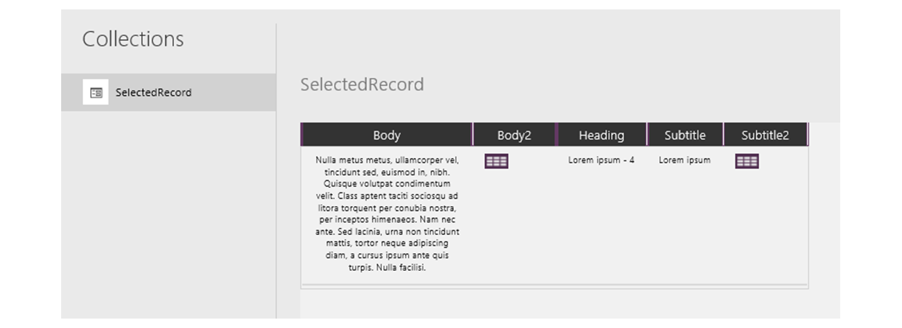
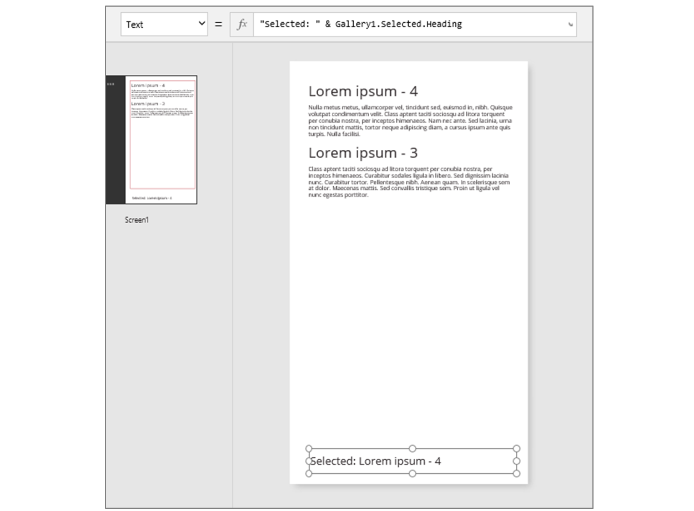

# Understand tables and records in PowerApps
You can create an app that accesses information in Microsoft Excel, SharePoint, SQL Server, and several other sources that store data in records and tables. To work most effectively with this kind of data, review the concepts that underlie these structures.

* A record contains one or more categories of information about a person, a place, or a thing. For example, a record might contain the name, the email address, and the phone number of a single customer. Other tools refer to a record as a "row" or an "item."
* A table holds one or more records that contain the same categories of information. For example, a table might contain the names, the email addresses, and the phone numbers of 50 customers.

In your app, you'll use [formulas](working-with-formulas.md) to create, update, and manipulate records and tables. You'll probably read and write data to an external [data source](working-with-data-sources.md), which is an extended table. In addition, you might create one or more internal tables, which are called [collections](working-with-data-sources.md#collections).

You can build a variety of formulas that take the name of a table as an argument, just as a formula in Excel takes one or more cell references as arguments. Some formulas in PowerApps return a table that reflects the other arguments that you specify. For example, you might create a formula:

* to update a record in a table by specifying that table as one of multiple arguments for the **[Patch](functions/function-patch.md)** function
* to add, remove, and rename columns in a table by specifying that table as an argument for the **[AddColumns](functions/function-table-shaping.md)**, **[DropColumns](functions/function-table-shaping.md)**, or **[RenameColumns](functions/function-table-shaping.md)** function. None of those functions modifies the original table. Instead, the function returns another table based on the other arguments that you specify.

## Elements of a table

### Records
Each record contains at least one category of information for a person, a place, or a thing. The example above shows a record for each product (**Chocolate**, **Bread**, and **Water**) and a column for each category of information (**Price**, **Quantity on Hand**, and **Quantity on Order**).

In a formula, you can refer to a record by itself, outside of a table's context, by using curly braces. For example, this record **{ Name: "Strawberries", Price: 7.99 }** isn't associated with a table.

### Fields
A field is an individual piece of information in a record. You can visualize this sort of field as a value in a column for a particular record.

Just as with a control, you refer to a field of a record by using the **.** [operator](functions/operators.md) on the record.  For example, **First(Products).Name** returns the **Name** field for the first record in the **Products** table.

A field can contain another record or table, as the example for the **[GroupBy](functions/function-groupby.md)** function shows. You can nest as many levels of records and tables as you want.

### Columns
A column refers to the same field for one or more records in a table. In the above example, each product has a price field, and that price is in the same column for all products.  The above table has four columns, shown horizontally across the top:

* **Name**
* **Price**
* **Quantity on Hand**
* **Quantity on Order**

The column's name reflects the fields in that column.

All values within a column are of the same data type. In the above example, the "Quantity on Hand" column always contains a number and can't contain a string, such as "12 units," for one record.  The value of any field may also be *blank*.  

You may have referred to columns as "fields" in other tools.

> [!NOTE]
> For SharePoint and Excel data sources that contain column names with spaces, PowerApps will replace the spaces with **"\_x0020\_"**. For example, **"Column Name"** in SharePoint or Excel will appear as **"Column_x0020_Name"** in PowerApps when displayed in the data layout or used in a formula.

### Table
A table comprises one or more records, each with multiple fields that have consistent names across the records.

Any table that's stored in a data source or a collection has a name, which you use to refer to the table and pass it to functions that take tables as arguments.  Tables can also be the result of a function or a formula.

As in the following example, you can express a table in a formula by using the **[Table](functions/function-table.md)** function with a set of records, which you express in curly braces:

**Table( { Value: "Strawberry" }, { Value: "Vanilla" } )**

You can also define a single-column table with square brackets.  An equivalent way to write the above:

**[ "Strawberry", "Vanilla" ]**

## Table formulas
In Excel and PowerApps, you use formulas to manipulate numbers and strings of text in similar ways:

* In Excel, type a value, such as **42**, in cell **A1**, and then type a formula, such as **A1+2**, in another cell to show the value of **44**.
* In PowerApps, set the **[Default](controls/properties-core.md)** property of **Slider1** to **42**, and set the **[Text](controls/properties-core.md)** property of a label to **Slider1.Value + 2** to show the value of **44**.

In both cases, the calculated value changes automatically if you change the values of the arguments (for example, the number in cell **A1** or the value of **Slider1**).

Similarly, you can use formulas to access and manipulate data in tables and records. You can use names of tables as arguments in some formulas, such as **Min(Catalog, Price)** to show the lowest value in the **Price** column of the **Catalog** table. Other formulas provide whole tables as return values, such as **RenameColumns(Catalog, "Price", "Cost")**, which returns all the records from the **Catalog** table but changes the name of the **Price** column to **Cost**.

Just as with numbers, formulas that involve tables and records are automatically recalculated as the underlying table or record changes. If the cost of a product in the **Catalog** table is lowered below the previous minimum, the return value of the **[Min](functions/function-aggregates.md)** formula will automatically change to match it.

Let's walk through some simple examples.

1. Add a **Text gallery** control, and set its **[Items](controls/properties-core.md)** property to the name of a table.
   
    By default, the gallery shows placeholder text from a table named **TextualGallerySample**. The **[Items](controls/properties-core.md)** property of the gallery is automatically set to that table.
   
    > [!NOTE]
> Some controls have been rearranged and enlarged for illustration purposes.
   
    
2. Instead of setting the **[Items](controls/properties-core.md)** property to the name of a table, set it to a formula that includes the name of the table as an argument, as in this example: 
   **Sort(TextualGallerySample, Heading, Descending)**
   
    This formula incorporates the **[Sort](functions/function-sort.md)** function, which takes the name of a table as its first argument and the name of a column in that table as its second argument. The function also supports an optional third argument, which stipulates that you want to sort the data in descending order.
   
    
3. Set the **[Items](controls/properties-core.md)** property to a formula that takes the formula from the previous step as an argument and returns a table, as in this example: 
   **FirstN(Sort(TextualGallerySample, Heading, Descending), 2)**
   
    In this formula, you use the **[FirstN](functions/function-first-last.md)** function to show a particular number of records in a table. You use the **[Sort](functions/function-sort.md)** function as the first argument to **[FirstN](functions/function-first-last.md)** and a number (in this case, **2**) as the second argument, which specifies how many records to show.
   
    The entire formula returns a table that contains the first two records of the **TextualGallerySample** table, sorted by the **Heading** column in descending order.
   
    

### Table functions and control properties
Many functions in PowerApps take the name of a table as an argument, create a second table that contains the same data, manipulate the new table based the other arguments, and then return the result. These functions don't modify the original table, even if it's a data source.

* **[Sort](functions/function-sort.md)**, **[Filter](functions/function-filter-lookup.md)** - Sorts and filters records.
* **[FirstN](functions/function-first-last.md)**, **[LastN](functions/function-first-last.md)** - Returns the first N or last N records of the table.
* **[Abs](functions/function-numericals.md)**, **[Sqrt](functions/function-numericals.md)**, **[Round](functions/function-round.md)**, **[RoundUp](functions/function-round.md)**, **[RoundDown](functions/function-round.md)** - Arithmetic operations on each record of a single-column table, resulting in a single-column table of results.
* **[Left](functions/function-left-mid-right.md)**, **[Mid](functions/function-left-mid-right.md)**, **[Right](functions/function-left-mid-right.md)**, **[Replace](functions/function-replace-substitute.md)**, **[Substitute](functions/function-replace-substitute.md)**, **[Trim](functions/function-trim.md)**, **[Lower](functions/function-lower-upper-proper.md)**, **[Upper](functions/function-lower-upper-proper.md)**, **[Proper](functions/function-lower-upper-proper.md)** - String manipulations on each record of a single-column table, resulting in a single-column table of strings.
* **[Len](functions/function-len.md)** - For a column of strings, returns a single-column table that contains the length of each string.
* **[Concatenate](functions/function-concatenate.md)** - Concatenates multiple columns of strings, resulting in a single-column table of strings.
* **[AddColumns](functions/function-table-shaping.md)**, **[DropColumns](functions/function-table-shaping.md)**, **[RenameColumns](functions/function-table-shaping.md)**, **[ShowColumns](functions/function-table-shaping.md)** - Column manipulation of the table, resulting in a new table with different columns.
* **[Distinct](functions/function-distinct.md)** - Removes duplicates records.
* **[Shuffle](functions/function-shuffle.md)** - Shuffles records into a random order.
* **[HashTags](functions/function-hashtags.md)** - Searches for hashtags in a string.
* **[Errors](functions/function-errors.md)** - Provides error information when you work with a data source.

You can run a function on a table that contains multiple columns, even if the function requires a single column as an argument. To extract a single column from a multi-column table, use the **[ShowColumns](functions/function-table-shaping.md)** function as an argument for the function that you want to use, as in this example: **Lower( ShowColumns( Products, "Name" ) )**

This formula creates a single-column table that contains all the data from the **Name** column of the **Products** table but converts any uppercase letters to lowercase letters. If you specify a table as an argument for the **[AddColumns](functions/function-table-shaping.md)**, **[RenameColumns](functions/function-table-shaping.md)**, or **[DropColumns](functions/function-table-shaping.md)** function, you can completely reshape that table however you want.

If you specify a data source as an argument for one of these functions, it will modify the records of that data source and, in general, return the data source's new value as a table.

* **[Collect](functions/function-clear-collect-clearcollect.md)**, **[Clear](functions/function-clear-collect-clearcollect.md)**, **[ClearCollect](functions/function-clear-collect-clearcollect.md)** - Creates, clears, and adds to a collection.
* **[Update](functions/function-update-updateif.md)**, **[UpdateIf](functions/function-update-updateif.md)** - Updates records that match one or more criteria that you specify.
* **[Remove](functions/function-remove-removeif.md)**, **[RemoveIf](functions/function-remove-removeif.md)** - Deletes records that match one or more criteria that you specify.

The following controls have properties that are tables:

* **Items** - Applies to galleries and list boxes. Table to display in the gallery.
* **SelectedItems** - Applies to list boxes. Table of items that the user has selected.

## Record formulas
You can also build a formula that calculates data for an individual record, takes an individual record as an argument, and provides an individual record as a return value. Returning to our gallery example above, let's use the **Gallery1.Selected** property to display information from whatever record the user selects in that gallery.

1. Add a button, and set its **[OnSelect](controls/properties-core.md)** property to this formula: 
    **Collect( SelectedRecord, Gallery1.Selected )**

2. If the button isn't selected, click it to select it, and then click it again to run the formula.

3. In the **File** menu, select **Collections.**

This formula returns a record that includes not only the data from the record that's currently selected in the gallery but also each control in that gallery. For example, the record contains both a **Body** column, which matches the **Body** column in the original table, and a **Body2** column, which represents the label that shows the data from that column. Select the table icon in the **Body2** column to drill into that data.

Now that you have the selected record, you can extract individual fields from it with the **.** operator.

1. Press Esc to return to the default workspace, and then add a label below the gallery.

2. Set the **[Text](controls/properties-core.md)** property of the label to this formula: 
    **Gallery.Selected.Heading**
   
    

You've taken the **Selected** property, which is a record, and extracted the **Heading** property from it.  

You can also use a record as a general-purpose container for related named values.

* If you build a formula around the **[UpdateContext](functions/function-updatecontext.md)** and **[Navigate](functions/function-navigate.md)** functions, use a record to gather the [context variables](working-with-variables.md#create-a-context-variable) that you want to update.
* Use the **[Updates](controls/control-form-detail.md)** property on an **[Edit form](controls/control-form-detail.md)** control to gather the changes that have been made by the user in a form.
* Use the **[Patch](functions/function-patch.md)** function to update a data source but also to merge records.

In these cases, the record was never a part of a table.

### Record functions and control properties
Functions that return records:

* **[FirstN](functions/function-first-last.md)**, **[LastN](functions/function-first-last.md)** - Returns the first or last record or records of the table.
* **[Lookup](functions/function-filter-lookup.md)** - Returns the first record from a table that matches one or more criteria.
* **[Patch](functions/function-patch.md)** - Updates a data source or merges records.
* **[Defaults](functions/function-defaults.md)** - Returns the default values for a data source.

Properties that return records:

* **Selected** - Applies to galleries and list boxes. Returns the currently selected record.
* **Updates** - Applies to galleries.  Pulls together all the changes that a user makes in a data-entry form.
* **[Update](functions/function-update-updateif.md)** - Applies to input controls such as text-input controls and sliders. Sets up individual properties for the gallery to pull together.

## Record scope
Some functions operate by evaluating a formula across all the records of a table individually.  The formula's result is used in various ways:  

* **Filter**, **Lookup** - Formula determines if the record should be included in the output.
* **Sort** - Formula provides the value to sort the records on.
* **Concat** - Formula determines the strings to concatenate together.
* **ForAll** - Formula can return any value, potentially with a side effect.
* **Distinct** - Formula returns a value, used to identify duplicate records.  
* **AddColumns** - Formula provides the value of the added field.
* **Average**, **Max**, **Min**, **Sum**, **StdevP**, **VarP** - Formula provides the value to aggregate.

Inside these formulas, you can reference the fields of the record being processed.  Each of these functions creates a "record scope" in which the formula is evaluated, where the fields of the record are available as top-level identifiers.  You can also reference control properties and other values from throughout your app.

For example, take a table of **Products**:

To determine if any of any of these products had more requested than is available:

**Filter( Products, 'Quantity Requested' > 'Quantity Available' )**

The first argument to **Filter** is the table of records to operate on, and the second argument is a formula.  **Filter** creates a record scope for evaluating this formula in which the fields of each record are available, in this case **Product**, **Quantity Requested**, and **Quantity Available**.  The result of the comparison determines if each record should be included in the result of the function:

Adding to this example, we can calculate how much of each product to order:

**AddColumns( Filter( Products, 'Quantity Requested' > 'Quantity Available' ), "Quantity To Order", 'Quantity Requested' - 'Quantity Available' )**

Here we are adding a calculated column to the result.  **AddColumns** has its own record scope that it uses to calculate the difference between what has been requested and what is available.

Finally, we can reduce the result table to just the columns that we desire:

**ShowColumns( AddColumns( Filter( Products, 'Quantity Requested' > 'Quantity Available' ), "Quantity To Order", 'Quantity Requested' - 'Quantity Available' ), "Product", "Quantity To Order" )**

Note that in the above, we used double quotes (") in some places and single quotes (') in other places.  Single quotes are required when referencing the value of an object, such as a field or table, in which the name of the object contains a space.  Double quotes are used when we are not referencing the value of an object but instead talking about it, especially in situations in which the object does not yet exist, as in the case of **AddColumns**.  

### Disambiguation
Field names added with the record scope override the same names from elsewhere in the app.  When this happens, you can still access values from outside the record scope with the [**@** disambiguation](functions/operators.md) operator:

* To access values from nested record scopes, use the **@** operator with the name of the table being operated upon using the pattern ***Table*[@*FieldName*]**.  
* To access global values, such as data sources, collections, and context variables, use the pattern **[@*ObjectName*]** (without a table designation).

If the table being operated upon is an expression, such as **Filter( *table*, ... )**, then the disambiguation operator cannot be used.  Only the innermost record scope can access fields from this table expression, by not using the disambiguation operator.

For example, imagine having a collection **X**:

You can create this collection with **ClearCollect( X, \[1, 2\] )**.

And another collection **Y**:

You can create this collection with **ClearCollect( Y, ["A", "B"] )**.

In addition, define a context variable named **Value** with this formula: **UpdateContext( {Value: "!"} )**

Let's put it all together.  In this context, the following formula:

* **Ungroup( ForAll( X, ForAll( Y, Y[@Value] & Text( X[@Value] ) & [@Value] ) ), "Value" )**

produces this table:

What is going on here?  The outermost **ForAll** function defines a record scope for **X**, allowing access to the **Value** field of each record as it is processed.  It can be accessed by simply using the word **Value** or by using **X[@Value]**.

The innermost **ForAll** function defines another record scope for **Y**.  Since this table also has a **Value** field defined, using **Value** here refers to the field in **Y**'s record and no longer the one from **X**.  Here, to access **X**'s **Value** field, we must use the longer version with the disambiguation operator.

Since **Y** is the innermost record scope, accessing fields of this table do not require disambiguation, allowing us to use this formula with the same result:

* **Ungroup( ForAll( X, ForAll( Y, Value & Text( X[@Value] ) & [@Value] ) ), "Value" )**

All the **ForAll** record scopes override the global scope.  The **Value** context variable we defined is not available by name without the disambiguation operator.   To access this value we must use **[@Value]**.

**Ungroup** flattens the result, since nested **ForAll** functions will result in a nested result table.

## Inline syntax
### Records
You express records by using curly braces that contain named field values.  For example, you can express the first record in the table at the start of this topic by using this formula:

**{ Name: "Chocolate", Price: 3.95, 'Quantity on Hand': 12, 'Quantity on Order': 10 }**

You can also embed formulas within other formulas, as this example shows:

**{ Name: First(Products).Name, Price: First(Products).Price * 1.095 }**

You can nest records by nesting curly braces, as this example shows:

**{ 'Quantity': { 'OnHand': ThisItem.QuantOnHand, 'OnOrder': ThisItem.QuantOnOrder } }**

Enclose each column name that contains a special character, such as a space or a colon, in single quotes.  To use a single quote within a column name, double it.

Note that the value in the **Price** column doesn't include a currency symbol, such as a dollar sign. That formatting will be applied when the value is displayed.  

### Tables
You can create a table by using the **[Table](functions/function-table.md)** function and a set of records. You can express the table at the start of this topic by using this formula:

**Table( { Name: "Chocolate", Price: 3.95, 'Quantity on Hand': 12, 'Quantity on Order': 10 }, &nbsp;&nbsp;&nbsp;&nbsp;&nbsp;&nbsp;&nbsp;&nbsp;&nbsp;&nbsp;&nbsp;&nbsp;{ Name: "Bread", Price: 4.95, 'Quantity on Hand': 34, 'Quantity on Order': 0 }, &nbsp;&nbsp;&nbsp;&nbsp;&nbsp;&nbsp;&nbsp;&nbsp;&nbsp;&nbsp;&nbsp;&nbsp;{ Name: "Water", Price: 4.95, 'Quantity on Hand': 10, 'Quantity on Order': 0 } )**

You can also nest tables:

**Table( { Name: "Chocolate", &nbsp;&nbsp;&nbsp;&nbsp;&nbsp;&nbsp;&nbsp;&nbsp;&nbsp;&nbsp;&nbsp;&nbsp;'Quantity History': Table( { Quarter: "Q1", OnHand: 10, OnOrder: 10 }, &nbsp;&nbsp;&nbsp;&nbsp;&nbsp;&nbsp;&nbsp;&nbsp;&nbsp;&nbsp;&nbsp;&nbsp;&nbsp;&nbsp;&nbsp;&nbsp;&nbsp;&nbsp;&nbsp;&nbsp;&nbsp;&nbsp;&nbsp;&nbsp;{ Quarter: "Q2", OnHand: 18, OnOrder: 0 } ) } )**

### Value tables
You can create single-column tables by specifying values in square brackets. The resulting table has a single column, named **Value**.

For example, **[ 1, 2, 3, 4 ]** is equivalent to **Table( { Value: 1 }, { Value: 2 }, { Value: 3 }, { Value: 4 } )** and returns this table:

