# Working with Test Studio (experimental) 

Now that we understand some of the key testing terminology, let’s create tests for a canvas app called Kudos so that you can explore and discover concepts that you can apply to writing tests for your own canvas apps.  The sample Kudos app we use in this article is part of a suite of employee engagement apps deployed to over 100K+ Microsoft employees. These apps are also available for you to use within your own organizations and they can be downloaded from [Employee Experience Starter Kit](powerapps.microsoft.com/en-us/blog/powerapps-employee-experience-starter-kit/). 

> [!NOTE]
> This feature is still experimental and we recommend you use it to write tests for non-production apps. For more information, see [Experimental and preview features](working-with-experimental-preview.md).

## Open Test Studio

Although Test Studio is an experimental feature, you do not need to enable this in your app like other experimental features. It is available by default for all applications from the left navigation toolbelt.  

1. Sign in to [Power Apps](https://make.powerapps.com).
2. Create a new app or edit an existing app. 
3. Save your app to Power Apps to open Test Studio. If your app is not saved to Power Apps, you will not be able to write tests for the app. 
4. Select Advanced tools in the left navigation tool belt.
5. Select Open tests to open the Test Studio for this application. This will open in a new browser tab. 

    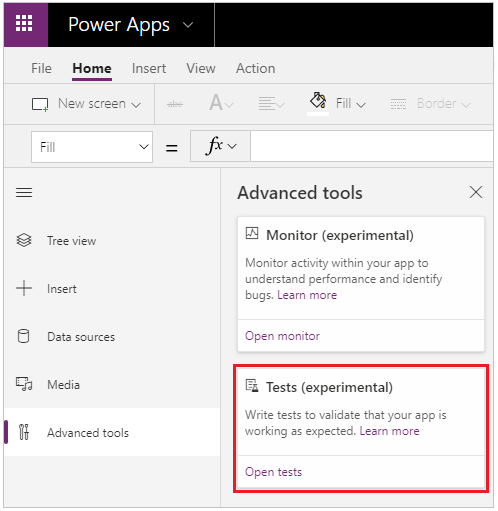

## Create a test suite

When you open Test Studio for your application for the first time, a default test suite and test case are created. Test suites are used to organize your test cases. An app can contain one or more test suites. You can use the default test suite and case to begin writing your tests immediately or create a new test suite. 

1. Select **New suite**. By default, a new case is always created when you create a new suite. 
2. Update the **Test suite name and description** by selecting the fields on the main grid. 

    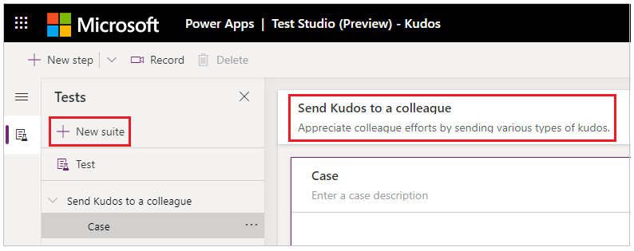

## Create a test case

Depending on how you want to organize or group or your tests together, you can create multiple test cases in a test suite. Each case can test a specific feature or a sub-set of functionalities in your app. 

1. Select a test suite 
2. Select New Case in the top menu. A new case is created in the selected test suite. 
3. Update the **Test case name and description** by selecting the fields on the main grid

 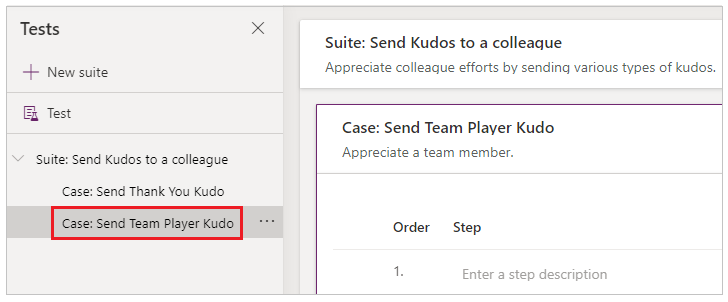

## Record a test case

A test case consists of test steps that contain actions. Test actions are written using familiar Power Apps expressions which perform a task, for example interacting with your app, setting variable values or validating the test results. There are two ways to create test steps in the Test Studio. You can manually write the test steps or use the recorder which will automatically generate the test steps as you interact with your app. After you record, you can update the test case, add new steps, delete steps and write test assertions to validate the result of your test. 

When in Record mode, the published app is playing. If you have made changes or added controls to your app and you have not published them, these changes will not be available and test steps cannot be recorded against them. 

1. Select **Record** from the top menu. This will open the published app in recording mode in the browser window. If selecting Record on a test case containing test steps, the steps will be overridden, and new test steps will be recorded. 

    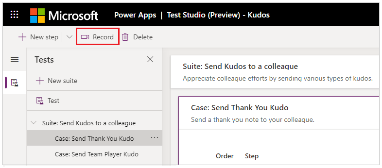

2. Interact with your app. Your actions will be **recorded** in the left pane. 
3. When you have completed recording your actions, select **Done**. Optionally, you can select **Cancel** to return to the Test Studio without your interactions getting recorded. 

    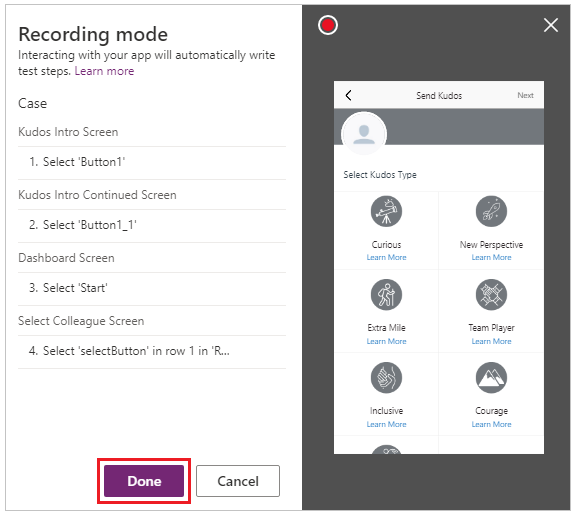

4. View the test steps and the expressions that were automatically generated for you in the Test Studio. 
5. Update the test step descriptions, if required, by selecting on the step description text in the main grid. You can also update the test step actions by selecting the formula on the main grid.

    

### Add Test Steps and Test Assertions

Every test case should have an expected result. In our Kudos example, one of the expected results of sending a Kudo is that a new record should be created in the Common Data Service (Common Data Service) database, in the Kudo entity. We will now update our test case and add additional test steps to validate a record was created successfully. If required, you can also reorder the test steps, update the test step actions and delete steps. 

To verify our record was created successfully, we will add steps to 

- Initialize a variable for the Kudo record count in the database at the beginning of the test case. 
- Initialize a variable for the Kudo record count in the database at the end of the test case. 
- Write a Test assertion expression to validate it incremented by 1. If the count has not increased by one, the test assertion will fail, and our test case will fail. 

Let’s begin adding the new steps. 

1. Select Step 1 (or the step where you want to insert a new step above or below)
2. Select Insert a step above from the top menu or by selecting the option from the active row.  This will create an empty step. 

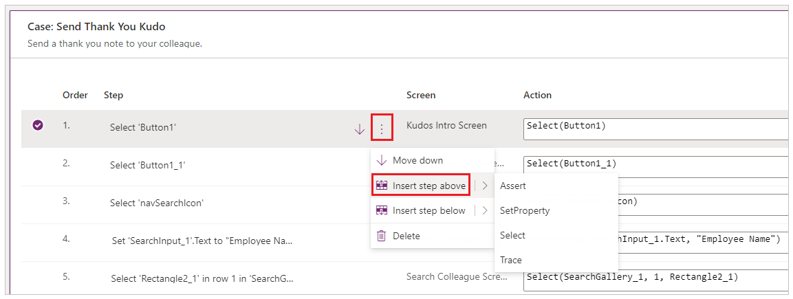

> [!NOTE]
> When you select **Insert step above**, it just adds a blank step above current step. You can also use **Assert**, **SetProperty**, **Select** or **Trace** actions instead. This adds step with respective action formula that you can edit.

3. Update the step description, example “Count Kudo in database”
Enter an expression or formula into the action input to count the records in the database for the user we are sending the Kudo to before we execute the test. Any expression that is supported by Power Apps can be written here. You can query any data sources, collections, variables or run flows that are contained in your app, as well as create new global variables or collections to use in your tests.

    ```Set(kudosBeforeTest, CountRows(Filter(Kudos, Receiver.Email = "someone@example.com")))```

4. Select Step 2
5. Select **Insert a step above** from the top menu or by selecting the option from the active row.  This will create an empty step. 
6. Enter an expression or formula into the action input to Trace step to write the kudosBeforeTest value to the test results record.

    ```Trace("kudosBeforeTest : " & kudosBeforeTest);```

        

7. Go to the bottom of the test case and insert a new step to count the records in the database after the test has completed. 

    ```Set(kudosAfterTest, CountRows(Filter(Kudos, Receiver.Email = "someone@example.com")))```

8. Add a final step validate the record count in the database has increased by 1. Enter the below assertion action to verify this. 

    ```Assert(kudosAfterTest = kudosBeforeTest + 1, "Kudos count incorrect. Expected : " & kudosBeforeTest + 1  & " Actual :" & kudosAfterTest)```

    

9. Save the test case from the top right menu in the Test Studio. Saving will save the test case to your application. 

## Play back your test

Now that we have a test case, with an assertion, we can playback the test to validate it is working as expected. Before you can play back your tests, you need to publish them. Tests are contained in the app, so publishing tests will also publish any changes in your app. Depending on the size and complexity of your app, the publish process may take between 15-30 seconds. When the publish process completes, you can play back all tests within a test suite or a single test case. If you are playing a test suite, test cases in the suite are executed in the order they are arranged. 

1. Click **Publish**. This automatically saves and publishes your test.

    

    > [!NOTE]
    > You must publish the app changes from Test Studio in order to play the recording back with recent changes. If you skip, the recording  plays back previous version of published app with test case or suite as selected. 
    >
    > 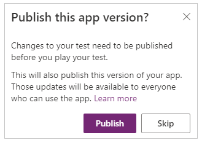

2. Select either a test suite or a single test case 
3. Click **Play**. The published app will open in Play mode, and you can see your test steps that you wrote playing back automatically in the browser. A green check mark indicates when a test step is executed successfully. If a step fails, a red failure indicator along with a failure message is displayed

    

4. Click Done to return to Test Studio authoring 

### Failed Assertion

Now, let’s change the test assertion you wrote previously to make the test fail to see what that experience looks like. 

1. Edit the assertion step by selecting the expression box. 

2. Update the “+1” to “+2” in the test action. This means that we are expecting 2 records to be created, which is incorrect. If the test is successful, only one record should be created in the database. We purposely want to make this test case fail to show the failure scenario. In a real-world scenario, the test may fail if we have updated the app and inadvertently introduced a "bug". The test would catch this regression and allow us to modify the app and reduce impact to our end users. 

    ```Assert(kudosAfterTest = kudosBeforeTest + 2, "Kudos count incorrect. Expected : " & kudosBeforeTest + 2  & " Actual :" & kudosAfterTest)```

    

3. Click Publish 
4. Click Play
5. Observe the test playing back. The final step will now fail and show an error and the message you provided in the assertion step.  

    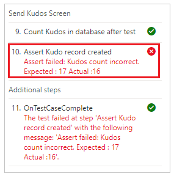

### Playing tests in a browser

To enable test automation scenarios, like integrating your tests into a continuous build and release pipeline such as Azure DevOps, you have the option to copy a URL to play a test suite containing multiple tests or a single test case outside of the Test Studio in a browser. The play link for a test suite or test case is persisted, and it will not change for the test suite or test case. This allows you to update your test suites or test cases, and since the play link is persisted, you would not need to modify your build and release process to consume those test changes. To play tests in your browser, follow the steps below:

1. Select a test suite or test case in the right pane
2. Click **Copy play link**

    

3. If you have made changes and not yet published, you will be prompted to publish your tests. 

    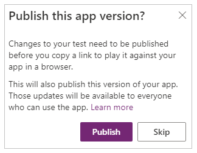

4. You can select to skip the publish process and copy the play link. If you decided to skip, any new test changes will not be played. 

    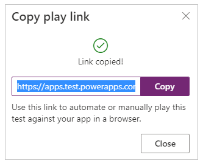

5. Open a browser and paste in the URL to the address bar to play the test. 
6. Observe your test playing back

## Processing Test Results

When the test is run in a browser, outside of the Test Studio, you will not be able to determine the specific test step that is executing or if the test has passed or failed. The test panel that is available when playing back tests in the Test Studio is not visible when playing back test against the published app in a browser. To determine test results outside of the Test Studio, there are two properties called **OnTestCaseComplete** and **OnTestSuiteComplete** available in the test object that you can use to process the results of your tests. If you are integrating your tests into a continuous build and release pipeline like **Azure DevOps**, these properties can also be used to help you determine if you should proceed with the app deployment. 

The Test object contains 2 properties called **OnTestCaseComplete** and **OnTestSuiteComplete**. The expression entered for these events are triggered when each case or suite completes. You can customize these events to process and send the results of your tests to other data sources, such as storing the results in a SQL server, Common Data Service or sending the results to a Flow or email. These settings apply to every test suite or test case in your app. After each test suite or test case completes, the test results and any trace messages contained in the tests are available in the TestCaseResult and TestSuiteResult records. 

The TestCaseResult record contains the following properties: 

- TestCaseName – the name of the test case
- TestCaseId – the Id of the test case
- TestSuiteName – the test suite name that the case belongs to 
- TestSuiteId – the test suite id that the case belongs to
- StartTime – the start execution time of the test
- EndTime – the end execution time of the test
- Traces – the result of any test Assertions and any messages from the Trace function. 
- Success – indicates if the test case completed successfully 
- TestFailureMessage – if the case failed, the failure message. 

The TestSuiteResult record contains the following properties: 

- TestSuiteName – the test suite name   
- TestSuiteId – the test suite id  
- StartTime – the start execution time of the test suite
- EndTime – the end execution time of the test suite
- TestsPassed – the number of test cases that completed successfully in the suite
- TestsFailed - the number of test cases that failed in the suite

In this example, I have created two custom entities in my Common Data Service database to store the results of my tests and we will customize the OnTestCaseComplete and OnTestSuiteComplete events to store the results in my entities.  To begin customizing the test completion events, follow the steps below. 

1. Click **Test** in the left pane or click **View** on the suite header.

    

2.	Select the **OnTestCaseComplete** action. 
3.	Input an expression to process the results of your test. Below, we are saving each test case results to the custom AppTestResults entity in Common Data Service. The test results could optionally be stored to SQL, SharePoint, or any other data source. Depending on the number of traces in your test case, you may need to set or increase the Trace field in your data source to a suitable length.

    ```
    //Save to Common Data Service
    Patch(AppTestResults
    , Defaults(AppTestResults)
    , {
             TestPass: TestCaseResult.TestCaseName & ":" & Text(Now())
             ,TestSuiteId: TestCaseResult.TestSuiteId
             ,TestSuiteName: TestCaseResult.TestSuiteName
             ,TestCaseId: TestCaseResult.TestCaseId
             ,TestCaseName: TestCaseResult.TestCaseName
             ,StartTime: TestCaseResult.StartTime
             ,EndTime: TestCaseResult.EndTime
             ,TestSuccess: TestCaseResult.Success
             ,TestTraces: JSON(TestCaseResult.Traces)
             ,TestFailureMessage: TestCaseResult.TestFailureMessage
    }
    );
    ```
    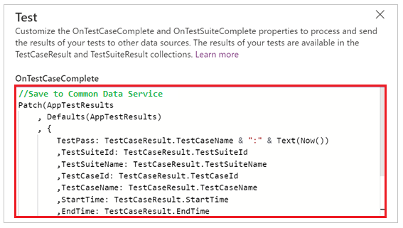

4. Select the OnTestSuiteComplete action. 
5. Input an expression to process the results of your test. Below, we are saving each test suite results to the custom AppTestSuiteResults entity in Common Data Service. The test results could optionally be stored to SQL, SharePoint, or any other data source. 

    ```
    //Save to Common Data Service
    Patch(AppTestSuiteResults
        , Defaults(AppTestSuiteResults)
        , {
             TestSuiteId: TestSuiteResult.TestSuiteId
             ,TestSuiteName: TestSuiteResult.TestSuiteName
             ,StartTime: TestSuiteResult.StartTime
             ,EndTime: TestSuiteResult.EndTime
             ,TestPassCount: TestSuiteResult.TestsPassed
             ,TestFailCount: TestSuiteResult.TestsFailed
        }
    );
    ```

    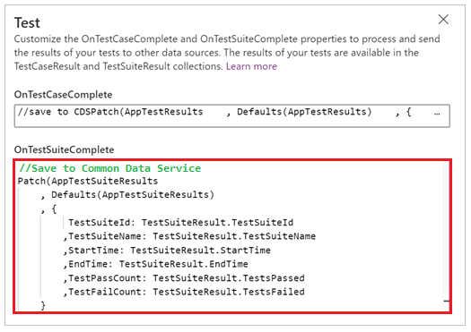

Other example of expressions you could use in these events are

- Send results to a Power Automate Flow. 

    ```MyTestResultsFlow.Run(JSON(TestCaseResult))```

- Email your results 

    ```Office365.SendMailV2(“xxxx@mycompany.com”, “Test case results”, JSON(TestCaseResult, JSONFormat.IndentFour))```


- Receive an app notification of the test result, for example when playing the test outside of the Test Studio, in the browser after a test completes 

    ```
    Notify(TestCaseResult.TestCaseName & " : " 
            & If( TestCaseResult.Success
                , " Passed"
                , TestCaseResult.TestFailureMessage)
            ,If(  TestCaseResult.Success
                , NotificationType.Success
                , NotificationType.Error)
    )
    ```

## Test Functions

Along with the standard functions available in Power Apps, below are common functions that you will typically use when authoring tests. 

