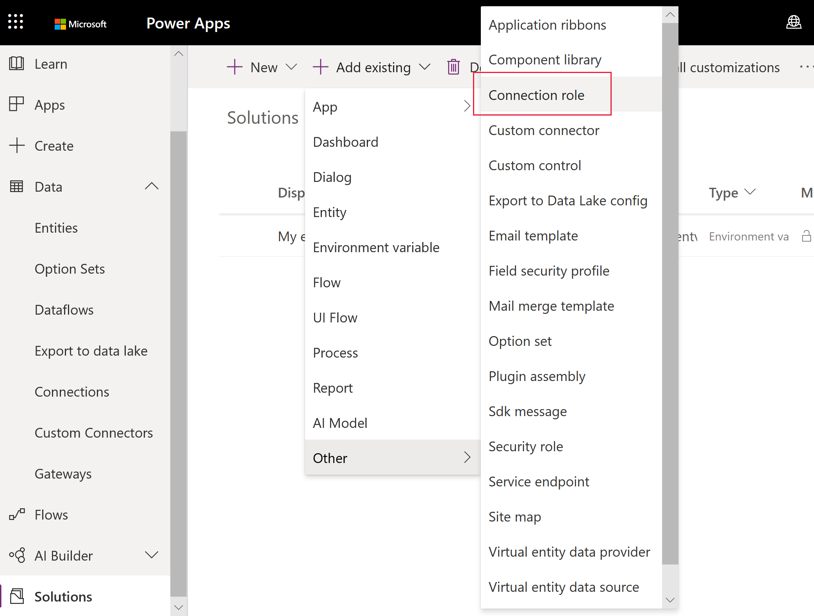
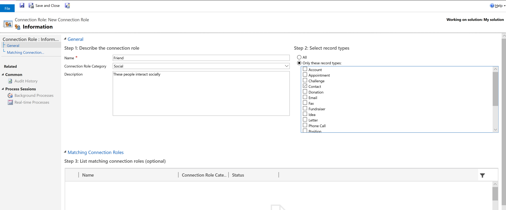

# Configure connection roles

With Common Data Service for Apps you can define **connections** between entity records without creating an entity relationship. In model-driven apps people can establish a named link between records to establish less a formal relationship which doesn't justify creating an actual entity relationship. Some examples include *friend*, *sibling*, *spouse*, *attendee*, and *stakeholder*. Some connections can can also be reciprocol, such as *child* and *parent*, *husband* and *wife*, or *doctor* and *patient*.

When people set a connection between two records, they can also add a description and additional information such as start and end dates for the relationship. More information: [Create connections to define and view relationships between records](/dynamics365/customer-engagement/basics/create-connections-view-relationships-between-records)

Anyone with write access to the **Connection Role** entity can establish which connection are available for people to use.

## View connection roles

There are a number of standard connection roles already configured in CDS for apps. To view them you need to go to the settings area. 

### Navigate to the settings area

1. While viewing a model-driven app edit the URL to remove everything after `dynamics.com` and refresh the page.
1. Navigate to **Settings** > **Business** > **Business Management** and then select **Connection Roles**.

In this view you can see all the connection roles that are available for this environment and you can edit them here.

> [!NOTE]
> If you want to distribute connection roles with a solution, make sure they are included in the solution you want to distribute. More information: [Add connection roles to a solution](#add-connection-roles-to-a-solution)

## View connection roles in the solution explorer.

Because connection roles are *solution aware*, which means that they can be included in a solution, you can also add connection roles to a solution you distribute.

[!INCLUDE [cc_navigate-solution-from-powerapps-portal](../../includes/cc_navigate-solution-from-powerapps-portal.md)]

Most of the connection roles you can see in the **Settings** area are defined within the *internal* **Default Solution** (not to be confused with the **Common Data Services Default Solution**). This internal **Default Solution** contains all the customizations in the system. To view the **Default Solution** choose the **All Solutions - Internal** view.

## Add connection roles to a solution

Generally it is not recommended to edit components in the internal **Default Solution**. Within the **Common Data Services Default Solution** or any solution you have created to work in, you can use the **Add Existing** command to bring any of the default connection roles into your solution.

Once you add the connection role to your solution, you can edit it wherever it is visible.

## Create or edit connection roles.

> [!IMPORTANT]
> If you intend to distribute a solution that includes new connection roles or changes to the existing connection roles you must add them to the solution you will distribute. Editing or adding new connection roles using the **Settings** area will add these connection roles to the internal **Default Solution** and will not include them in the solution you will distribute unless you first add it to your solution. More information [Add connection roles to a solution](#add-connection-roles-to-a-solution)

In the **Connection Roles** list, select one of the connection roles to edit it.
There are three steps to define a connection role which are clearly called out in the form.

### Describe the connection role

Set the following fields:

|Field|Description|
|--|--|
|**Name**|(Required) The text describing the connection.|
|**Connection Role Category**|A group describing the category of the connection. More information: [Connection Role Category values](#connection-role-category-values)|
|**Description**|Provide a definition for the role.|

#### Connection Role Category values

The default **Connection Role Category** values are:
- Business
- Family
- Social
- Sales
- Other
- Stakeholder
- Sales Team
- Service

You can add new categories or modify existing ones by editing the **Category** global option set. More information: [Create and edit global option sets for Common Data Service for Apps (picklists)](create-edit-global-option-sets.md)

### Select record types

Select which record types should be available to connect.

> [!NOTE]
> Although **All** is selected by default, make sure you consider which types are appropriate for the connection role you are adding.

### Matching connection roles

In this optional step, you can define any roles that be applied in a reciprocal manner. It is not required, but connections are more meaningful if these are defined.

For example, people can set that Glen is a *Friend* to Mary, but does this mean that Mary is a *Friend* to Glen? We hope so. But if Glen is the *Father* of Mary it doesn't mean that Mary is the *Father* of Glen. Establishing correct reciprocity requires this extra step.

When people set a connection role that doesn't have a matching connection role, the role will only be displayed when viewing the connection from the record that the connection was applied to. When viewed from the connected record, the role will be empty unless a matching role is set.

For role definitions like *Friend*, *Spouse*, *Colleague*, or *Sibling*, it is best to assign the matching role to itself. If a single matching connection role is configured, the single matching connection role will be applied in both directions.

> [!IMPORTANT]
> You will need to save a new connection role without this matching connection role before you can set the matching connection role to itself.

You will find that some connection roles are already configured with matching connection roles. *Former Employee* is matched with *Former Employer* and vice versa. This kind of one-to-one matching connection role is most common.

You can configure multiple matching connection roles to describe complex relationships. If you create a connection role such as *Father*, you could configure two more roles such as *Daughter* and *Son* and apply both of them as matching connection roles to *Father*. In turn, both the *Daughter* and *Son* connection roles should be matched to *Father*. Of course, then you should set up an equivilent role for *Mother* that is similarly matched with *Daughter* and *Son*.

> [!TIP]
> Before you create a complex set of connection roles, consider if a more simple set of roles will be enough. For example, rather than creating a complex set of connection roles like *Father*, *Mother*, *Son*, and *Daughter* - consider if simply using *Parent* and *Child* will work for you.

If more than one matching connection role is configured, those connection roles represent the only valid reciprocal roles. The first one will be applied automatically as the default value. If the default value is not correct, people need to manually edit the connection and choose between valid options defined in the configuration.

### See also
<!-- This is in the basics guide. It needs to be migrated -->
[Create connections to define and view relationships between records](/dynamics365/customer-engagement/basics/create-connections-view-relationships-between-records) 
[Create and edit global option sets for Common Data Service for Apps (picklists)](create-edit-global-option-sets.md) 
[Create and edit relationships between entities](create-edit-entity-relationships.md)

