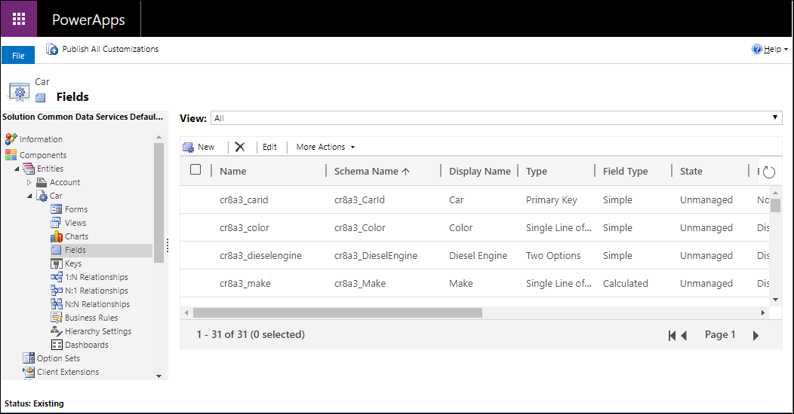
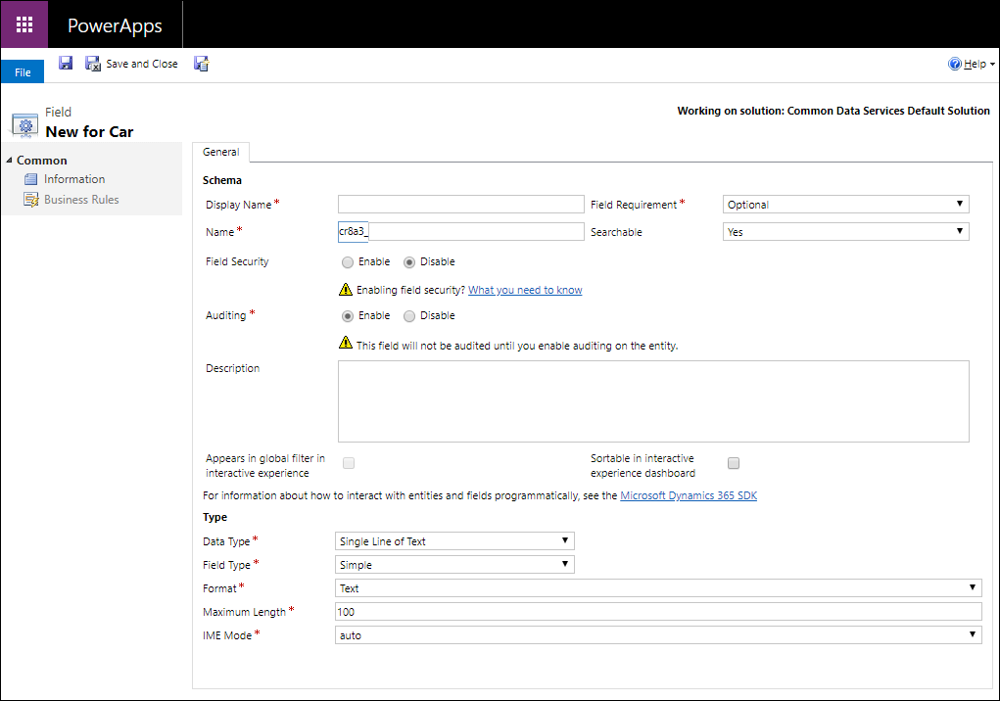
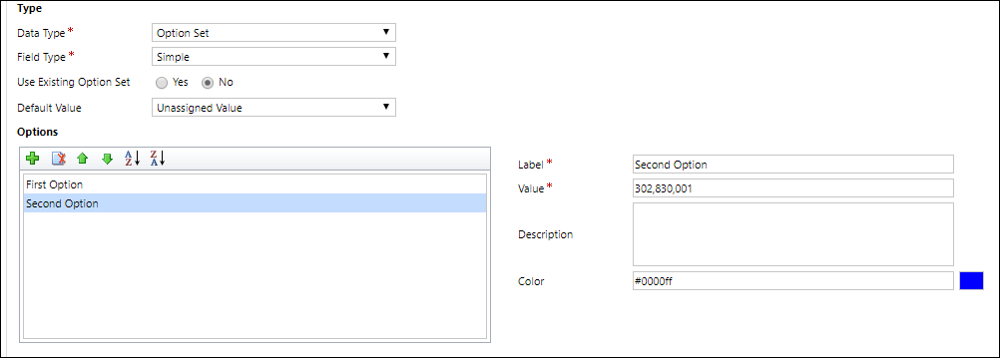
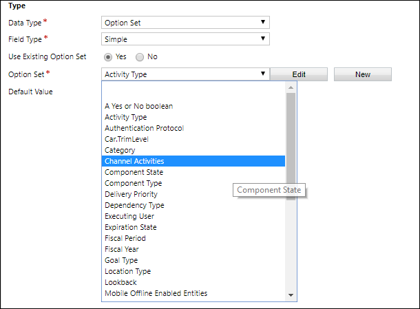
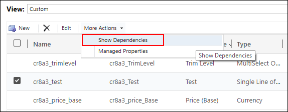

# Create and edit fields for Common Data Service for Apps using PowerApps solution explorer

Solution explorer provides one way to Create and edit fields for Common Data Service for Apps.

The [PowerApps portal](https://web.powerapps.com/?utm_source=padocs&utm_medium=linkinadoc&utm_campaign=referralsfromdoc) enables configuring the most common options, but certain options can only be set using solution explorer.  More information: 
- [Create and edit fields for Common Data Service for Apps](create-edit-fields.md)
- [Create and edit fields for Common Data Service for Apps using PowerApps portal](create-edit-field-portal.md)
  
## Open solution explorer

Part of the name of any custom field you create is the customization prefix. This is set based on the solution publisher for the solution you’re working in. If you care about the customization prefix, make sure that you are working in an unmanaged solution where the customization prefix is the one you want for this entity. More information: [Change the solution publisher prefix](change-solution-publisher-prefix.md) 

[!INCLUDE [cc_navigate-solution-from-powerapps-portal](../../includes/cc_navigate-solution-from-powerapps-portal.md)]

## View fields

With solution explorer open, under **Components** expand **Entities** and select the entity where you want to create or edit the field.

You can select the following views: 

 |View|Description|
 |--|--|
 |**All**| Shows all the fields for the entity|
 |**Custom**|Shows only custom fields for the entity|
 |**Customizable**|Shows only the fields that can be edited|

## Create a field

While viewing fields, in the command bar, click **New** which will open the new field form.  Some standard entities or custom entities that are included in a managed solution might not allow you to add new fields.

> [!NOTE]
> For model-driven apps you can also create a new field from the form editor. In the form editor, below the **Field Explorer** click **New Field** to create a new field. More information: [Add a field to a form](../model-driven-apps/add-field-form.md)

You must enter data and confirm default values set for the following properties before you save.

|Property|Description|
|--|--|
|**Display Name**|The text to be displayed for the field in the user interface. You can change this after you save, but the value you enter will generate a value for the **Name** field.|
|**Field Requirement**|Whether data is required in the field to save the record. More information: [Field Requirement options](#field-requirement-options)|
|**Name**|The unique name across your environment. A name will be generated for you based on the display name that you've entered, but you can edit it before saving. Once a field is created the name cannot be changed as it may be referenced in your applications or code. The name will have the customization prefix for the current solution's publisher prepended to it.|
|**Searchable**|Set this to **No** for fields for the entity that you don’t use.  When a field is searchable it appears in **Advanced Find** in model-driven apps and is available when customizing views. De-selecting this will reduce the number of options shown to people using advanced find.|
|**Field Security**|Whether the data in the field is secured at a higher level than the entity. More information: [Field level security to control access](/dynamics365/customer-engagement/admin/field-level-security)|
|**Auditing**|Whether data for this field will be audited when the entity is enabled for auditing. More information: [Audit data and user activity for security and compliance](/customer-engagement/admin/audit-data-user-activity)|
|**Description**|Enter instructions to the user about what the field is for. These descriptions appear as tooltips for the user in model-driven apps when they hover their mouse over the label of the field.|
|**Appears in global filter in interactive experience**|More information: [Configure interactive experience dashboards](/dynamics365/customer-engagement/customize/configure-interactive-experience-dashboards) |
|**Sortable in interactive experience dashboard**|More information: [Configure interactive experience dashboards](/dynamics365/customer-engagement/customize/configure-interactive-experience-dashboards)|
|**Data type**|Controls how values are stored as well as how they are formatted in some applications. Once a field is saved, you cannot change the data type as it may impact the data in your entity. More information: [Field Data types](#field-data-types)|
|**Field type**|Whether the field is **Simple**, **Calculated**, or **Rollup**. More information: [Field Type](#field-type)|
|**Format**|How the field will be formatted. The available formatting options depend on the **Data type**.|

You can set additional options depending on your choice of **Data type**. More information: [Field Data types](#field-data-types)

## Field Requirement options

There are three field requirement options:
- **Optional**: The record can be saved even if there is no data in this field.
- **Business Recommended**: The record can be saved even if there is no data in this field. However, a blue symbol appears next to the field to indicate it is important.
- **Business Required**: The record can’t be saved if there is no data in this field.
> [!NOTE]
> Be careful when you make fields business required. People will resist using the application if they can’t save records because they lack the correct information to enter into a required field. People may enter incorrect data simply to save the record and get on with their work. You can use business rules or form scripts to change the requirement level as the data in the record changes as people work on it. More information  [Create business rules and recommendations to apply logic in a form](../model-driven-apps/create-business-rules-recommendations-apply-logic-form.md)

## Field Data types

There are many different types of fields, but you can only create some of them. For more information about all types of fields, see [Types of fields and field data types](types-of-fields.md).

When creating a field, **Data type** provides the following choices:

|Option|Description|
|--|--|
|**Single Line of Text**|This field can contain up to 4,000 text characters. You can set a maximum length to be less than this. This field has several format options that will change the presentation of the text.  More information: [Single line of text options](#single-line-of-text-options)|
|**Option Set**|Displays a list of options where one can be selected. More information: [Option set field options](#option-set-field-options)|
|**MultiSelect Option Set**|Displays a list of options where more than one can be selected. More information: [Option set field options](#option-set-field-options)|
|**Two Options**|Displays a list of options where one of two can be selected.   Two option fields don’t provide format options at the field level. But when you add one to the form you can choose to display them as radio buttons, a check box, or a select list.|
|**Image**|Displays a single image per record in the application. Each entity can have one image field. Image fields are always named `EntityImage`.|
|**Whole Number**|Integers with a value between -2,147,483,648 and 2,147,483,647 can be in this field.  This field has options that change depending on how the field is presented. More information: [Whole number options](#whole-number-options)|
|**Floating Point Number**|Up to 5 decimal points of precision can be used for values between -100,000,000,000 and -100,000,000,000 can be in this field. You can specify the level of precision and the maximum and minimum values. More information: [Using the right type of number](types-of-fields.md#using-the-right-type-of-number)|
|**Decimal Number**|Up to 10 decimal points of precision can be used for values between -100,000,000,000 and -100,000,000,000 can be in this field. You can specify the level of precision and the maximum and minimum values. More information: [Using the right type of number](types-of-fields.md#using-the-right-type-of-number)|
|**Currency**|Monetary values between -922,337,203,685,477 and 922,337,203,685,477 can be in this field. You can set a level of precision or choose to base the precision on a specific currency or a single standard precision used by the organization. More information: [Using currency fields](types-of-fields.md#using-currency-fields)|
|**Multiple Lines of Text**|This field can contain up to 1,048,576 text characters. You can set the maximum length to be less than this. When you add this field to a model-driven app form, you can specify the dimensions of the field.|
|**Date and Time**|Use these fields to store time values. You can store values as early as 1/1/1753 12:00 AM. More information: [Date and Time options](#date-and-time-options)|
|**Lookup**|A field that allows setting a reference to a single record of a specific type of entity. Some system lookup fields behave differently. More information: [Different types of lookups](types-of-fields.md#different-types-of-lookups)|
|**Customer**|A lookup field that you can use to specify a customer, which can be an account or contact.  More information: [Different types of lookups](types-of-fields.md#different-types-of-lookups)|

### Single line of text options

The single line of text data type has the following format options:

|Format|Description|
|--|--|
|**Text**|A text value intended to be displayed in a single-line textbox.|
|**Text Area**|A text value intended to be displayed in a multi-line textbox. If you require more than 4,000 characters, use a **Multiple Lines of Text** data type.|
|**Email**|A text value validated as an e-mail address and rendered as a mailto link in the field. |
|**URL**|A text value validated as a URL and rendered as a link to open the URL.|
|**Ticker Symbol**|A text value for a ticker symbol that will display a link that will open to show a quote for the stock ticker symbol. |
|**Phone**|A text value validated as a phone number rendered as link to initiate a phone call by using Skype. |

You can also set a **Maximum length** to so that the system will not allow text values longer than you specify.

### Option set field options

Fields that provide a set of options can include their own set of *local* options or refer to a common set of *global* options that can be used by multiple fields.

Using a global option set is valuable when you find yourself creating the same set of options for multiple fields. With a global option set, you only need to maintain the set of options in one place. 

When you choose **Multi Select Option Set** or **Option Set** data type the solution explorer designer will provide the option for a local option set by default.

#### Configure local options

[!INCLUDE [cc_configure-option-set-options-solution-explorer](../../includes/cc_configure-option-set-options-solution-explorer.md)]

#### Use Existing Option Set

If you to choose **Use Existing Option Set** the designer will display a list of existing *global option sets* and include an **Edit** and **New** buttons to configure the global options that this field should use.

You can also configure global option sets separately. More information: [Create and edit global option sets for Common Data Service for Apps (picklists)](create-edit-global-option-sets.md)

> [!NOTE]
> If you define every option set as a global option set your list of global option sets will grow and could be difficult to manage. If you know that the set of options will only be used in one place, use a local option set.

### Whole number options

Whole number fields have the following format choices:

|Format|Description|
|--|--|
|**None**|A number value presented in a text box.|
|**Duration**|A number value presented as a drop-down list that contains time intervals. A user can select a value from the list or type an integer value that represents the number of minutes.|
|**Timezone**|A number value presented as a drop-down list that contains a list of time zones.|
|**Language**|A number value presented as a drop-down list that contains a list of languages that have been enabled for the environment. If no other languages have been enabled, the base language will be the only option. The value saved is the Locale Identifier (LCID) value for the language.|

You can also restrict the maximum or minimum allowed values.

### Date and Time options

Date and Time fields have the following options:

|Format |Description|
|--|--|
|**Date and Time**|A date and time value.|
|**Date Only**|A date and time value that only displays a date. The time value is stored as 12:00 AM (00:00:00) in the system.|

You can also set specific **Behavior** for Date Time fields in the **Advanced options**.

- **User local** : Displays values converted to in the current user’s local time zone. This is the default for new fields.
- **Date only**: This behavior is available for the **Date Only** type. Displays values without time zone conversion. Use this for data like birthdays and anniversaries.
- **Time zone independent**:  Displays values without time zone conversion.

More information: [Behavior and format of the Date and Time field](behavior-format-date-time-field.md)

## Field Type

You can set a custom field **Field Type** to be a **Simple**, **Calculated**, or a **Rollup** field. 

### Simple

Simple means that the field is not a calculated or rollup field.

### Calculated

With a calculated field you can enter a formula to assign a value to the field. 
These data types can be set to calculated fields: **Currency**, **Date and Time**,  **Decimal Number**,  **Multi Select Option Set**, **Option Set**, **Single line of text**, **Two Options**, and **Whole Number**.

More information: [Define calculated fields to automate manual calculations](define-calculated-fields.md)

### Rollup

With a rollup field you can set aggregation functions that will run periodically to set a number value for the field. These data types can be set to calculated fields: **Currency**, **Date and Time**, **Decimal Number**, and **Whole Number**.

More information: [Define rollup fields that aggregate values](define-rollup-fields.md)

## Save new field

Once you have configured the field, use one of three commands in the command bar:

|Command|Description|
|--|--|
|**Save**|Save the field definition and leave the form window open.|
|**Save and Close**|Save the field definition and close the window.|
|**Save Create New**|Save the field definition and open a new form to create a new field.|

## Edit a field 

While [viewing fields](#view-fields), click the field you want to edit. Some standard fields or custom fields that are included in a managed solution might not allow you to edit them.

> [!NOTE]
> When editing a form, for any field already added to the form you can double-click the field to display the **Field Properties**. On the **Details** tab, click **Edit**. More information: [Add a field to a form](../model-driven-apps/add-field-form.md)

After you make changes to a field, you must publish customizations. 

- To publish your changes for one entity, under **Components**, select **Entities**, and then select the entity that you made changes to. On the **Actions** toolbar, select **Publish**.  
  
- To publish all changes you have made to multiple entities or components, on the **Actions** toolbar, select **Publish All Customizations**.  
  
> [!NOTE]
>  Installing a solution or publishing customizations can interfere with normal system operation. We recommend that you schedule a solution to be published when it’s least disruptive to users.  

### Edit multiple fields

To edit one or more fields, select the field or fields (using the Shift key) you want to modify and then on the **Actions** toolbar, select **Edit**. 
  
When you select multiple fields to edit, the **Edit Multiple Fields** dialog box appears. You can edit **Field Requirement**, **Searchable**, and **Auditing**. 

## Delete a field

With the system administrator security role, you can delete any custom fields that aren’t part of a managed solution. When you delete a field, any data stored in the field is lost. The only way to recover data from a field that was deleted is to restore the database from a point before the field was deleted.

> [!NOTE]
> Before you can delete a custom field, you must remove any dependencies that may exist in other solution components. 

1. While [viewing fields](#view-fields), select a custom field that can be deleted in the list and click the  button in the command bar.
2. In the **Confirm Deletion** dialog, select **Delete**.

> [!TIP]
> You can select multiple custom fields to be deleted in one operation.

### Check field dependencies 

Select the field in the list. In the **More Actions** menu, select **Show Dependencies**.

Dependencies are any related use of the field that would prevent it from being deleted. For example, if the field is used in a form or view, you must first remove references to the field in those solution components.  
  
If you delete a lookup field, the 1:N entity relationship for it will automatically be deleted.  

## IME Mode

Any of the fields that provide direct text input have an IME Mode. The Input Method Editor (IME) is used for east asian languages like Japanese. IMEs allow the user to enter the thousands of different characters used in east asian written languages using a standard 101-key keyboard.

### See also  
[Create and edit fields for Common Data Service for Apps](create-edit-fields.md) 
[Create and edit fields for Common Data Service for Apps using PowerApps portal](create-edit-field-portal.md) 
[Types of fields and field data types](types-of-fields.md) 
[Define calculated fields to automate manual calculations](define-calculated-fields.md) 
[Define rollup fields that aggregate values](define-rollup-fields.md) 
[Behavior and format of the Date and Time field](behavior-format-date-time-field.md)
