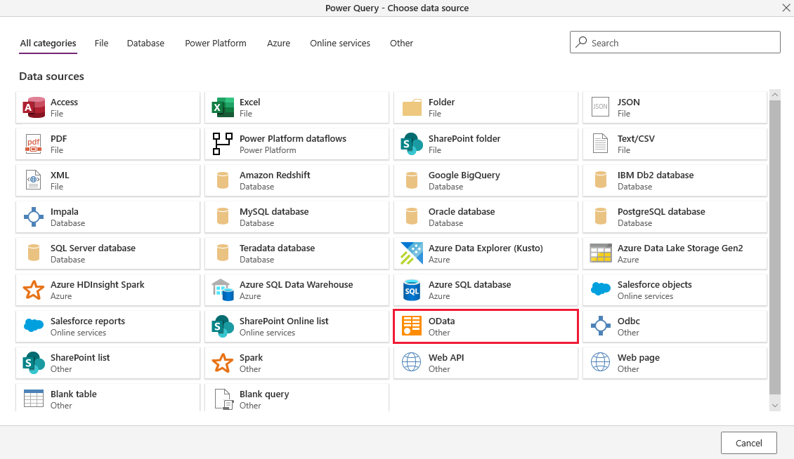
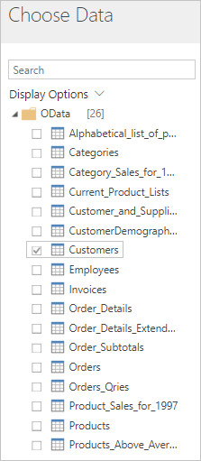
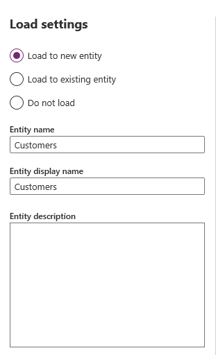
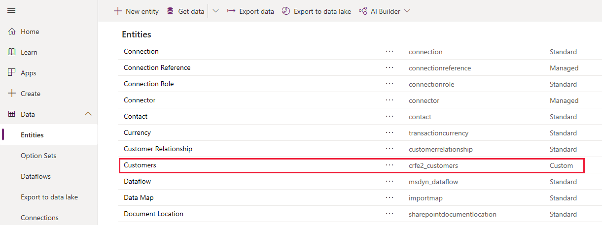
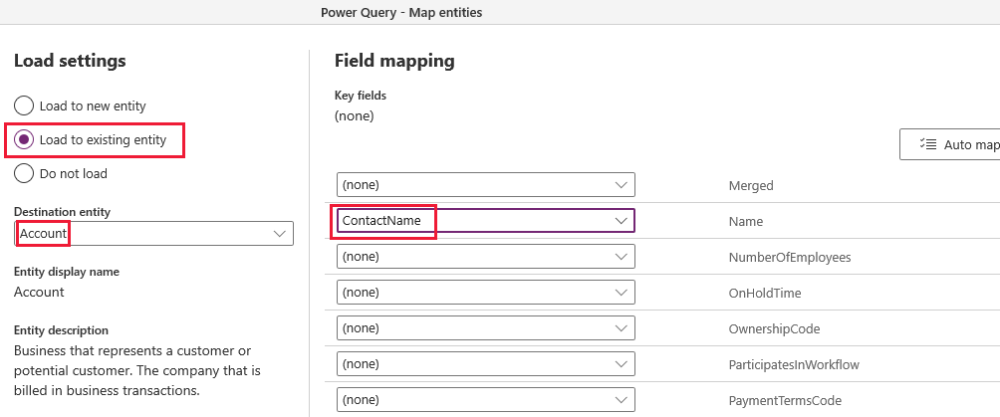

# Quickstart: Add data to an entity in the Common Data Service by using Power Query
In this procedure, you'll create an entity in the [Common Data Service for Apps](data-platform-intro.md) and fill that entity with data from an OData feed by using Power Query. You can use the same techniques to integrate data from these online and on-premises sources, among others:

* SQL Server
* Salesforce
* IBM DB2
* Access
* Excel
* Web APIs
* OData feeds
* Text files

You can also filter, transform, and combine data before you load it into a new or existing entity.

If you don't have a license for PowerApps, you can [sign up for free](../signup-for-powerapps.md).

## Prerequisites
To follow this topic, you must switch to an [environment](../canvas-apps/working-with-environments.md) in which you can create entities.

## Specify the source data

1. Sign in to [PowerApps](https://web.powerapps.com), and then click or tap the down arrow for **Data** near the left edge.

	

1. In the list that appears, click or tap **Data Integration**, and then click or tap **New Project** near the upper-right corner of the window.

1. In the list of data sources, click or tap **OData**.

	

1. Under **Connection settings**, type or paste this URL, and then select **Next**: 
`http://services.odata.org/V4/Northwind/Northwind.svc/`

1. In the list of tables, select the **Customers** check box, and then click or tap **Next**.

	

1. (optional) Modify the schema to suit your needs by choosing which columns to include, transforming the table in one or more ways, adding an index or conditional column, or making other changes.

1. In the lower-right corner, click or tap **Next**.

## Specify the target entity
1. Under **Load settings**, select **Load to new entity**.

    

    You can give the new entity a different name or display name, but leave the default values to follow this tutorial exactly.

1. In the **Primary name field** list, click or tap **ContactName**, and then click or tap **Next** in the lower-right corner.

    You can specify a different primary-name field, map a different column in the source table to each field in the entity that you're creating, or both. To follow this tutorial exactly, leave the default column mapping.

1. When the **Load status** is **Completed**, select **Done** in the lower-right corner.

1. Under **Data** (near the left edge), select **Entities** to show the list of entities in your database.

    The **Customers** entity that you created from an OData feed appears as a custom entity.

    

> [!WARNING]
> If you use Power Query to add data to an existing entity, all data in that entity will be overwritten.

If you select **Load to existing entity**, you can specify an entity into which you add data from the **Customers** table. You could, for example, add the data to the **Account** entity with which the Common Data Service ships. Under **Source column**, you can further specify that data in the **ContactName** column from the **Customers** table should be added to the **Name** column in the **Accounts** entity.

We're excited about this functionality and eager to hear your feedback. Please [send us your suggestions and feedback](https://powerusers.microsoft.com/t5/PowerApps-Community/ct-p/PowerApps1) about this feature!

If an [error message about permissions](data-platform-cds-newentity-troubleshooting-mashup.md) appears, talk to your administrator.