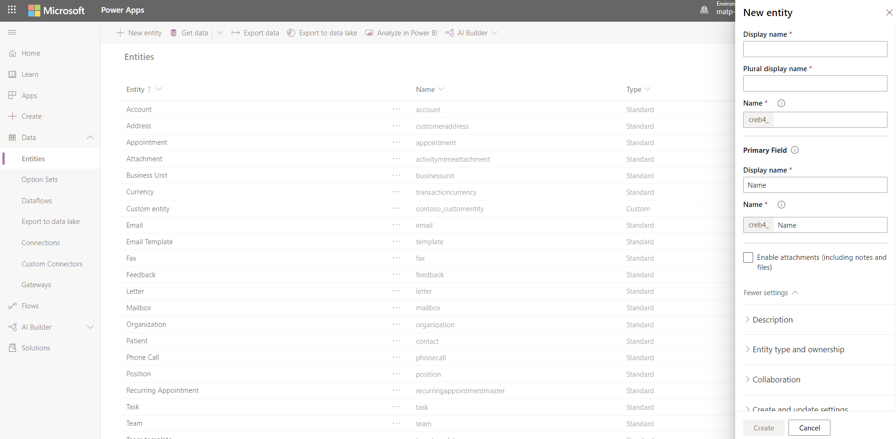

# Create a custom entity
You can create a custom entity to store data that is specific to your organization. You can then show that data by developing an app that refers to the entity. After you create an entity, you can [create or modify one or more of its fields](data-platform-manage-fields.md), and [build relationships between entities](data-platform-entity-lookup.md).

These instructions will show you how to create a custom entity manually, you can also use Power Query to create an entity based off your existing data. For more information, see [Create new entity using Power Query](data-platform-cds-newentity-pq.md)

> [!NOTE]
> Before you create an entity, see the [entity reference](../../developer/common-data-service/reference/about-entity-reference.md). These entities cover typical scenarios, such as accounts and contacts. If one of these entities will meet your requirements out of the box or after only minor changes, you can save yourself some time by starting with that entity.

## Create an entity
1. On [powerapps.com](https://web.powerapps.com), expand the **Data** section and click or tap **Entities** in the left navigation pane.

    

2. From the command bar, click or tap **New entity**.
3. In the **Display name** field, enter a name that's easily recognizable for you to refer to this entity in the future. This is also used in forms, charts and other objects created using this entity. You'll notice two other fields also be populated:

    * Plural display name - this is used when interacting with this entity from PowerApps or Flow, and used as the name of the entity through the Common Data Service WebAPI. The Plural name should be automatically generated, but can be changed.
    * Name - this is the unqiue name of the entity, it cannot contain special charecters or spaces and must be unqiue. The name also includes a prefix which was setup when your environment was created, this is used ensure the entities you create can be exported and imported into other environemnts with colliding with other entity names. This prefix can be changed by updating the prefix on your Publisher for the Common Data Service Default Solution.

    > [!NOTE]
    > The **Display name** fields can be updated at anytime to display differently in your apps, the **Name** field cannot be changed after your entity has been saved as this could result in breaking an existing app.

    

4. Click **Next** and you'll be taken to the Entity details page. By default every entity starts with one field, the "Primary Name" this field is used when lookups are created against this entity. It should typically be used to store the name or primary description of the data being stored in the entity.

    > [!NOTE]
    > The name and display name of the **Primary Name** field can be updated before saving the entity for the first time. For example, if you wanted to call this field "Student name" instead of "Primary name"

    

5. Optional: Add a text field to your entity by clicking **Add field**. In the New Field panel, enter the **Display name** for your field and select the Data type. For more information, see [Manage fields in an entity](data-platform-manage-fields.md).

    

6. Click **Done** to add the field, and repeat step 5 to add additional fields.
7. Click **Save entity** to save your entity and make it available for use in apps.

    Your entity appears in the list of entities in your database. To see entties you've created, you can change the filter in the command bar from "Default" to "Custom"

## System fields
All entities have system fields. These fields are read-only. Therefore, you can't change or delete these fields, and you don't assign values to them. By default system fields will not be shown in the list of fields even though they exist on the entity. To see all fields, you can change the filter on the Command Bar from **Default** to **All**.

For more inforamtion on the metadata related to an entity, see [Entity metadata](../../developer/common-data-service/entity-metadata.md)

## Next steps
* [Manage fields in an entity](data-platform-manage-fields.md)
* [Define relationships between entities](data-platform-entity-lookup.md)
* [Generate an app by using a Common Data Service database](../canvas-apps/data-platform-create-app.md)
* [Create an app from scratch using a Common Data Service database](../canvas-apps/data-platform-create-app-scratch.md)

## Privacy notice
With the Microsoft PowerApps common data model we collect and store custom entity and field names in our diagnostic systems.  We use this knowledge to improve the common data model for our customers. The entity and field names that Creators create help us understand scenarios that are common across the Microsoft PowerApps community and ascertain gaps in the service’s standard entity coverage, such as schemas related to organizations. The data in the database tables associated with these entities is not accessed or used by Microsoft or replicated outside of the region in which the database is provisioned. Note, however, the custom entity and field names may be replicated across regions and are deleted in accordance with our data retention policies. Microsoft is committed to your privacy as described further in our [Trust Center](https://www.microsoft.com/trustcenter/Privacy/default.aspx).

