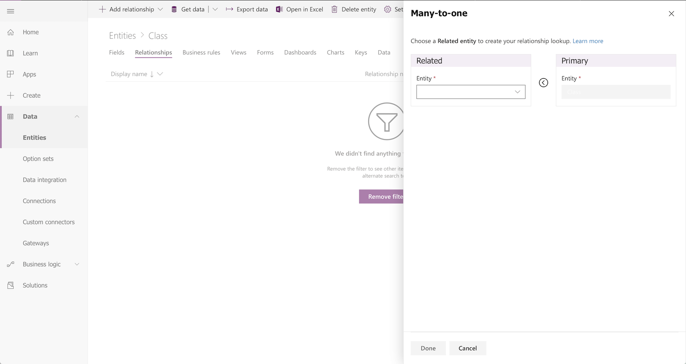
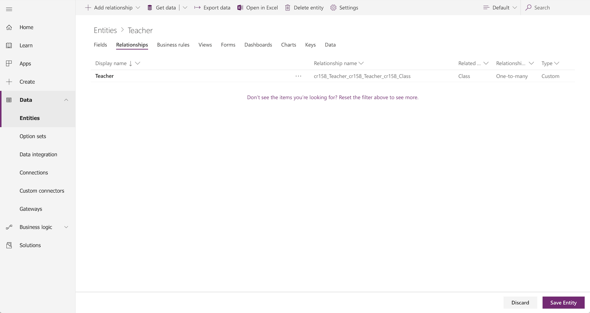
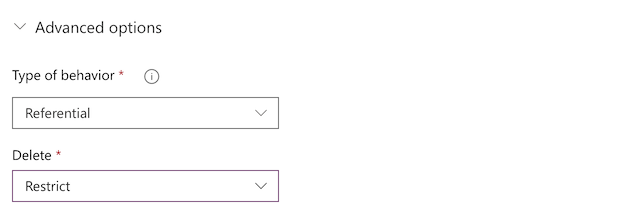
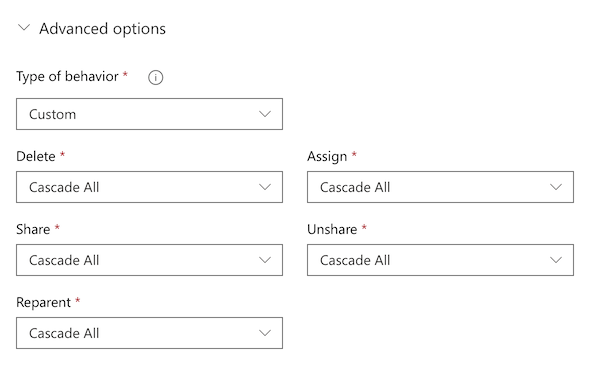

# Create a relationship between entities
Data in one entity often relates to data in another entity. For example, you might have a **Teachers** entity and a **Class** entity, and the **Class** entity might have a lookup relation to the **Teachers** entity to show which teacher teaches the class. You can use a lookup field to show data from the **Teachers** entity. This is commonly referred to as a lookup field.

## Define a relationship
You can create several types of relationships from one entity to another (or between an entity and itself). Each entity can have a relationship with more than one entity, and each entity can have more than one relationship to another entity. Some common relationship types are:

* **Many-to-one** - In this type of relationship, each record in entity A can match more than one record in entity B, but each record in entity B can match only one record in entity A. For example, a class has a single classroom. This is the most common type of relationship and is shown in the field list as a **Lookup field**
* **One-to-many** - In this type of relationship, each record in entity B can match more than one record in entity A, but each record in entity A can match only one record in entity B. For example, a single teacher, teaches many classes.
* **Many-to-many** - In this type of relationship, each record in entity A can match more than one record in entity B, and vice versa. For example, students attend many classes, and each class can have multiple students.

Additionally, you can set advanced cascading behaviors on many-to-one and one-to-many relationships whenever an action is taken on the parent entity.

## Add a lookup field (Many-to-one relationship)

To add a lookup relation to an entity, create a relation under the **Relationships** tab and specify the entity with which you want to create a relationship.

1. On [powerapps.com](https://web.powerapps.com/?utm_source=padocs&utm_medium=linkinadoc&utm_campaign=referralsfromdoc), expand the **Data** section and click or tap **Entities** in the left navigation pane.

2. Click or tap an existing entity, or [Create a new entity](data-platform-create-entity.md)

3. Click **Relationships**

4. Click **Add relationship**, this will open a new panel for you to choose the entity you want to create a relationship to. Select the entity from the **Related entity** drop down.

    > [!div class="mx-imgBorder"] 
    > 

5. After selecting an entity the Look up fields will be shown on the Primary entity, they will default with the entity's name (in this example Classroom) but you can change them if needed.

    

6. Click **Done** to add the relationship to your entity, and then click **Save entity**.

    > [!div class="mx-imgBorder"] 
    > 

## Add a One-to-many relationship

To add a One-to-many relationship, create a relation under the **Relationships** tab and specify the entity with which you want to create a relationship.

1. On [powerapps.com](https://web.powerapps.com/?utm_source=padocs&utm_medium=linkinadoc&utm_campaign=referralsfromdoc), expand the **Data** section and click or tap **Entities** in the left navigation pane.

2. Click or tap an existing entity, or [Create a new entity](data-platform-create-entity.md)

3. Click **Relationships**

4. Click  the down arrow to the right of **Add relationship**, this will give you the choice of both types of relationships. Click **One-to-many** this will open a new panel for you to choose the entity you want to create a relationship to. Select the entity from the **Related entity** drop down.
    > [!div class="mx-imgBorder"] 
    > 

5. After selecting an entity the Look up fields will be shown on the Primary entity, they will default with the entities name (in this example Class) but you can change them if needed.

    > [!NOTE]
    > In the case of a One-to-many relationships, the Look up field will be created on the related entity, not the entity you currently have selected. If you need the lookup on the current entity, please create a Many-to-one relationship.

    > [!div class="mx-imgBorder"] 
    > 

6. Click **Done** to add the relationship to your entity, and then click **Save entity**.

    > [!div class="mx-imgBorder"] 
    > 

## Add a Many-to-many relationship
To add a Many-to-many relationship, create a relation under the **Relationships** tab and specify the entity with which you want to create a relationship.

1. On [powerapps.com](https://web.powerapps.com/?utm_source=padocs&utm_medium=linkinadoc&utm_campaign=referralsfromdoc), expand the **Data** section and click or tap **Entities** in the left navigation pane.

2. Click or tap an existing entity, or [Create a new entity](data-platform-create-entity.md)

3. Click **Relationships**

4. Click  the down arrow to the right of **Add relationship**, this will give you the choice of both types of relationships. Click **Many-to-many** this will open a new panel for you to choose the entity you want to create a relationship to. Select the entity from the **Related entity** drop down.

5. After selecting an entity, the names for the relationship and relationship entity will appear. They will default with the names of the entities combined, but you can change them if needed.

    > [!div class="mx-imgBorder"] 
    > 

6. Click **Done** to add the relationship to your entity, and then click **Save entity**.

## Add advanced relationship behavior

While building a one-to-many or a many-to-one relationship, you can also set advanced behaviors.

These options are also referred to as cascading behaviors because they cascade down the hierarchy of related entities. For example, it may be desireable to delete the related tests and homework of a student if a student is removed from the system. This type of behavior is called a parental relationship.

On the other hand, you may decide that you don't want  actions to cascade down the hierarchy. For example, in the teacher to class relationship you may decide that the child entity (class) should *not* be deleted when a parent (teacher) is deleted. This is called a referential relationship.

As you model your business data by creating custom entities or when using existing Common Data Model entities, consider the behavior you require and the implications for the entire hierarchy of related entities and choose between one of the following standard behaviors:

* **Referential, Remove Link:** In a referential relationship between two entities, you can navigate to any related records, but actions taken on one will not affect the other. For example, if you have a one-to-many relationship between teachers and classes, deleting a teacher will have no impact on the related class.

* **Referential, Restrict Delete:** In a referential, restrict delete relationship between two entities, you can navigate to any related records. Actions taken on the parent record will not be applied to the child record, but the parent record cannot be deleted while the child record exists. This is useful if you do not want child records to become orphaned. This forces the user to delete all of the children before deleting the parent.

    > [!div class="mx-imgBorder"] 
    > 

* **Parental:** In a parental relationship between two entities, any action taken on a record of the parent entity is also taken on any child entity records that are related to the parent entity record. For example, this would cause all of the child records to be deleted when the parent is deleted.

* **Custom:** In a custom relationship between two entities, you select the behavior associated with each of a set of possible actions. 

    > [!div class="mx-imgBorder"] 
    > 

For more information on defaults and custom behaviors: [Configure entity relationship behavior](entity-relationship-behavior).

## Use a lookup field in an app
If you [create an app automatically](../canvas-apps/data-platform-create-app.md) from an entity that contains a lookup field, it appears as a **Drop down** control that contains data from the **Primary name** field of the entity.

## Add 1:N and N:N relationships for canvas apps
Use the **Relate** function to link two records through a one-to-many or many-to-many relationship in Common Data Service. More information: [Relate and Unrelate functions in PowerApps](../canvas-apps/functions/function-relate-unrelate.md)

## Next steps
* [Generate an app by using a Common Data Service database](../canvas-apps/data-platform-create-app.md)
* [Create an app from scratch using a Common Data Service database](../canvas-apps/data-platform-create-app-scratch.md)

