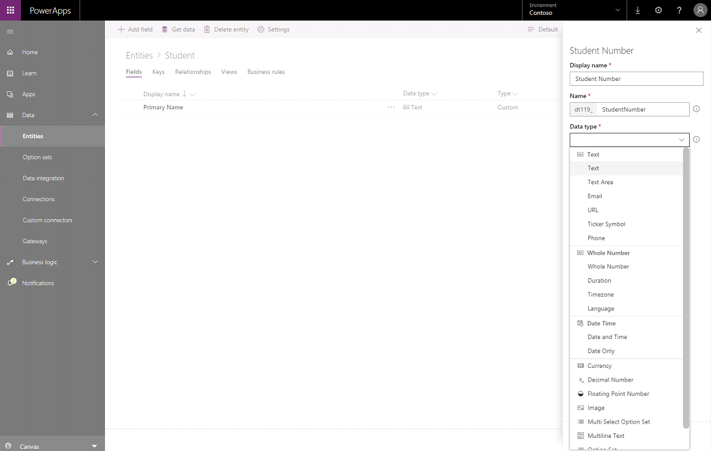
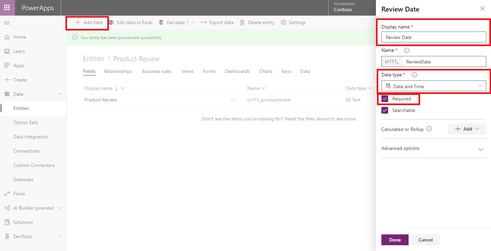

# Manage custom fields in an entity
You can create and update one or more custom fields in any entity. When you create a custom field, you specify a set of properties, such as the field's name, its display name, and the type of data that it will contain. For more information, see [Entity attribute metadata](../../developer/common-data-service/entity-attribute-metadata.md).

> [!NOTE]
> Every entity has system fields, such as fields that indicate when a record was last updated, and who updated it. In addition, standard entities have standard (default) fields. You can't modify or delete system fields or standard fields. If you create a custom field, it should provide functionality on top of these built-in fields.

## Create a field
1. On [powerapps.com](https://web.powerapps.com/?utm_source=padocs&utm_medium=linkinadoc&utm_campaign=referralsfromdoc), expand the **Data** section and click or tap **Entities** in the left navigation pane.

    

2. Click or tap an existing entity, or [Create a new entity](data-platform-create-entity.md)

3. Add a new field to your entity by clicking **Add field**.

4. In the New Field panel, enter the **Display name** for your field, **Name** will be automatically populated and is used as the unique name for your field. The **Displayname** is used when presenting this field to your users, the **Name** is used when building your app, in expressions and formulas.

    > [!NOTE]
    > The **Display name** fields can be updated at anytime to display differently in your apps, the **Name** field cannot be changed after your entity has been saved as this could result in breaking an existing app.

    

5. Select the **Data type** of your field, this controls the way the information is stored as well as how it is presented in apps. For example, text is stored different to a decimal number or a URL. For more detailed information of the data types available, see [Entity attribute metadata](../../developer/common-data-service/entity-attribute-metadata.md).

    If you're prompted, specify additional information for the data type that you specified. Depending on the data type, different fields will be presented. If you're creating a field of type Option set or Multi Select Option Set, you can select **New Option Set** and create a new Option Set while creating your field. For more information, see [Create Option set](custom-picklists.md)

    

7. Under **Required**, select the check box if you want to recommended this field as required in your apps. This does not provide hard enforcement through all connections to the Common Data Service. If you need to ensure the field is populated, create a [Business Rule](data-platform-create-business-rule.md)

8. Under **Searchable**, select the check box if you need this field to be available in Views, Charts, Dashboards and Advanced Find. In most cases this checkbox should be checked.

9. Click or tap **Done** to close the Field panel and return to the entity. You can repeat steps 3-9 for each additional field.
   
    > [!IMPORTANT]
    > Your field is not yet saved and created, until you save the changes to the entity.

10. Click or tap **Save entity** to finalize your changes and save them to the Common Data Service.

    You're notified when the operation is completed successfully. If the operation is unsuccessful, an error message indicates the issues that occurred and how you can fix them.

## Create a Calculated or Roll up field
Calculated fields let you automate manual calculations used in your business processes. For example, a salesperson may want to know the weighted revenue for an opportunity which is based on the estimated revenue from an opportunity multiplied by the probability. Or, they want to automatically apply a discount, if an order is greater than $500. A calculated field can contain values resulting from simple math operations, or conditional operations, such as greater than or if-else, and many others. Calculated fields can be created using the following data types:

* Single line of text
* Option Set
* Two Options
* Whole Number
* Decimal Number
* Currency
* Date and Time

For more details on the types of expressions supported and examples, see [Define calculated fields](/dynamics365/customer-engagement/customize/define-calculated-fields)

## Update or delete a field
1. On [powerapps.com](https://web.powerapps.com/?utm_source=padocs&utm_medium=linkinadoc&utm_campaign=referralsfromdoc), expand the **Data** section and click or tap **Entities** in the left navigation pane, and then click or tap an entity.
2. In the list of fields for the entity that you selected, click or tap a field, and then follow one of these steps:
   
   * Change one or more properties of the field.
   * Delete the field by clicking or tapping the ellipsis (...) near the right edge of the field, and then clicking or tapping **Delete**.

3. Click or tap **Save entity** to submit your changes.
   
    > [!IMPORTANT]
    > Your changes will be lost if you don't save them before you open another page in the browser or exit the browser.

    You're notified when the operation is completed successfully. If the operation is unsuccessful, an error message indicates the issues that occurred and how you can fix them.

## Best practices and restrictions
As you create and modify fields, keep these points in mind:

* You can't modify or delete system fields or their values.
* In a standard entity, you can't modify or delete a standard (default) field, add a field that requires data, or make any other change that might break an app that relies on that entity.
* In a custom entity, you should make sure that the changes that you make won't break any app that relies on that entity.
* You must give each custom field a name that's unique within the entity, and you can't rename a field after you create it.

## Next steps
* [Define relationships between entities](data-platform-entity-lookup.md)
* [Create a business rule](data-platform-create-business-rule.md)
* [Create an app using entities](../canvas-apps/data-platform-create-app.md)
* [Create an app from scratch using a Common Data Service database](../canvas-apps/data-platform-create-app-scratch.md)

## Privacy notice
With the Microsoft PowerApps common data model we collect and store custom entity and field names in our diagnostic systems.  We use this knowledge to improve the common data model for our customers. The entity and field names that Creators create help us understand scenarios that are common across the Microsoft PowerApps community and ascertain gaps in the service’s standard entity coverage, such as schemas related to organizations. The data in the database tables associated with these entities is not accessed or used by Microsoft or replicated outside of the region in which the database is provisioned. Note, however, the custom entity and field names may be replicated across regions and are deleted in accordance with our data retention policies. Microsoft is committed to your privacy as described further in our [Trust Center](https://www.microsoft.com/trustcenter/Privacy/default.aspx).

