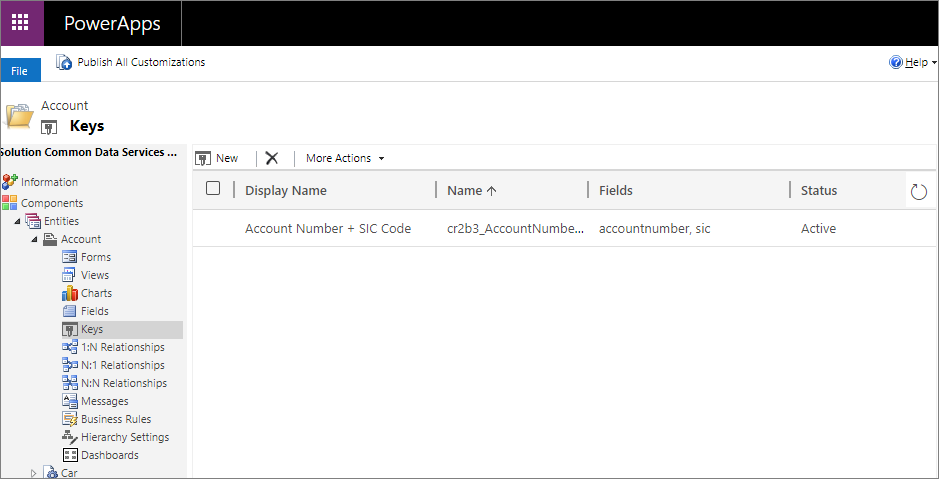
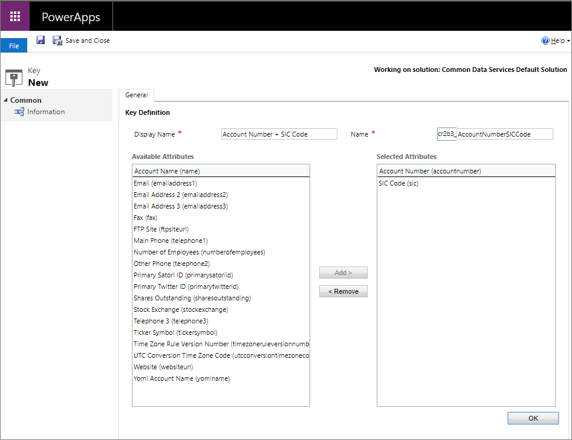

# Define alternate keys using solution explorer

Solution explorer provides one way to view and create alternate keys for Common Data Service.

The [PowerApps portal](https://web.powerapps.com/?utm_source=padocs&utm_medium=linkinadoc&utm_campaign=referralsfromdoc) enables configuring the most common options, but certain options can only be set using solution explorer.  More information: 
- [Define alternate keys to reference records](define-alternate-keys-reference-records.md) 
- [Define alternate keys using PowerApps portal](define-alternate-keys-portal.md)

## Open solution explorer

Part of the name of any alternate key you create is the customization prefix. This is set based on the solution publisher for the solution you’re working in. If you care about the customization prefix, make sure that you are working in an unmanaged solution where the customization prefix is the one you want for this entity. More information: [Change the solution publisher prefix](change-solution-publisher-prefix.md) 

[!INCLUDE [cc_navigate-solution-from-powerapps-portal](../../includes/cc_navigate-solution-from-powerapps-portal.md)]

## View alternate keys

1. With solution explorer open, under **Components** expand **Entities** and select the entity where you want to view alternate keys.
2. Expand the entity and select **Keys**.

    

## Create an alternate key

1. While [viewing alternate keys](#view-alternate-keys), select **New**.
1. On the form, enter the **Display Name**. The **Name** field will be auto-populated based on the **Display Name**. 
2. From the **Available Attributes** list, select each attribute and then **Add >** to move the attribute into the **Selected Attributes** list.
    
1. Select **OK** to close the form.

### (Optional) View the system job tracking creation of indexes
1. While [viewing alternate keys](#view-alternate-keys) after you have created a new alternate key you will see a row for the key you created.
2. In the **System Job** column you will find a link to the system job that monitors the creation of the indexes to support the alternate key. 
    
    This system job will have a name that follows this pattern: `Create index for {0} for entity {1}` where `0` is the **Display Name** of the alternate key and `1` is the name of the entity.

    The link to the system job will not be displayed after the system job completes successfully. More information: [Monitor and manage system jobs](/dynamics365/customer-engagement/admin/monitor-manage-system-jobs)

## Delete an alternate key

While [viewing alternate keys](#view-alternate-keys), select .

### See also

[Define alternate keys to reference records](define-alternate-keys-reference-records.md) 
[Define alternate keys using PowerApps portal](define-alternate-keys-portal.md) 
[Developer Documentation: Define alternate keys for an entity](/dynamics365/customer-engagement/developer/define-alternate-keys-entity)
