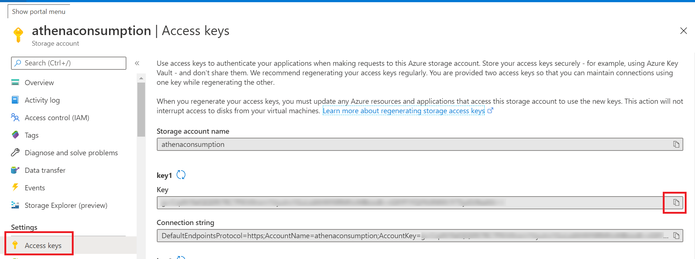
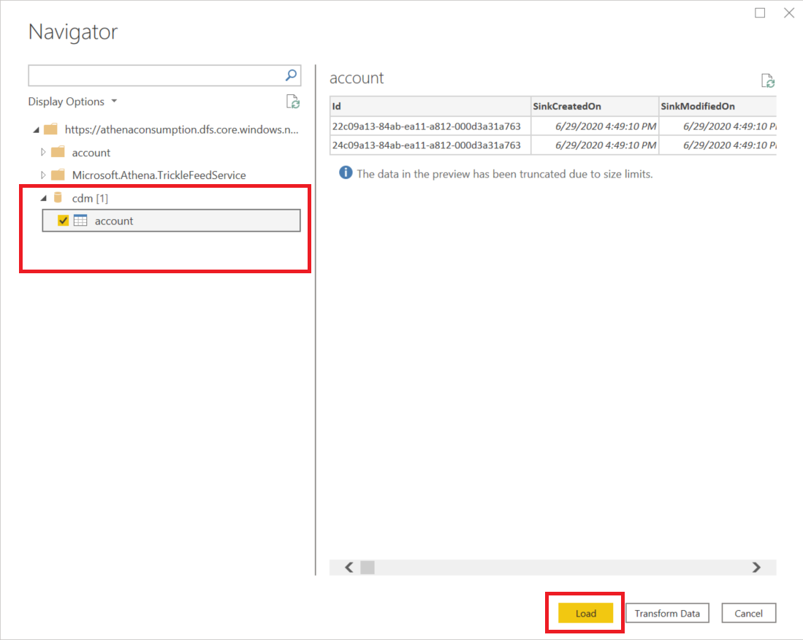
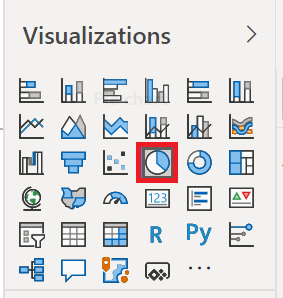
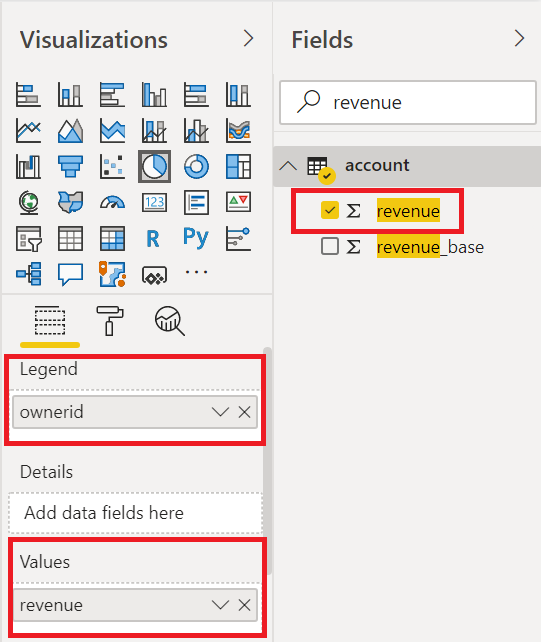
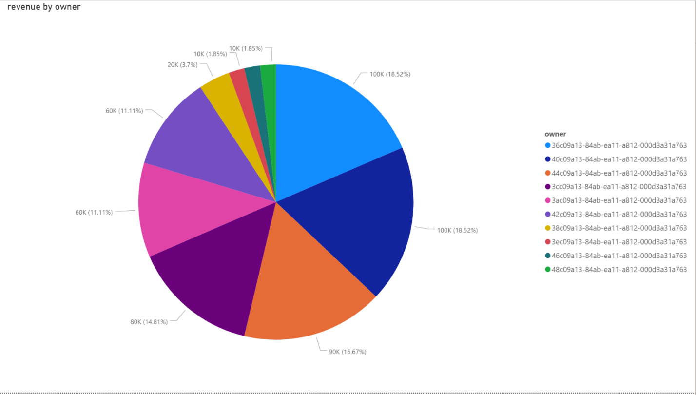

# Analyze Common Data Service data in Azure Data Lake Storage Gen2 with Power BI

[!INCLUDE [cc-beta-prerelease-disclaimer](../../includes/cc-beta-prerelease-disclaimer.md)]

After exporting data from Common Data Service to Azure Data Lake Storage Gen2
with the export to data lake service, you can use Power BI to create business
reports and analytics. This can be useful for sales managers and sales associates to refine and build additional reports and dashboards in Power BI. 

This article shows you how to perform the following tasks: 

1.  Connect the Data Lake Storage Gen2 storage container containing the exported Common Data Service data to Power BI.

2.  Create a report in Power BI that graphs account owners and their respective total account revenue.

## Prerequisites
This section describes the prerequisites necessary to consume Athena data with Power BI using export to data lake.
-  **Power BI Desktop**. [Get it now](https://powerbi.microsoft.com/downloads/)

-  **Export to data lake:** This guide assumes that you have already exported Common Data Service data using the [Export to data lake service](export-to-data-lake.md).  In this example, account entity data is exported to the data lake and will generate a report using the account entity fields.

## Connect the Data Lake Storage Gen2 storage to Power BI Desktop

1. Open Power BI Desktop and sign in.

2. Select **Get data** > **More…**.

3. On the **Get Data** page, select **Azure** > **Azure Data Lake Storage Gen2** > **Connect.**

4.  Enter the storage container name in the format *https://accountname.dfs.core.windows.net/containername/.*

5. Find the storage account name by accessing **Azure** > **Storage accounts** and then select the  Data Lake Storage Gen2 account that is populated with the exported Common Data Services data.

6. Find the container name by navigating to **Storage Explorer (preview)** > **Containers**.

    

7. Select **CDM Folder View (Beta)**, and then select **OK**.

8. If prompted to sign in, do so, and then select **Access key** from the left side bar.

9. Find the access key by going back to the storage account setting and selecting **Access keys** from the left navigation pane. Copy the first key.

    

10. Expand **cdm**, select the **account** data, and then select **Load**.

    

## Create a Power BI report with account revenue by account owner

1. Select the **Pie Chart** from the **Visualizations** menu.

    

2. Under the **Fields** menu search for the fields *ownerid* and *revenue* and select the fields. The **ownerid** field should appear under **Legend** and **revenue** should appear under **Values** in the **Visualizations** menu.

    

3. A pie chart that separates each account owner by color and displays the total revenue of accounts appears. 

    

### See also
[Export entity data to Azure Data Lake Storage Gen2](export-to-data-lake.md)