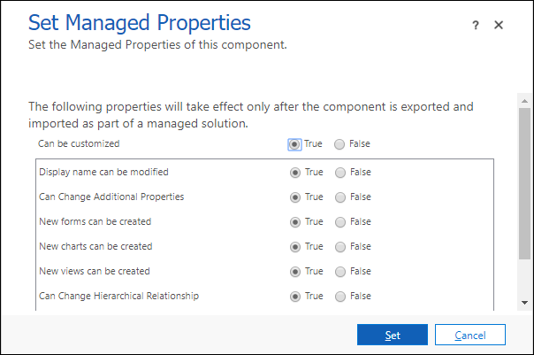
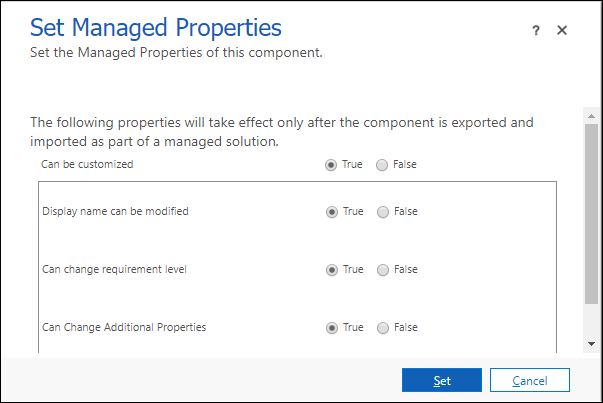

# Set managed properties in Common Data Service metadata 

Managed properties only apply when you include metadata with a managed solution and import it into another environment. These settings allow a solution maker to have some control over the level of customization that they want to allow people who install their managed solution to have. 

> [!TIP]
> It is generally a good idea to allow people to extend metadata in your solution that works with business data. This will allow them to tailor your solution to their needs in the same way that they can for standard entities.
>
>For metadata that provides functionality to support your solution but does not contain business data, it is a good idea to limit what customizations are allowed.

Setting managed properties must be done using solution explorer.

[!INCLUDE [cc_navigate-solution-from-powerapps-portal](../../includes/cc_navigate-solution-from-powerapps-portal.md)]

## Entity managed properties

While [viewing entities](create-edit-entities-solution-explorer.md#view-entities), select the entity and select **Managed Properties** on the menu bar.  This will open the **Set Managed Properties** dialog.

  
Entities have more managed properties than any other type of solution component. If the entity is customizable, you can set the following options:  

|Option|Description|
|--|--|
|**Can be customized** |Controls all the other options. If this option is `False`, none of the other settings apply. When it is `True`, you can specify the other customization options. When `False`, it is equivalent to setting all other options to false.|
|**Display name can be modified**|Whether the entity display name can be modified.|
|**Can Change Additional Properties** |Applies to anything not covered by other options.|
|**New forms can be created**|Whether new forms can be created for the entity.|
|**New charts can be created**|Whether new charts can be created for the entity.|
|**New views can be created** |Whether new views can be created for the entity.|
|**Can Change Hierarchical Relationship**|Whether Hierarchial Relationships settings can be changed. More information: [Define and query hierarchically related data](define-query-hierarchical-data.md)|
|**Can Change Tracking Be Enabled** |Whether the entity **Change Tracking** property can be changed.|
|**Can Enable sync to external search index** |Whether the entity can be configured to enable relevance search. More information: [Configure Relevance Search to improve search results and performance](/dynamics365/customer-engagement/admin/configure-relevance-search-organization) |

## Field managed properties

See [Create and edit fields for Common Data Service using PowerApps solution explorer](create-edit-field-solution-explorer.md) for information about how to edit fields.

While [viewing fields](create-edit-field-solution-explorer.md#view-fields), select a custom field from an unmanaged solution and then choose **More Actions** >  **Managed Properties** on the menu bar.

  
  
This will open the **Set Managed Properties** dialog box.

The **Can be customized** option controls all the other options. If this option is **False**, none of the other settings apply. When it is **True**, you can specify the other customization options.  
  
If the field is customizable, you set the following options to **True** or **False**.  
  
- **Display name can be modified**
- **Can change requirement level** 
- **Can change Additional Properties** : This property controls any other customizations that do not have a specific managed property.

Setting all the individual options to **False**, is equivalent to setting **Can be customized** to **False**.  

Apply your choices and click **Set** to close the dialog box.

> [!NOTE]
> If this field is a **Date and Time** field, an additional **Can change date and time behavior** property is available. More information: [Behavior and format of the Date and Time field](behavior-format-date-time-field.md)

## Relationship managed properties

While viewing entity relationships, select a relationship from an unmanaged solution and then choose **More Actions** > **Managed Properties** on the menu bar.
  
With relationships, the only managed property is **Can Be Customized**. This single setting controls all changes that can be made to the entity relationship. 

### See also

[Managed properties](solutions-overview.md#managed-properties) 
[Create and edit entities using solution explorer](create-edit-entities-solution-explorer.md) 
[Create and edit fields for Common Data Service using PowerApps solution explorer](create-edit-field-solution-explorer.md) 
[Create and edit 1:N (one-to-many) or N:1 (many-to-one) entity relationships using solution explorer](create-edit-1n-relationships-solution-explorer.md) 
[Create N:N (many-to-many) entity relationships in Common Data Service using solution explorer](create-edit-nn-relationships-solution-explorer.md)
