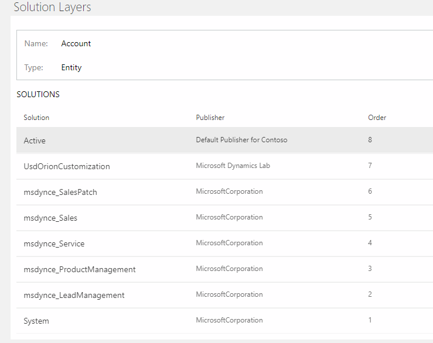
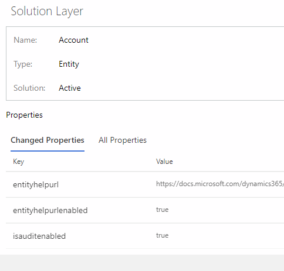
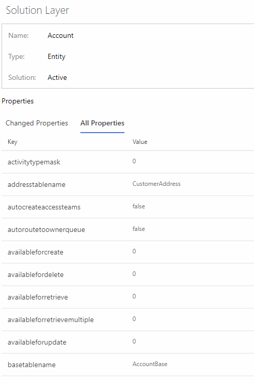

# View solution layers
Solution layers allow you to view all component changes that occur due to solution changes over time. Within a solution layer, you can drill down to view specific changed and unchanged property details for a component. 

Solution layers: 
-	Let you see the order in which a solution changed a component. 
-	Let you view all properties of a component within a specific solution, including the changes to the component. 
-	Can be used to troubleshoot dependency or solution-layering issues by displaying change details for a component that was introduced by a solution change.

## View the solution layers for a component
You can access solution layers from the **Components** list or from the **Dependency Details** dialog box in solution explorer. 

1. To view solution layers from the **Components** list, open [solution explorer](../model-driven-apps/advanced-navigation.md#solution-explorer). In the **Components** list, select a component, such as **Account**, and then select **Solution Layers** on the toolbar. 

   > [!div class="mx-imgBorder"] 
   > 

2. The solution layer page appears. It displays each layer for the component, such as the Account entity displayed here, with the most recent layer at the top. To view the details for a solution layer, select it. 

   > [!div class="mx-imgBorder"] 
   > 

3. In the **Solution Layer** dialog box, the **Changed Properties** tab displays only those properties that were modified as part of the specific solution layer. 

   > [!div class="mx-imgBorder"] 
   > 

4. Select the **All Properties** tab to view all properties, including changed and unchanged properties, for the solution layer. 

   > [!div class="mx-imgBorder"] 
   > 

## See also
[Solutions overview](solutions-overview.md)
