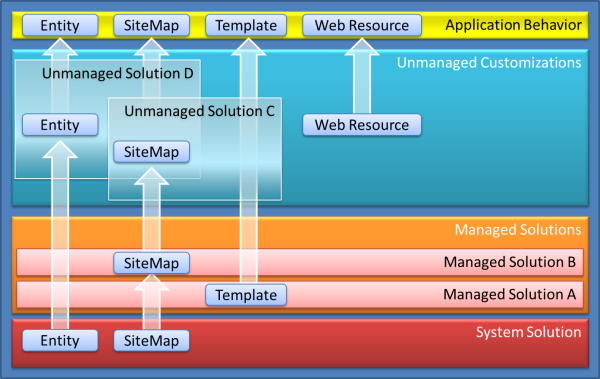

   
# Solutions overview  

Solutions are used to transport apps and components from one environment to another or to apply a set of customizations to existing apps. A solution can contain one or more apps as well as other components such as site maps, entities, processes, web resources, option sets, flows, and more.

Solutions are the mechanism for implementing application lifecycle management (ALM) in Power Apps and other Power Platform products, such as Power Automate. For detailed information about the solution concepts and how solutions are used for application lifecycle management, see [Overview of ALM with Microsoft Power Platform](/power-platform/alm/overview-alm) in the Power Platform ALM guide.

This section will focus on the **manual** tasks that app makers need to perform while working with solutions in Power Apps.

## Solution concepts

Before you work with solutions, it's important that you get acquainted with the following solution concepts:
- Two types of solutions (managed and unmanaged)
- Solution components
- Lifecycle of a solution (create, update, upgrade, and patch a solution)
- Solution publisher
- Solution and solution component dependencies

For detailed information, see [Solution concepts](/power-platform/alm/solution-concepts-alm) in the Power Platform ALM guide.

## Default solutions

Power Apps provides you the following default [unmanaged](/power-platform/alm/solution-concepts-alm) solutions:

- **Common Data Service Default Solution**. This solution is available for makers to use by default for their customizations in an environment. The Common Data Service Default Solution is useful when you want to evaluate or learn Power Apps. However, we recommend that app makers work in their own unmanaged solutions. 
- **Default Solution**. This is a special solution that contains all components in the system. The default solution is useful for discovering all the components and configurations in your system.

However, we recommend that you create a solution to manage your customizations. More information: [Use a solution to customize](/power-platform/alm/use-solutions-for-your-customizations) in the Power Platform ALM guide.

<!--  
   

### How solutions are applied  
All solutions are evaluated as layers to determine what your app will actually do. The following diagram shows how managed and unmanaged solutions are evaluated and how changes in them will appear in your environment.  
  
  
  
Starting from the bottom and working up to top:  
  
**System Solution**  
The system solution is like a managed solution that every environment has. The system solution is the definition of all the out-of-the box components in the system.  
  
**Managed Solutions**  
Managed solutions can modify the system solution components and add new components. If multiple managed solutions are installed, the first one installed is below the managed solution installed later. This means that the second solution installed can customize the one installed before it. When two managed solutions have conflicting definitions, the general rule is "Last one wins." If you uninstall a managed solution, the managed solution below it takes effect. If you uninstall all managed solution, the default behavior defined within the system solution is applied.  
  
**Unmanaged Customizations**  
Unmanaged customizations are any change you have made to your environment through an unmanaged solution. The system solution defines what you can or can't customize by using managed properties. Publishers of managed solutions have the same ability to limit your ability to customize solution components that they add in their solution. You can customize any of the solution components that do not have managed properties that prevent you from customizing them.  
  
**Application Behavior**  
The application or runtime behavior is what you actually see in your environment. The default system solution plus any managed solutions, plus any unmanaged customizations you have applied. --> 
 
 
### Next steps  
[Use solutions in Power Apps](use-solution-explorer.md)  

 
